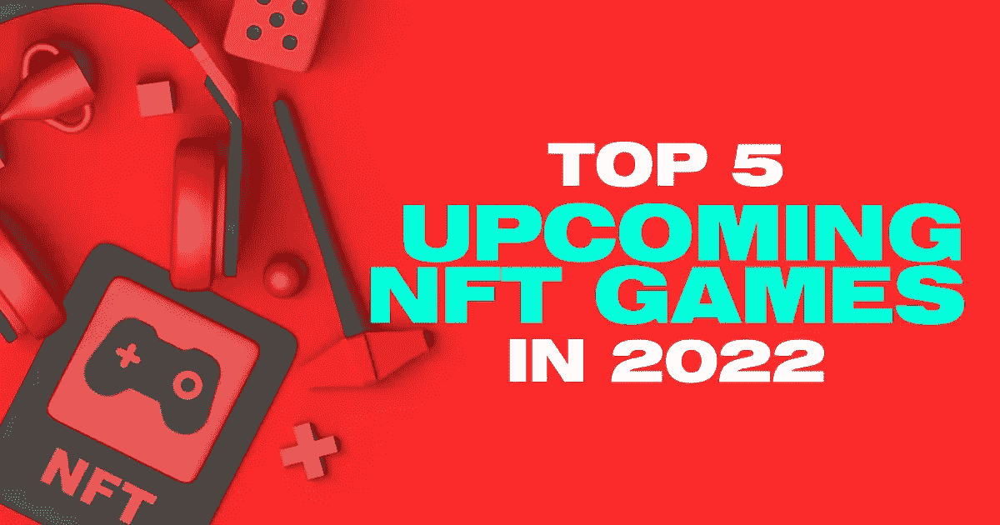
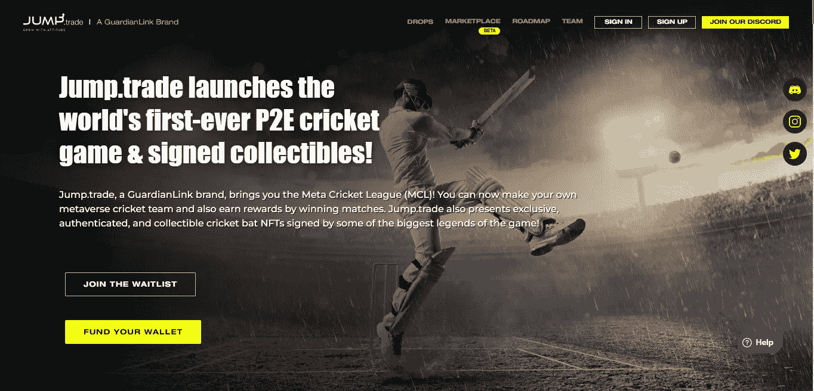
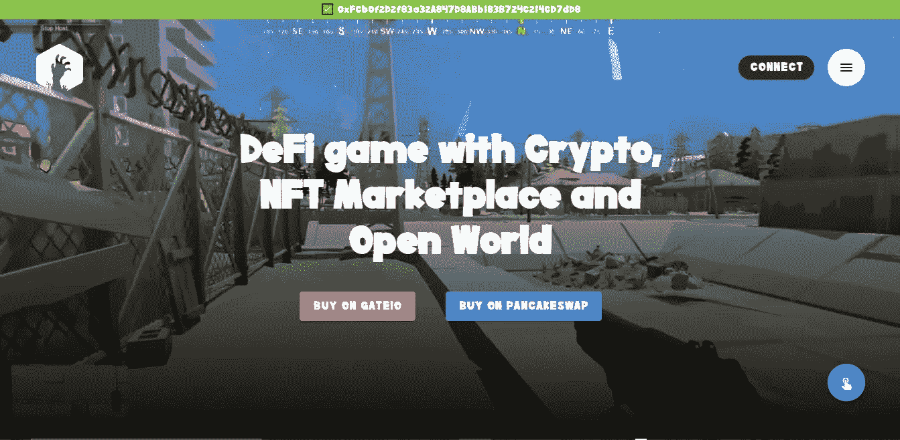
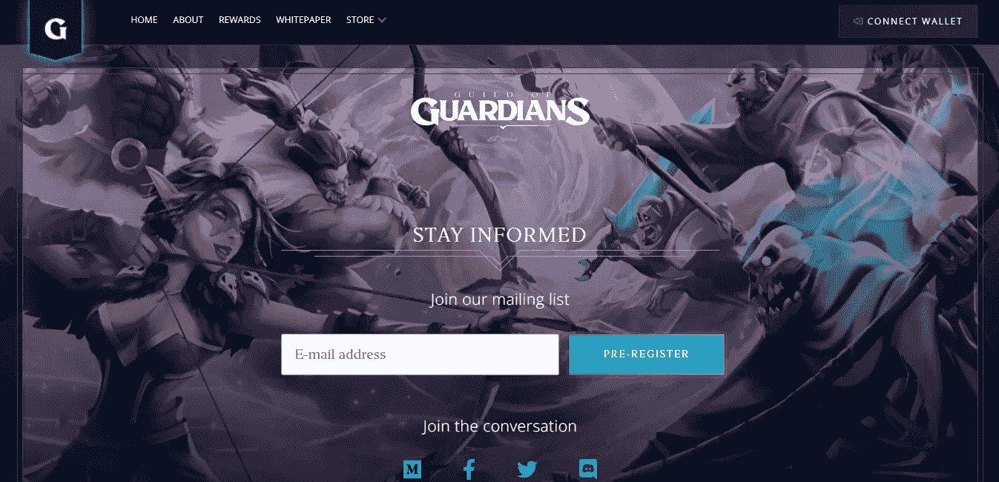
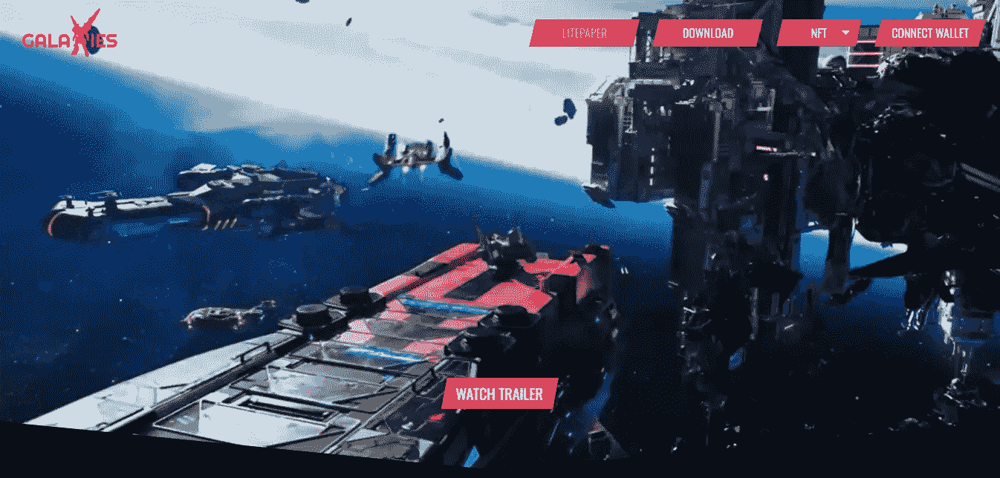
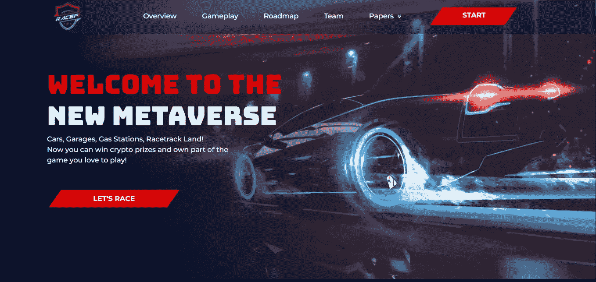

# 2022 年 NFT 奥运会前五名

> 原文：<https://medium.com/geekculture/top-5-upcoming-nft-games-in-2022-bb1c581cb07c?source=collection_archive---------26----------------------->

**Top 5 Upcoming NFT Games in 2022**

# 介绍

在过去的几十年里，如果我们回顾一下游戏行业的过去，每个移动游戏开发商都试图创造最好的游戏来吸引越来越多的游戏玩家，以便他们可以从广告收入中获利。

但在引入区块链技术和不可替代令牌(NFT)后，游戏开发商和游戏玩家的整个场景都发生了很大变化。

现在是玩赚游戏的十年，用户通过基于他们参与度的奖励受到激励。这些奖励是游戏中的收藏品、虚拟剧情、代币、非战斗单位等等。最棒的是，这些游戏中的资产在游戏之外也有价值。主要是，价值取决于游戏，它的效用，需求，和资产的稀有性。

因此，在这篇文章中，我们将带您经历一次激动人心的旅程，其中我们将涵盖即将到来的 NFT 最佳游戏的前 5 名，您可以探索并进入新的游戏世界。

# 2022 年玩并赢取奖金的五大 NFT 游戏

对于初始资本较低的游戏玩家来说，很难突破大多数顶级 NFT 游戏的障碍，因为他们的游戏内资产和令牌过于昂贵。

因此，以下是即将推出的 NFT 新游戏列表，这些游戏有巨大的潜力呈指数级增长，并帮助用户在即将到来的未来赚取可观的财富:

**元板球联赛** —跳。贸易最近推出了 MCL NFTs 从他们的板球 NFT 市场，这是以社区为中心的 NFT 为基础的 P2E 板球比赛

**蓼属**——这是一款免费的跨平台 Defi 游戏，有一个 NFT 和加密的市场

**守护者协会**——这是一款即将推出的角色扮演 NFT 游戏

**幻影星系**——这是一场区块链上的机甲星际战斗机战斗

这是索拉纳生态系统中第一款基于人工智能/人工智能的赛车游戏

# 详细了解 2022 年 NFT 5 大游戏

这里有一个最好的 NFT 游戏的详细概述，让玩家在娱乐的同时获得可观的收入。

1.  **跳跃。贸易—元板球联盟**

跳。贸易是一个 P2E 的游戏 NFT 市场。他们最期待的即将到来的 NFT 游戏是 [**元板球联赛**](https://mcl.jump.trade/) ，玩家可以从中赚取巨额收入，因为它是完全以社区为中心的 NFT P2E 板球游戏。

它也是购买世界上第一个 P2E 板球比赛 NFTs 的头号市场，也是板球爱好者的最佳平台，因为用户可以购买球棒、球员和签名的传奇 NFTs，以纪念世界杯决赛。

它提供各种各样的服务，如游戏资产人工智能培训，交易和购买超罕见的板球 NFT，房地产和租赁建筑等。

MCL 的主要目标是瞄准板球爱好者和 NFT 业主，打造 Web3 世界最大的板球元宇宙。

**Jump.Trade Meta Cricket League**

**2。蓼属**

蓼是一款跨平台的多人生存模拟游戏，允许用户买卖游戏内资源；与此同时，用户还可以创建自己的区域，挖掘资源和硬币，并形成社区。根据游戏玩家的需求、节奏和风格，它分为 3 个部分:

*   **农业区:**这是一个农业区，是一个安全的区域，基本上可以自由出入。
*   **PVE 区:**狩猎和探索游戏内资源的区域。它被进一步划分为子区域，玩家必须根据他们需要的战利品的价值来面对许多不同级别的敌人。
*   PVP 区:这是一个玩家对玩家的区域，基本上意味着这是一个危险的区域，有死亡奖金、激烈的战斗、僵尸和稀有资源。

蓼属生态系统的治理令牌是 POG 币。

**Polygonum**

**3。守护者协会**

《守护者协会》是一款即将推出的幻想主题角色扮演 NFT 游戏，设定在魔法、精灵、地下城和兽人的区域。

这款游戏的设计主要关注玩家的策略和技能，而不仅仅是为了资本回报。因此，玩家不需要太多的投资就可以开始玩游戏。

与此同时，没有像蓼属这样的 PVP 游乐场，因为如果有 PVP，那么玩家将需要他们的金钱或资源来与对手竞争。

游戏的原生货币是宝石。

**Guild of Guardians**

**4。幻影星系**

幻影星系是一个机甲星际战斗机战斗，让用户感觉和体验类似于传统的角色扮演 3D 游戏。

玩家可以购买幻影银河机甲、替身和装备作为 NFT。这个游戏吸引人的一个主要中心是它的故事情节，在书籍、动画、漫画、NFT 收藏的商品和游戏性的帮助下，故事情节缓慢而稳定地展开。

这款游戏的主要目的是在一个元宇宙平台上建立一个超过 100 万玩家的社区。

该游戏还旨在借助区块链驱动的治理、游戏内资产的自我保管和可验证的所有权，提供一流的体验。

**Phantom Galaxies**

**5。RaceFi**

RaceFi 是 Solana 生态系统上第一款基于 AI/ML 的车辆赛车游戏。在 RaceFi 上，玩家可以比赛或者拥有游戏的一部分并从中获利。

根据玩家的方便和兴趣，它有两种模式:

*   **PvE 模式:**这种模式也被称为玩家对战环境。它允许玩家直接驾驶和控制汽车。
*   **PvP 模式:**这种模式也被称为玩家对玩家。它允许玩家使用一些统计数据和高级控制。

游戏的结果是用 AI 的加权随机算法分析出来的，这个游戏的原生货币是 RACEFI。

**RaceFi**

# 结论

这些即将到来的 NFT 游戏证明，整个游戏行业将发生革命性的变化，从赋予玩家权力到为游戏开发商提供各种选择来赚钱。

因此，这些游戏将很快使 P2E 和 NFT 的游戏成为整个游戏行业的主流媒体。跳。交易 [**板球 NFT 市场**](https://jump.trade/?fsz=Karthik) 将发挥非常重要的作用，因为他们最近创造了一项纪录，在推出仅 9 分钟内销售了 55，000 多张元板球联盟(MCL)NFT。