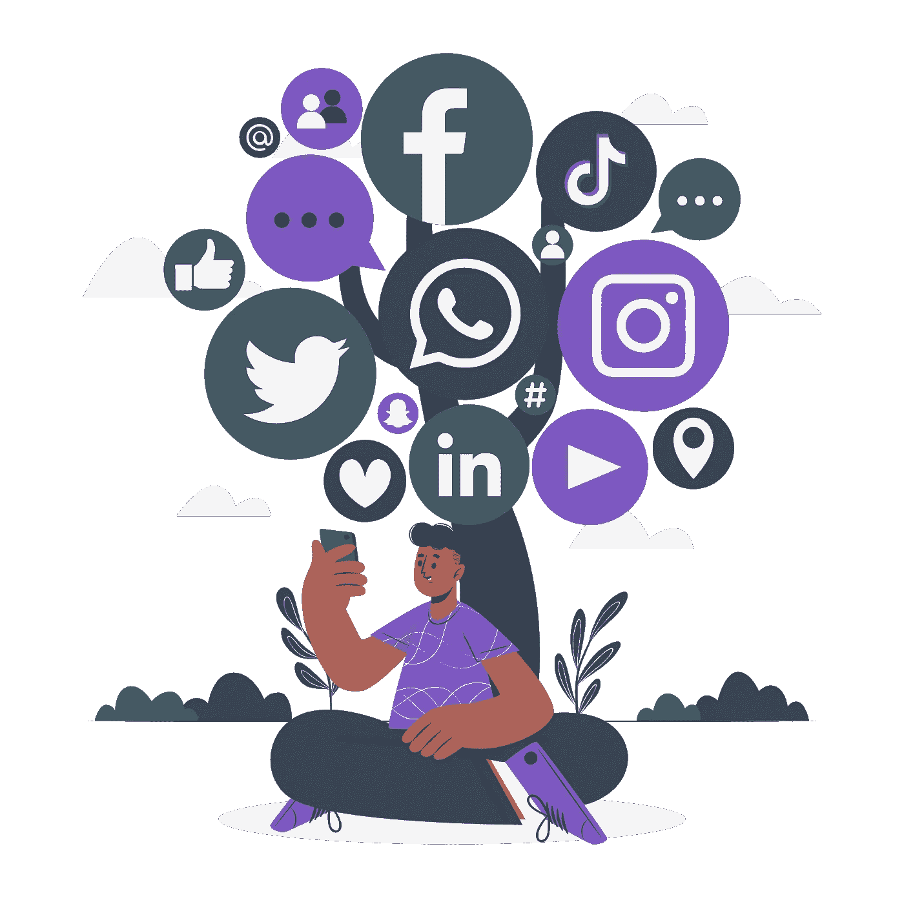
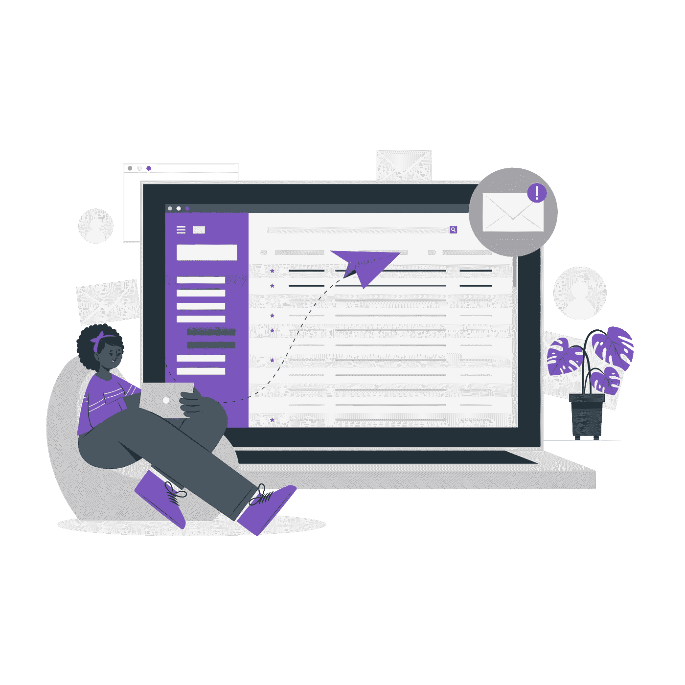
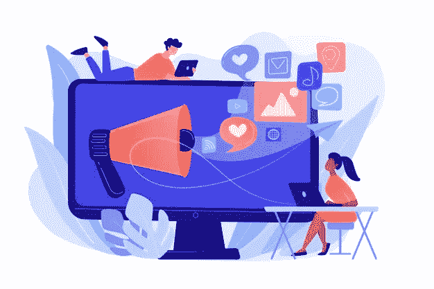

# 更好地营销虚拟活动的五大方法

> 原文：<https://medium.com/geekculture/top-5-ways-to-market-your-virtual-event-better-82abc3ed1899?source=collection_archive---------1----------------------->

您知道吗？80%的活动专业人士都提到，社交媒体是推广活动最有效的方式。推广虚拟活动的四大社交媒体渠道是**脸书、LinkedIn、Twitter 和 Instagram。**

那么，你怎么能确定你的营销活动是超级新鲜的，并尽可能达到数百万观众和用户的最佳效果呢？*你在等着通过社交媒体推广你的活动吗？*

**虚拟营销事件的方法**

1.  图片和视频是为你的活动抢占市场的社交货币。大多数观众可能没有太多的时间去读那些又大又长的句子。一张图片或一段视频可以巧妙的完成这项工作，同时让观众记住你的想法。因此，你的首要任务是从你的活动中收集尽可能多的辅助材料，确保你有足够的图片和视频，可以用于你的活动营销策略。图片和视频对于社交网络上的任何活动都非常重要，尤其是在脸书、Instagram 和 YouTube 上。

**2。电子邮件营销:**超过 70%的活动专业人士表示，电子邮件营销是获得注册与会者和/或向观众销售更多门票的最有效工具之一。现在，随着大量电子邮件涌入收件箱，抓住用户的注意力，说服他们点击活动并预订门票，这已经成为一门艺术。可以有机的增加出席人数。获得一个像 MailChimp 这样的免费工具，不只是在没有数据库和想法的情况下粗略地发送电子邮件，而是在更私人和更有计划的时间内向用户发送电子邮件。它应该给观众这种感觉，这是为他们个人和他们的优势。下一步必须是一个事件序列来宣布你的事件，你必须创建一个序列来
安排你的事件，如每天或每周。找出引起注意、兴趣、欲望和行动的方法。

**3。游戏化:**为参与者创造一个参与的竞赛或机会。比如折扣或免费门票，给他们一些有价值的理由来在线谈论你的活动。使用活动应用等工具。在活动应用上获得潜在的参与者，让他们参与其中，并在社交网络之外创建内容。通过使用活动标签来创建有价值的内容，这可以创建社区，并让其他人感觉到该标签周围发生的事情，如果有人参加该活动，他们可能会觉得有趣，他们会觉得与该活动有联系并被敦促参加该活动。因此，游戏化是让你的活动获得观众的最有效的方法之一。

**4。将数量转变为质量:**以前的算法是基于内容数量的。脸书、LinkedIn、Instagram 或 Twitter 等社交网络上的内容越多，你的活动的算法就会给出越多的可见性。但是现在旧的算法被更新了，这种转变更多的是针对质量而不是数量。你也注意到了，即使你没有关注 Instagram 上的某个页面或脸书上的某个赞页面，你的社交媒体也会显示那些有大量赞或粉丝访问的页面的建议列表。关注你的社交网络的最佳更新，比如在那个页面上花时间或者转发。

**5。巧妙利用社交媒体广告:**你如何获得有效突出和展示你的内容的机会。最好的方法是使用社交媒体广告为你的内容播种合适的受众。专注于每次更新 50 卢比到 10，000 卢比之间的预算，让您获得优势，并以此方式安排您的广告，以接触您的观众，让更多的人参加您的活动，并通过一点点广告增加抓住用户的机会，以保持您的内容或活动在顶部！就有效的广告支出和获得最大的成本效益回报而言，脸书是渠道化广告的最佳平台。脸书再营销和脸书广告趋势更便宜，然后你可以根据进一步的需要切换到 Instagram 或 Twitter 或 LinkedIn。

**6。24*7:** 几年前的趋势是，如果活动安排在 3 个月后，你会和你的与会者一起参与，并试图在 2 到 3 个月前了解他们。但是现在情况变了，社交媒体也变了。如果你不经常更新你的社交网络，社交媒体运行的算法内部的变化将通过让你身后的参与者和观众知道你的事件来惩罚你。因此，你不需要一整年都吸引你的观众。这是我们在社交网络上谈论活动的第一天的最佳实践。

**结论:**希望我已经介绍了利用社交媒体成功营销任何营销活动的主要方法。