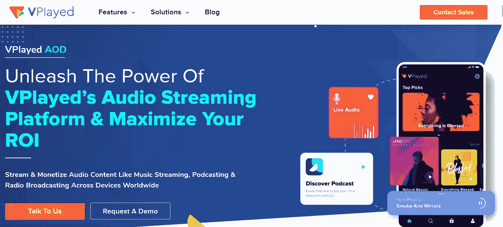
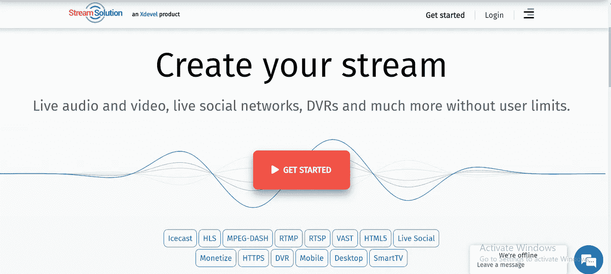
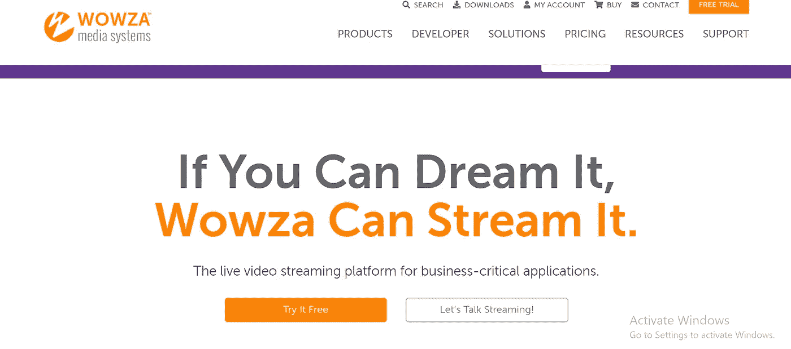

# 比较构建音频流平台的 6 大解决方案

> 原文：<https://medium.com/geekculture/top-6-audio-streaming-platforms-to-launch-live-on-demand-audio-streaming-services-30e9f85c2d32?source=collection_archive---------7----------------------->

根据美国市场研究和咨询公司 Grand View Research 的研究，全球音乐流媒体市场，换句话说，音频和视频流媒体市场预计将在不久的将来从之前的 209.5 亿美元增长到 244 亿美元以上。考虑到技术的进步，这并不奇怪；智能设备的大量使用；以及音频、视频音乐和播客形式的在线内容服务的采用增长。此外，这种音乐流媒体平台提供了自动定制歌曲播放列表和新闻推荐等功能。

从地区、行业、平台、内容类型、服务和最终用途等方面快速分析一下音频/视频流媒体市场，应该能让你了解这个行业的样子。

**按地区**

谈到音频/ [视频流媒体平台](https://www.vplayed.com/us/online-video-platform.php)市场，北美的市场份额最大，最新数据显示 2019 年的份额为 35.0 %。这一份额可以归因于移动应用程序使用的增加和使用的方便性。

**按行业分类**

这个市场中的一些顶级行业参与者包括苹果、亚马逊、谷歌、Spotify、潘多拉媒体和腾讯音乐娱乐集团。

**按平台类型**

随着移动网络技术的进步，除了网络浏览器之外，移动应用已经成为音频和视频流的主要来源。音乐流媒体公司现在正在考虑推出将在所有浏览器和设备上运行的音频/ [视频流媒体服务](https://www.vplayed.com/blog/best-video-streaming-services/)，因为应用程序部分自 2019 年以来占据了约 85%的最大收入份额，预计到 2027 年将进一步增长。

**按内容类型**

由于听音乐或看视频时的多任务处理以及用户硬盘上所需空间的减少，近年来对 OTT (Over-The-Top)平台上的高级音频和视频内容的需求呈指数级增长。虽然音频市场至少占据 60%的收入份额，但视频市场并不落后。根据 IBEF 的一份报告，Gaana 以 30%的份额主导印度音频流媒体市场，其次是。JioSaavn。另一方面，根据 Statista 的数据，2021 年至 2025 年，全球视频流媒体市场的收入预计将达到 11.25%的 CAGR。

**按服务类型**

尽管盗版问题引起了广泛的关注，但顶级 IT 解决方案提供商提供的增强的安全解决方案使得点播音频和视频流领域的收入份额增长了 70%。因此，不再需要担心非法共享或下载音乐音频和视频。另一方面，从 2020 年到 2027 年，直播领域的 CAGR 预计将达到 19%。导致这种预测的因素是更广泛的受众范围和受众对互联网上现场音频/视频广播的偏好。此外，一些社交媒体平台也通过网络直播和播客进行直播。YouTube、facebook、Instagram 和 Twitter 是此类直播音频/视频流媒体服务的先驱，这些平台包括

**按最终用途**

音频或视频流市场的最终用户包括所有喜欢音乐、最新新闻、电影等的人。用户必须支付一定的费用，并遵循指南才能访问任何此类音频或[在线视频平台](https://www.vplayed.com/online-video-platform.php)。当这些用户在家做家务时，或者当他们在健身房锻炼或在餐馆或酒吧用餐时，或者当他们被允许在工作时插入耳机时，他们可以访问音频或视频，以便他们能够完全安静地进行工作，而没有外部噪音。这种终端用户市场的收入份额约占 65%。

# 什么是音频流？

[什么是音频流](https://blog.vplayed.com/what-is-audio-streaming/)？如果你是一个老的音乐听众，你可能知道你曾经如何下载完整的音频文件格式，如 WMA，WAV，AIFF，或充其量 MP3，然后能够听音频。但是，自从音频流技术出现以来，你不需要下载整个音频文件就可以听到任何类型的音乐或录音。这是因为当有网络连接时，音频文件会以“数据包”的形式实时传送到你的电脑或手机上。而且，只要有连续的数据流，你就可以不受任何干扰地访问音频。

# **点播与实时音频流**

基本上有两种音频流服务，音频广播公司可以使用它们来向观众提供音频内容或文件。

## 点播音频流平台

在这里，内容存储在档案或 A-CMS(音频内容管理系统)中，观众可以通过网站或移动应用程序在任何时间和任何地方收听音乐或任何音频内容。它可能包括完整的节目，播客或播客的一部分。

## 实时音频流平台

这就像一个互联网收音机，当广播公司可能使用它进行单个事件或广播，然后按需提供音频记录。还可以选择让在线收音机全天候可用。嗯，约翰·传奇说的没错— *音乐流媒体改变了音乐人创作和发布音乐的方式*。

现在，您已经了解了点播和直播音频流服务的市场报告和技术基础，让我们来看看这个领域的[顶级音频流平台](https://www.apptha.com/blog/top-audio-streaming-platforms/)的列表。

# **六大音频流媒体平台对比**

这里列出了顶级的[音频流平台](https://www.vplayed.com/audio-streaming-solution.php)来构建你自己的具有基本特性的音频流服务。

**1。**[**v 显示**](https://www.vplayed.com/audio-streaming-solution.php)

VPlayed of CONTUS 为教育、宗教、电影、体育和健身等行业提供完全无故障的音频流平台和定制内容平台。这个音频平台拥有大约 150 多种流媒体功能和 6 种以上的盈利模式，可让您在多种设备上提供真正迷人的音频体验。VPlayed 最好的部分是它以一次性许可价格提供。有关如何[创建自己的音频流网站](https://blog.contus.com/create-audio-streaming-platform/)或应用程序的详细信息。

*Create an audio streaming service that you can own lifelong*

**v played 音频流平台的主要特点。**

*   100%定制，以满足您的独特需求。
*   它是一个白色标签的音频平台。
*   获得音频流平台的完全所有权和终身源代码许可证。
*   将您的平台作为内部托管服务器或云集成音频流服务器。
*   约 6 种以上的收入模式，如订阅、应用内广告、促销和优惠券等，从其他流媒体平台中脱颖而出，提高您的投资回报率。
*   您的音频平台的第三方集成是可能的，如与谷歌分析，广告插入，支付网关等集成。

**2。** [**海卫一数字**](https://www.tritondigital.com/)

自 2006 年成立以来，Triton Digital 是多个行业的全球技术和服务领导者，从事创建或开发音频流媒体网站和应用程序。它在 80 多个国家开展业务，为广播公司、播客公司和在线音乐服务公司提供帮助，帮助这些企业发展受众、简化运营并实现收入最大化。Triton 最大的优点之一是它在一个屋檐下提供了所有吸引观众的工具。联系 Triton Digital 团队，了解如何开发自己的音频流应用程序。

*Build on demand/ live audio streaming platform to deliver branded listening experience*

**Triton 数字音频流解决方案的主要特点。**

*   在全球 13 个以上的地点提供基础设施支持，以提供高质量、高效和定制的音频流。
*   通过 SAM Broadcaster Cloud 和 Live Edition 将音频节目和货币化扩展到单个流之外。
*   帮助您利用其广泛的音频广告解决方案和播客来创造更多收入。
*   其受众测量技术可帮助您在任何时间、任何设备上捕捉受众。
*   配备高级分析工具，让您深入了解流媒体内容的性能。
*   云企业版包含音乐版税报告。

**3。**[流解](https://streamsolution.com/en/home)

Xdevel 创建的 Stream Solution 平台提供了现场音频和视频流、现场社交网络、DVR 等领域的最佳解决方案。它允许在 HTTP 和 HTTPS 上实时和点播传播音频和视频内容。除了经典的 SHOUTcast 和 Icecast，该平台支持的协议还有 MPEG-DASH、RTMP 和 RTSP。您可以使用 HTML5 播放器轻松定制您自己的徽标、大量功能等。最棒的是——它提供了特定时间点的用户数量和流媒体网站流量的高级统计数据。访问 Stream，了解如何制作自己的音频流应用程序或网站。

*Top-performing audio streaming solution with flexible targeting tools worldwide*

**Stream Solution 实时音频流的主要特性**

*   一次性和基于订阅的支付模式都可用。
*   兼容最新技术。
*   可以在 http 和 https 上播放。
*   完全可定制。
*   通过广告货币化，整合大量。
*   DVR 协议将使最后一小时可以观看。
*   一个播放器有多个频道。

**4。** [**Dacast**](https://www.dacast.com/)

从体育到媒体组织，从宗教到非营利组织，Dacast 为所有人提供了一些东西。它通过提供高质量的音频和视频流媒体服务吸引了体育迷的注意力。Dacast 引以为豪的是，它已经为全球超过 300，000 家专业广播公司提供了高质量的解决方案。Dacast 通过其博客解释了如何[建立一个音乐流媒体应用](https://blog.contus.com/build-music-streaming-website-application-like-spotify/)或网站。

*Launch an intuitive Live audio streaming platform with Dacast now*

**Dacast 的点播音频流软件的主要特点如下。**

*   自动存档点播音频流。
*   观众人数不限。
*   通过消除任何第三方品牌的广告和徽标，提供不受干扰的流媒体服务。
*   一个安全的平台，提供保持您的音频内容安全。
*   定制品牌以获得更好的观看体验。

**5。** [**Wowza**](https://www.wowza.com/)

Wowza 说——如果你能梦想到，那么 wowza 就能实现它。不用说，Wowza 因其为高度关键的商业应用提供音频和视频流平台而闻名。Wowza 在为医疗保健行业、政府组织、视频监控机构、城市发展和公共安全组织制作音频流媒体网站和应用程序方面取得了巨大成功，最重要的是在太空探索领域。您可以通过使用 [Wowza](https://www.wowza.com/support/open-ticket) 打开支持票来获得技术支持。

*Broadcast immersive content through top audio streaming solution provider*

**Wowza 直播音频流服务的主要特点是**

*   现场音频/视频监控和监视。
*   直播和 OTT 流媒体。
*   交互式实时流和低延迟流。
*   点播音频和视频流。
*   全天候监控。
*   在任何环境中灵活部署。
*   通过其强大的软件集成到 AI/ML 技术中。

**6。** [**穆维**](https://www.muvi.com/)

从教育到宗教和体育，再到健康、健身和娱乐，Muvi 为几乎所有想通过[最佳在线视频平台](https://blog.contus.com/online-video-platforms/)发展业务的人准备了很多东西。Muvi 提供了至少 500 多种功能，并为那些希望满足观众 OTT 需求的人提供了端到端的音频流解决方案。关于如何制作自己的音频流应用程序或网站，请访问 [Muvi](https://www.muvi.com/) 。

*Launch an intuitive whitelabel audio streaming platform with Muvi now*

**Muvi 的音频流媒体平台的主要特点如下。**

*   帮助您建立一个完全由您拥有和品牌化的音频流网站和应用程序，涵盖 20 多个平台、设备和广告生态系统。
*   帮助您启动音频流平台，该平台可将音轨缩短为多种格式，这样您就不必将音频库从一种格式转换为另一种格式。
*   通过 Movi 的支持 DVR 的 livestream 获得完全定制、不间断和重播的流媒体功能，并通过提供您的音频/视频内容录制来访问点播内容。
*   通过 Movi Live 插件提供端到端音频直播功能，无需使用单独的软件/CMS。
*   确保您的音频内容和客户数据的安全。
*   允许多个合作伙伴添加、更新或上传您的内容。同时，您可以对您的内容拥有完全的控制和限制权限。
*   通过 Muvi 卡丁车产品设施有一个专门的在线商店。
*   音频内容的各种盈利模式。
*   提供实时分析来跟踪和监控您的音频内容。
*   获得不同的政策和定价方法。

**结论**

综上所述，作为一个音频或视频广播公司的老板，你应该依靠市场研究报告和市场情报来为你的公司做出更好的决策。无论如何，本博客中提到的顶级性能音频平台的想法应该有助于您丰富或推出自己的音频流平台，为您的观众提供强大的实时点播音频流解决方案。需要更多细节？您可以随时从做大量行业研究的组织那里获得一份直播市场报告。