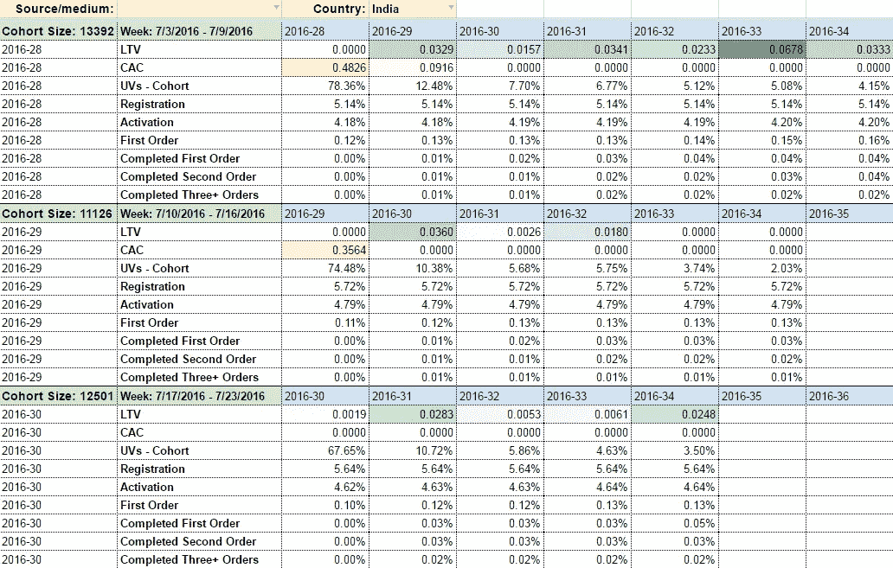
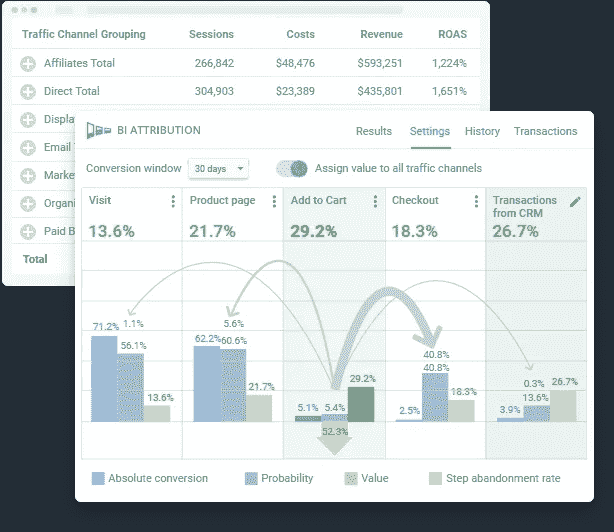

# 使用 Google Analytics 4 和 Google BigQuery Export 的六大好处

> 原文：<https://medium.com/geekculture/top-6-benefits-of-using-google-analytics-4-and-google-bigquery-export-3e96cd3698ae?source=collection_archive---------7----------------------->

Source: [Depositphotos](https://ru.depositphotos.com/165304302/stock-photo-billiard-balls-in-a-blue.html)

## 新的 Google Analytics 4 的主要优势之一是能够免费将原始未采样数据导出到 Google BigQuery。让我们看看这一变化为大多数谷歌分析(Google Analytics)用户带来了哪些机遇。

# 为什么您需要将 Google Analytics 4 与 Google BigQuery 集成

通过将 Google Analytics 4 与 Google BigQuery 集成，您可以从云存储中的网站收集原始的、未采样的数据，每个用户及其事件将显示在单独的行上。通过对这些数据使用 SQL 查询，您可以计算出您需要的任何参数和指标。

通过在 Google BigQuery 中收集站点统计数据，可以避免 Google Analytics 4 的采样和其他限制。您将能够分析完整的数据，这意味着基于这些数据做出的决策的质量将远远高于您基于 x 做出的决策的质量。

例如，[GA 4 中用户和事件数据](https://support.google.com/analytics/answer/7667196)的默认保留期是两个月。您可以在资源设置中将它增加到 14 个月。但是，如果您想要分析超过 14 个月前最后一次登录的用户的事件，这可能还不够。也就是说，您不能生成两年范围的报告。这就是 Google BigQuery 可以提供帮助的地方。将数据导出到 BigQuery 后，可以不受时间限制地存储它。

# 在 Google BigQuery 中使用 Google Analytics 4 数据的好处

## 1.无限制的报告(以及自定义调整)

谷歌分析或任何其他分析系统的界面限制了你创建报告的能力。例如，对参数和指标的数量以及如何组合它们和基于它们执行计算有限制。此外，在 GA 4 中，无法导入成本数据、创建自定义渠道分组，也无法在报告中包含来自 CRM 等第三方来源的指标。

通过访问 Google BigQuery 中的原始数据，您可以根据需要构建任意数量和组合的指标报告。例如，您可以根据对您的业务非常重要的任何指标进行群组分析。

Image by Author

在 Google Analytics 4 中，标准报告不需要进行采样，但是可以在自定义报告中使用采样:在比较数据时，在使用附加参数和过滤器时，在超过 1000 万个事件的限制时。当日期范围大于 60 天时，也会应用抽样。

抽样会扭曲数据，所以你不能 100%相信用抽样构建的报告。对于长时间的报告或具有大量参数和指标的自定义报告来说尤其如此。通过将 Google Analytics 4 的原始数据上传到 Google BigQuery，可以避免这个问题。

## 2.基于销售和客户数据的报告(已完成订单)

您网站的原始数据可以与来自广告服务的广告支出数据、呼叫跟踪数据、电子邮件简讯数据以及来自 CRM 的兑现订单数据合并，以建立端到端分析。

这将使你能够考虑到与你的公司的所有接触点，分析用户的转化路径，评估所有营销努力(在线和线下)对业务绩效的影响，找到最有效的营销渠道，并快速优化带来损失的渠道。

## 3.基于您的规则定制归因模型

一旦您收集并合并了所有的营销数据，您就可以创建适合您的业务结构的复杂销售渠道，并建立自己的归因模型来评估每个广告渠道对销售的贡献。

例如，您可以使用基于 OWOX 漏斗的归因来评估渠道对营销漏斗的贡献。[基于漏斗的归因模型](https://www.owox.com/products/bi/attribution/)根据每个渠道和活动对用户通过漏斗的步骤的进度的贡献，计算漏斗中每个渠道和活动的价值。要进行这种计算，聚合数据是不合适的——我们需要关于每个用户操作的数据，通过用户 ID 链接。

渠道越能帮助买家度过最困难的阶段，它获得的价值就越大。

Image by Author

使用基于漏斗的归因模型，您可以确定最有效的活动，并专注于开发它们来实现您的营销计划。例如，您可以找到可开发的管理活动，以增加能力有限的从属渠道的弹性(有机、品牌背景、CPA、重新定位)，从而提高您的整体销售额。

## 4.使用自定义功能集预测转化率

谷歌分析 4 提供了使用机器学习计算的[预测指标](https://support.google.com/analytics/answer/9846734?hl=en)(购买概率、流失概率和收入预测)。然而，该模型是一个黑盒，只对 GA 4 数据进行操作。

假设数据分析师的任务是创建一个模型来预测购买的可能性。预计该模型将尽可能透明(将清楚它所训练的功能)，并基于所有可用数据(包括自定义数据)形成。在这种情况下，Google Analytics 4 界面对分析师来说不再足够，因为他们不知道 GA 计算的预测指标中有什么。如果您需要理解和管理模型，例如，设置您自己的特征来训练它，最好将您的数据上传到 BigQuery。

## 5.将单个频道分组

在 Google Analytics 4 中，提供了一个标准的预定义频道分组(付费、搜索、有机等。).这意味着您将无法在 GA 4 界面中使用自己的通道分组来构建报告——至少现在还不能(也许将来会添加这个选项)。

例如，默认情况下，你的 facebook/cpc 活动属于付费渠道组，但你可能需要将它们分成付费社交组。在这种情况下，将数据上传到 BigQuery 并使用 SQL 对通道进行分组会有所帮助。

公平地说，通道分组可以用更简单的方式配置:

1.  通过内置连接器将 Google Analytics 数据连接到 Data Studio。
2.  在 Data Studio 中设置分组条件。

它不会像 Google BigQuery 中的分组通道那样可靠，但是如果您需要一个快速的解决方案，您可以使用这个实现。

## 6.过滤统计数据

假设您需要向合作伙伴展示仅基于 UTM 标签的统计数据，并且不披露任何其他信息。在 Google Analytics 4 界面中，您不能为此创建单独的视图。只有一个单一的资源视图，也就是说，所有的合作伙伴都能看到所有的数据。

Google BigQuery 允许你加载大量数据并使用 SQL 快速处理数据。您可以自动生成和安排报告，这样您的团队就可以专注于获取见解，而不是准备报告。

**注意:**从 Google Analytics 4 向 BigQuery 导入数据是免费的，但有一些限制，超过这些限制你需要付费。你可以在这里找到详细的。

# 结论

过渡到谷歌分析 4 是大多数公司在 2023 年 7 月 1 日之前必经的一步。最好现在就开始在谷歌分析 4 中收集数据，与通用分析同时进行。在并行跟踪的帮助下，你可以比较两个版本的谷歌分析，探索新功能和 GA 4 中的新界面，并积累历史数据。越早安装 Google Analytics 4，收集的历史数据就越多。