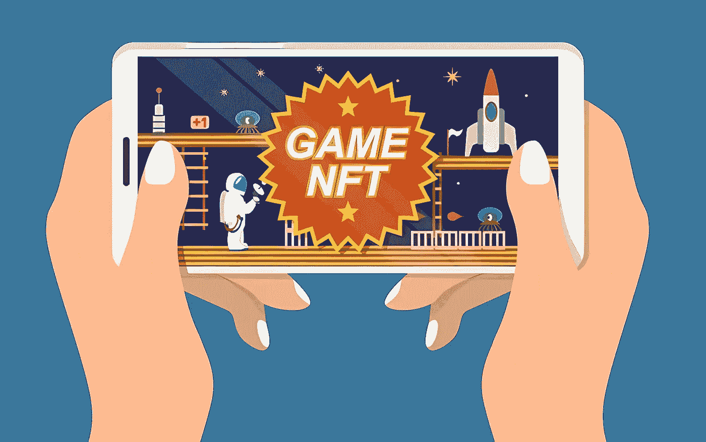
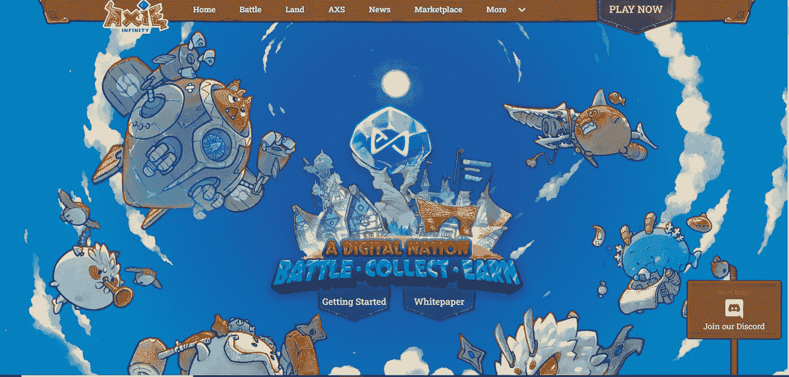
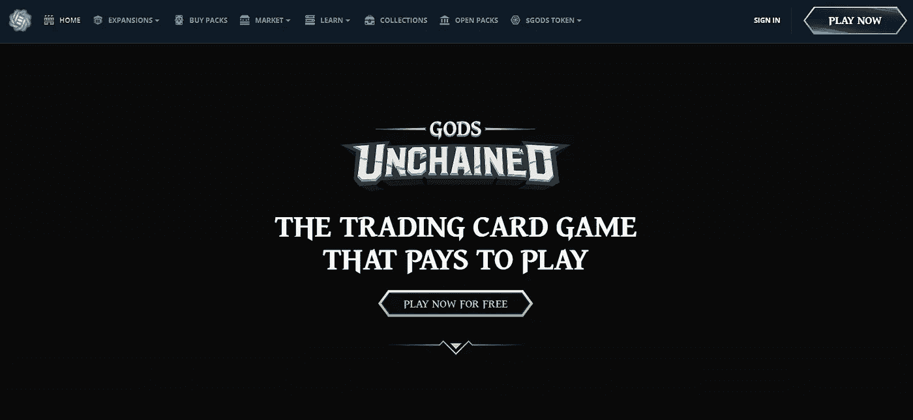
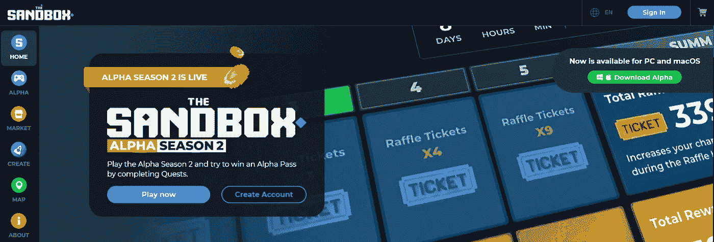
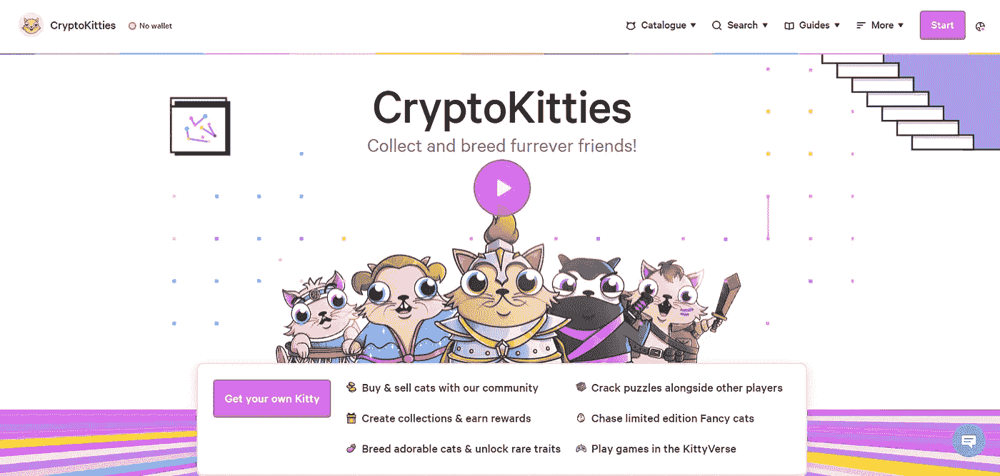
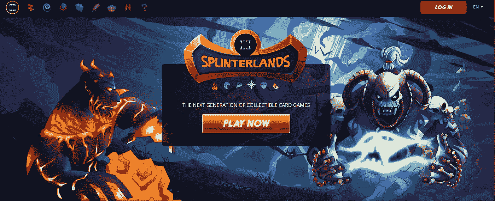
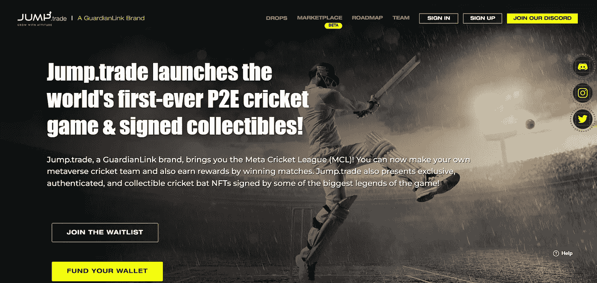

# 赢得 2022 年 NFT 奥运会的前 6 名游戏

> 原文：<https://medium.com/geekculture/top-6-play-to-earn-nft-games-in-2022-ce4323b1c419?source=collection_archive---------7----------------------->

## 在 NFTs 的影响下，游戏行业正在蓬勃发展。这里列出了赢得 NFT 游戏的最佳玩法。

Play To Earn NFT Games

帮助 NFT 取得今天成就的激励因素，在他们主办的游戏部门中发挥了很好的作用。2021 年，NFT 的总收入为 410 亿美元。全年一、三季度迎来总交易量的 70%以上。NFTs 中的游戏产业在这个领域表现同样出色，交易额达到 100 亿美元。其中，仅游戏中的商品就有大约 20 亿美元。

## [轴协无穷大](https://www.google.com/search?q=axie+infinity&rlz=1C1CHBF_enIN983IN983&oq=Axie+Infinity&aqs=chrome.0.0i131i355i433i512j46i131i433i512j0i131i433i512j0i433i512j0i131i433i512j0i20i263i512j0i131i433i457i512j0i131i433j0i512.807j0j7&sourceid=chrome&ie=UTF-8)

[Axie Infinity](https://www.google.com/search?q=axie+infinity&rlz=1C1CHBF_enIN983IN983&oq=Axie+Infinity&aqs=chrome.0.0i131i355i433i512j46i131i433i512j0i131i433i512j0i433i512j0i131i433i512j0i20i263i512j0i131i433i457i512j0i131i433j0i512.807j0j7&sourceid=chrome&ie=UTF-8)

*   带有化身的口袋妖怪仿真/灵感界面被称为“Axie”玩家可以积累，交易，升级，等等。
*   该平台是在以太坊区块链上开发的，该平台在 2021 年大受欢迎。
*   它今年的市场估值超过 10 亿美元，是 NFT 地区最大的游戏平台之一。
*   玩家可以收集市场专用的令牌“SLP”——光滑的爱情药剂，他们可以在以太坊平台兑换其他令牌。
*   这些代币是玩家在与“玩赚”模式的 NFT 游戏市场互动时获得的奖励。

## [被解放的众神](https://www.google.com/search?q=Gods+unchained&rlz=1C1CHBF_enIN983IN983&oq=Gods+unchained&aqs=chrome..69i57.284j0j7&sourceid=chrome&ie=UTF-8)

[Gods unchained](https://www.google.com/search?q=Gods+unchained&rlz=1C1CHBF_enIN983IN983&oq=Gods+unchained&aqs=chrome..69i57.284j0j7&sourceid=chrome&ie=UTF-8)

*   界面免费玩。装载了 NFT 角色的王牌模拟，玩家可以在游戏空间中使用。
*   这是另一个基于幻想的游戏界面，玩家通过更多的互动和努力来完成手头的关卡和任务，从而获得更多的利益。
*   凭借彰显高端图形和用户体验的出色界面，该游戏平台迅速成为 NFT 地区最受欢迎的游戏之一。
*   平台建立在以太坊区块链上，玩家可以进行纸牌交易，交易免油费。
*   随着 P2E 模块的部署，另一个游戏平台“被解放的神”很快取得了成功，值得一试。

## [沙盒](https://www.google.com/search?q=Sandbox&rlz=1C1CHBF_enIN983IN983&oq=Sandbox&aqs=chrome..69i57j46i433i512j0i20i131i263i433i512j0i433i512l2j0i131i433i512j46i131i433i512j0i131i433i512l3.438j0j7&sourceid=chrome&ie=UTF-8)

[Sandbox](https://www.google.com/search?q=Sandbox&rlz=1C1CHBF_enIN983IN983&oq=Sandbox&aqs=chrome..69i57j46i433i512j0i20i131i263i433i512j0i433i512l2j0i131i433i512j46i131i433i512j0i131i433i512l3.438j0j7&sourceid=chrome&ie=UTF-8)

*   也许是 NFT 元宇宙空间中最具互动性和智能的空间。玩家可以拥有虚拟土地，玩游戏。
*   元宇宙还提供了在购买的土地上建造生态系统的选项，包括他们自己的游戏。
*   这些空间可以作为单独的服务出租给希望在您购买的空间内进行互动的其他人。
*   游戏的每个方面都可以被激励——从游戏中的商品、头像、皮肤、生态系统和奖励代币。
*   这是在 NFTs 的元宇宙空间中流行起来的一个更知名的平台，并成为其他人的灵感来源。

## [隐猫](https://www.google.com/search?q=Cryptokitties+game&rlz=1C1CHBF_enIN983IN983&sxsrf=APq-WBs5ITwsHkGTjsNc1iGZUqH4Lh6szA%3A1648644546727&ei=wlFEYoj-K7qNseMP6_y14As&ved=0ahUKEwiI58XE7-32AhW6RmwGHWt-DbwQ4dUDCA4&uact=5&oq=Cryptokitties+game&gs_lcp=Cgdnd3Mtd2l6EAMyBAgAEEcyBAgAEEcyBAgAEEcyBAgAEEcyBAgAEEcyBAgAEEcyBAgAEEcyBAgAEEdKBAhBGABKBAhGGABQ1wdY3Q1g_g9oAHAEeACAAQCIAQCSAQCYAQCgAQHIAQjAAQE&sclient=gws-wiz)

[Cryptokitties](https://www.google.com/search?q=Cryptokitties+game&rlz=1C1CHBF_enIN983IN983&sxsrf=APq-WBs5ITwsHkGTjsNc1iGZUqH4Lh6szA%3A1648644546727&ei=wlFEYoj-K7qNseMP6_y14As&ved=0ahUKEwiI58XE7-32AhW6RmwGHWt-DbwQ4dUDCA4&uact=5&oq=Cryptokitties+game&gs_lcp=Cgdnd3Mtd2l6EAMyBAgAEEcyBAgAEEcyBAgAEEcyBAgAEEcyBAgAEEcyBAgAEEcyBAgAEEcyBAgAEEdKBAhBGABKBAhGGABQ1wdY3Q1g_g9oAHAEeACAAQCIAQCSAQCYAQCgAQHIAQjAAQE&sclient=gws-wiz)

*   今天，一个可爱的游戏界面，包括基于再生朋克的猫的化身，称为“cryptokitties”，是一个巨大的交易。
*   它们在 2020 年升至最高点，目前仍在公海平台上积极交易。
*   令牌的所有者可以种植、饲养和繁殖猫，并产生具有自己独特属性的新小猫——一些比另一些更特殊和独特。
*   这些新生成的代币可以进一步出售和交易。可能性是无限的。
*   Cryptokitties 是非常理想的，因为每个都是根据 ERC-721 标准开发的。他们是发展 NFT 的最高梯队。

## [夹板岛](https://www.google.com/search?q=Splinterlands&rlz=1C1CHBF_enIN983IN983&oq=Splinterlands&aqs=chrome..69i57j46i67i433j0i67l2j0i512j0i67j0i512l2j0i20i263i512j0i512.313j0j7&sourceid=chrome&ie=UTF-8)

[Splinterlands](https://www.google.com/search?q=Splinterlands&rlz=1C1CHBF_enIN983IN983&oq=Splinterlands&aqs=chrome..69i57j46i67i433j0i67l2j0i512j0i67j0i512l2j0i20i263i512j0i512.313j0j7&sourceid=chrome&ie=UTF-8)

*   基于体育的游戏 NFT 空间。该平台鼓励“玩赚”模块。
*   但是为了玩游戏，玩家必须购买游戏卡。
*   该界面类似于一个游戏平台，基于玩家的战术知识以及他们如何利用手中的牌来获得优势。
*   收集卡可以购买互动，战斗，并赢得奖励的游戏。
*   最后，有了奖励点数，玩家可以获得更多的物品或代币。

## [星光大道](https://www.google.com/search?q=Star+Atlus&rlz=1C1CHBF_enIN983IN983&oq=Star+Atlus&aqs=chrome..69i57j46i10i433j0i10l4j0i10i433j0i10l2.296j0j7&sourceid=chrome&ie=UTF-8)

[Star Atlus](https://www.google.com/search?q=Star+Atlus&rlz=1C1CHBF_enIN983IN983&oq=Star+Atlus&aqs=chrome..69i57j46i10i433j0i10l4j0i10i433j0i10l2.296j0j7&sourceid=chrome&ie=UTF-8)

*   现在风靡一时的高端太空主题游戏之一。
*   玩家可以继续冒险、征服，并且“游戏赚钱”模块被设置为完全有效。
*   建造你自己的船去探索新的生态系统或星系。
*   图形和服务的梯队使它成为一个不那么容易获得的平台，因为它不是免费的。
*   但就像任何 P2E 平台一样，一旦你进入并开始使用这个平台，那就像在公园散步一样简单。

# 2022 年即将推出的项目

## [麦克跳转交易](https://mcl.jump.trade/)

P2E 博彩行业协会投机取巧，目前在全球范围内广受欢迎。对于开发者和玩家来说，它们可以是完全娱乐性的和创收的。 ***Jump.trade 推出全球首款“玩赚”板球主题的 NFT 游戏*** 。“收集-玩-赚取”设置被集成到游戏中，玩家可以帮助自己获得身临其境的体验。充满了元宇宙和多人游戏界面。加入他们的等待名单，收获即将与市场一起推出的超级战利品 NFT 系列中的早期鸟类奖励。

## 结束 NFT P2E 世界运动会

在 NFTs 的影响下，游戏行业正在蓬勃发展，这不仅仅是为了大型企业集团和开发商的利益。NFT 游戏平台的创收流是双向的。P2E 帮助那些与该行业有互动的人，如果他们愿意的话，创建一个银行。随着交易和投资，收入向数字资产开放。