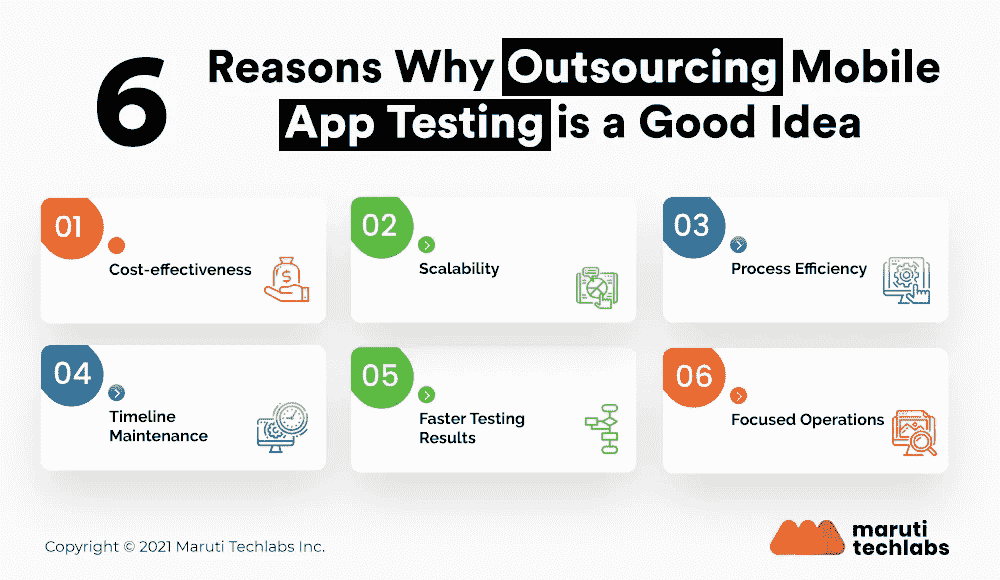

# 你应该外包移动应用测试的 6 大理由

> 原文：<https://medium.com/geekculture/top-6-reasons-why-outsourcing-mobile-app-testing-is-a-good-idea-b8c01a51bdf4?source=collection_archive---------32----------------------->

为了降低移动应用开发的总成本，你可以选择**而不是**将你的移动应用测试外包给可靠的 QA 专家。你需要意识到，如果不选择移动应用 QA 外包，你很有可能会推高整体移动应用开发的成本。

怎么会？

**通过外包移动应用程序测试，你可以在雇佣全职软件测试人员上节省一大笔钱。您还可以避免为内部测试人员支付昂贵的培训费用。一个经验丰富的外包软件测试团队将帮助您尽早发现问题。**

**外包你的软件测试功能也可以让你更快地开始你的新产品开发，转化为更多的商业创收机会。**

经过彻底测试的应用程序可以提高移动应用程序的评级，从而增加移动应用程序的下载量。

如果你仍然对外包移动应用测试犹豫不决，让我们来看看为什么外包移动应用质量保证是一个有益的决定。

# 外包移动应用 QA 是有益决策的 6 个原因

1.  **性价比**

如果你计划进行内部移动应用测试，那么你需要问几个问题。

*   您是否以有利的成本运营，并促进资源的最佳利用？
*   你能削减培训和招聘成本吗？

内部测试会自动增加你的业务开销。您需要建立适当的基础设施，投资合适的工具，雇佣专业工程师，并创建测试所需的环境。你还需要确保你的团队跟上最新的趋势，这意味着在培训和其他内容上的一点花费。

当你将你的移动应用程序测试外包给一家质量保证公司时，你将会在你所利用的服务上花费。顶级软件测试供应商以其一流的基础设施和工具而闻名。在这个领域中，他们知道业务需求，并且配备了准确的资源。因此，你可以有效地管理你的利基，同时确保你将获得的质量。你还可以节省移动应用测试的时间和精力。

**2。可扩展性**

作为一家企业，你希望在竞争对手之前，加快你的创意上市时间。然而，为了满足时间表，您还需要扩展测试过程。扩展需要对您的开发过程进行持续的测试，[测试的持续改进](https://marutitech.com/software-testing-improvement-ideas/?utm_source=medium&utm_medium=content_promotion&utm_campaign=Outsourcing-MobileApp-Testing)，以及测试所需资源数量的增加。在内部立即实施这种级别的扩展将是一项挑战。当您将 QA 外包给测试公司时，他们可以确保即时的可伸缩性，并保证测试与您的需求同步。因此，您可以满足发布时间表。

**3。流程效率**

当你在内部开发和测试产品时会发生什么？虽然开发是你的强项，但你的 QA 团队可能没有得到同等的发展。您可能还缺乏加速上市所需的专业人员和流程。在某些情况下，低效的工作流造成的空白也会导致测试问题。

你可以通过[选择正确的软件测试伙伴](https://marutitech.com/guide-to-outsourcing-software-testing/?utm_source=medium&utm_medium=content_promotion&utm_campaign=Outsourcing-MobileApp-Testing)来消除这些问题。软件测试专家有一个明确的过程，并了解业务需求。这有助于他们认识到你的产品的优点和缺点，并为创造一个更好的产品版本提供见解。他们将整合手动和自动测试，以确定移动应用程序的稳定性、性能、负载和其他功能方面。

**4。确保严格的截止日期**

应用程序测试需要一个指定的团队和紧张的时间表，以便您可以按时发布应用程序。然而，如果你没有资源或专家，你会推迟应用程序的发布。当您外包测试时，您会注意到测试合作伙伴有一个明确的过程，帮助他们保持对时间表的承诺。

简化的沟通、有保证的所有发现的报告，以及在开发阶段集成测试的灵活性有助于更快的质量保证测试。大多数机构在解决移动应用程序中的每一个问题之前，都会找到问题的根源。他们有一个定义好的测试环境，并提前准备好测试用例，这样他们就可以交付结果了。因此，他们可以更快更准确地解决问题。

**5。更快的测试结果**

当你在内部开发和测试应用程序时，你花费的时间是应用程序启动时间的两倍。因此，您无法提供快速而精确的结果，这也影响了您的商业声誉。

如果你在移动应用程序开发或设计方面很强大，那么就把精力集中在核心上。将移动应用程序测试外包给在该领域积累了专业知识的机构。他们将更快地发现错误，将测试集成到开发过程中以持续集成，并确保准确的结果。

**6。重点操作**

当您的 IT 团队承担与设置网络、开发业务应用程序和升级相关的任务时，测试应用程序将成为他们的额外负担。你会注意到结果的低效率和不准确性。

外包将有助于获得更快的结果。除此之外，你将与 QA 专家一起工作。专家可以更快地识别错误，并立即提供测试结果。最后，你将为你的核心业务节省时间和金钱，从而进一步扩大机会，增加你的转换。

软件和应用 QA 外包提供商依靠先进的测试自动化工具、测试管理和 bug 跟踪来提高测试过程的速度和效率。专业测试人员使用的一些最流行的测试自动化工具包括 Ranorex、Selenium 和微软编码的 UI 测试。

# 总结

外包你的应用程序测试不仅能节省你的时间和其他资源，还能让你安心。将软件测试的责任交给专家团队是利用您的资源更快地开发更好的软件产品的最有效方式。

与正确的 [QA 测试公司](https://marutitech.com/quality-engineering-services/?utm_source=medium&utm_medium=content_promotion&utm_campaign=Outsourcing-MobileApp-Testing)合作将使您能够完全控制您的软件解决方案，同时确保更好的&更快的测试结果。[马鲁蒂技术实验室](https://marutitech.com/?utm_source=medium&utm_medium=content_promotion&utm_campaign=Outsourcing-MobileApp-Testing)为更好的开发和更快的测试提供持续集成。在创建和测试产品时，我们会考虑客户的反馈和用户的关注。与我们合作，您将获得最先进的基础设施、协调一致的资源和完美的结构化计划，从而引领您在竞争中领先并获得制胜优势。