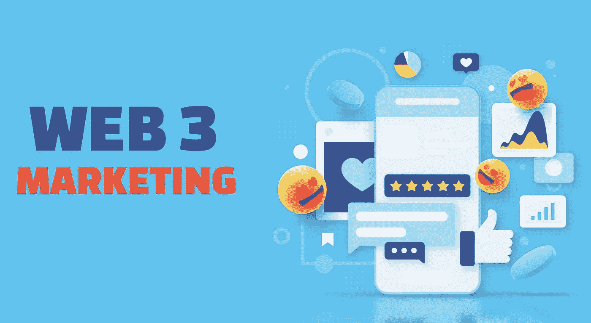
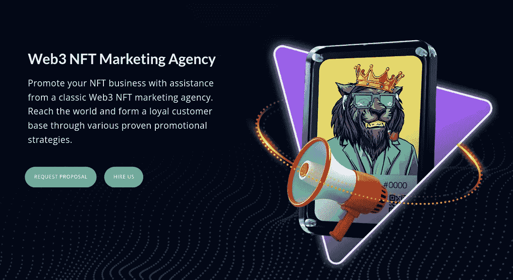
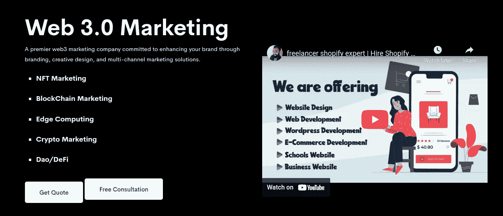
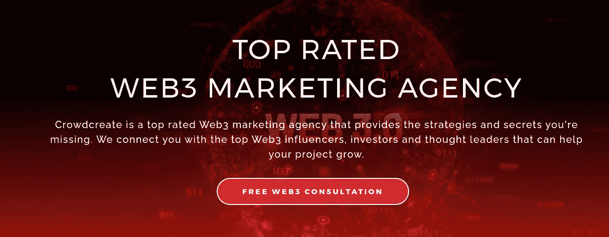
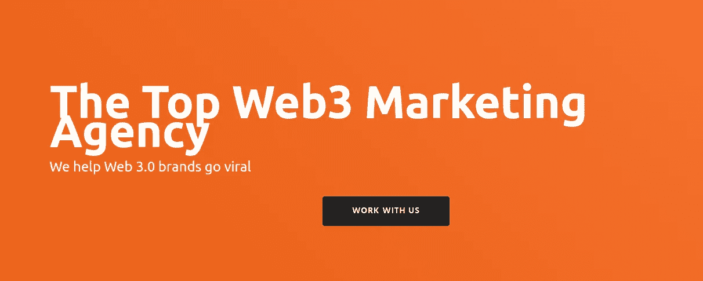
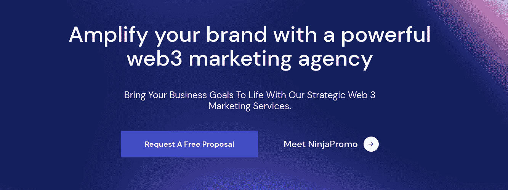

# 2023 年全球 6 大 Web3 营销机构

> 原文：<https://medium.com/geekculture/top-6-web3-marketing-agencies-in-the-world-in-2023-fc2d57241c55?source=collection_archive---------7----------------------->

Top 6 Web3 Marketing Agencies in the world in 2023

Web3 应用程序和服务在数字世界中获得了巨大的流行。由于其独特的功能，它被预言为互联网的未来。根据国家研究小组的调查，几乎 83%听说过 Web3 的用户认为它将塑造互联网的未来，并积极影响他们的数字生活。许多公司由于利用了这个赚钱的市场，已经进入了 Web3 空间。在这些公司中，仅 438 家初创公司就筹集了超过 45 亿美元的资金。

[**聘请最好的 Web3 营销代理**](https://www.blockchainappfactory.com/web3-marketing-services?utm_source=Guest+Blog+GC&utm_medium=1/11/22&utm_campaign=senpagapandian) 👈👈**点击这里**

这清楚地表明，Web3 空间已经成为一个竞争激烈的市场。对于公司来说，让市场知道他们的存在是绝对必要的。设计巧妙的网络 3 营销活动对在网络 3 市场建立品牌有很大帮助。由于有效的 Web3 营销需要通过不同的渠道和营销工具进行推广，它可以在没有任何专业帮助的情况下让你黔驴技穷。但不要害怕；我们编制了一份 2023 年前 6 大营销机构的名单，可以帮助您在 Web3 领域建立稳固的地位。

# 2023 年前 6 大 Web3 营销机构

## **区块链 App 工厂**

Blockchain App Factory

[**区块链 App Factory**](https://bit.ly/3sLPDn9) 是区块链开发和 Web3 营销服务的市场领导者。该机构创建量身定制的营销策略，以满足您的业务需求，并为您的品牌打造一个忠诚的社区，以获得有机的牵引力。

该公司提供的 Web3 营销服务包括社区营销、社交媒体营销、内容营销、影响者营销、公关营销、视频营销、不和谐营销等等。

如果你希望为你的 Web3 企业带来最大的影响力，区块链应用工厂可以成为你的首选，因为该公司专注于为你的 web3 项目产生高牵引力，为你的业务产生具体的结果。

## **SAGipl**

SAGipl

SAGipl 是一家著名的 Web3 营销公司，提供广泛的营销服务，包括 SEO、PPC、内容营销、社交媒体营销等。

SAGipl 凭借其强大的营销团队和丰富的 Web3 营销服务经验，采用定制营销策略为客户服务，确保品牌在 Web3 市场的最大影响力。

你可以和它的专家取得联系，交流你的营销计划和目标。SAGipl 凭借其熟练的团队可以为您的品牌提出一个创造性的营销计划。

## **记忆技术**

MementoTech

MementoTech 是一家领先的 Web3 营销公司，通过多渠道营销、品牌和创新的多渠道营销策略来增强 Web3 业务的存在。MementoTech 拥有超过 8 年的数字营销经验，是数字领域备受推崇的 Web3 营销公司之一。

该公司已经发展成为最成功的 Web3 营销机构之一，为 Web3 营销服务提供更加数据驱动的方法。

## **众筹**

Crowdcreate

Crowdcreate 是一家顶级的 Web3 营销机构，凭借其成熟的营销团队提供优质的 Web3 营销服务。从构思到成功发起有效的营销活动，Crowdcreate 可以根据业务需求和目标市场开展建设性的营销活动。

Crowdcreate 提供的 Web3 服务包括 web3 咨询、web3 咨询、Web3 病毒式推荐营销、Web3 影响者营销和 Web3 社交媒体营销。你可以联系 Crowdcreate，因为它在帮助品牌在 Web3 市场上制造宣传和轰动方面有着良好的记录。

## **合订本**

Coinbound

Coinboud 是另一家领先的 Web3 营销公司，帮助许多品牌在 Web3 市场建立了强大的存在。Coinbound 提供的 Web3 营销服务包括影响者营销、社区营销、Twitter 管理、公共关系、博客推广、SEO 优化和不和谐管理。

该公司擅长帮助企业围绕其品牌和产品制造声势，以提升其在市场中的地位。Coinbounds 做出了额外的努力，以确保他们的客户的要求得到满足。

Coinbound 是一个很好的资源，可以帮助 Web3 品牌扩大在 Web3 市场的份额。

## Ninjapromo

Ninjapromo

Ninjapromo 是一家著名的网络 3 营销机构，因其服务在世界各地广受赞誉。该公司成立于 2017 年，通过最先进的营销策略帮助品牌与目标受众建立联系。

Ninjapromo 为您的 Web3 营销活动创建了一个详细的路线图，包括咨询、审计、数据驱动的营销和执行，以根据结果完善活动。这是一家具有前瞻性思维的营销机构，其营销服务处于 Web3 领域的最前沿。

如果你对一个高度以结果为导向的营销团队感兴趣，这个团队可以为你的企业创造最好的结果，那么，Ninjapromo 就是一个不错的选择。

**总结**

随着加密行业呈指数级增长，更多的 Web3 项目正在进入市场。这使得加密市场成为一个高度竞争的地方。如果没有一个有能力的营销团队，在 Web3 市场建立你的品牌会是一项艰巨的任务。我们建议您为您的项目雇佣上述 Web3 营销公司之一，以扩大您在 Web3 领域的影响力。