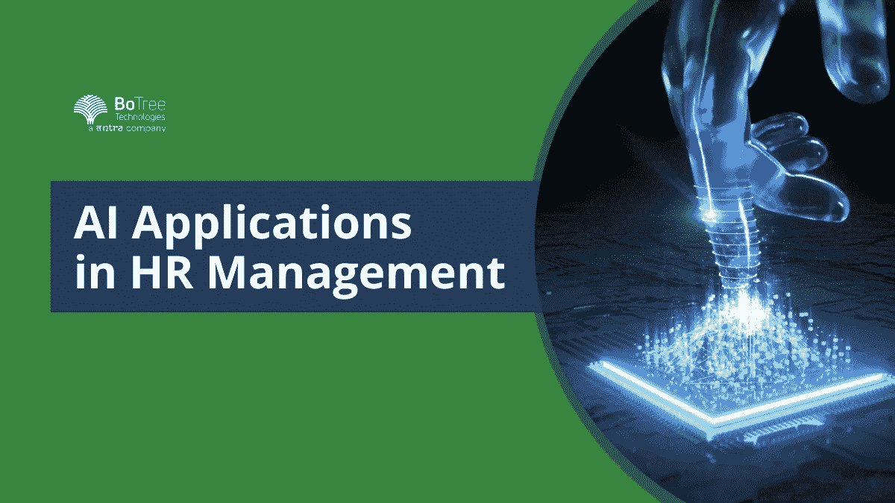

# 人力资源管理中的 7 大人工智能应用

> 原文：<https://medium.com/geekculture/top-7-ai-applications-in-human-resource-management-496d0d44160a?source=collection_archive---------15----------------------->

近 40%的公司在人力资源中使用人工智能。基于人工智能的解决方案使人力资源管理人员能够节省时间。当世俗的活动被处理时，他们可以扩展到更具战略性的角色。

寻找优秀人才是一项重大挑战。这需要大量的时间、精力和金钱。人工智能解决方案简化了招聘流程。LinkedIn 是[人工智能解决方案](https://www.botreetechnologies.com/artificial-intelligence-solutions)实施的一个很好的例子。

LinkedIn 使用相关工作功能来帮助候选人接触公司。它会根据之前的搜索推荐工作。找到理想的候选人变得更加容易。LinkedIn 人工智能系统使用算法来帮助候选人找到完美的雇主。

然而，用例不止于此。人力资源的初始流程是数据驱动的。关于候选人的事实信息提供了他或她的背景概况。[人工智能和机器学习](https://www.botreetechnologies.com/blog/artificial-intelligence-vs-machine-learning-vs-deep-learning-difference/)轻松自动化这一过程。

但是其他 AI 在 HR 的应用有哪些呢？让我们看一看。

> **阅读更多:** [**9 种方式 AI 正在改造定制企业软件**](https://www.botreetechnologies.com/blog/9-ways-ai-is-transforming-custom-enterprise-software/)

# 7 人工智能在人力资源管理中的重要应用

人工智能(AI)服务可行的领域有数百个。人力资源经理利用[机器学习算法](https://www.botreetechnologies.com/blog/machine-learning-everything-you-need-to-know/)来理解候选人数据。

**以下是人工智能在人力资源中最有价值的 7 个应用:**

1.  **恢复扫描:**

*   人力资源人员收到数百份求职申请。对他们进行扫描以找到合适的候选人是一个挑战。然而，快速扫描和选择是优先考虑的。但是人类的技能和能力是有限的。
*   基于人工智能的自然语言处理工具简化了这个过程。它扫描数百份数据，选出最好的简历。系统被赋予匹配简历的参数。它指定从人群中脱颖而出的候选人。

**2。任务自动化:**

*   人工智能开发解决方案轻松自动化数百项任务。人工智能让入职等活动变得简单。AI 可以在自动化任务的同时做出智能决策。
*   人工智能可以轻松管理员工福利。该系统可以回答团队的一般/常见查询。当人力资源需要输入数据时，他们可以实现自动化。借助人工智能开发解决方案，员工入职也变得很容易。它提供所有的入职文档，分配空间，并提供有关资产的详细信息。

**3。推荐评估:**

*   人工智能在人力资源领域的另一个伟大应用是评估员工推荐。系统可以识别员工提供的推荐类型。它让我们了解谁提供了最成功的推荐。
*   [人工智能系统](https://www.botreetechnologies.com/blog/what-you-should-know-about-the-future-of-artificial-intelligence/)分析以前推荐的数据。它将新推荐的人与任职期间表现良好的人进行匹配。转换的候选人通常是那些与以前的表现一致的人。它有助于提高员工保留率。公司很快就会知道被推荐的员工是否发挥了自己的潜力。

**4。员工入职培训:**

*   新兵的第一天总是充满挑战。然而，这是每个人力资源经理/主管都必须遵循的标准流程。它包括一个非常耗时的定向过程。
*   除了人类的体验，领先的人工智能公司创建员工定向软件。它为新员工提供了大量信息。公司知识和规则、工作简介、任务分配、团队成员分配等。，可以用智能系统进行。人工智能解决方案还有助于定制员工体验，从而提高员工保留率。

**5。内部流动性:**

*   AI 专家为 HR 创造管理内部流动的系统，这意味着什么？人工智能识别每个员工的关键绩效参数。然后，它将他们进行匹配，看谁有资格晋升，谁没有。
*   人力资源经理也可以更准确地评估工作满意度。通过调查，他们可以收集数据。通过运行人工智能算法，他们可以洞察员工如何看待自己的工作和组织。人工智能服务还可以预测谁更有可能退出一支球队。

**6。培训&发展:**

*   新员工和雇员通常需要培训。[人工智能开发者](https://www.botreetechnologies.com/blog/ai-solutions-for-next-level-customer-experience/)构建解决方案，告知人们他们的角色和职责。然而，基于技能集，人工智能会推荐在工作中取得成功所需的必要培训。
*   人力资源经理必须仔细阅读简历，评估哪些技能需要提高。人工智能(AI)服务更简单。他们评估简历上的技能，并确定哪些技能需要提高。然后，人工智能系统为培训提供必要的文档。

**7。简化沟通:**

*   将[人工智能应用](https://www.trickyenough.com/top-9-use-cases-of-artificial-intelligence-for-industries-in-2022/)整合到人力资源中最重要的好处之一就是简化沟通。联系公司的候选人必须等待很长时间，才会有人从公司联系他们。
*   聊天机器人，一个令人惊叹的人工智能实现，简化了通信过程。他们会自动向候选人发送电子邮件，并回答常见的问题。AI 系统可以进行首轮面试，了解候选人的基本信息。最重要的是，它可以简化内部人力资源沟通。系统可以根据提供的数据了解需要实施什么策略。

> **阅读更多:** [**Python AI:为什么 Python 更适合机器学习和 AI**](https://www.botreetechnologies.com/blog/python-for-machine-learning-and-ai/)

## 结论

任何一家构建 AI 解决方案的[软件开发公司](https://www.botreetechnologies.com/)都知道它在 HR 中有多重要，管理人员是最艰难的工作之一，但人工智能充当了简化这些工作的伙伴。

今天，相当多的公司正在人力资源中利用人工智能应用。无论是[企业软件开发公司](https://www.botreetechnologies.com/software-development-company)还是跨国金融科技组织，人工智能都在简化人力资源管理人员过去管理工作场所的方式。

如果你想在工作场所实现人工智能解决方案，并且需要人工智能专家，请尽快给我们打电话。我们提供免费咨询一切人工智能。我们的团队帮助简化人力资源管理流程，让您在寻找合适的人才方面拥有优势。

[**今天联系我们**](https://www.botreetechnologies.com/contact) **！**

*原载于 2022 年 8 月 2 日 https://www.botreetechnologies.com**的* [*。*](https://www.botreetechnologies.com/blog/ai-applications-in-human-resource-management/)