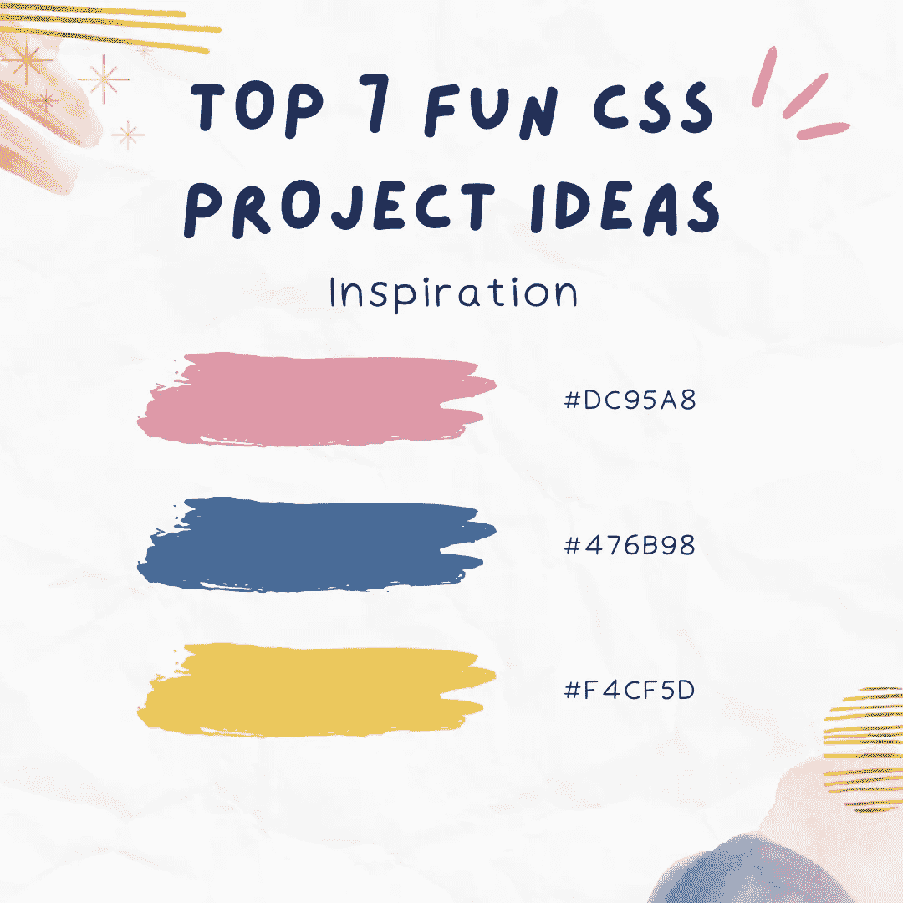

# 7 大有趣的 CSS 项目创意&初学者主题[2022]

> 原文：<https://medium.com/geekculture/top-7-fun-css-project-ideas-topics-for-beginners-2022-649abd21c686?source=collection_archive---------9----------------------->

任何想做网页设计师的人都必须明白 CSS 有多重要。你的网站可能会被赋予创造性的 CSS 设计和布局，给他们一个独特的外观。有了 CSS，你可以玩网站布局，改变字体和颜色，用有趣的效果修饰照片，等等。将显示从结构(HTML)分割成几个文件的能力是 CSS 的另一个奇妙特性。

但是学习 CSS 并不简单。你需要多种能力，比如设计、编码、想象力，来学习如何使用这个应用。这些能力必须随着时间的推移而发展，以达到特定的专业水平。尽管学习曲线很高，但构建自己的 CSS 项目可以帮助您提升知识和能力。当你构建和计划几个不同难度的项目时，你的实践能力会显著提高。

## 7 CSS 项目创意

这里提供了七个 CSS 项目建议来帮助你提升你的网页设计水平。

让我们先从最简单的 CSS 项目开始，然后再转到更复杂的项目。

## 1.使用当前 CSS 主题更新当前网站

一个网站不需要从头开始创建。在这个任务中，你所要做的就是改变一个现有网站的设计和主题，给它一个新鲜的、吸引人的外观。

一个调色板不变的网站会过时。以前，网站的风格或主题可以通过使用主题切换器来改变，除了基于 JavaScript 的切换控件之外，这通常还需要一个单独的主题库。然而，现代浏览器包含 CSS 自定义属性(变量)功能，使您能够尝试各种主题。

如果你想给你的网站一个黑暗的主题，请看现代 CSS:添加一个 CSS 黑暗主题上有一个完整的实现黑暗主题的指导。接下来是有条件地应用 CSS，解释了如何定义 [@media](http://twitter.com/media) 查询规则和 preferred-color-scheme。通过查看主题化策略，你可能会找到网站主题的灵感。它包括几个不同的主题建议。

## 2.将网站转换为可打印的版本

没有多少网站能够实现无障碍页面打印。这是因为基于 HTML 的网站是连续的平台，在印刷媒体上表现不佳。这种不匹配可能是由多种因素造成的，例如不正确对齐的部分、不合适的字体大小、不正确的列长度、缩放以及缺少或剪切的材料等等。

令人欣慰的是，CSS 使你能够纠正这样的问题，并使网站易于打印。你必须使用 CSS 来对齐布局中的组件，重置样式(从黑底白字到白底黑字)，删除不必要的部分(图片、菜单、表单、小部件等)。)，还有其他的东西。这一切都可能在短时间内完成。

## 3.修改表单的设计

您必须访问一个网站，该网站有该项目的表格(查询/调查/注册表格),并检查该表格是否是最近生成的。Web 表单通常以容器 div 和基于浮动的布局为特色，它们在小型显示器上不太好用，因为它们是在过去构建的(移动设备)。此外，这些表单可以包含其他 JavaScript 组件。

## 4.提高网站的速度

如果你的网站运行缓慢，你会失去访问者。在平均 2MB 的下载后，智能手机屏幕在 20 秒内加载一个网页。你可以使用 CSS 生成七个 65KB 的文件。这将极大地影响网站的加载速度。

分析现有网站，找出改进选项。它可能涉及改变字体、替换或删除图像，以及应用 JavaScript 效果。网站的权重会随着你对 CSS 的修改而调整，从而提高速度。

## 5.三维动画条形图

你以前没见过像这样的三维条形图。这个项目是当代 CSS 是如何灵活的理想例证。

flexbox 容器用于执行这些条形图。因此，根据您添加的条的数量和容器的大小，它们会自动修改它们的大小。因为每个条的大小在 EM 中运行，所以它们是可定制的，并且可以根据浏览器的字体大小有机地调整大小。当您将条形图移动到视图中时，它会变成动画。

## 6.个人地图制作者

另一个完全基于 CSS 的项目是这个地图制作工具。然而，它具有动态功能，这是 JavaScript 应用程序的典型功能，如地形放置和 3D 旋转。

这个自定义地图生成器使用 CSS 来创建旋转效果、旋转箭头和所有点击放置功能。3D 立方体用于实现项目的整体理念。每个块充当一个 3D 组件。简单地将鼠标悬停在积木上就可以旋转它们。

## 7.昼夜切换

这种昼夜转换机制是我们清单上的另一个挑战，比它第一次出现时更复杂。这个项目只使用 CSS，但它也有复杂的后端 web if 函数。

它首先通过一个复选框输入，将信息发送到后端。界面相当棒。切换符号允许在太阳和月亮之间切换(白天)(晚上)。当你从白天走到夜晚，整个背景变得生动起来。这种切换是为了记录用户的每次点击，并使用户界面变成白天或夜晚的动画。不言而喻，CSS 有助于切换非常漂亮的图标。