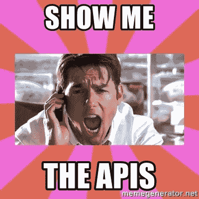
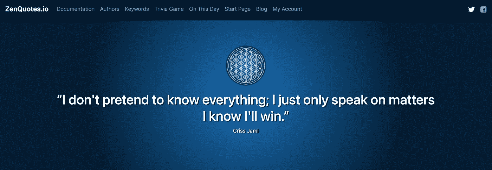
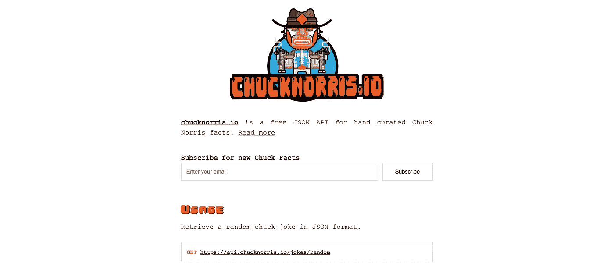
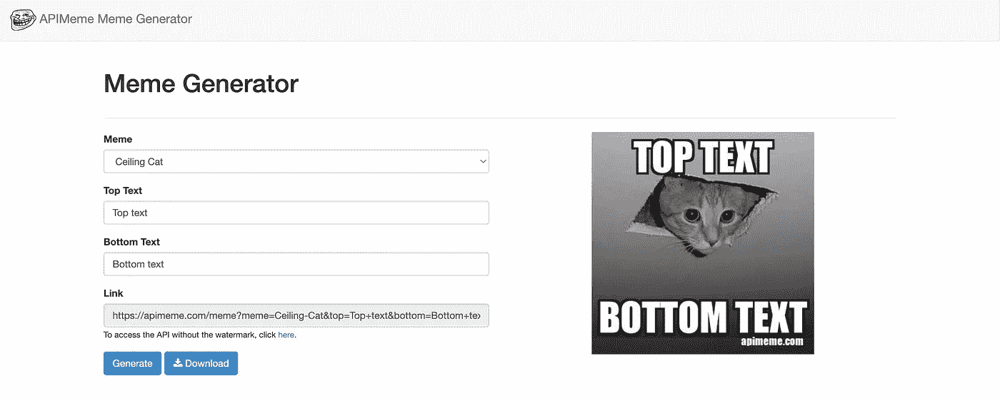
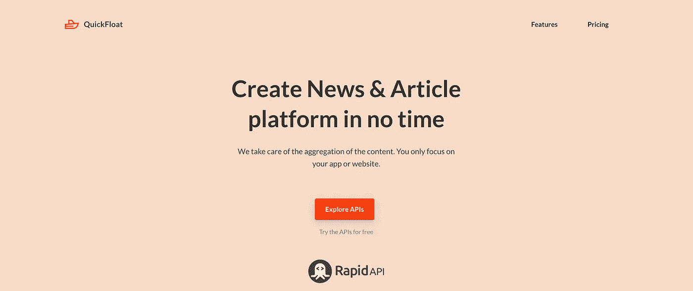
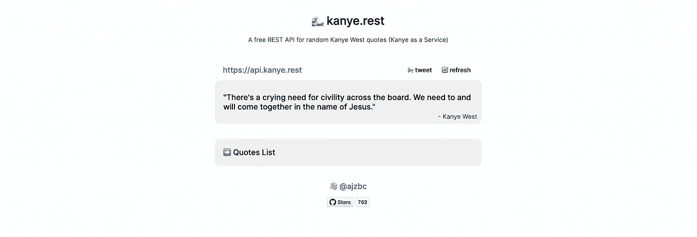
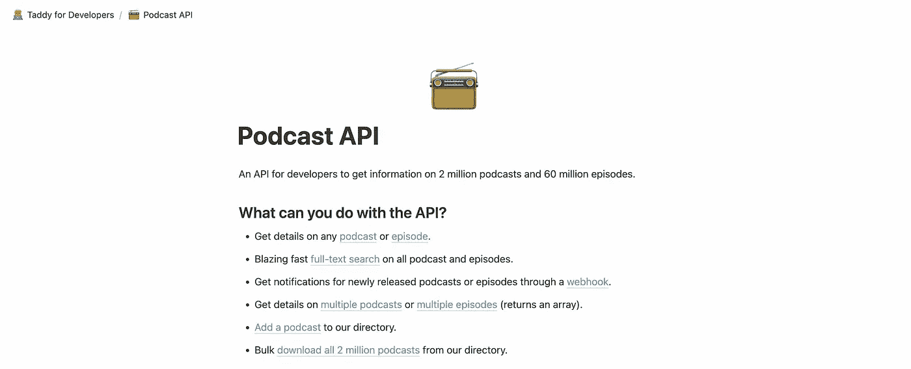
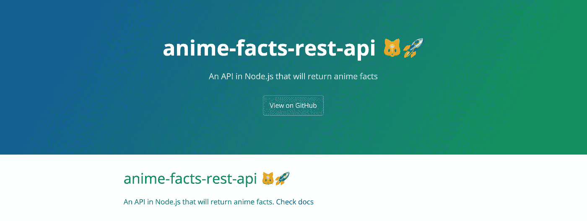

# 7 大隐藏的有趣 API 宝石供您尝试

> 原文：<https://medium.com/geekculture/top-7-hidden-fun-api-gems-for-you-to-try-172736439794?source=collection_archive---------14----------------------->

如果你是一名程序员，有更多的机会，你想创建一些随机的应用程序只是为了好玩。但是如果你只是为了好玩而创建你的应用程序，为什么要花太多时间呢？

在本文中，我将列出一些隐藏的 API 宝石，您可以在下一个有趣的项目中使用它们。我敢肯定，你甚至没有听说过这些。

# 1.随机报价 API

你可以创建自己的报价应用程序，每天显示一些随机报价，或者做更多的事情。Zen Quotes 为你提供了 API。只需调用一个简单的 API，就可以立即获得报价。

链接:【https://zenquotes.io/ 

# 2.随意的查克·诺里斯笑话

这太随意了。如果你想创建一个显示**随机查克·诺里斯笑话**的应用程序，那么这就是适合你的 API。

这个 API 将会返回一个笑话，甚至是一个图片来显示文本。多棒啊。

链接:[https://api.chucknorris.io/](https://api.chucknorris.io/)

# 3.迷因生成器

如果我告诉你，你可以通过把文本传递给一个 API 来生成一个迷因图像。酷吧？

APIMeme 会做到这一点。你只需要调用一个简单的 API，它就会立刻给你生成的迷因。

链接:[https://apimeme.com/](https://apimeme.com/)

# 4.文章 API

所以你想创建一个严肃的应用程序？也许你想在你的应用程序中显示不同类别的最新文章。但是你将如何获得最新的内容呢？

嗯， **QuickFloat** 会帮到你。只需调用一个简单的 API，即时获取最新内容。

链接:[https://quickfloat.com/](https://www.quickfloat.com/)

# 5.随机 Kanye West 报价

这是随意的 Kanye west 报价 API 或者应该说***Kanye as a Service****。*

也许你想为 Kanye 粉丝创建一个应用程序，并向他们展示 Kanye 的随机报价。Kanye.rest 就是为了那个。

链接:[https://kanye.rest/](https://kanye.rest/)

# 6.播客 API

如果你想创建一个展示**播客**信息的平台。这是给你的 API。你可以从 200 多万个播客中获取播客信息。

链接:[https://taddy.org/developers/podcast-api](https://taddy.org/developers/podcast-api)

# 7.动漫事实 API

这是只给动漫迷的。你可以使用 anime facts API 向你的动漫迷观众展示关于动漫的事实。很酷吧？也许在你的应用程序中添加一个分享选项，这样任何人都可以在互联网上分享这些事实。

链接:[https://chandan-02.github.io/anime-facts-rest-api/](https://chandan-02.github.io/anime-facts-rest-api/)

这只是 API 的一个小汇编，还有很多其他很酷的 API。我希望你用上面的 API 创建一些很酷的应用。

干杯！！