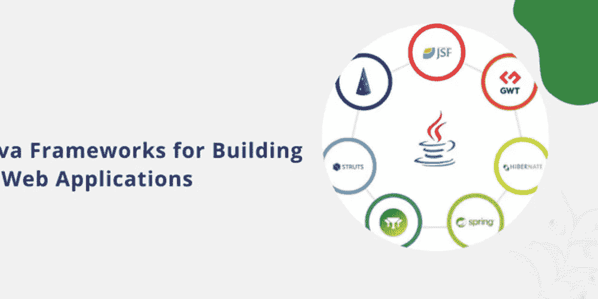
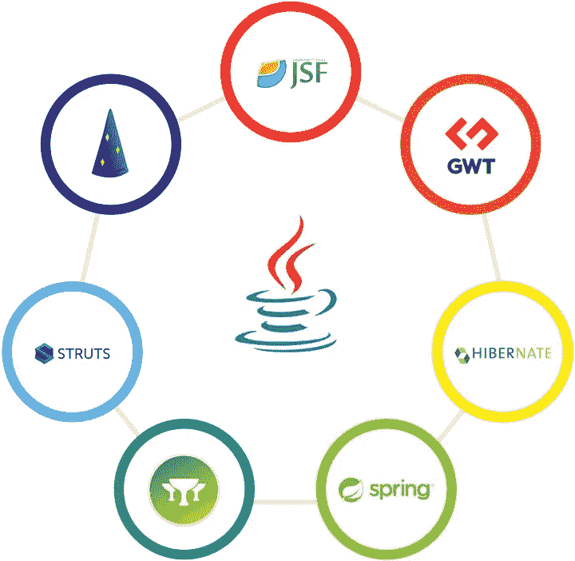

# 构建定制 Web 应用程序的 7 大 Java 框架

> 原文：<https://medium.com/geekculture/top-7-java-frameworks-for-building-custom-web-applications-f42678e9afe7?source=collection_archive---------11----------------------->

Java 支持超过 5000 万个网站。谷歌、脸书、网飞、亚马逊和易贝是使用 Java 解决方案的几个巨头。它是最有用的编程语言之一。

令人难以置信的是，网络上排名前 10，000 的网站中有 24.87%在其技术栈中使用 Java EE。它是全球软件开发人员使用第六多的编程语言。

Java 需要优秀的执行框架。然而，有数百个框架支持 [Java 开发服务](https://www.botreetechnologies.com/java-development-company)。

32%的开发人员使用不止一个框架进行开发。由于行业是如此的多样化，不同的任务执行有多种框架。

有针对 Java web 应用开发、机器学习、云计算、大数据、桌面应用等的框架。然而，每个框架也有一些共性。

本文将重点介绍创建 web 应用程序的 7 大 Java 框架。

> ***阅读更多:*** [***软件开发最流行的 Java 框架有哪些***](https://www.botreetechnologies.com/blog/what-are-some-of-the-best-java-web-application-frameworks/)

# Java Web 应用程序开发的 7 大框架

在很大程度上，框架提供了创建应用程序的环境。Java 框架是特定于 Java 编程语言的。当公司雇佣 Java 开发服务人员时，他们雇佣的是只在特定技术领域工作的 Java 专家。

资料来源:Orientsoftware.com

这里有 7 个对构建定制 web 应用有用的 Java 框架

1.  **弹簧**

*   Spring 是 Java 开发人员的最爱。这是一个强大的轻量级框架。Spring 简化并加速了开发过程。
*   谷歌、网飞和亚马逊是 Spring 最重要的用户。
*   该框架遵循 MVC 架构，有详细的文档，并拥有一个活跃的社区。公司经常使用 Spring 来创建 Java 企业应用程序。
*   Spring 提供了向后兼容性和代码测试。它包含了允许开发者一次完成多项任务的特性。
*   **功能-**
*   使用预定义的配置快速启动 Spring 项目
*   使用 JDBC 提高生产率并最大限度减少错误
*   从春天 MVC 或 Spring Boot 中选择
*   通过主动 IOC 反转保持框架控制
*   支持关系数据库管理

**2。休眠**

*   作为一个免费的开源框架，Hibernate 是 Java 专家的可靠伴侣。它是最可靠的对象关系映射 Java 框架之一。
*   IBM、戴尔和 Daily Hotels 是少数使用 Hibernate 的公司。
*   本质上，Hibernate 是一个在关系数据库管理和 Java 之间架起桥梁的框架。它是一种 ORM，以其强大的数据访问功能而闻名。
*   Hibernate 拥有独特的工具，如向导、映射编辑器和逆向工程，可以简化 web 应用程序开发。
*   **特色-**
*   使用轻量级框架快速扩展应用程序
*   用简单的编码实现复杂的数据操作
*   用 Hibernate 查询语言克服 Java 的困难
*   用抽象层将代码与数据库松散地耦合起来
*   轻松处理 NoSQL 数据存储

**3。雅加达服务器面孔(JSF)**

*   Java 顾问推荐 Jakarta Server Faces (JSF)创建一个惊人的前端。它有一个基于组件的用户界面，用于设计在线 Java 应用程序。
*   甲骨文公司、乐天银行和德意志信贷银行是 JSF 的主要用户。
*   Jakarta Server Face 是一个基于组件的 MVC 框架。它主要关注表示层，使开发人员能够构建令人惊叹的 UI 元素。
*   Jakarta Server Faces 以前被称为 Java Server Faces。
*   **功能-**
*   封装客户端技术以实现高性能
*   拖放可重用的用户界面组件
*   为验证和方法调用添加 Ajax 事件
*   通过 Facelets 模板化使用 XML 而不是 Java
*   组织良好且有用的文档

**4。支柱**

*   也被称为 Apache Struts，这个框架非常适合 Java 软件开发服务。该框架基于 web 开发的约定优于配置原则。
*   Aspen、Jalan 和 Spookies 是两家使用 Struts 的公司。
*   虽然 Struts 遵循 MVC 架构，但是它分离了视图、控制器和模型。它通过 struts-config.xml 配置文件提供它们之间的绑定。
*   Struts 有两个版本——Struts 1 和 2。Struts 2 用 OpenSymphony web 框架工具扩展了第一个版本。
*   **功能-**
*   传统 MVC 框架的灵活性和可扩展性
*   与 Spring & Hibernate 等其他框架即时集成
*   创建易于维护的 [Java 企业应用](https://www.botreetechnologies.com/blog/top-use-cases-of-java-development/)
*   获得对 web 应用的各种主题和模板支持
*   最小化开发时间并简化流程

**5。谷歌网络工具包(GWT)**

*   这是 Google 产品的 7 大 Java 框架之一。它使用谷歌 API 进行所有类型的交互式[网络应用开发](https://www.botreetechnologies.com/web-application-development)。
*   Google Adsense、脸书和 StudyBlue 是两家使用 Google Web Toolkit (GWT)的公司。
*   Java 顾问推荐这个将 Java 代码转换成 JavaScript 的框架。该框架在其网站上有教程、文档和开发人员指南。
*   开发人员可以简单地将现有的代码库合并到框架中，然后开始创建解决方案。
*   **功能-**
*   在没有前端开发专业知识的情况下创建令人惊叹的用户界面
*   与 Eclipse IDE、Maven 和 JUnit 兼容
*   支持客户端和服务器端应用程序开发
*   支持完整的 Java 调试特性
*   提供国际化和本地化支持

**6。瓦丁**

*   当一个 [Java 开发公司](https://theomnibuzz.com/10-high-quality-java-development-companies-to-should-know-in-2022/)创建复杂的、多层次的应用时，他们通常更喜欢 Vaadin。它允许从 Java 虚拟机(JVM)直接访问 DOM。
*   迪士尼、富国银行、美国银行都是使用 Vaadin 的大巨头。
*   Vaadin 提供了一个内置的 UI 组件。它使开发人员能够创建新时代的 web 应用程序。该框架不需要 JS 或 CSS 来编写代码。
*   最棒的是，Vaadin 是跨平台的。Java 专家可以使用单个代码库整理本地、web 和移动应用程序。
*   **功能-**
*   动态接口的服务器端架构
*   利用 web 组件标准进行开发
*   轻松集成谷歌网络工具包(GWT)
*   用于路由客户端和服务器通信的轻量级框架
*   管理应用程序流程的高级 Java APIs

**7。Grails**

*   Grails 是对初学者最友好的 Java 框架之一，它是用 Groovy 编程语言编写的。它是一个开源的 Java 框架，用于简化 Java web 应用程序开发。
*   LinkedIn、Transferwise 和 SiteMinder 是 Grails 最受欢迎的用户。
*   Java 框架使用 MVC 设计模式。它简化了 Java 自动化测试的过程。Grails 完全兼容 Java 语法。
*   Grails 不需要任何配置。该框架还支持实例开发。
*   **功能-**
*   为 RESTful APIs 提供内置支持
*   支持动态特征形成，无需重启服务器
*   使用 Spring 的依赖注入来提高生产率
*   对于创建强奸原型非常有用
*   简单的部署和清晰的文档

**阅读更多:** [**现实世界中十大流行 Java 应用实例**](https://www.botreetechnologies.com/blog/java-applications-examples/)

# 结论

这些 7 大 Java 框架对于创建几乎每个行业的 web 应用程序都很有用——医疗保健、金融科技、物联网、供应链、新经济等等。作为领先的[企业软件开发公司](https://www.botreetechnologies.com/enterprise-software-development-company)，我们也利用这些框架进行交互式应用开发。

Java 专家构建无缝、可伸缩且高效的解决方案。如果你正在寻找一家使用这 7 个框架的软件开发公司，那么 BoTree Technologies 是正确的选择。

[**联系我们**](https://www.botreetechnologies.com/contact) **今天免费咨询。**

*原载于 2022 年 8 月 3 日*[*https://dev . to*](https://dev.to/botreetechnologies/top-7-java-frameworks-for-building-custom-web-applications-2jef)*。*