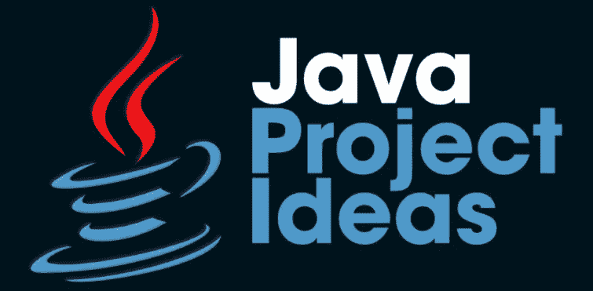

# 提高编程技能的 6 大 Java 项目创意

> 原文：<https://medium.com/geekculture/top-7-java-project-ideas-to-enhance-programming-skills-37fe0ccd16cb?source=collection_archive---------9----------------------->

难度:中等

你知道吗，尽管经历了无数的讲座、笔记、培训等等。，并且涵盖了所有需要的概念，大多数程序员仍然没有获得足够的信心和专业知识与他们的编程技能？

## ***想知道背后的主要原因…？？***

好吧，这是因为缺乏项目建设，也就是说，你需要有一些实际项目的实践经验，帮助你将所有的理论学习和知识应用到实际世界中。甚至可以说，项目构建是获得最大限度实际接触 JAVA 或任何其他编程语言的唯一途径。此外，从你的职业角度来看，从事现实生活中的项目也是必要的，因为几乎每个雇主都更加重视你的项目组合，以评估你的编程技能。

当使用 JAVA 进行实际项目时，建议您选择 Eclipse 或 NetBeans 作为您的 JAVA IDE，因为它们具有易于使用的功能。但是，您也可以使用其他几个 ide，如 Blue J、JDeveloper 等。根据您的要求和方便。现在，不浪费太多时间，让我们来看看 ***7 个可以帮助你提高编程技能的最佳 JAVA 项目想法*** :

# 1.JAVA 中的贪吃蛇游戏

作为一个初学者，强烈建议你从这个经典的贪吃蛇游戏开始你的项目建设之旅，因为它将帮助你在整个项目中保持兴趣和好奇心。贪吃蛇游戏可以用不同的方式和不同的规则来创建，但是，您可以选择构建不太复杂的游戏。这个游戏的主题是用代币(食物)喂蛇，这样它就不会被触碰到边界。玩家将在蛇每次吃掉代币时获得分数，最终分数将在游戏完成后显示。您可以使用 OOPs 概念、Swing 等在 JAVA 中高效地开发贪吃蛇游戏。

# 2.JAVA 中的计费系统

计费系统也是提高 JAVA 编程技能的最受欢迎的项目之一。该计费系统项目的主要目标是自动计算账单，即无需任何手动计算。您可以选择用一个简单的界面开始构建这个项目，该界面要求用户输入商品名称、单价和数量。根据这些细节，系统将生成一个账单，其中提到需要支付的总金额。用 JAVA 开发一个计费系统项目的最大好处是，你可以根据自己的技能和需求将项目的级别从初级切换到高级。

# 3.JAVA 中的学校/学院管理系统

这个列表中的下一个项目是学校/学院管理系统。该项目涉及到与学生、教师和其他工作人员相关的所有机构数据和记录的管理。在这个项目中，除了 JAVA 编程技能之外，您还需要对数据库概念有很好的了解。该项目可以通过集成其他功能，如考勤管理、公交车跟踪等，扩展到更高级的水平。您可以为 4 种类型的用户(管理员、教师、学生和其他员工)创建项目界面，这样每个用户都可以使用有效的用户名/密码登录系统，查看他们的详细信息，并执行各自的操作。

# 4.JAVA 在线学习门户

您也可以选择用 JAVA 构建一个在线学习门户来磨练您的编程技能。这个项目的主题是为用户创建一个平台，在这里他们可以注册自己，并可以从各种学习选项中挑选出相关的课程。该项目的界面将包括一个登录屏幕，用户需要在课程注册前注册自己。此外，应该有一个管理面板，以及监测所有的活动，并满足用户的要求。此外，在线课程或其他学习材料将被优先添加到门户网站，以便用户在成功注册后可以轻松访问资源。

# 5.数据可视化软件

但是，如果您是 JAVA 编程或项目构建的初学者，建议您先尝试一下上面提到的项目，然后再转到这样的项目。此外，由于数据可视化涉及图形或图示格式的数据的可视表示，数据可视化软件倾向于使用户理解以图表或图形格式而不是报告页面表示的信息变得高效和方便。数据可视化软件项目将以数据可视化的形式显示网络中的节点连通性。这个项目的主要目标应该是使用图形和图像的方式进行有效的信息交流，功能性和美观性都很好，有效地传达对复杂的数据和信息等的重要见解。

# 6.JAVA 中的交通控制系统

交通控制器系统项目推荐给初级和中级 JAVA 程序员。本项目是关于交通控制管理自动化系统的开发。在这个项目中将有几个模块来执行各种操作，如交通灯操作管理，交通路线管理，特定区域的交通警察管理等。此外，您可以使用 JSP 和 MySQL 在 JAVA 中构建流量控制器系统项目，并充分了解其他概念，如 OOPs、Servlets 等。您还可以通过添加一些更复杂的功能和使用 Spring、Hibernate 等将项目扩展到高级水平。

所以，这是几个最值得推荐的 JAVA 项目，你可以根据你的技能和方便程度来选择开发。这些项目不仅会提高你的编程技能，还会通过提供实践机会让你为科技行业做好准备。现在，你还在等什么？继续按照上面提到的项目思路工作，建立您强大的 JAVA 档案！！