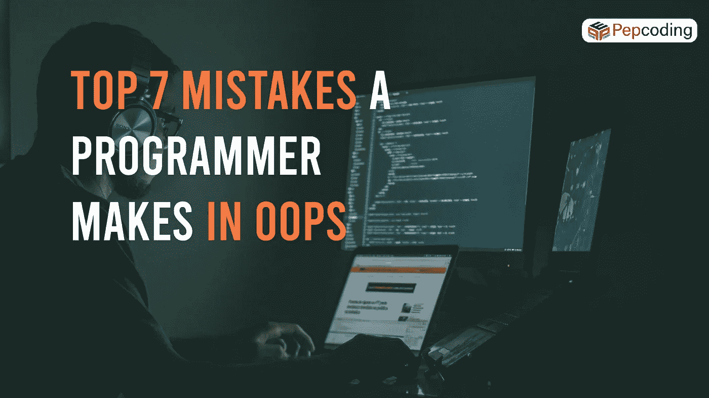
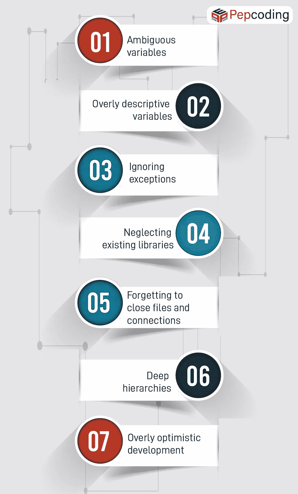

# 程序员在 OOPs 中犯的 7 大错误

> 原文：<https://medium.com/geekculture/top-7-mistakes-a-programmer-makes-in-oops-b32cc12e2a79?source=collection_archive---------25----------------------->

犯错误是正常的。只要你向他们学习

嗯，你知道 OOPs 是“**面向对象编程”。当大多数学生学习[时，他们会犯很多错误，但是这些错误帮助他们成为更好的程序员。](https://bit.ly/3Dyjraw)**

**哎呀**的主要目的是创建一个有目的的程序。它满足给定任务的所有要求，并能抵抗使用变化。第一个条件是提供给定的任务作为一个好的应用方案。第二个条件是学习 [**编程语言**](https://bit.ly/3Dyj7sk) **、**的知识，最后一个条件是了解程序运行的设置知识。但是在使用**哎呀**的时候，我们会犯一些常见的错误。在本文中，我们将讨论程序员在开发面向对象环境时会犯的那些常见错误:

1.  不明确的变量非描述性的变量名总是会导致混乱，也不会产生可读的代码。程序员应该能够看到一个变量的名字，并对它的用法和它包含的值有一个大致的概念。
2.  过度描述的变量对于其他程序员以及那些可能阅读代码的人来说，代码应该始终是描述性的和可读的。在某种程度上，过度描述的变量名和函数变得难以阅读。如果后续的多个函数调用很长，就会产生多行很长的代码，降低可读性。主要目的不是为了命名而命名代码，而是为了使其可读。

**3。忽略异常通常很容易让异常不被处理。但是最好由程序员来处理异常。异常总是故意抛出的，在大多数情况下，我们需要解决导致这些异常的问题。如果需要，您可以重新抛出它，向用户显示一个错误对话框，或者向日志中添加一条消息。最后，您可以解释为什么该异常没有得到解决，以便其他程序员也知道原因。**

**4。忽略现有的库**当然，作为一个程序员，如果忽略不计其数的库，那将是一个明显的错误。在开始之前，试着寻找适合你的选择。有多个库可供免费使用。这些可以是日志库，比如 Logback 和 Log4j，或者网络库，还有一些比如 Joda-time，它们已经成为事实上的标准。

**5。忘记关闭文件和连接**然而，写完文件后关闭打开的文件总是一个好习惯。在运行一个长时间的大型程序时，一旦你读/写完了文件，或者如果你没有关闭连接，就意味着你的程序仍然拥有资源。它不会让其他进程访问该文件，直到您的程序终止(这可能不是您所希望的)。

万一您无法关闭连接，这可能是有害的，因为典型的程序不会像结果集那样使用那么多连接。因此，积累大量未闭合的连接将需要相当长的时间，并且可能在测试时无法发现问题。

**6。深度层次**在创建一个**面向对象**的环境时，如果你一直拒绝使用抽象类，并构建在每一层都定义了大量数据的深度层次，这将产生一个问题，这意味着即使是一个微小的变化也可能导致整个事情失败。你真的不应该对漫长的编译时间、频繁的重新编译以及理解什么在哪里定义的问题感到惊讶。

**7。过分乐观的开发**嗯，**哎呀**理解程序员时间的价值。当你开始一个新项目时，这种情况经常发生，你总是在预期未来的特性中计划巨大的层次结构。但是在写代码的时候不要想太多，因为这会以某种方式影响你的代码。在**哎呀**中，试着不要忽略最初的目标，即可读、可扩展、可调试、稳定和可维护。在一个好的设计中，应该在做得过多和做得不够之间找到平衡。

这是我们在使用时经常犯的 7 个常见错误。 **OOPs** 的主要目的是创建设计良好、可重用和可维护的代码。考虑它有助于防止代码重复，有助于调试，并且适用于现实世界的问题。此外，请记住，您的代码应该对扩展开放，对修改关闭。如果你知道如何正确使用**哎呀**这是一个强大的工具。