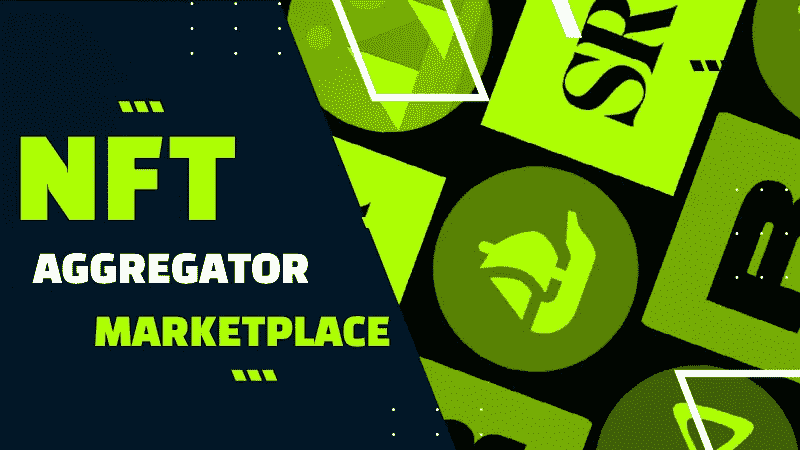
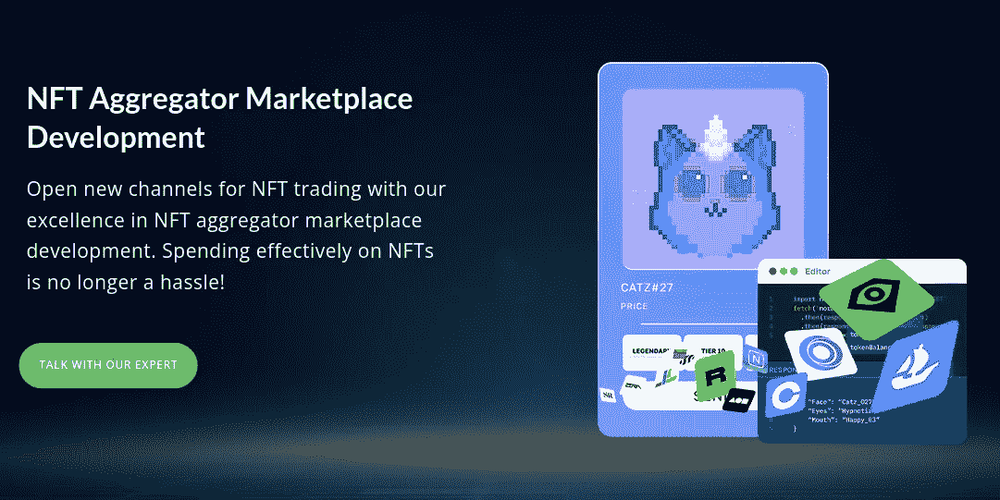
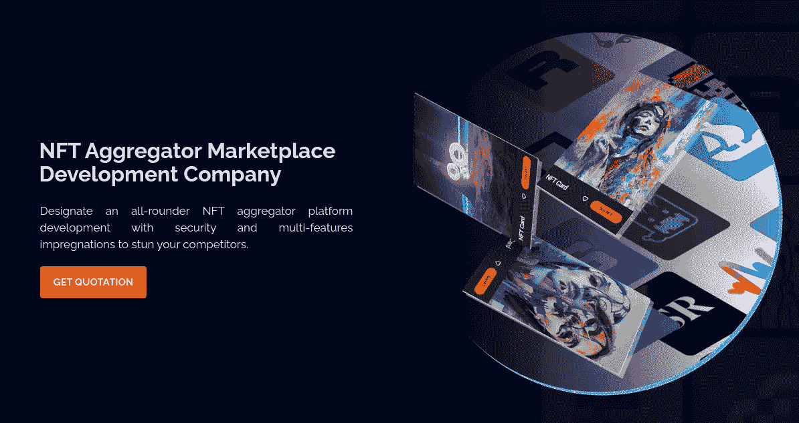
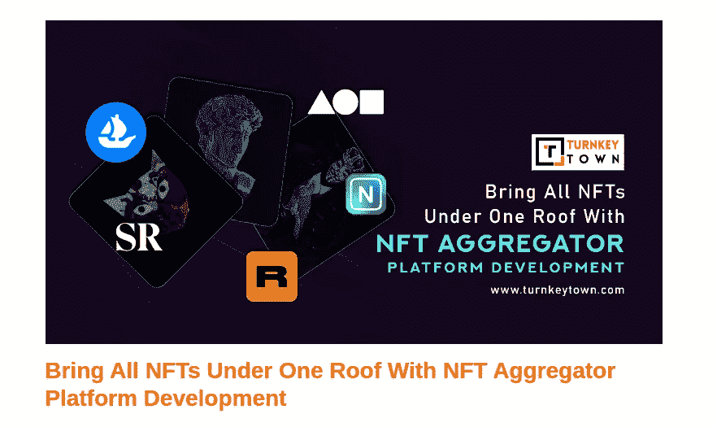
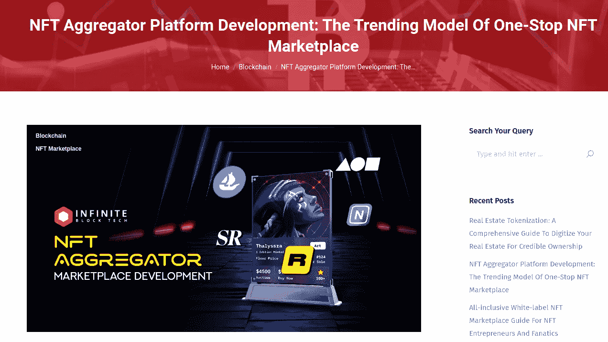
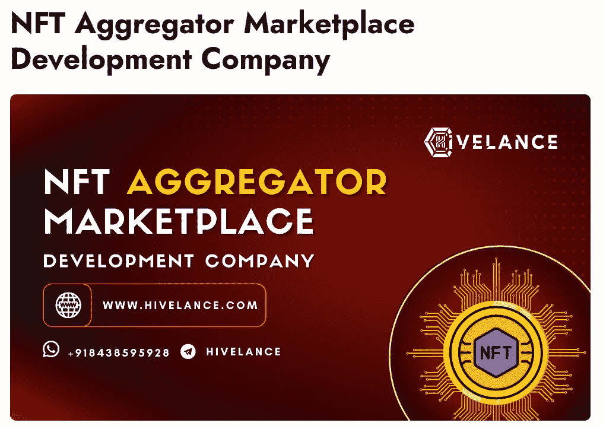
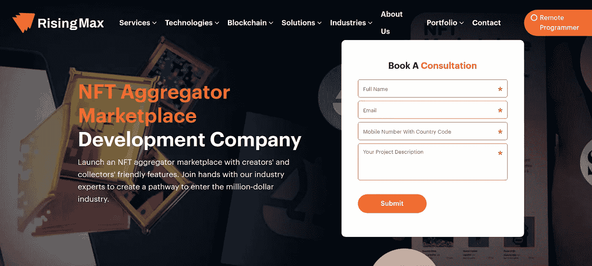
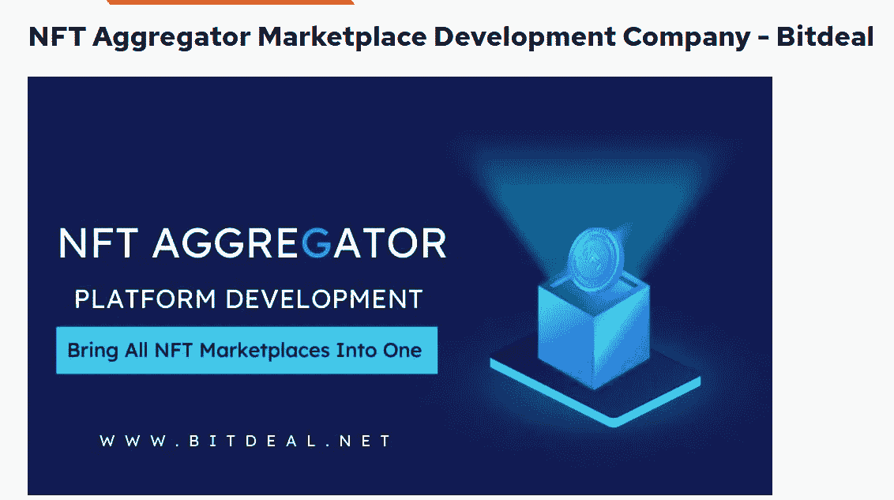

# 印度 7 大 NFT 聚合器市场开发商

> 原文：<https://medium.com/geekculture/top-7-nft-aggregator-marketplace-developers-in-india-1fdac2476e90?source=collection_archive---------23----------------------->

Top 7 NFT Aggregator Marketplace Developers in India

NFT 世界终于起飞了，在 21 世纪 20 年代发现了许多用例。虽然 NFT 市场过去是、现在仍然是不断发展的 Web3 空间中的盈利商业模式，但依赖于这些平台的另一种模式已经发展起来。他们被称为 NFT 市场聚合器，作为分析 NFT 价格和购买他们的一站式中心。因为他们的软件架构有点不同，所以对于企业家来说，利用专业的 NFT 市场聚合器开发公司的服务是理想的。这篇博客讲述了在创建这些平台方面表现出色的七大公司。

[**为 NFT 聚合器平台**](https://www.blockchainappfactory.com/nft-aggregator-marketplace-development?utm_source=Medium+GC&utm_medium=14%2F12%2F22&utm_campaign=senpagapandian) 聘请最佳开发者👈👈

# 印度最佳 NFT 聚合器市场开发公司

## 1.[区块链 App 工厂](https://www.blockchainappfactory.com/nft-aggregator-marketplace-development?utm_source=Medium+GC&utm_medium=14%2F12%2F22&utm_campaign=senpagapandian)

Blockchain App Factory

区块链应用工厂是一家 Web3 端到端 Web3 服务提供商，拥有 NFT 聚合器市场开发经验。该公司为其客户提供功能强大的聚合平台和相关的软件应用程序接口(API ),可以集成到主要的区块链网络中。它的专家还根据客户的要求，帮助开发具有众多功能的平台。该公司在 Web3 方面的丰富经验，以及活跃的研发团队和对最新技术的获取，无疑给了它优势。

## 2. [AppDupe](https://www.appdupe.com/nft-aggregator-marketplace-development)

作为 Web3 企业应用的另一个领导者，AppDupe 在 NFT 市场聚合平台创建方面的卓越表现无疑是一记重拳。该公司提供具有多种可集成功能的功能平台，包括铸造门户和钱包，使企业能够在 Web3 领域激烈竞争。其专业人员通过向其市场聚合器解决方案添加新时代的功能来吸引用户，从而提供模范服务。它的用户界面/UX 设计师是最好的，这在最终结果中是可见的。

## 3.[交钥匙小镇](https://www.turnkeytown.com/blog/bring-all-nfts-under-one-roof-with-nft-aggregator-platform-development/)

作为一个被低估的 NFT 市场聚合开发公司，交钥匙镇最近凭借其小团队赢得了一些声誉。那里的专业人员确保所有的客户需求都在平台上得到满足，而不会以任何方式妥协。他们还为客户企业提供技术和非技术支持，甚至在项目启动后也是如此，以确保一切顺利。如果你想在几年内建立你的 NFT 企业，你可以选择交钥匙城镇。

## 4.[无限块技术](https://www.infiniteblocktech.com/blog/nft-aggregator-platform-development/)

Infinite Block Tech 是一家端到端的区块链应用程序开发公司，致力于构建 Web3 业务应用程序。其新颖的市场聚合器开发为企业家提供了广泛定制的空间，使他们能够打造独特的商业平台。该公司的专家可以利用多个著名的区块链，以具有竞争力的价格为客户构建这些解决方案。Infinite Block Tech 的后端开发团队可以确保这些 NFT 市场聚合器解决方案保持强大和安全，击败任何安全漏洞。

## 5.[希韦兰斯](https://www.hivelance.com/nft-aggregator-marketplace-development)

Hivelance Technologies 是一家专注于 NFT 业务的 Web3 平台开发公司。其与 NFT 聚合器市场相关的解决方案已经在全球 Web3 社区中获得认可。该公司可以从头开始创建这些平台，方法是在前端和后端添加大量元素，并通过密集测试确保它们完美工作。它的服务平等地延伸到各种规模的企业家，多年来它部署的项目规模证明了这一点，这使它对风险投资非常友好。

## 6.[上升最大值](https://risingmax.com/nft-aggregator-app-marketplace-development)

RisingMax 是一家总部位于美国的公司，为客户提供 NFT 聚合器市场开发服务。其咨询、设计、开发、测试、推广和维护方面的专业团队致力于在区块链提供高质量的 NFT 聚合器软件解决方案。它们还通过提供足够的改进空间来确保平台适应新的趋势，即使企业决定自己进行更新。尽管服务来自美国，该公司收取相对经济的服务费用。

## 7. [Bitdeal](https://www.bitdeal.net/nft-aggregator-platform-development)

尽管进入市场较晚，Bitdeal 还是进入了我们的顶级 NFT 聚合器市场开发公司名单。该公司为其客户提供丰富的服务来部署这些平台，包括他们在两端要求的所有元素。该公司的顾问团队是 Web3 领域中最好的团队之一，因为其洞察力和对优秀分析工具的访问允许客户企业有效地规划其增长。Bitdeal 可能是长期致力于 Web3 的企业家的理想选择。

## 迷茫？永远不需要！

因此，我们向您展示了排名前七位的 [**NFT 聚合器市场发展**](https://www.blockchainappfactory.com/nft-aggregator-marketplace-development?utm_source=Medium+GC&utm_medium=14%2F12%2F22&utm_campaign=senpagapandian) 公司，这些公司可以帮助像您这样的企业家启动您的新企业。该模型的新颖性质，加上分析指标的参与，使得在没有专业帮助的情况下进行部署成为一个挑战。谢天谢地，你可以选择上述公司之一来为你创建它。总的来说，2023 年将是 NFTs 革命性复苏的时候，你不会想错过作为企业的一部分，在这个过程中获得巨大收益。

***“用一个复杂构建的 NFT 聚合器市场平台来吸引 Web3 社区！”***