# 7 大 NFT 即玩即赚游戏

> 原文：<https://medium.com/geekculture/top-7-nft-play-to-earn-games-e37a1f5d8b51?source=collection_archive---------3----------------------->

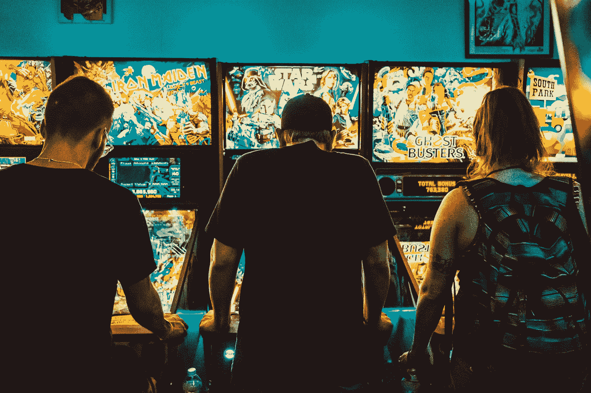

到目前为止，你可能已经听说过术语 **NFT** (不可替代令牌)。挺主流的。如果你是一个游戏玩家，你有机会在娱乐和竞争的同时**赚钱。如果你不是玩家，你可以交易游戏的 NFT 资产来获利。**在这篇文章中，我将列出**利用 NFT 的 7 大**游戏项目。

首先，对于那些不熟悉或者知之甚少的人来说——关于 NFT 的一些简短的事情。

> 不可替换令牌(NFT)是存储在数字分类帐中的数据单位，称为区块链，用于证明数字资产是唯一的，因此不可互换。NFTs 可用于表示照片、视频、音频和其他类型的数字文件。然而，对原始文件的任何副本的访问不限于 NFT 的买方。虽然任何人都可以获得这些数字项目的副本，但 NFT 在区块链上被跟踪，以向所有者提供独立于版权的所有权证明。—维基

NFT 有很多**用例**:

*   数字艺术
*   生成艺术
*   收藏品头像(个人资料图片)
*   **游戏**
*   虚拟世界
*   音乐
*   电影
*   模因
*   运动
*   时尚
*   色情描写
*   学院
*   公用事业

## 它是如何工作的？

NFT 怎样才能用在电子游戏中？它被用作数字资产，并允许用户购买一块土地，盔甲，卡包，缓冲器，怪物，收藏品等。有趣的是，由于 NFT，游戏中的物品可以在第三方(非本地)市场上出售，而无需开发者的批准。

## 玩赚 NFT 游戏

我们熟知很多游戏中的市井，比如著名的 MMORPG——**魔兽世界**、**江湖**、 **EVE Online** 、**黑沙漠**、**上古卷轴:Online (ESO)** 。这些 MMORPG 游戏的共同点是，除了有趣的游戏性、少量的任务、团队游戏、地下城和持久的突袭，还有复杂的市场。它赋予了新的游戏道具新的含义。

经过多年的游戏，已经形成了一个强大的市场，其中特定物品的某些属性受到重视，例如头盔、盔甲、宝石、坐骑等。

这些项目中的每一个都有特定的属性，例如:

*   稀薄
*   持久性
*   最低水平
*   灵活
*   活力
*   抵抗力(火、冰、毒等。)

物品越独特、越坚固、越稀有，就越受赞赏。玩家们意识到了这一点。有些物品甚至是独一无二的，或者只存在于游戏中的几个副本中，这就是为什么它们在游戏中的价格很高。

诚然，游戏中的价格是用游戏中的货币来支付的——无论是金币、银币还是类似的东西。

## 将游戏与 NFT 相结合

游戏也加入了 NFT 技术冒险列车——它是区块链(电脑游戏中一个项目的实际(货币)价值)和电脑游戏之间的联系。

你可以用代币购买游戏中的物品和其他数字资产。这个故事很有趣，有两个原因:

*   如果你是一名游戏玩家，它会让你玩电脑游戏，并参与有利可图的 NFT 市场
*   如果你是一个投资者或交易者，除了交易已知的风险敞口，如**股票**、**ETF**、**加密货币**，你还可以交易游戏中的物品并获利

**如何开始？**

在游戏中，您可以通过多种方式拥有与 NFT 代币相关的特定数字资产:

*   通过玩游戏，创造和发展角色
*   通过购买收藏品和有价值的物品，如卡，盔甲，头盔，市场上的角色(本地或第三方)
*   通过参加掉落物品或在玩家之间分配土地的活动

既然你知道了基本知识，是时候向你介绍 7 大电脑游戏了，你可以通过投资或玩这些游戏来获利。

# 1.无限轴

这可能是当时最流行的游戏了。在**安卓**、 **iOS** 、 **Windows** 和 **macOS** 上都有。

这有点像**口袋妖怪 Go** & **Tomagochi** ，因为你是**axis**的*主人*，你**培育**、**训练**和**对抗**其他玩家的角色(迷你怪物)。要开始玩，**你必须拥有 3 轴**。

该公司的想法是在娱乐和玩游戏的同时向玩家介绍区块链技术。

Axie Infinity 使用两种类型的 ERC-20 实用令牌— **光滑爱情药水($SLP)** ，你可以在 **PvP** (玩家对玩家)和**解决任务**时获得。

为了繁殖后代，你花费这些代币希望得到更好的后代。

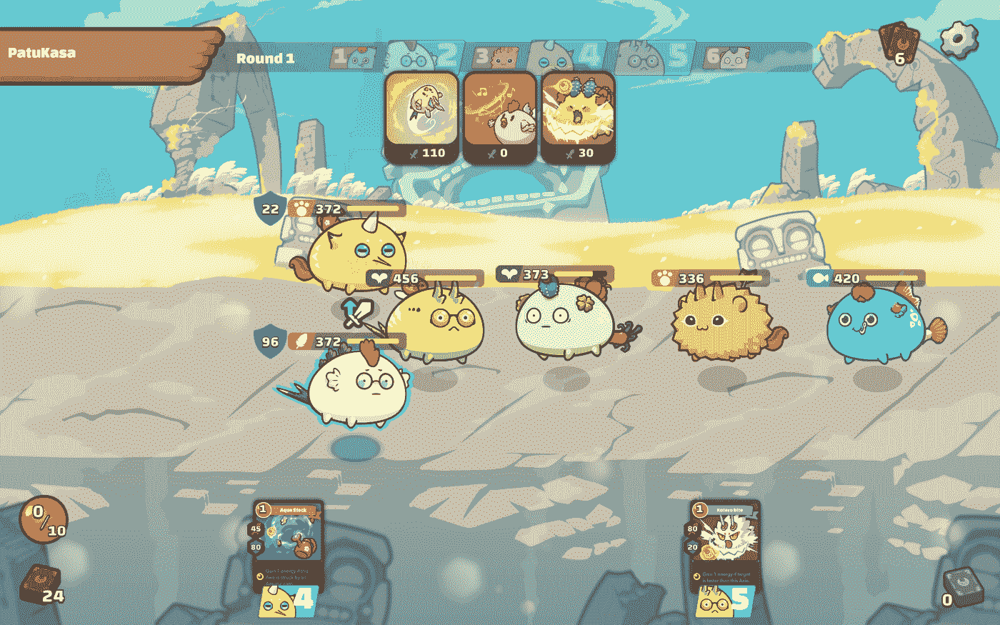

Axies Infinity battle example

## 战斗系统

Axie**通过**选择一张卡片来命令 Axie** 做什么来和**战斗。每个轴有 4 张**牌**，每场战斗**随机**。为了打出这张牌，必须开发能量。例如，如果你有 4 点能量，你可以打出一张适合你 4 点能量的牌。

战斗系统攻击随机目标，通常击中最近的目标。如果你输了，你**就会失去 MMR(配对等级)**。然而，如果你赢了，你**获得 MMR 和 SLP(顺滑爱情药剂)**。根据你的 MMR，你每赢一次可以获得介于 **0** 和 **12** 之间的 SLP。

目前全球有超过 15 万台 Axies，最便宜的在**1**左右，最贵的是**300 ETH**(2020 年回售)。

你也可以把你的轴借给其他人来照顾它们(因为你不能同时玩它们)。借轴的玩家叫**管理者**，管轴的玩家叫**学者**。

每个轴都有自己的 **DNA** ，所以每个品种都包含了一种可能性，即一个特定的轴从它的**祖先**那里拥有**优势**和**劣势**。除了 SLP，另一个使用的令牌是 **AXS (Axis Infinity Shard)** ，它被用作治理令牌。据说 2021 年将增加一个打桩系统。

月交易量约为 1.7 亿美元。
你可以在这里看到官方市场:[Axies Infinity market place](https://marketplace.axieinfinity.com/)

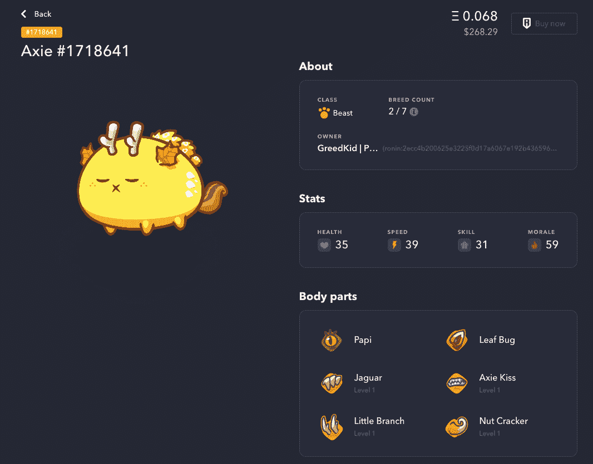

Axie example — showing basic stats and body parts with corresponding level

Axie 能力卡，命令 axie 在战斗中做什么:

阿谢的父母(还记得你为了得到孩子而繁殖他们吗？).孩子和他们的父母有相似之处——就像他们在现实生活中一样，所以他们可以继承好的东西和坏的东西，所以要小心:)

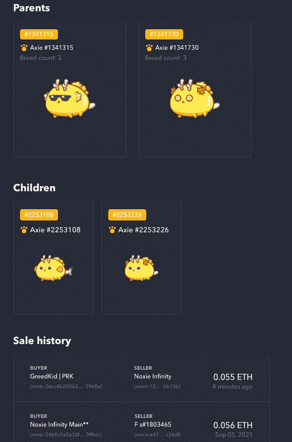

每个 Axie 跟踪他自己的销售历史。

# 2.分散土地

一个**分散的虚拟世界**。你有机会在游戏中处理**房地产**。

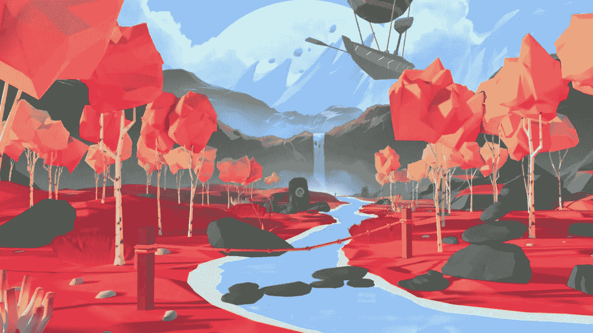

他们在 2015 年以“石器时代”*的名字开始，并有一个 2D 概念证明。2020 年 2 月，有一次官方的公共午餐。现在它是一个完全去中心化的 3D 虚拟世界，人们可以拥有或开发他们的土地。这片土地可以有任何东西，从**静态物体**到 **3D 场景**，到像**建筑**、**艺术**、**游戏**或**大型活动**。*

## *世界是怎么划分的？*

*去中心化的世界被分成小片段，称为**块**。地块大小为*16 米 x 16m 米(52 英尺 x 52ft 英尺)*，是你能拥有的最小一块。如果你有多个相邻的地块，你可以将它们合并成一个**地产**。更大的区域，可以是主题性的，被称为**区**。*

*每个地块由地图上的 **X** 和 **Y** 坐标(X，Y)确定，并带有以太坊区块链上的 **$LAND** (ERC721)令牌。Token 包含 X，Y 坐标，以及由社区运行的分散式服务器，其中包含 3D 渲染宗地所需的内容。*

*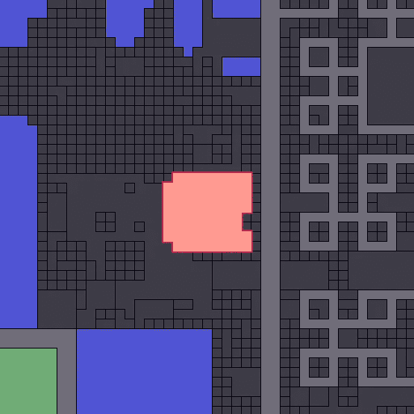*

*这与《我的世界》的情况有所不同，在那里，单一实体掌控一切，改变规则，禁止&做出决定。
在这里，**一切都属于社区**，由**道**(去中心化自治组织)治理，每个人都可以对提案进行投票。道控**智能合约**、**房产合约** & **可穿戴**。*

## *分散土地的象征和兼容性*

*为分散之地提供燃料的令牌叫做**$法力。**
游戏在 **Chrome** 或 **Firefox** 上运行。(Windows / MacOS)。*

*为了玩这个游戏，你需要一个充有 **ETH** & **法力**的钱包(比如超能面具)。*

*[分散式土地市场](https://market.decentraland.org/)*

# *3.夹板地*

*基于区块链的 NFT **卡牌游戏**，运行在 **HIVE** 引擎上。
最初，你必须在 Splinterland 网站上创建一个账户(提供电子邮件和密码)。最简单的玩法是通过 **BRAVE** 浏览器(尽管你可以用 **Mozilla** 、 **Safari** 或 **Chrome** 来玩)。*

## *启动包*

*开始的话，你要先买一个*首发包* ( **召唤师魔法书**，也就是 **$10** ，解锁赚**买能量水晶**等一大堆功能，到**交易**和**买**卡。如果你想注册并试一试，这里有一个推荐链接。*

*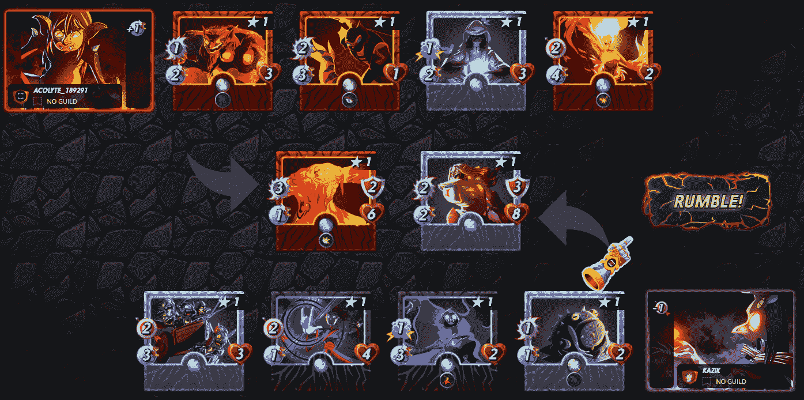*

*Splinterland PvP fight*

*有不同的**版本**、**陪衬**、**角色**、**稀有**和**元素**，组合众多。
战斗开始前，你选择你的花名册，战斗开始。你根据战斗的结果获得奖励。*

**

*There’s a ton of cards on the marketplace*

*你可以在这里找到市场:[夹板地市场](https://splinterlands.com/?p=market&tab=cards)*

*那里有一些**很贵的**和**标价的**卡。由于这仍然是一个相对较新的游戏，你可以开始**享受游戏**，同时仍然能够**通过玩游戏**赚钱和**获利。***

*还有一个名为 **$DEC** ( **暗能量晶体**)的令牌与该项目相关，其当前价格约为 0.007 美元，市值略高于 700 万美元，因此考虑投资该项目也是一个好主意。*

# *4.沙盒 3D*

> *“玩、创造、拥有和管理一个由玩家创造的虚拟世界”TheSandbox3D*

*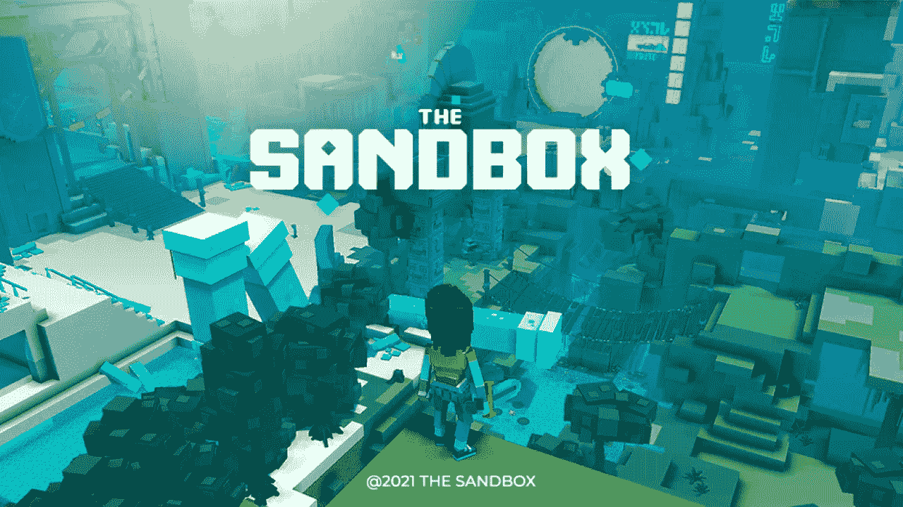*

*这款游戏可能会受到《我的世界》和 Roblox 用户的欢迎。*

## *$沙子和$土地代币*

*这是一个基于体素的游戏，你可以在其中建立和交易虚拟资产。有一张地图，你可以用 NFT 代币 **$LAND** 购买一块土地。还有一个 **$SAND** ，ERC-20 代币，用于**购买游戏内资产**和**物品**。*

*$沙币，是一种存储土地、 **NFT** 、**治理**和**玩家**的**值的货币，同时也用于下注。它只在以太坊上运行。【TheSanbox 平台包括:***

*   *创造一个资产，比如一个怪物，让它变成一个 NFT，然后在市场上出售。可以用体素创建。*
*   ***市场** —允许交易通过 NFT 制造商创建的资产*
*   ***游戏制作者**——提供创建游戏的能力，不需要任何编码知识，而且是免费的*

*创建资产时，有**宝石**和**催化剂**定义等级、稀缺性和属性。
**催化剂**通过 NFT-s 增加空的插座，里面填充**宝石**。催化剂的质量越高，插座资产就越多。*

*提供沙盒资产详细信息的图像*

# *5.被解放的神*

*一个**卡牌游戏**。《T2 魔法:聚会前导演》在《综合管理》中有提及。游戏有类似于**炉石、魔法聚会、Gwent(巫师)、游戏王**的元素。*

*它是基于 **PvP 决斗**的，在决斗中你与其他玩家战斗，并试图用你拥有的**牌的力量**、**策略**和其他技巧将对手的生命值归零。
有一个**等级系统**，旨在连接等级和技能相近的玩家。*

*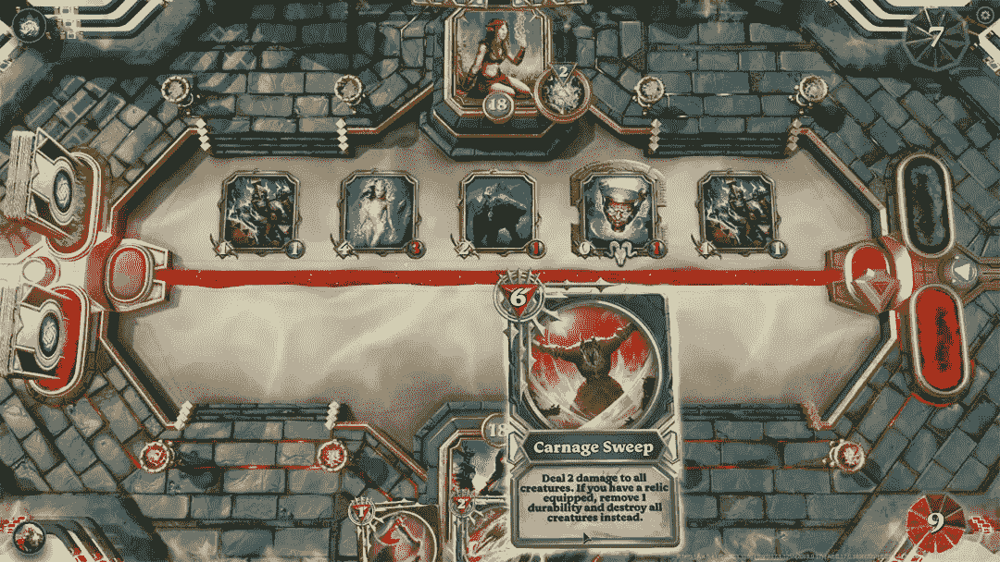*

*通过战胜其他玩家来购买或赢得牌。每一次胜利你都会获得**点经验值**，这些经验值可以让你升级到下一个等级。*

*每张卡都有一个 ERC721 令牌作为备份。因此，你可以在本地市场和第三方市场进行交易。如果你决定在游戏系统中出售一张门票，你将获得一个 **$GODS** 令牌(尚未正式推出，注意不要被骗)。*

# *6.九编年史*

*完全去中心化的幻想世界，由玩家驱动，在其中你可以和其他玩家一起玩、采矿和统治。*

*这里有**地牢**，你可以探索这些地牢，在九个不同的领域中寻找独特的怪物。为了变得有竞争力和足够强大，你可以通过**收集和组合原材料，用你自己的配方将它们加工成独特的物品。像在每一个 RPG 中一样，你有你的技能，buffs，debuffs，齿轮和元素，你可以挑战其他玩家进入竞技场，并以你的方式到达顶峰。***

*你也可以在市场上交易卡片，投资装备并获得金币奖励。*

*竞技场第 0 季于 9 月 8 日开始(也就是今天！)并将从第一个竞技场赛季中给予 896，000 美元，这超过了$2M 的奖励！*

*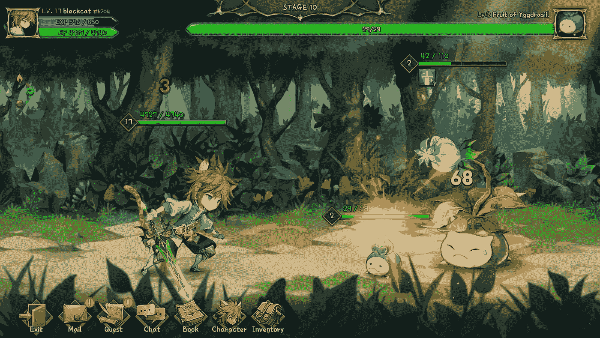*

*Nine Chronicles battle example*

*有每周**奖励、季末**奖励——基于等级。本周末，前 500 名将获得 **$NCG** 。总共大约有 70-80 名玩家将获得两种皮肤奖励。神话皮肤将只奖励给少数顶级玩家，而传奇奖励将给予另外 70 名玩家。*

*比赛将于 10 月 6 日结束，你需要达到**17 级**才能加入竞技场模式。*

*看看[九历记官方页面](https://nine-chronicles.com)了解更多信息。*

# *7.布兰科斯街区派对*

*制作这款游戏的团队还包括**使命召唤**、**魔兽世界**和**吉他英雄**。这是一个开放的世界游戏。有不同的游戏模式——赛跑、收集、射击。您也可以创建自己的模式。*

*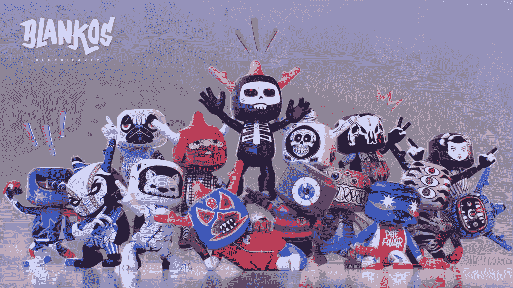*

*Blankos 是小巧可爱的角色和可玩的 NFT，所以你可以在市场上分享和交易它们。他们有各种各样的头部形状，独特的皮肤，包括罕见的属性和风格，衍生出无尽的组合，玩家拥有真正的所有权。到目前为止，布兰科已经售出了超过 12 万件 NFT 的作品。*

*它与**博柏利**、**迪德马乌**、奎基斯和 El Grand Chamaco 有交易。*

*你可以在 [Blankos Block 党官方页面](https://blankos.com)上看到更多。*

# *结论*

*NFT 游戏只不过是游戏。你可以像玩任何游戏一样玩它们。不同之处在于区块链技术的参与。更增添了一层稀有与独特。除了玩游戏，你还可以选择通过玩游戏来赚钱。*

*我会把游戏 NFT 系统的用户分成两部分:*

*   ***玩游戏的用户**——潜在创造并接受 NFTs 价值的玩家。如果 NFT 没有用途，它就没有价值。他们享受游戏本身，磨砺、战斗和建造角色或土地。*
*   ***交易员**，他们是来赚钱的。然而，如果你站在这一边，要小心，因为每场比赛都可能有炒作的时刻，但也可能会失去球员。有很多曾经流行的死亡游戏的例子——它们被数千甚至数百万人玩，只是为了被遗忘。*