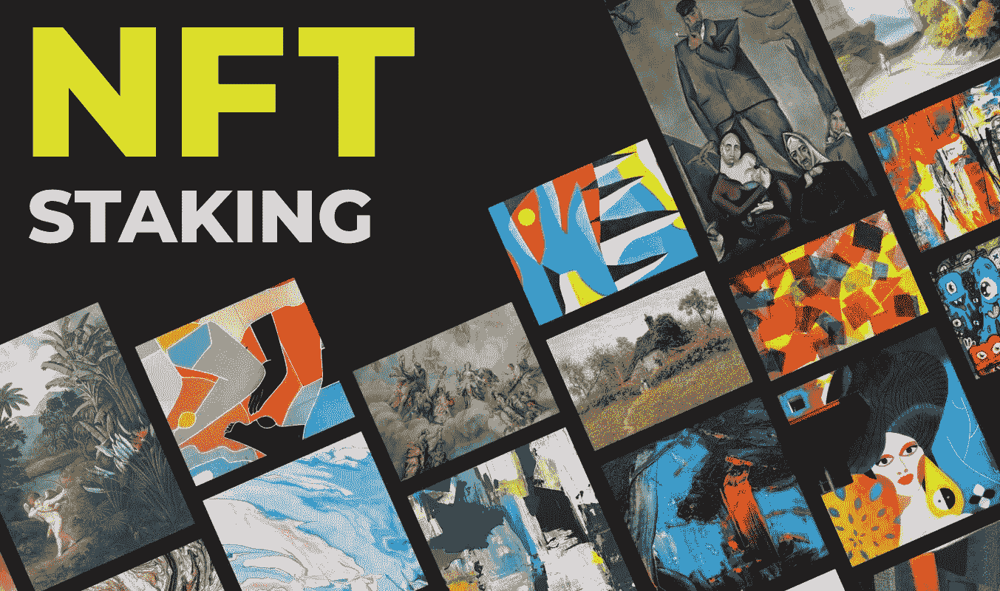

# 前 7 名 NFT 赌注平台开发公司

> 原文：<https://medium.com/geekculture/top-7-nft-staking-platform-development-companies-9ffb0ae84c29?source=collection_archive---------17----------------------->

Top 7 NFT Staking Platform Development Companies

由于其稀有性和需求，非功能性食物的市场正在迅速扩大。在收藏家和投资者中。除了 NFT 市场，NFT 的赌博平台也有很高的需求，并成为许多 NFT 企业的基础。为了从数字平台获得下注激励和其他奖励，NFT 所有者在 NFT 下注平台上下注或锁定不可替代的代币。通过拍卖 NFT，所有者可以继续拥有他们的收藏，同时间接产生收入。由于参与者的数量在不断增加，对 NFT 房地产感兴趣的企业主可以在 NFT 一家赌注平台开发公司的帮助下进入。

[**开发你的 NFT 跑马圈地平台现在**](https://www.blockchainappfactory.com/nft-staking-platform-development?utm_source=Medium+GC&utm_medium=29%2F11%2F22&utm_campaign=senpagapandian) 👈👈

# **最佳 NFT 跑马圈地平台开发公司名单**

## **1。区块链 App 工厂(推荐)**

[**区块链 App Factory**](https://www.blockchainappfactory.com/nft-staking-platform-development?utm_source=Medium+GC&utm_medium=29%2F11%2F22&utm_campaign=senpagapandian) 是一家 NFT 的跑马圈地平台开发公司，自 NFT 公之于众以来，一直活跃在区块链世界。它在技术上是先进的，并且在 NFT 市场上占有稳固的地位。一个专业团队设计、开发和测试了所有区块链应用程序。它已经成功交付了 250 多个项目，并向客户提供现代营销技术。

## 2.AppDupe

作为一家 NFT 跑马圈地平台开发公司， [**AppDupe**](https://www.appdupe.com/nft-staking-platform-development?utm_source=Medium+GC&utm_medium=29%2F11%2F22&utm_campaign=senpagapandian) 高效地提供高效的跑马圈地平台。它在 NFT 商业和技术领域的经验超过五年。它雇佣了对市场有深入了解的区块链开发商。它为客户按时完成每一个项目。此外，它帮助其客户建立成功的 NFT 赌注平台。AppDupe 经验丰富的团队帮助新人驾驭复杂的数字代币世界。

## 3.比特交易

Bitdeal 是一家知名的 NFT 赌注平台开发公司，拥有一支强大的团队，为用户提供在 NFT 领域取得成功所需的所有资源和工具。它为初创公司和企业家提供全面的开发解决方案，以成功推出他们的 NFT 赌注平台。它有一个熟练的 NFT 开发者团队，他们已经在 NFT 空间建立并成功发布了这个平台。

## 4.Exio。技术

Exio。Tech 将最复杂的 NFT 愿景变为现实，它是 NFT 的一个 staking platforms 开发组织。它提供全周期定制应用程序开发服务。因此客户可以专注于他们的业务。它的开发团队建立了一个现成的模型，为企业家提供商业目标。它允许其客户接触大众，并在市场上建立一个强大的跟踪平台。

## 5.Mobiloitte

Mobiloitte 是一家位于 NFT 的 staking 平台开发公司，它提供了许多与众不同的特性。Mobiloitte 在 NFT 打桩开发方面拥有多年的经验，是社区中著名的 NFT 打桩开发组织。它在几个区块链网络上提供开发服务，包括以太坊、币安智能链(BSC)、Polygon、Solana 和 Cardano。

## 6.马蒂茨

Maticz 是一家 NFT Staking platform 开发公司，拥有一支由区块链和 NFT 精英工程师组成的团队，可以为初创公司和商业组织构建先进的 NFT Staking 平台。它提供顶级、无错误、可扩展的解决方案，满足客户独特的业务需求。它有程序员开发具有尖端功能的 NFT 赌注网站，使客户能够在各种 NFT 上下注，并产生被动收入。它使用各种区块链网络构建应用程序，如币安智能链(BSC)、以太坊、Solana、Polygon、Tron 等。，以确保 NFT 消费者获得完美的用户体验。

## 7.克拉里斯科

Clarisco 是一家 NFT staking platform 开发公司，在印度、美国和英国设有分支机构。它为全球的企业家和初创公司提供 NFT 开发服务。它拥有一支专业的开发团队，能够成功开发和部署基于 NFT 的业务应用程序。这是一家经验丰富的开发公司，能够按时交付项目。其赌注平台已经集成了所有必要的元素。

## **大结局**

新的发明者和参与者正在进入 NFT 市场。新的数字代币正在开发中，并在平台上上市销售。NFT 市场通过赋予创作者对其数字资产的完全所有权，给了他们新的机会。您可以从上面的列表中选择合适的公司，并在 NFT 竞技场有效地 [**推出您的 NFT 赌注平台**](https://www.appdupe.com/nft-staking-platform-development?utm_source=Medium+GC&utm_medium=29%2F11%2F22&utm_campaign=senpagapandian) 。