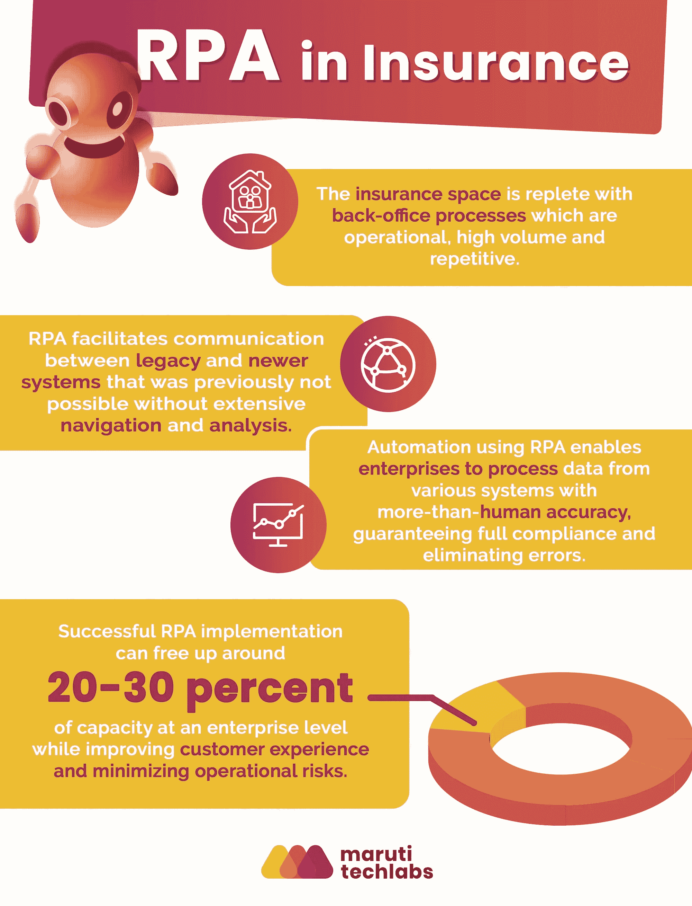

# 保险业自动化:7 大用例

> 原文：<https://medium.com/geekculture/top-7-use-cases-of-automation-in-the-insurance-industry-9e405f1e83f8?source=collection_archive---------13----------------------->

保险业处理许多重复性的后台任务，严重依赖手动和过时的方法。这导致客户满意度降低和深度时间下沉，使实现业务目标变得困难。随着时间的推移，它导致成本增加，阻碍了保险业的发展。

然而，有一个好消息——保险业的自动化。保险业对 RPA 的授权被认为是解决这些挑衅的办法。RPA 是一项技术，可以使保险业变得更加结构化和以客户为中心。

# 保险自动化— RPA 使用案例

现在让我们看一些保险行业的 [RPA 使用案例](https://marutitech.com/robotic-process-automation-services/?utm_source=medium&utm_medium=content_promotion&utm_campaign=Insurance_automation):

**1。索赔处理**

快速而系统的索赔处理是保险公司成功的关键，但这通常非常耗时、费力。索赔处理需要几天时间，因为公司必须从几个来源收集大量数据。这导致了保险公司和客户的失望。

当前的索赔系统缺乏功能性和灵活性。过度依赖手工处理。这导致效率和灵活性受到限制，从而导致延迟并对整体客户体验产生负面影响。

保险业的自动化具有多种业务优势；RPA 保险服务可以自动化手动密集型流程，从而加快流程并创造更好的客户体验。自动化索赔处理将手动工作量减少了 80%,并显著提高了准确性。

**2。承销**

承销是个人或机构通过收费承担金融风险的程序。它本质上是风险评估，涉及大量的数据整理、分析和确定给定政策所涉及的风险。平均需要超过 2-3 周的时间。

保险业中的机器人流程自动化自动化了数据收集，从而减少了承保时间。它还可以利用相关信息占据内部系统中的多个字段，并在评估运行损失时提供建议。这使得构成产品承销和定价基础的过程自动化。

**3。法规合规性**

保险公司必须遵守大量法规。对这些法规的修改通常会迫使保险公司重组其业务流程以适应变化。违反法规会给公司带来严重的财务和运营损失。对保险领域的监管检查从未像今天这样严厉。保险业中有许多平淡无奇且容易出错的流程，违反法规的风险大大增加。

保险业的自动化有助于公司改进监管流程，因为它取代了对手动监管合规性的需求。RPA 可以自动执行验证现有客户信息、生成监管报告和发送账户关闭处理通知等任务。

**4。流程和业务分析**

与保险业相关的大量运营和纸面密集型流程使得跟踪和衡量运营效率变得非常困难。

随着保险业的自动化，软件机器人执行的任务可以很容易地被跟踪，而无需人工干预。同时，可以使用 RPA 无缝测量遇到的异常。RPA 提供的审核记录有助于法规遵从性，从而改进整个流程。结果，客户服务响应时间得到改善，客户从高效的应用中受益。

**5。表单注册**

表格注册是保险行业中一项可有可无但又必不可少的任务。RPA 可以自动化并帮助流程完成，所需时间仅为实际时间的 40%,只需一半的人力。大家共赢！

**6。保单取消**

保单取消涉及许多事务性任务，如清点取消日期、开始日期、保单条款等。保险业的自动化使得保单取消只需三分之一的时间。

**7。财务和会计**

RPA 系统可以执行点击、击键、按键、模板自动填充、复制粘贴信息、字段输入等操作，从而自动完成大部分的日常银行对账。这最大限度地减少了交易费用和保单成本。

## **结论**

由于保险业高度依赖后台流程的效率，保险公司已经开始采用机器人流程自动化来自动化事务性的、例行的、基于规则的操作。通过这样做，资本和人才可以重新用于更复杂和更具战略性的任务。

RPA 的[投资回报是巨大的。RPA 可以帮助保险公司提高利润、更好的合规性、稳定的公司增长和出色的客户服务，同时降低成本并最大限度地降低客户流失率。由于 RPA 提供的灵活性和好处，以采用 RPA 的形式实现保险自动化是不可避免的。](https://marutitech.com/roi-of-rpa/?utm_source=medium&utm_medium=content_promotion&utm_campaign=Insurance_automation)

我们马鲁蒂技术实验室提供端到端 [RPA 解决方案](https://marutitech.com/robotic-process-automation-services/?utm_source=medium&utm_medium=content_promotion&utm_campaign=Insurance_automation)，满足您的特定业务需求。我们帮助您从头开始构建一个完整的 [RPA CoE](https://marutitech.com/rpa-coe/?utm_source=medium&utm_medium=content_promotion&utm_campaign=Insurance_automation) 。我们致力于提供全面支持，分析最佳自动化机会，在推动您的业务更上一层楼的同时提供出色的投资回报。

[立即联系我们](https://marutitech.com/contact-us/)进行免费咨询，了解我们的自动化服务如何帮助您的企业。