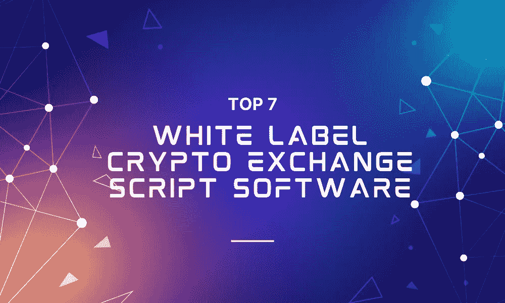

# 2022 年排名前 7 的白色标签加密货币交易脚本软件

> 原文：<https://medium.com/geekculture/top-7-white-label-cryptocurrency-exchange-script-software-2022-f8f362b7a799?source=collection_archive---------20----------------------->

从金融机构到日常投资者，越来越多的人对加密货币感兴趣。为了满足这种对密码的突然渴求，对密码交换有着巨大的需求。然而，开发一个加密交换既困难又耗时。这就是白标软件的用武之地:它们通过充当可以添加附加特性和功能的代码库，简化了开发和部署加密交换的过程。

# 什么是白标克隆脚本？

白标软件是一种软件或代码，由一个实体生成并出售给另一个实体，但没有任何品牌，因此购买者可以使用他们自己的徽标对其进行品牌标记，并将其作为自己的产品出售。白标克隆脚本复制现有软件，如网站或应用程序。他们可以很容易地重新命名，定制，并转化为一个完全不同的产品。这个过程比从头开始开发一切要容易得多，这就是为什么白标克隆脚本如此受欢迎。并非所有的白标克隆脚本都是同等创建的。在本文中，我们列出了 2022 年最受欢迎的 7 大白标加密交换克隆脚本。

## 币安克隆脚本

啊，是的，好老币安。这是一个著名的加密货币交易所，迎合经验丰富的加密货币交易商。它的交易成本极低，并为世界各地的贸易提供了大量加密货币，使其成为全球加密交易所的黄金标准。由于每个人都熟悉币安界面， [**币安克隆脚本**](https://www.clarisco.com/binance-clone-script) 感觉很直观，使入职过程变得更加容易。

**可交易加密货币的巨大选择**:对于美国的消费者，币安提供超过 65 种可交易货币。这为密码交易员和投资者提供了很多选择。如果你住在美国以外，你有更多的可能性。

低费用:因为该平台成本低廉，交易者可能会保留更多的资金和利润，使其成为一个有吸引力的选择。

**广泛的交易选项和订单类型选择**:币安提供多种交易选择，包括点对点、现货和保证金交易。限价单、市价单、限价止损单、市价止损单、追踪止损单、仅发布订单和一个取消另一个订单都可用。

## 本地比特币克隆脚本

[**LocalBitcoins 克隆脚本**](https://www.clarisco.com/localbitcoins-clone-script) 是一个连接消费者和卖家直接交换比特币的点对点(p2p)市场。与当今大多数交易所不同，用户可以相互联系，直接交流。该平台允许其卖家提供广泛的支付选择，内置的托管确保买家受到保护。其他一些值得一提的优点是

*   简单快捷的网上交易。
*   支持多种法定货币。
*   易于使用的用户界面。

## 雷米塔诺克隆脚本

Remitano clone 本质上是一个点对点的加密货币交易所，用户可以在这里买卖数字代币。保证金交易，硬币互换服务，平台自己的原生代币也有。除此之外，平台还提供

*   比赛
*   应用程序接口
*   在线聊天
*   多种货币
*   博客
*   移动应用程序
*   介绍
*   区域特定接口
*   钱包
*   论坛
*   加盟计划

基于尼日利亚顶级加密交易所之一的 [**雷米塔诺克隆剧本**](https://www.clarisco.com/remitano-clone-script) 对于任何想迎合观众的人来说都是完美的。

## WazirX 克隆脚本

WazirX 是一个著名的印度加密交易平台，其用户友好的交易软件具有有趣的功能。用户友好的 WazirX 加密交易平台配备了先进的安全措施。它的流行和广泛接受也得益于它与币安的联系、WRX 实用令牌的推出以及独特的 WazirX P2P 交易平台。由 [**WazirX 克隆脚本**](https://www.clarisco.com/wazirx-clone-script) 提供的一些精致的特性是

*   **跨平台支持**

WazirX 克隆版可以在各种平台上运行，并为网络浏览器、Android 和 iOS 智能手机平台以及 Mac 和 Windows 电脑提供程序。

*   **交易平台设计**

WazirX clone 是菲亚特-on-ramp 全球交易所。这是一个用户友好的加密交易平台，有大量的交易。移动应用程序几乎拥有与在线平台相同的所有功能。本次交流提供多语言帮助。

*   **投资产品&支持加密货币**

WazirX 克隆版能够支持 100 多个加密货币交易对。

*   **交易速度**

区块链基础设施的可扩展性和效率足以在几秒钟内处理数百万笔交易。

*   **高级交易工具**

WazirX 克隆版的自动匹配 P2P 引擎可以立即自动匹配买家和卖家。买家下单购买 USDT，并直接向卖家付款。此后，平台会自动将托管的 USDT 转移到买家的安全钱包中。

*   **一流的安全性**

WazirX 将 95%的资金储存在冷库中。该平台还支持两步验证功能，为客户账户提供增强的安全性。它还利用多签名钱包系统，并遵守严格的 KYC/反洗钱准则。

## 比特币基地克隆脚本

比特币基地是一个总部位于美国的加密货币交易和投资平台，允许用户购买、出售和兑换 100 多种不同的加密货币，包括比特币、以太坊和 Dogecoin。

与最初的比特币基地一样，克隆脚本运行两个不同的交易平台，以及一个独立的比特币钱包服务。你可能会在比特币基地的产品中找到创建和管理比特币投资组合或交易策略所需的一切。

*   **加密货币初学者易于使用**:比特币基地克隆版提供了一个主网站和移动应用程序，两者都非常用户友好，允许你快速购买、交易和交换比特币。
*   **支持大量加密货币**:比特币基地克隆版能够支持超过 100 种货币进行交易。
*   **赚取加密货币的机会**:赚取合格余额的利息，或通过比特币基地赚取少量新货币。
*   Pro 平台价格更低:任何用户都可以转到比特币基地克隆的 Pro 平台，这是一个活跃的交易平台，功能更多，费用更低。

## 库科恩克隆脚本

[**KuCoin 克隆脚本**](https://www.clarisco.com/kucoin-clone-script) 是一个加密货币交易所，允许用户购买、出售和交易加密货币。除了传统的交易选择之外，该平台还提供保证金、期货和点对点(P2P)交易。用户还可以通过押注或出借他们的加密货币来获得激励。投资者更喜欢 KuCoin，因为它列出了具有巨大上行潜力的小盘股加密货币，拥有大量硬币，包括不太知名的加密货币，并提供高额利润分享激励。

*   支持数百种不同加密货币的能力
*   iOS 和 Android 手机应用
*   用法定货币直接购买密码
*   仅需要部分 KYC 验证
*   P2P 市场——零费用买卖密码
*   期货和保证金交易
*   KuCoin 奖金——每天赚取原生硬币
*   密码借贷
*   交易机器人
*   银行级资产安全

## Paxful 克隆脚本

Paxful 是一个流行的点对点加密货币交易平台和数字钱包。Paxful 交易者可以使用各种支付选项来购买和出售加密货币。它是目前最著名的 P2P 加密货币交易平台之一。

与其他基于订单簿的交易所不同， [**Paxful 克隆脚本**](https://www.clarisco.com/paxful-clone-script) 是一个值得信赖的透明平台，允许加密买家和卖家直接相互沟通，以出售或收购比特币和其他关键加密货币。paxful 帕克思富的其他吸引人的功能有

*   提供生物识别验证
*   300 多种支付方式
*   固定交易费用
*   快速响应支持系统
*   安全托管交易

# 结论

所以你有它。2022 年**排名前七的白标密码交易所**。这些都不会错，但在购买白标加密交易所时，请确保选择值得信赖的软件提供商。Clarisco Solutions 是一个很好的选择，因为我们的团队由经验丰富的开发人员、设计人员和测试人员组成，他们努力为我们的客户带来一流的软件。我们的白标软件安全、无缺陷、可靠且价格合理。查看我们的网站了解更多>>[**www.clarisco.com**](https://www.clarisco.com/)