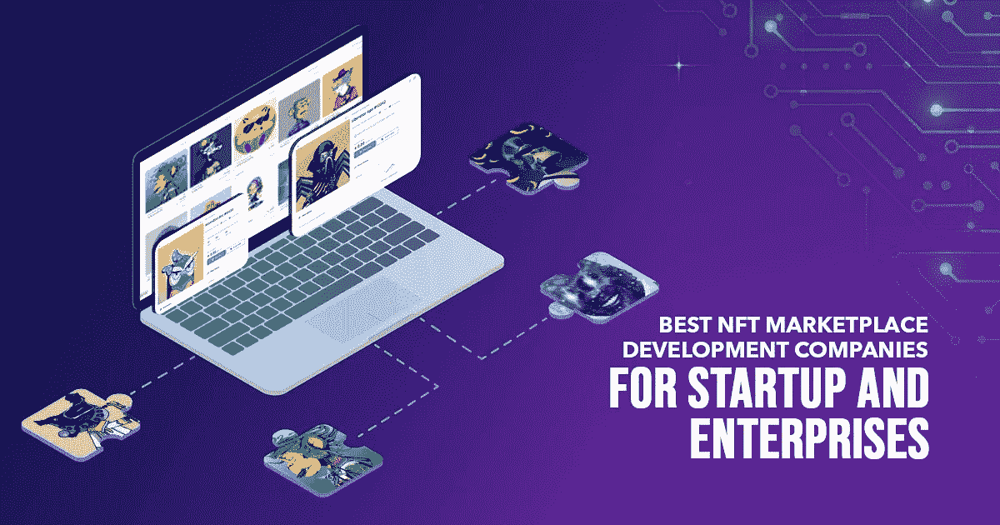
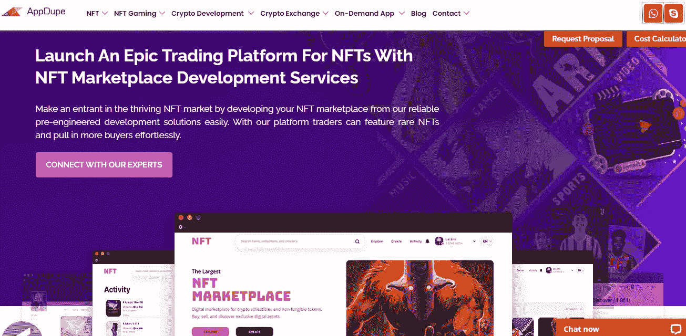
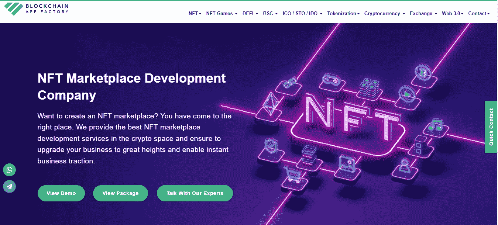
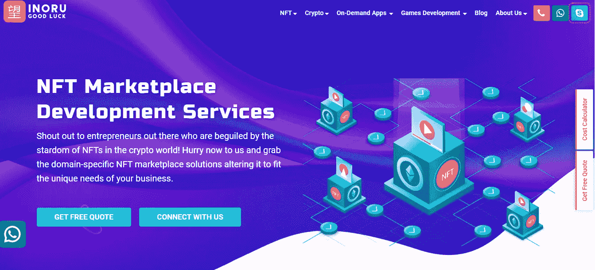
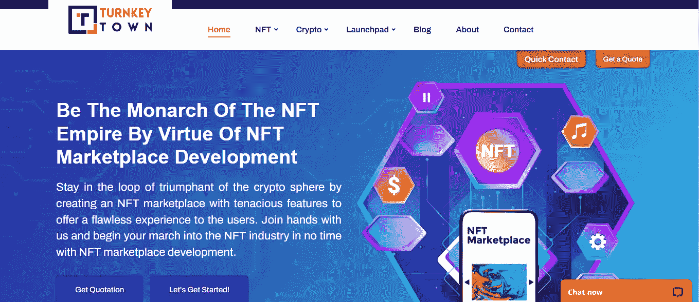
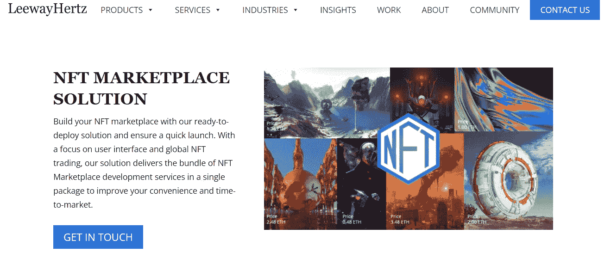
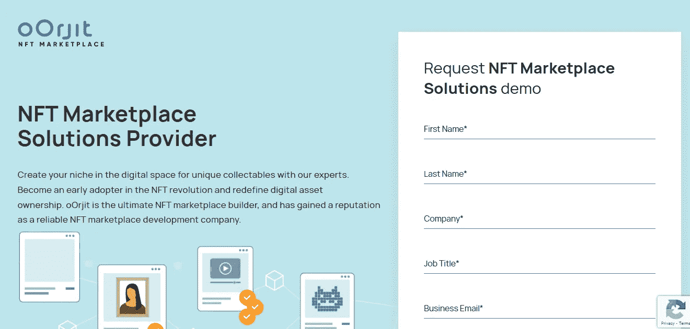
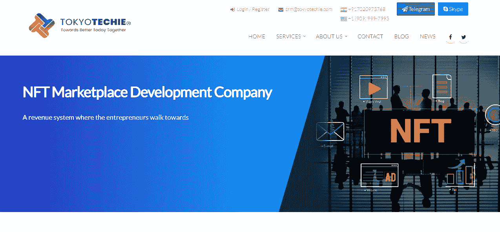
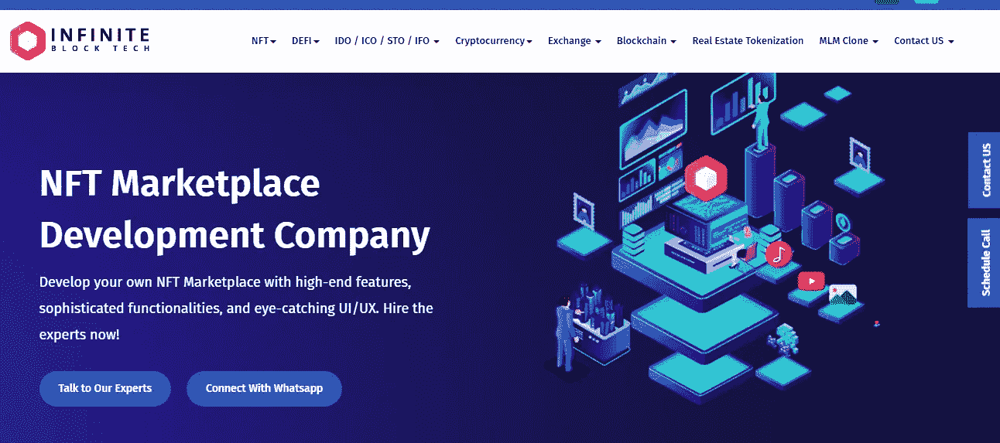

# 面向初创企业和企业的 8 大 NFT 市场开发公司

> 原文：<https://medium.com/geekculture/top-8-nft-marketplace-development-companies-for-startups-enterprises-74c916a012eb?source=collection_archive---------10----------------------->

随着对不可替代代币(NFT)需求的增长，对 NFT 交易平台的需求也显著增长。虽然不可替代的代币已经存在了五到七年，但是每个人都突然对它们表现出了兴趣，尤其是在最近两年。是的，围绕 NFTs 的兴奋是真实的，并且在未来几年还会继续。另一方面，NFT 市场是一个交易者可以买卖数字资产和收藏品的平台。

你愿意为交易者提供一个交换数字资产的平台，并在蓬勃发展的 NFT 空间建立一个引人注目的存在吗？你需要做的只是开始发现和接近[顶级 NFT 市场](https://www.forbes.com/advisor/investing/cryptocurrency/best-nft-marketplaces/)业务，并根据你的规格构建、开发和部署你的平台。如果你不确定选择哪家公司，让我们在博客中为你提供 NFT 市场前八名的公司。看一看。

# 最佳 NFT 市场创业发展公司

# [Appdupe](https://www.appdupe.com/nft-marketplace-development)

AppDupe 是顶级的区块链和 NFT 开发公司，以尽快提供所需定制的 [**白标 NFT 市场**](https://www.appdupe.com/nft-marketplace-development) 开发解决方案而闻名。此外，他们提供的解决方案能够适应不断变化的需求。因此，就特性和功能而言，这是您希望平台成为的样子。

他们预先构建的解决方案包括许多必需的元素以及安全和高级功能，以确保平稳的交易体验。此外，答案将是理想的各种行业，如艺术，音乐，游戏，时尚，体育，房地产，元宇宙，等等。

开发商在提供 NFT 市场方面表现出色，该市场将在各种区块链网络上开发和部署，以满足客户的需求。他们主要关心的是 24 小时不间断的支持和最终解决方案的按时实现，没有任何错误。以太坊，TRON，Polkadot，Polygon，EOS，BSC，更多的加密货币都在其中。

# [区块链 App 工厂](https://www.blockchainappfactory.com)

区块链 app factory 是一家加密货币交易所开发公司，率先开发了整个加密货币交易所软件，以支持安全和快速的交易。区块链应用工厂是一家杰出而完美的公司，致力于为客户提供实施 NFT 市场的最佳创意解决方案和独特想法。

区块链应用工厂是 NFT、加密和区块链市场的领导者。该公司在这些领域的熟练程度与其在特定时间框架内交付高质量解决方案的卓越表现相匹配。NFT 令牌的发展鼓励艺术家和音乐家等制作人将他们的数字创作令牌化为可以在他们选择的任何区块链上创建的 NFT。此外，NFt 市场将采用坚固的技术建造，并具有广泛的适应性，确保根据不同的个人需求进行调整。

# [Inoru](https://www.inoru.com/nft-marketplace-development)

Inoru 是一家出色的 NFT 市场开发公司。它专注于提供一个顶级的 NFT 市场。他们在各种市场工作过，这使他们多才多艺。例如，他们有迎合音乐艺术的 NFT 市场选项和许多类似的选项。市场也可以找到一个合理的成本。毫无疑问，任何人都可以在更短的时间内建立市场。此外，这家公司提供全方位的服务。它包含以下内容:

*   为 NFT 发展服务
*   NFT 营销服务公司
*   NFT 市场发展
*   NFT 音乐市场发展
*   NFT 收藏品营销服务和更多。

# [交钥匙城](https://www.turnkeytown.com/nft-marketplace-development)

TurnkeyTown 是一家值得信赖的 NFT 开发公司。他们重视消费者，并努力提供满足他们需求的 NFT 市场。TurnkeyTown 和 Inoru 一样，专注于提供广泛的服务。以下是各种 NFT 市场发展服务的例子:

*   NFT 艺术奖
*   音乐 NFT
*   游戏 NFT
*   数字收藏品和其他领域

# [李维赫兹](https://www.leewayhertz.com)

LeewayHertz 是一家出色的 NFT 市场开发公司。该公司将通过提供具有关键功能的定制解决方案，帮助企业家快速开发他们的 NFT 交易平台。由于其用户友好的界面，这个平台的设计和开发方式将吸引创作者和 NFT 迷更喜欢它的交易。这是为了确保他们享受特殊的交易体验。

这个内部团队将专注于为各种行业提供平台，如音乐、艺术、游戏、数字收藏品、体育、房地产等。无论客户的期望是什么，它都会在特性注入和将要构建和部署的区块链平台方面得到满足。

# [Oorjit](https://www.oorjit.com)

Oorjit 是一家创造性的解决方案公司，帮助您将公司带到下一个层次。Oorjit 可以帮助您建立简单的 NFT 交易所软件系统，以支持由不可替代令牌支持的下一代数字资产交易(NFT)。它可以有效地创建和个性化商务网站，并营销品牌产品。它使用户能够维护其在线业务的前端，而平台处理后端。它还能非常快速高效地解决您的问题。您还可以体验它们与大量第三方集成的轻松集成。

# [东京技术](https://tokyotechie.com)

Tokyo Techie 是一家 NFT 市场公司，提供白标 NFT 市场开发服务，显著降低您的成本，同时创建一个高度安全的 NFT 市场，支持不同的区块链，如以太坊、Polygon、Solana 等。它提供完全定制的 NFT 市场开发服务，为白牌 NFT 平台提供您在 NFT 市场所需的精确功能。

# [无限区块技术](https://infiniteblocktech.com)

Infinite Block Tech 是一家支持品牌获得 NFT 领域尖端解决方案的公司。由于该公司对 NFT 开发的独创方法，它为 NFT 开发公司提供游戏、艺术、梦幻体育、房地产、时尚、P2P 交换音乐、域名、视频、内容订阅和许多其他行业的服务。该网站的 NFT 部分似乎是一个包含一系列服务部门的保护伞。它声称要开发能够管理高流量和处理故障的 NFT 平台。团队还将贡献想法，使最终解决方案比计划的更好。

# 投资 NFTs 是个好主意吗？

NFT 市场是投资收藏品、数字资产和艺术品的绝佳方式，但也有很多可能性。根据你想要的 NFT 市场发展类型，选择一个符合你购买和储存需求的产品。请记住，这是一个全新的、非常投机的行业。某些 NFT 可能比其他的爬得更快，但不能保证。收藏品、数码、艺术品的价值和收藏品、实物艺术品差不多。

价值是一个主观问题，由独特性和创作这件作品的艺术家的声誉等标准决定。在考虑你的战略、资产净值和投资后，考虑 NFT 市场的发展。

# 包扎

非金融交易的日益流行为 NFT 市场的建立铺平了道路，这是一个交易非金融交易的平台。许多 NFT 市场现在充斥着 NFT 市场。令人惊讶的是，NFT 部门也提供了许多商业前景，因为企业家可以创建自己的 NFT 市场。通过 NFT 交易市场进入 NFT 市场并没有你想象的那么难。现在有很多公司，这可能是你不确定选择哪家公司建立不可替代代币交易平台的主要原因之一。

这篇文章给了你八大 NFT 市场开发公司，可以提供可靠的解决方案。希望这有所帮助！