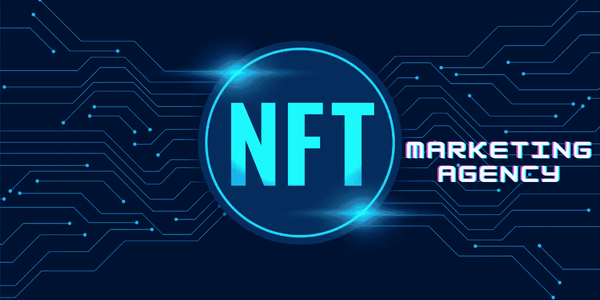

# 与 NFT 营销机构合作有益的八大理由

> 原文：<https://medium.com/geekculture/top-8-reasons-why-collaborating-with-an-nft-marketing-agency-is-beneficial-8a9fe935a73a?source=collection_archive---------12----------------------->

NFT Marketing Agency

你有没有想过你在 NFT 市场的竞争对手是如何胜过你的？几乎所有的企业都需要继续营销，NFT 营销是一种有效的战术。

NFT 的名气和市场与日俱增，我们可以注意到许多新的创作者和大牌品牌正怀着更大的希望进入 NFT 的世界。

由于竞争变得如此激烈，一个人需要与一家领先的[**NFT 营销机构**](https://www.infiniteblocktech.com/nft-marketing?utm_source=Guestblog&utm_medium=medium-geekculture-31-10-2022&utm_campaign=muralidharan.g) 联系，他们可以利用自己的专长吸引你的目标受众，提供尖端的促销策略。

在这个博客中，我们将分享创作者或企业通过与可靠的 NFT 营销机构合作可能继承的利益。

那我们为什么还在这里？转到博客。

## 令人印象深刻的 NFT 统计数据

NFT Statistics

NFT 是由最有前途的区块链技术驱动的独特的数字资产。NFT 充当由区块链技术支持的认证数字证书，并且现在是当今场景中的数字热点。

从大牌商业大亨到崭露头角的企业家，每个人都渴望成为 NFT 革命的一部分。2021 年全球 NFT 市场规模估计为 31.8478 亿美元，2022 年大幅增长，约为 38.3576 亿美元。

[据可靠消息来源预测，到 2027 年，市场价值将以 20.69%的 CAGR 增长，达到 98.45 亿美元。](https://cointelegraph.com/news/nft-market-worth-231b-by-2030-report-projects-big-growth-for-sector)

## 那么 NFTs 成名的背后是什么呢？

NFT 在最近达到如此狂热水平的主要原因之一是它们给拥有它们的人一种幸福感。

当 NFT 持有者获得著名或稀有艺术品的所有权时，他们会感到自豪。

许多收藏家、艺术家、交易商和开发商都对购买、收集和转售 NFT 表现出兴趣，这证明 NFT 世界不仅仅是大牌加密投资者的天下。

另一方面，像耐克、必胜客、阿迪达斯和塔可钟这样的大品牌已经投资了这些 NFT 并获得了巨大的利润。

在 NFT 投资的知名品牌名单可能会继续下去，未来几天还会更多。

## 为什么 NFT 营销值得你花一分钱？

在这个快节奏的世界里，创建一个独特的 NFT 项目是一件小事。真正令人头疼的是营销过程。

没有投资者对获得价值 0%的 NFT 表现出兴趣。当谈到增加 NFT 的价值时，营销起着关键作用。

营销在 NFT 领域也很有意义，有助于你的项目拥有更广泛、更强大的追随者基础。

有了完善的营销支持，你的 NFT 项目会得到应有的曝光率。

像普通的产品或服务一样，NFT 项目也需要适当的营销，在全球范围内做广告。

术语“NFT 营销”是强制性的，因为它使你的项目从市场竞争对手中脱颖而出，并有可能决定你的 NFT 企业的未来。

推广 NFTs 将改善您与目标受众的关系，推动客户参与，并创造性地创造品牌知名度。

如果你想独自推广你的 NFT 项目，你必须从零开始，花更多的时间分析哪些营销策略会奏效，哪些不会。

为了避免这种情况，你需要联系一个领先的 [**NFT 营销服务**](https://www.infiniteblocktech.com/nft-marketing?utm_source=Guestblog&utm_medium=medium-geekculture-31-10-2022&utm_campaign=muralidharan.g) 供应商，他们会用他们在该领域的专业知识帮助你营销你的 NFT 项目。

让我们从以下几个方面来讨论 NFT 营销代理公司在宣传你的项目中的重要作用。

## **NFT 营销机构的角色**

由于每一个 NFT 都是独一无二的和有价值的，执行完美的 NFT 营销策略将提高你的项目在竞争环境中的成功。

如何打造你的 NFT 项目？这是一个价值百万美元的问题，只有声誉良好的 NFT 营销机构才能回答。

NFT 营销机构的作用是至关重要的，因为他们提供一流的战略，推动更多的投资者到你的 NFT 项目。

一家领先的 NFT 营销机构通过可信地与目标受众频繁互动，专注于提高对您的 NFT 的认识，从而提高您的 NFT 品牌的知名度和成功。

## **顶级的 NFT 营销策略，保证 100%的效果！！！**

现在让我们来看看一家经验丰富的 NFT 广告公司提供的一些营销策略，这些策略可以最大限度地提高你的 NFT 的宣传水平:

*   新闻发布
*   时事通讯
*   博客推广
*   视频营销
*   网站创建
*   为您的 NFT 举办引人入胜的 AMA 会议
*   搜索引擎优化
*   付费广告
*   直播带货
*   在 NFT 日历中提交您的 NFT 项目
*   NFT 不和谐营销
*   NFT 电报营销
*   NFT 推特营销
*   NFT Instagram 推广
*   NFT Reddit 营销
*   内容营销
*   联盟营销
*   NFT 上市
*   电子邮件营销
*   NFT 赠品、奖金和空投

## **8 与 NFT 营销机构合作的好处**

以下是与 NFT 营销机构合作的一些好处，可以让您的业务受益，并最大限度地提高您的成功率:

**在整个营销过程中获得专业指导**

*   一家 NFT 营销机构提供服务，拥有一支合格的专家团队，他们在创造非功能性食品的有机宣传方面有着非凡的知识。
*   为了制定有效的广告策略，团队首先评估你的项目。
*   一旦对项目有了清晰的认识，他们就会想出对你的 NFT 有利的最佳策略。

他们掌握了当前的市场趋势

*   该公司的营销团队一直在跟踪最新的市场趋势。
*   收集所有这些信息，他们可以帮助您使用最伟大和最可靠的战略，这可能最终扩大您的 NFT 品牌的影响到一个更广阔的空间。

**降低消费成本**

*   在推广你的 NFTs 时，如果你需要更多的营销专业知识，你可以求助于试错法。
*   这些方法不仅浪费时间，而且通常花费太多的钱。
*   因此，建议雇佣一家 NFT 营销公司来减少这些不必要的开支，并帮你节省一些钱。
*   公司的营销团队知道在推广你的 NFTs 时最有效的方法。

**提高投资回报率**

*   该机构的 NFT 营销专家了解您的业务需求，并在可承受的预算范围内提高业务的可扩展性。
*   你的 NFTs 将通过利用他们的市场营销专业知识，走到你的目标受众面前。

**完全透明和可靠**

*   依靠内部员工团队来提供可靠的结果可能具有挑战性。
*   另一方面，如果你与一个有经验的 NFT 营销机构携手，你可以见证所有营销努力的更好的结果。

**获得先进的营销工具**

*   除了内部团队之外，其他人也可以使用业内顶尖的营销工具。
*   但是，当你与 NFT 营销机构合作时，情况就完全不同了，因为该公司的营销团队配备了顶级的营销工具，可以增加你项目的成功。

**提供定制化的高质量服务**

*   一个经验丰富的 NFT 营销机构，已经默认与各种客户合作，将有技能向大众推销你的 NFT 项目或收集。
*   与其与一家新公司合作，不如与一家有丰富经验的公司合作，根据你的业务需求提供合适的营销解决方案。

**定期监测结果**

*   与 NFT 营销机构合作的最大好处是他们在专业分析结果方面的专长。
*   任何活动都应该提供准确的结果，这样你就可以就如何继续下去做出明智的决定。
*   为了跟踪结果，该机构指派了一个由专业人士组成的团队来分析营销工作。
*   然后他们会提供多份报告，让你清楚地了解推广 NFT 的策略。
*   此外，这种分析还有助于您确定为获得更好的结果而必须进行的最佳改进。

## **上发条，**

强调了与 NFT 营销机构合作的主要优势后，您现在在市场上拥有了广泛的 NFT 营销服务提供商。

凭借他们在营销方面的专业知识，该公司的营销团队帮助您的项目获得最大的知名度、曝光率、收入和牵引力。

所以不要着急，花点时间去寻找最可靠的 NFT 营销服务提供商。

在选择最好的 NFT 营销机构时，会考虑某些因素，包括该机构的声誉、客户推荐、多年经验、营销专业知识和定价。