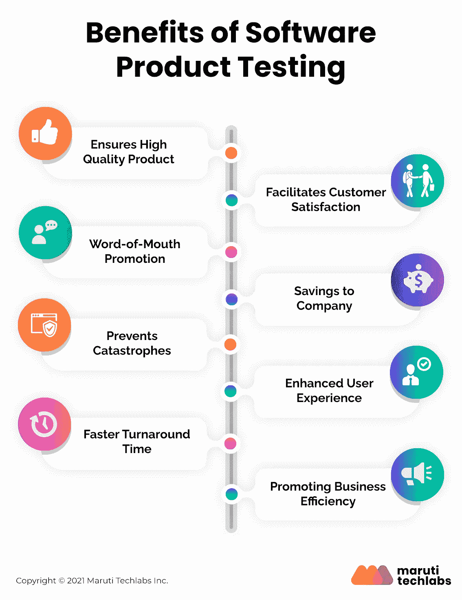

# 软件产品测试有利于产品开发的 8 种方式

> 原文：<https://medium.com/geekculture/top-8-ways-software-product-testing-can-benefit-your-business-47651c1cdb5e?source=collection_archive---------22----------------------->

在这个残酷的竞争环境中，产品的成功不仅取决于创新功能，还取决于其可靠、高效和防故障的能力。因此，产品开发中的[QA](https://marutitech.com/software-testing-in-product-development/)已经成为产品开发生命周期中不可或缺的一部分。它确认产品已经过测试，没有任何缺陷或错误。

此外，它确保开发过程遵循一个标准化的和有效的方法。本文试图强调软件产品测试的好处以及它对最终产品的影响。

# 软件产品开发挑战

*   **不清晰的产品愿景**:在产品开发过程中，最终产品的期望可能不清晰或不可见。这是由于不断变化的需求、多次迭代或者产品的过快增长造成的。
*   **无法控制外部因素**:与那些为特定受众定制的软件产品相比，通用软件产品不能在受监管的环境中使用。因此，控制外部因素并不容易，如用户统计、设备、网络等。
*   **缺乏迭代反馈**:假设软件是由有特定愿景的公司开发的，由于缺乏来自客户、行业用户或利益相关者的持续反馈，很难估计什么是有效的，什么是无效的。因此，公司不断地试图弥合他们对软件的愿景和客户需求之间的差距。
*   **竞争截止日期**:软件行业的残酷竞争要求快速的产品开发和部署，以在竞争中领先两步。这导致无情的最后期限和增加的工作量。
*   **最佳资源分配**:公司在分配资源时必须认识到，不要过度沉迷于预算、技术、基础设施等。这是很重要的，因为软件开发主要是创新，可能会也可能不会以失败告终。因此，保持一个应急计划是必要的。

# 软件产品测试的 8 个好处

1.  **确保高质量的产品**

就软件而言，质量、可靠性和性能是最重要的。软件产品测试的好处之一是，它确保你将你的产品的最好版本投放到市场，建立一个稳固的品牌形象和声誉。此外，持续交付高质量的软件在培养与客户的长期关系中起着至关重要的作用。

**2。促进客户满意度**

成功的商业冒险建立在顾客满意的基础上。产品售出后，公司和顾客之间的关系会持续很久。产品中的任何小故障或错误都会导致失望和随之而来的关系恶化。软件测试保证客户得到了高质量、可靠的产品。因此，从一开始就投资于一个好的产品测试策略是理想的，这样你就不会浪费资源去修改或替换它。

**3。口碑推广**

除了标准的产品推广技巧之外，高质量的产品本身就说明了一切。口碑营销是软件产品测试的主要好处之一。在软件行业，口碑推荐是无价的，也是一个人能得到的最好的推广。因此，一个可靠的，经过质量检验的产品被接受，被欣赏，被谈论，给予你的公司和你的产品应有的吸引力。这有助于吸引新客户，也有助于留住现有客户。

**4。公司节省的费用**

软件产品测试是一种变相的成本节约。由于高质量的产品不需要反复改进，它减少了固定成本，降低了客户服务的费用。

**5。防止灾难**

今天的软件处理我们所有的数据、敏感信息等。因此，确保产品无懈可击至关重要。赌注甚至更高；小故障会导致病毒攻击、故障、系统故障和数据丢失。这使得软件产品测试变得更加重要和不可协商。

**6。增强的用户体验**

最终用户体验和反馈决定了产品的成败。为了获得无缝体验，软件应该简单、易于理解、使用直观。此外，测试有助于识别任何软件故障或使用障碍。这确保了增强的用户体验，从而提高了品牌忠诚度、客户保持率和产品推荐率。

**7。更快的周转时间**

软件开发生命周期中的及时和迭代测试允许更快地交付高质量的产品。另一方面，推迟到最后检查故障会在软件开发过程中产生冗余，延长时间表，增加成本，并且本质上产生一个不合格的产品。因此，在软件测试中争取[持续的过程改进](https://marutitech.com/software-testing-improvement-ideas/)对业务是有益的。

**8。提升业务效率**

使用敏捷方法在软件创建时测试和交付小块软件，总体上提高了团队、项目和业务的整体效率。让软件测试成为软件开发周期的一个组成部分，可以让你估计更现实的时间表，更好的产品质量，以及在遇到不可预见的障碍时的缓冲时间。此外，定期解决产品故障可以提高最终产品的效果、效率和性能。

# 总结一下

从上面陈述的好处可以清楚地看出，软件产品测试是产品开发不可分割的一部分，是交付高质量产品不可或缺的一部分。

要获得更深入的了解，您可以依靠我们熟练的 QA 工程师，他们已经帮助许多公司通过简化的产品测试确保无与伦比的性能。

给我们留言[这里](https://marutitech.com/contact-us/)优质[工程和软件测试服务](https://marutitech.com/quality-engineering-services/)，我们将从那里开始。