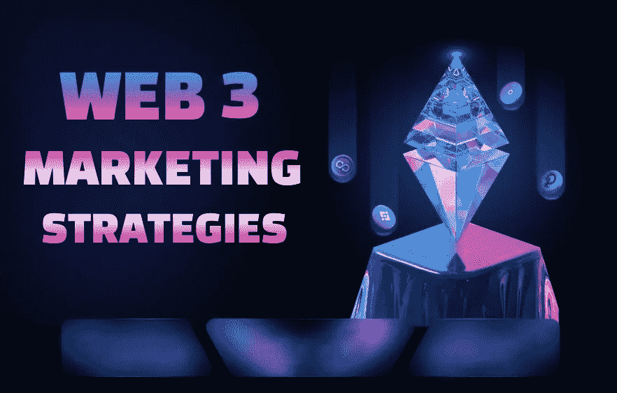

# 2022 年 8 大网络 3 营销策略

> 原文：<https://medium.com/geekculture/top-8-web3-marketing-strategies-in-2022-27698eae89af?source=collection_archive---------7----------------------->

Top 8 Web3 Marketing Strategies in 2022

Web3 正在引发一场企业和创造者与消费者互动方式的新革命。NFTs、metaverses、加密货币和 DeFi 为不同行业提供了新的商机。此外，众所周知，营销在成功的企业如何为客户提供服务、商品和体验方面扮演着重要的角色。随着最新形式的网络轰动的开始，一切都水落石出。一个合适的基于 Web3 的营销策略可以帮助你在正确的框架中描绘自己。

[**开始你的 WEB3 营销**](https://www.blockchainappfactory.com/web3-marketing-services?utm_source=Medium+GC&utm_medium=23%2F11%2F22&utm_campaign=senpagapandian) 👈👈**点击这里**

# **网络 3 营销——营销新时代的开始**

与强调前端即兴创作的 Web2 相比，Web3 更关注后端创新。在 Web2 中，平台使用所提供的数据来换取对其难以置信的服务的访问是很常见的。然而，有了 Web3，公民，而不是私人企业现在可以拥有和控制他们的数据。

数据隐私将对营销人员产生重大影响，因为他们现在需要投入更多资源来确定哪些问题对客户最重要，并围绕这些问题创建社区。由于“社区营销”越来越受欢迎，你会听到许多 Web3 品牌和项目强调社区建设的价值。

相反，Web2 营销策略将继续与 NFTs&meta vers 等 Web3 创新一起使用。这些发展将帮助品牌建立忠诚的社区，支持他们成为品牌倡导者。

由于内容制作者将最终完全控制他们的内容和收入，而不是受他们使用的平台的支配，所以 Web3 对他们来说特别有效。

## ***Web3 营销:最新营销策略的开始！***

那么，你如何为 web3 准备你的品牌呢？有些事你应该知道。

## **为网络 3 类营销做好准备！**

一场营销革命即将发生。因此，请做好准备，让您的品牌适应以下 Web3 营销策略:

## **跟随 Web3 趋势:**

过时是很昂贵的。有很多未知，但也有很多发展。请记住，在做商业决策时，未来已经在眼前，而且瞬息万变。根据你的品牌，尝试收购 3D 资产，如 3D 模型或虚拟现实商店。随着你对 Web 3.0 趋势了解的越多，你会发现更多的方法来将最新的 Web 3.0 趋势融入到你当前的策略中。

## **使用 NFTs 增强您的内容创作策略:**

尽管没有为 Web 3.0 创建内容的固定指导方针或规则，但每个人都同意使用 NFTs。在区块链，NFT(不可替代的令牌)是促进数字稀缺的知识产权。他们已经为开始制造它们的品牌完成了几件事，包括:

*   更高的品牌认知度和影响力
*   新奇的遭遇和受限的访问
*   更高的品牌忠诚度

## **开始在社交媒体上发展与客户的深度关系:**

社交媒体仍将在 Web 3.0 中扮演重要角色，尽管会有一些重大变化。权力下放将使用户能够控制他们的信息。在早期阶段与客户建立深厚的关系将加强他们与你的品牌的联系，并增加他们将数据委托给你的意愿。

如前所述，网络 3 营销的基础是社区建设。因此，即使在产品发布之前，拥有一个稳固的社区也是至关重要的。

## **模因是你传播策略的一部分:**

模因被认为是互联网上的通用语言，Web3 社区很喜欢它们。迷因具有人情味，平易近人，并能唤起强烈的情感。它们对于将项目与人联系起来是必不可少的。

## 应该开发新的 Web3 KPIs 来衡量您的努力是否成功。

营销人员需要重新考虑他们如何在网络 3 时代衡量增长表现。适用于网站 2 的关键绩效指标(KPI)有时可能只适用于网站 3。您可以对 Web3 使用以下指标:

*   跨渠道的社区维度
*   约定和活动水平
*   NFT 价格的稳定或持续增长表明您的客户对 NFT 项目有信心。

## ***web 3 版营销指标:迈向更美好未来的关键！***

## **增强的 Web3 营销策略**

Web3 让你离创造不可思议的事情更近了一步。然而，由于元宇宙是增长最快的现象，你可以利用它来加强你的营销计划，提高你的品牌认知度，扩大你的客户群。

## **虚拟土地中的 3D 广告牌**

因为你不受地理位置的限制，在元宇宙进行营销可以让你从任何地方与全球受众进行交流。任何浏览最繁忙的虚拟环境的人都可以看到你的广告，包括分散的土地、体素和空间。

希望在虚拟世界做广告的企业可以利用元宇宙居民提供的广泛服务。然而，一个选择是在分散的黄金地段的 3D 广告牌上展示你特别制作的广告。此外，由于界面的高度简单性和直观性，它充当了 Web2 和 Web3 之间的桥梁，企业可以在不了解任何编码或 Web3 概念的情况下做到这一点。

## **在元宇宙举办虚拟活动**

在虚拟世界中推广公司的另一个重要方式是在电脑生成的结构中举办一场活动。此外，在虚拟世界中，您可以使用实时视频流、预先录制的视频、音频回放、艺术品展示、与您的访问者实时聊天等。

## **出售 NFT 门禁**

基于 Web3 的营销创新和成功的关键是不可替代的令牌和元宇宙的组合。NFTs 作为一个创造性的渠道，可以帮助品牌和创作者增加他们的在线产品线&给现有的或潜在的客户更多令人兴奋的方式来与他们的业务互动。因此，一个繁荣的社区将围绕你的品牌成长，这是非常社区营销的想法。

此外，通过创建可以收集、交易和出售的数字资产，您可以为您的产品和服务吸引粉丝和收藏者。在这种互动水平上，顾客可以成为热情的支持者，这是传统营销策略难以达到的。

## **打造游戏相关体验**

提供互动和沉浸式体验的新营销策略与 Web3 一致。虽然随着时间的推移，它可以提供令人难以置信的投资回报率，但它确实需要增加营销费用，一个坚实的创意团队和一个懂 Web3 的团队。

## **包装完毕！**

他们与企业互动的方式每天都在变化。随着 Web3 的快速发展，营销人员采用这一最新技术并参与创新的时机已经成熟。因此，是时候从正确的头脑中获得最好的 [**Web3 营销服务**](https://www.blockchainappfactory.com/web3-marketing-services?utm_source=Medium+GC&utm_medium=23%2F11%2F22&utm_campaign=senpagapandian) 。