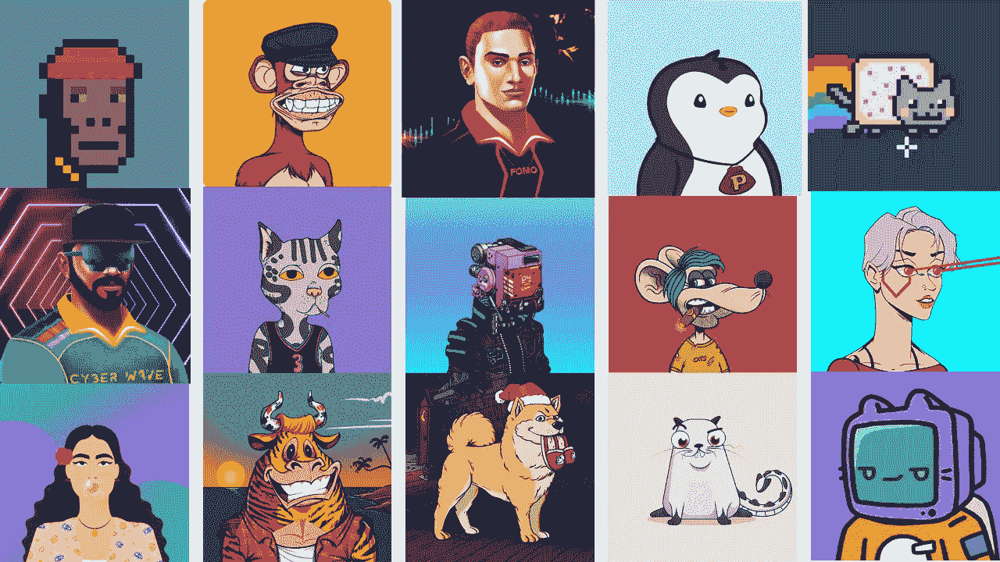

# 2023 年最值得投资的 9 大 NFT 项目

> 原文：<https://medium.com/geekculture/top-9-best-nft-projects-to-invest-in-2022-2023-b160ea7562f0?source=collection_archive---------1----------------------->

不可替代代币(NFT)——这些词甚至在 2021 年之前就已经存在，但 2021 年的繁荣让它们成为人们关注的焦点。自繁荣以来，对 NFT 的需求从未下降。加密的冬天来了，你肯定已经看到比特币和以太坊等加密货币的价值在过去 18 个月跌至历史最低点。这是一个问题吗？当然是了。据估计，今天大约 95%的 NFT 是在以太坊区块链铸造的。当 ETH 货币贬值时，NFT 的价值也随之下降。然而，现在被认为是购买 NFT 的合适时机，因为当市场回升时，人们可以获得代际财富。尽管加密崩溃，一些 NFT 项目在受欢迎的 NFT 市场是在聚光灯下。如果你是一个期待投资 NFT 或者收集 NFT 的人，你就来对地方了。让我们开始吧。

# **聚焦 2023 年 NFT 项目**

## **1。** [**涂鸦**](https://www.google.com/search?q=doodles+nft&oq=Doodles&aqs=chrome.1.69i59j35i39j0i131i433i512j0i512j0i131i433i512j0i512j46i10i512j69i60.1057j0j7&sourceid=chrome&ie=UTF-8)

涂鸦 NFT 系列是 2022 年初发布的手绘涂鸦艺术。该集合包含 10，000 种不同的 NFT，具有数百种不同的特征。该系列中的每一幅 NFT 都是一幅色彩鲜艳的动画图片，描绘了骨骼、动物、外星人、人形或宇宙飞船。

拥有涂鸦 NFT 的收藏者可以第一时间接触新产品和新活动。涂鸦也是分散治理的，这意味着所有者对主要功能、产品和事件进行投票。

## **2。** [Jump.trade](https://www.jump.trade/)

Jump.trade 是世界上第一个 NFT 板球 NFTs 市场，供玩家赢得元宇宙比赛。元板球联赛将是有史以来第一次在 NFT 举行的板球比赛。该市场在推出后仅 9 分钟内就售出了 55000 张板球运动员 NFTs 门票。这些 NFT 的所有者可以玩游戏，并通过它获得被动收入。随着游戏即将推出，市场上的二次销售正在进行，它正受到全球板球球迷的关注。1983 年、2003 年和 2011 年的世界杯 NFT 收藏都以 25 美元的底价售出了 400 倍。更不用说，2011 年世界杯 NFT 收藏以 11111 美元的天价售出。他们有一个活跃的社区，急切地等待游戏在 2022 年第二季度推出。

## **3。** [**志那都红豆 NFT 收藏**](https://www.google.com/search?q=azuki+nft&sxsrf=ALiCzsajaiDNg4PKciZvJJ1enXwEeTLAMA%3A1655976636450&ei=vDK0YpuJG8ev4-EP5ImPgAE&ved=0ahUKEwib16_ZocP4AhXH1zgGHeTEAxAQ4dUDCA4&uact=5&oq=azuki+nft&gs_lcp=Cgdnd3Mtd2l6EAMyBAgAEEMyDQgAEIAEEIcCELEDEBQyBAgAEEMyBQgAEIAEMgUIABCABDIFCAAQgAQyBQgAEIAEMgUIABCABDIFCAAQgAQyBQgAEIAEOgcIABBHELADSgQIQRgASgQIRhgAUMIHWLcJYIMRaAJwAXgAgAHDAYgB_QKSAQMwLjKYAQCgAQHIAQjAAQE&sclient=gws-wiz)

就整体交易量而言，志那都红豆是 2022 年推出的最受欢迎的 NFT 项目，已达到一个新的里程碑。志那都红豆是一个由 10，000 个虚拟角色组成的项目，这些虚拟角色允许你进入花园。志那都红豆设想在这个只有社区的空间里融合现实世界和数字世界。志那都红豆的角色和联盟被用于街头服装合作、更多的 NFT 空投和现场活动。这是一个成功的 NFT 项目启动，许多 NFT 卖出了高价。志那都红豆#9605 在 OpenSea 市场以 420.69 ETH 或 142 万美元的价格售出。

## **4。** [**月鸟**](https://www.google.com/search?q=moonbirds+nft&sxsrf=ALiCzsba0Ar5BWxLGjeUzENI7eeJjFzCwA%3A1655976641868&ei=wTK0YvvSNLe64-EP9eqNuAo&ved=0ahUKEwi7t_rbocP4AhU33TgGHXV1A6cQ4dUDCA4&uact=5&oq=moonbirds+nft&gs_lcp=Cgdnd3Mtd2l6EAMyBAgAEEMyBQgAEIAEMgUIABCABDIFCAAQgAQyBQgAEIAEMgUIABCABDIKCAAQgAQQhwIQFDIKCAAQgAQQhwIQFDIFCAAQgAQyBQgAEIAESgQIQRgASgQIRhgAUABYuAhgtAtoAHAAeACAAYQBiAGcBJIBAzIuM5gBAKABAcABAQ&sclient=gws-wiz)

Moonbirds 的第一个系列包括 10，000 只具有独特特征的像素化猫头鹰，包括火红的头发、眼罩、莫霍克发型、花朵头带和彩色眼睛。Moonbirds 的固定造币价格为 2.5 ETH，即 7000 美元。尽管如此，该系列在两天内就销售一空，自发布以来，二级市场上的转售一直在上升。

## **5。** [隐密咖啡师](https://www.google.com/search?q=Crypto+Baristas+nft&sxsrf=ALiCzsZsWHtSfQcD69LFsrzY0_5ZxhbNeQ%3A1655976838564&ei=hjO0YreNIu-I4-EPxJuA-AQ&ved=0ahUKEwi36N-5osP4AhVvxDgGHcQNAE8Q4dUDCA4&uact=5&oq=Crypto+Baristas+nft&gs_lcp=Cgdnd3Mtd2l6EAMyBQgAEIAEMgUIABCABDoHCAAQRxCwA0oECEEYAEoECEYYAFCEowZYhKMGYKuqBmgEcAF4AIABaogBapIBAzAuMZgBAKABAqABAcgBCMABAQ&sclient=gws-wiz)

Crypto Baristas 是一个手绘的、独一无二的倒咖啡的角色的集合，可以在区块链平台 Rarible 上作为 NFT 购买。Crypto Barista 网站总共出售由漫画家托尼·裴和咖啡兄弟制作的 60 个这样的角色。这些角色根据其稀有程度分为三类。

该活动的主要目标是培养一群志同道合的人，他们重视艺术、咖啡、创新和商业。

上述非功能性测试对行业来说是新的；它们一推出就被抢购一空。对这些 NFT 有巨大的需求，在各种 NFT 市场的二次销售正在进行，并保持在聚光灯下。除此之外，还有被归类为蓝筹股 NFT 的 NFT 收藏。这些集合虽然是几个月或几年前推出的，但即使在加密崩溃的时代，它们仍然抢尽了风头。下面给出了其中的一些。

## **6。** [**无聊猿游艇俱乐部**](https://www.google.com/search?q=BAYC&sxsrf=ALiCzsbRDyJBXSt4ArRUrJDPFnAyfHWpPQ%3A1655976652627&ei=zDK0YpDiJZ2v4-EPm4uRkAk&ved=0ahUKEwiQ-IrhocP4AhWd1zgGHZtFBJIQ4dUDCA4&uact=5&oq=BAYC&gs_lcp=Cgdnd3Mtd2l6EAMyBAgAEEMyBAgAEEMyBAgAEEMyBAgAEEMyBAgAEEMyBAgAEEMyBAgAEEMyBwgAEMkDEEMyBAgAEEMyCggAEIAEEIcCEBQ6BAgjECc6CggAELEDEIMBEEM6CgguEMcBEKMCEEM6BAguEEM6EQguEIAEELEDEIMBEMcBEKMCOg4ILhCABBCxAxDHARCjAjoOCC4QgAQQsQMQxwEQrwE6CgguEMcBEK8BEENKBAhBGABKBAhGGABQAFjTB2CIC2gAcAF4AIABhQGIAc4DkgEDMC40mAEAoAEBwAEB&sclient=gws-wiz)

无聊猿游艇俱乐部是 NFT 集合，是基于社区的公用事业 NFTs 的先驱。BAYC 是 NFT 的主要收藏之一，它带有独特的实用工具，如社区专用浴室，成员可以每 15 分钟在画布上画一个像素。社区驱动的决策，只有社区才能进入的 NFTs，如变种人猿游艇俱乐部，宠物狗的持有者，和社区会议是其中的一些。有了 Ape coin 和从社区中为 BAYC 开发一个专用市场的决定，该系列是一个前所未有的好投资。

## **7。**

**加密朋克被认为是有史以来第一个 NFT 项目出来。它们是像素化的图画，现在还没有失去价值。它们现在是迄今为止最受欢迎和最昂贵的非功能性测试之一。这一系列拥有 10，000 件设计独特的像素化时髦艺术品，是随时投资的宝石和蓝筹 NFT。**

## ****8。**[**vee friends**](https://www.google.com/search?q=VeeFriends&oq=VeeFriends&aqs=chrome..69i57j0i67l2j0i512l7.255j0j7&sourceid=chrome&ie=UTF-8)**

**VeeFriends 是 NFT 收集的 10，255 幅动物启发的视觉作品，由 Garyvee 手绘，Gary vee 是一位企业家，他期待通过 NFTs 带来一个商业社区。这些 NFT 在区块链以太坊上运行，在 NFT 开放海洋市场上可以买到。这些 NFT 的拥有者有机会通过不同的模式直接与加里·维互动，这取决于他们拥有的 NFT 的类型。**

## ****9。** [**下放**](https://www.google.com/search?q=Decentraland&oq=Decentraland&aqs=chrome..69i57j0i271.165j0j7&sourceid=chrome&ie=UTF-8)**

**分散土地是一个基于元宇宙的房地产游戏，其中每块土地都是一个 NFT。你可以买下这些 NFTs 建筑，然后开始新经济。这是一个通过奖励和 NFTs 提供被动收入的游戏。它推出了自己的本地加密货币令牌 MANA，这被认为是一项潜在的投资。**

## ****结果****

**最初，不可替代的代币都是关于艺术的。但是今天，非功能性代币也有了用途。他们现在是成为社区一部分的象征。人们有兴趣购买更多的 NFT，并成为社区的一部分，从而创造对它们的需求。随着 NFT 社区的许多会议和世界级会议，非功能性测试的价值将逐渐增加。政府现在对非功能性金融交易感兴趣，并试图对其进行监管，所以现在是你拥有不可替代代币的时候了。**