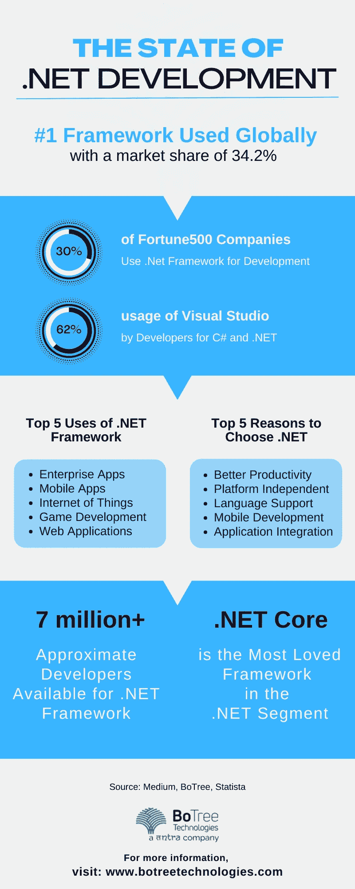

# 前 9 名。面向企业开发的. NET 开发工具和库

> 原文：<https://medium.com/geekculture/top-9-net-development-tools-and-libraries-for-enterprise-development-69f94563a636?source=collection_archive---------9----------------------->

世界各地的工程师都利用。NET 框架。这意味着在未来几十年中，可访问的开发工具和库的数量只会成倍增加。

无论如何，有无数的工具看起来和工作起来都很相似，所以很难做出决定，特别是假设你是一个初学者。NET 应用开发服务世界。

对于雇佣的团队来说。NET 开发人员来说，为他们的企业应用程序项目选择正确的库需要极大的探索。有大量的编程需求需要不同的开发工具。无论是用于编码还是用于测试的 IDE，这些工具都简化了 dotnet 开发服务的整个过程。

本文将重点介绍团队和工程师在使用微软的这个令人惊叹的框架时使用的顶级[ASP.NET 开发](https://www.botreetechnologies.com/blog/top-dotnet-development-skills-companies-look-for-in-developers/)工具。

从. Net 软件工程师的角度来看，这些工具使工程师更容易满足大量的标准编程活动。这些包括评估代码质量、修复错误以及与软件应用程序开发相关的其他不同任务。

> **阅读更多:**[**ASP.NET MVC vs ASP.NET Core**](https://dev.to/botreetechnologies/aspnet-mvc-vs-aspnet-core-which-one-is-better-for-web-development-17fm)**:哪个更适合 web 开发？**

# **ide 和代码编辑器。网络**

ide 和代码编辑器是开发人员用来编写和实现代码的开发环境。它们对于编写软件应用程序很有用，并且有几个内置特性可以简化开发过程。

以下是. NET 开发公司在企业应用程序开发过程中使用的一些最好的 ide 和代码编辑器

*   **Visual Studio IDE** 可能是最流行的代码编辑器。Visual Studio 是微软的一个全功能开发工具，允许你从头到尾创建、调整和传输代码。微软为 IDE 提出了各种付费计划，以使个人开发者和企业能够使用其丰富的工具集，包括 Visual Studio 社区——对个人工程师和限制在五个客户端的非组织公司免费。
*   Visual Studio Code
    这是 Visual Studio IDE 的一个轻量级版本，适用于那些觉得上一个版本令人不知所措的开发人员。它是免费的，可以在许多设计环境中使用，包括跨平台应用程序开发(Linux、Mac OS、Windows)。像 Visual Studio 一样，代码分布式支持 IntelliSense 代码完成功能、调查、Git 组合和扩充。
*   **JetBrains** 这个骑手有点年轻，限制性强(一个 30 天的初步试用软件)。NET IDE。它支持。NET 和。NET 核心应用程序在 Windows，Mac OS X 和 Linux 上。提供[ASP.NET 开发服务的公司](https://www.botreetechnologies.com/dot-net-development-company)认为，Rider 的快速表示、各种平台和运行时支持、表单控制组合和广泛的反编译能力使其非常适合企业应用程序。它在 Linux 上运行良好，并支持广泛的需求:控制中心、web 和库。

# **包经理。网**

包管理支持通过促进您的包、模块、库等等，并使它们对您的团队、您的涉众和您的交付物是可访问的，来增强工作过程的持续交付。按照这些思路，这是对您的。NET 环境。

以下是本文中 net 开发工具列表中的顶级包管理器

*   NuGet 是的一个包管理器。NET，它允许你访问不同的外部或第三方库，或者制作和共享你自己的工具。目前可访问的包超过 98，000 个，这是. NET 外部组件的最大数据集。NuGet 在配置时直接将外部组件交付到您的 Visual Studio 项目中，并包含 CI/CD 自动部署的订单行。
*   **NPM** 包管理不仅仅是关于 NuGet。Yevhenii Zabielyshynsky 注意到，在最近的几年中，尽管习惯上使用 NuGet director 作为 web 应用程序的源代码库，但 Microsoft Visual Studio 还是增加了 npm 支持:它极大地影响了 web 项目，并使人们能够利用高级 Web 实践、设备和开源代码以及。网芯。
*   **Microsoft Web Platform Installer** 开发人员使用的这个免费捆绑包可以轻松获得 Microsoft Web Platform 的最新版本，包括 IIS、SQL Server Express 等。NET 框架、Visual Web Developer 等等。该框架通过自然地引入平台中每个组件的最新版本来保持最新的更新。

> **阅读更多:** [**使用微软的 7 个理由。NET 框架进行 App 开发**](https://www.botreetechnologies.com/blog/7-reasons-to-use-microsoft-net-framework-for-app-development/)

# **其他工具和库。Net 开发**

而 ide 和包管理器是[的重要组成部分。NET 企业应用程序开发](https://topdigital.agency/top-20-reasons-to-choose-net-for-enterprise-application-development/)，还有其他一些工具可以简化开发过程。

这里有更多的工具。NET 核心开发工具列表，使开发人员能够使用框架构建更好的解决方案

*   **sonar cube—针对代码质量** sonar cube 是一个开源的静态代码审计工具，非常适合检查。NET 代码。它由一组静态分析器、一个数据存储和一个入口通道组成，在这里您可以处理您的特殊任务。除了其坚实的社区，SonarQube 还提供额外的分析器，可以作为模块添加。SonarQube 易于安排和设计，具有丰富的底层原则集:编码指南、最佳实践、数据保护和约定。
*   **ReSharper——用于代码评估** JetBrains 对 Visual Studio 进行了扩展，称为 ReSharper，以帮助设计人员。网络编码。它是工具之一。NET engineers，它提供了调查代码质量并快速发现和修复问题的能力。此外，它还有大量用于快速重构和路由的备选路径。Resharper 允许用户为所有主流编程语言提供无与伦比的帮助，如 C#、XAML、JavaScript、C++、TypeScript、JSON、ASP.NET MVC、XML、HTML、CSS、Protobuf、NAnt 和 MSBuild 脚本等等。
*   **。净反射器** 。净反射器是一个值得注意的。NET 反编译器和静态分析器。最好的一个[。NET 框架开发工具，它还可以作为 Visual Studio 扩展来访问，并且很可能是。](https://www.botreetechnologies.com/blog/top-dotnet-development-skills-companies-look-for-in-developers/)[网络工程师](https://www.codementor.io/@parthbarot/when-and-why-is-net-used-for-application-development-1n243vawr4)。利用。NET reflector 的作用是对你的程序进行故障诊断并发现问题。它可能会冒险使用 Visual Studio 编写的外部代码。应该提到的是，the.NET 反射器可以帮助简化代码组件。

## **结论**

在提供 net 开发服务时，有数百种工具可供开发人员选择。一家[软件开发公司](https://www.botreetechnologies.com/)拥有一套所有人都可以使用的标准工具。NET 开发团队，以确保他们能够实现标准的结果。以上 9 个工具主要由专注于应用程序开发的工程师使用，没有任何麻烦。

