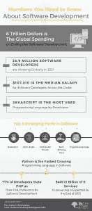

# 软件开发的 9 大上升趋势

> 原文：<https://medium.com/geekculture/top-9-rising-trends-in-software-development-c760d69e9373?source=collection_archive---------16----------------------->

软件开发趋势有一致的转变。然而，在 2022 年，有几个趋势似乎是主流。随着前沿创新的进步，当前的软件开发趋势发生了巨大的变化。组织需要了解这些变化，以便在竞争激烈的 IT 世界中取得更好的成绩。

每个技术专家都知道让自己跟上[最新软件开发趋势](https://www.botreetechnologies.com/blog/software-development-trends/)的重要性。从 DevSecOps 到低代码应用程序，软件开发模式的变化和技术本身一样快。为了保持与时俱进，公司不仅要考虑技术的现状，还应该期待接受变化。

软件应用的趋势永远在发展。然而，疫情还推动了这些变化。众所周知，今天的编程实践可能再也不会是这样了，宜早不宜迟。

创业公司和企业应该非常了解软件行业的发展趋势，并在考虑定制软件开发时进行类似的规划。让我们详细看看将塑造软件开发行业未来的多种趋势。

# 2022 年需要了解的 9 大软件发展趋势

今天看得见的创新可能马上就过时了。如果我们看一看正在进行的软件开发过程，许多关键模式正在改变我们创建、交付和监督软件以及为之生产的平台的方式。

以下是正在改变 IT 服务和技术世界的 2022 年软件开发的 9 大趋势

**边缘计算**

*   与公共云完全不同，公共云需要将存储、计算能力和 AI/ML 放在一个中心点(可用性区域)，边缘计算将存储、存储能力和 AI/ML 放在客户端附近。低延迟情况(游戏)、不幸的组织带宽(离岸场所)、无网络、管理要求、一致的使用案例(电动智能汽车)、智能和智能小工具(物联网)是需要边缘计算的领域。

**低码/无码平台**

*   低代码/无代码只会越来越突出。计算的历史背景是从 0 和 1 开始构建更重要的层次，从以前的低级计算结构和编译编程到现在的低代码/无代码解决方案。通过这些产品，任何软件开发服务公司都可以在每个阶段推进他们的现代数字化转型，而无需专业资源(开发人员)。

**网络安全** **网**

*   网络攻击者正在使用更聪明的方法，这需要在开发过程中执行网络安全网格。网络安全网格是在应用程序的每个循环网络访问模块上呈现和测试安全工作的地方。在这个过程中，[企业软件开发公司](https://www.botreetechnologies.com/software-development-company)的 DevOp 团队在开发过程中加入了安全测试，以保证始终没有弱点出现。

**用户体验设计**

*   用户体验配置前所未有地重要。在每个行业，组织都在重新考虑他们的客户承诺模型，更有可能根据疫情造成的干扰而改变。用户体验驱动的编程配置是更新面向客户的解决方案和服务的基础，使企业能够在当前的全数字环境中保持和恢复业务。

**TensorFlow 框架**

*   为了在软件工程的未来趋势中占据上风，公司需要真正理解开发人员正在使用的工具。在这一点上，谷歌的 TensorFlow 框架被视为深度学习、机器学习和人工智能编程进步的最佳工具。从一个角度来看，这是一个由库、工具和不同资产组成的详尽的生物系统，有望制造智能模型和计算。此外，该系统适应性强，易于使用，使工程师能够轻松创建先进的软件解决方案。

**区块链和 NFT**

*   区块链经常与加密货币联系在一起。每次出现关于加密货币的模仿，区块链技术都会受到谴责。区块链(分布式账本)是 21 世纪最具颠覆性的创新之一。数字货币是其实现最多的用例，但区块链远远不止是加密货币。区块链可以改变我们行业的许多领域，影响我们的日常生活。2021 年，我们看到了区块链的一个新的非常著名的用例:NFT(不可替代的令牌)。目前，NFT 主要用于数字艺术。2022 年，我们肯定会看到 NFT 在其他用例中得到利用。

**渐进式网络应用**

*   渐进式网络应用，或 PWA，是移动创新的下一件大事。它提供了最好的本地移动和网络应用。实际上，PWA 是具有当今编程能力的 web 应用程序开发。它消除了下载应用程序的需要，同时在移动设备上享受类似本机的应用程序体验。总的来说，pwa 的响应速度更快，建设和维护成本更低，这使它们成为新企业的一个迷人决策。

**遗留系统迁移**

*   许多公司实际上利用过时的编程框架。一般来说，他们依赖于与最新进展相矛盾的旧创新，这带来了一系列的困难。它包括执行不力、维护成本高、无法满足客户需求以及数据安全漏洞。因此，越来越多的组织目前需要考虑外包软件开发服务，以将其信息和流程迁移到新的框架中，从而保证其 IT 架构的稳定运行。

**AR 和 VR**

*   游戏和视频行业正在快速发展。毫无疑问，虚拟现实不会离开我们，直到下一个十年。随着虚拟现实给玩家带来来自尖端计算机视觉的生动的第一视角体验。尽管视频和游戏是虚拟现实的标准，但随着学校开始投资将虚拟现实带入课堂，准备和教学领域也倾向于研究虚拟现实。

# 包装材料

这些趋势通常会改变软件的创建和维护方式，传统的编程和软件开发策略将会成为历史。

在任何情况下，不仅仅是软件开发在改变——我们赋予编程的意义将随着它在这个不可否认的互联世界中驱动生活的无数部分而发展。因此，企业需要一个[软件开发公司](https://www.botreetechnologies.com/)，它可以帮助利用这些变化并为未来构建产品。

*原载于 2022 年 6 月 8 日 https://techywalls.com**。*