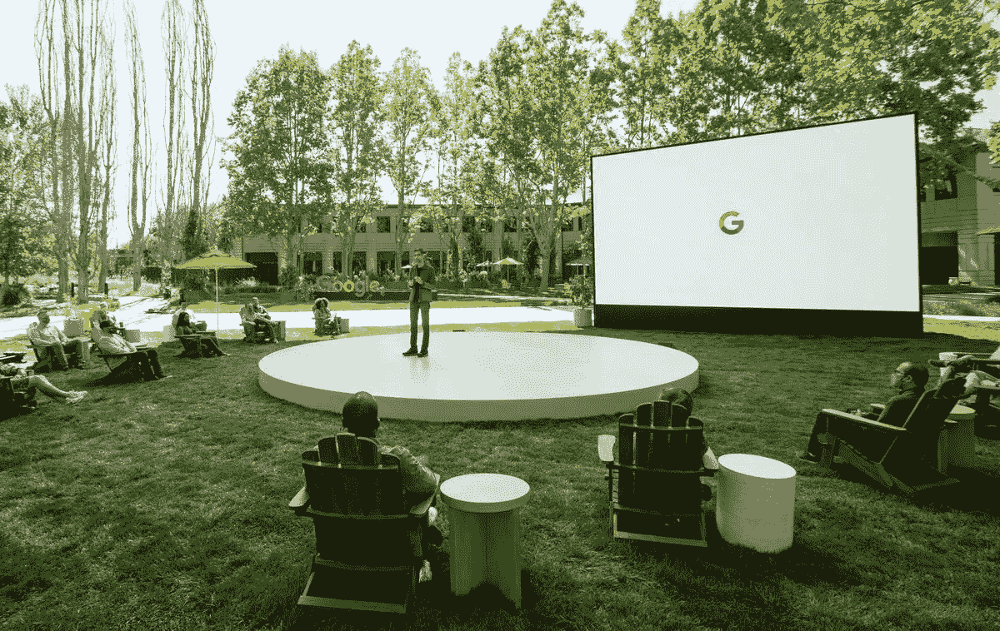

# 2021 年谷歌 I/O 大会上的顶级人工智能进展

> 原文：<https://medium.com/geekculture/top-ai-advancements-in-google-i-o-2021-5d6a48a858fa?source=collection_archive---------47----------------------->

在世界各地，大多数开发者大会都是为了讨论硬件、软件工具和特性发布而召开的。

众所周知，最近，Google I/O 是 Google 在美国举办的一年一度的开发者大会。I/O 代表输入/输出。作为一个口号，它代表“开放中的创新”。

今年发生在 2021 年 5 月。会议的主题是应用程序的新特性，以及这些应用程序如何以更具互动性的方式为用户提供帮助。

Google I/O Conference 2021

一些重要的更新如下:

—谷歌浏览器的新密码工具

—针对更多应用程序的隐私控制

—搜索引擎新功能更新

—增强现实中的谷歌地图实时视图等。,

谈到人工智能的进步，这里有一份宣布的几项顶级人工智能进步的列表:

**消除事故:**使用人工智能和导航信息识别制动事件，防止汽车碰撞，并在可行的情况下建议替代路线。

**LaMDA:** 一个自然语言平台，为未来的视角提高 AI 的对话技能。

**皮肤病学辅助工具:**一个人工智能模型，它分析图片，并从 288 种皮肤状况的知识中提取信息，给你一个可能匹配的列表，你可以进一步研究。

**智能写作:**在 Google Workspace 中写作的同时，会在适用的情况下建议更具包容性的语言。

**消除肺结核:**深度学习系统，检测活动性肺结核。

**购物图:**一个人工智能模型，它跟踪产品、卖家、品牌、评论和产品信息，以及这些特征如何相互关联。例如，如果我们给戴着你打算购买的手表的人拍照，谷歌眼镜会识别产品并建议在哪里购买。

**小模式:**谷歌正在为谷歌照片带来人工智能功能。它还改善了照片观看体验。使用人工智能，谷歌正计划创建使用类似照片的电影照片。

**Project Starline:** 谷歌的新技术项目可以让同事、朋友在视频通话中感受到彼此，即使他们身在不同的国家。