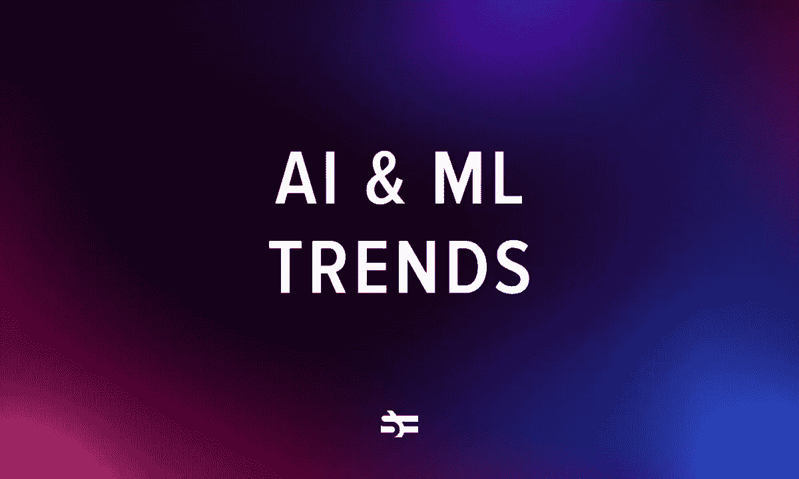

# 2023 年顶级人工智能和机器学习趋势

> 原文：<https://medium.com/geekculture/top-ai-machine-learning-trends-for-2023-b705db466e69?source=collection_archive---------8----------------------->

机器学习和人工智能是一个推动不同行业重大创新的领域。据预测，2023 年 AI 市场规模将达到 5000 亿美元，2030 年[【1，5971 亿美元](https://www.precedenceresearch.com/artificial-intelligence-market)。这意味着在不久的将来，机器学习技术将继续受到高度需求。