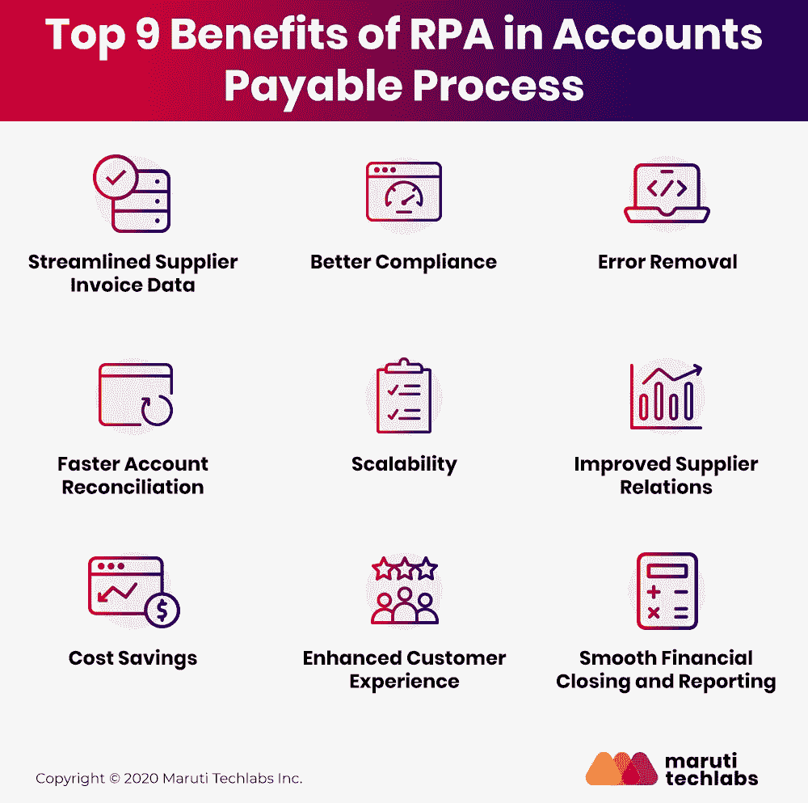

# RPA 在应付账款中的主要优势

> 原文：<https://medium.com/geekculture/top-benefits-rpa-in-accounts-payable-d6e060c40760?source=collection_archive---------10----------------------->

尽管基于纸面的应付账款流程是一项耗时且资源密集型的活动，但由于缺乏高效且有效的替代方案，企业仍依赖于此。

机器人流程自动化(RPA)是发展最快的技术之一，通过减少花费在日常会计任务上的时间和资源来实现流程效率。借助 RPA，您可以自动执行不易扩展的繁琐、重复的任务。

根据德勤的一项调查，超过 53%的企业已经确认将机器人流程自动化应用到他们的人工和管理流程中。

本文将介绍应付账款自动化的需求及其优势，以帮助金融企业实现流程现代化。

# 为什么我们需要应付账款自动化？

发票处理和供应商付款管理等任务非常耗时，而且容易出错，尤其是在涉及人工干预的情况下。从手动输入和调节到数据丢失和重复，AP 中的手动数据处理增加了成本和生产率损失。

这个问题的理想解决方案是机器人过程自动化(RPA)。RPA 降低了公司的成本，并有助于提高整个组织中工作流的适应性、灵活性和高配置。

因为 RPA 技术几乎不需要人工干预，所以它还可以通过消除人工错误来提高业务流程中的数据质量。因此，RPA 可以为公司提供一种大规模自动化手动任务和提高准确性的方法。

# 7 应付账款中 RPA 的好处

发票处理领域向更高效、更简化的方法转型的时机已经成熟。机器人流程自动化(RPA)通过自动化手动和重复性任务，为实现这一转变提供了巨大的潜力。以下是 RPA 提供的一些好处，可提高应付账款业务专业人员的效率:

1.  **简化的发票流程**

在使用人工编码方法的应付账款流程中，供应商发票的数据由数据录入人员输入系统。RPA 可以快速执行从发票复制数据、将该信息与数据库中存储的其他数据集进行匹配，以及生成报告和警报的任务。

**2。错误消除**

使用 AP 系统时，手动获取和输入数据非常耗时，并且可能会导致错误。RPA 软件能够准确无误地识别和处理特定数据，因此非常适合此类任务。

**3。可扩展性**

RPA 软件机器人可以快速响应工作负载的波动，因此可以在不同的部门和地区轻松实施。

**4。成本节约**

[通过实施 RPA 解决方案](https://marutitech.com/successful-rpa-implementation/?utm_source=medium&utm_medium=referral&utm_campaign=Benefits_of_RPA_in_Accounts_Payable)来处理多个发票数据条目，组织可以通过加快发票生命周期和利用供应商的提前付款折扣来实现显著的节约。

**5。增强客户体验**

RPA 实施确保了会计服务的全天候可用性。应付账款自动化还允许公司加强客户服务，并在市场中获得竞争优势。

**6。更好的合规性**

人工 AP 处理通常会给创建采购订单的员工带来负担，而且那个人可能是唯一确认收到货物的人，这就造成了流程的延迟。如果采购订单丢失，实施机器人流程自动化的公司可以向申购人发送自动警报。这样做可以防止流程中的延迟，并保持操作的恒定工作流。

**7。更快的账户对账**

在应付账款中实施 RPA 有助于整合 tong 和涉及多个员工输入的不可管理的流程。该过程可以是可访问的和有效的，因为软件机器人可以自动进行数据传输并排除不准确之处。

# 结论

随着组织开始评估机器人流程自动化(RPA)技术在应付账款中的优势，许多公司发现 RPA 有效地解决了支付处理挑战。

在[马鲁蒂技术实验室](https://marutitech.com/?utm_source=medium&utm_medium=referral&utm_campaign=Benefits_of_RPA_in_Accounts_Payable)，我们知道并不是每个企业都完全适合自动化。因此，我们通过开发适合您业务需求的可扩展计划，为您的组织提供最佳自动化机会。

与我们的 RPA 技术专家[取得联系](https://marutitech.com/robotic-process-automation-services/?utm_source=medium&utm_medium=referral&utm_campaign=Benefits_of_RPA_in_Accounts_Payable)，立即收获自动化为企业带来的力量！