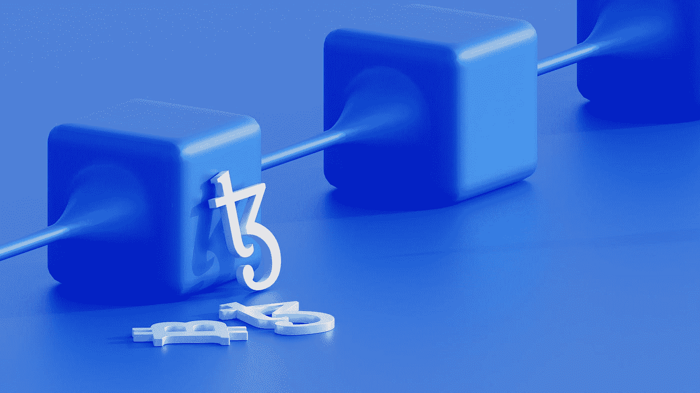
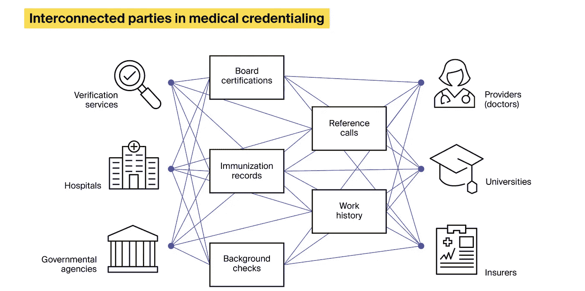

# 医疗保健领域的顶级区块链用例、优势和挑战

> 原文：<https://medium.com/geekculture/top-blockchain-use-cases-in-healthcare-advantages-and-challenges-7d796cae1576?source=collection_archive---------9----------------------->

在数据存储、共享和验证方面，医疗保健行业面临着许多问题。患者数据存在于孤立的筒仓中，医生在需要时无法访问，而黑客似乎能够相对容易地利用这些数据。患者感觉不到他们拥有自己的健康信息。假药充斥市场，因为没人能证实它们的来源。

传统的数据管理实践是否已经过时？

尽管区块链技术已经出现在金融领域，但区块链在医疗保健领域的用例也越来越受欢迎。预计到 2026 年，全球医疗区块链市场将达到 558.3 亿美元，从 2021 年开始，CAGR 将增长 35%。医院和其他医疗机构正在利用[区块链发展服务](https://itrexgroup.com/services/blockchain-development/)来增强他们的数据相关实践。

那么，区块链是如何在医疗保健行业工作的呢？在医疗领域实施该技术时，您会遇到哪些挑战？

# 什么是区块链，它对医疗保健有什么好处？

区块链是一个去中心化的分布式系统，产生和存储数据。当区块链上的一个设备执行一个事务时，所有其他设备都会生成反映该操作的相同块。同样，当区块链数据被以任何方式操作时，会创建一个块来记录此信息，以便可以轻松验证任何更改并追溯到其来源。

你可以在我们博客的专门文章中了解更多关于[区块链及其应用的信息。](https://itrexgroup.com/blog/blockchain-use-cases-advantages-issues-implementation-tips/)

区块链如何用于医疗保健？这项技术结合了先进的加密机制来增强数据安全性。通过区块链的许可系统，它将数据所有权还给个人，并通过其透明度，通过记录和标记所有细节来促进临床试验。此外，它还提供独特的合同管理和支付功能。

# 区块链在医疗保健方面的优势

以下是区块链技术为不同的医疗机构带来的主要优势:

## 面向医疗机构的区块链:

*   改善决策，因为区块链允许不同位置的多名医生实时查看相同的数据
*   将患者病历转换为一个无法篡改的分散式系统
*   加速医疗认证

## 面向患者的区块链:

*   使患者能够掌控自己的医疗数据
*   支持同意机制，禁止医疗服务提供者在未经患者允许的情况下访问信息
*   使患者能够参与研究，并在没有中介的情况下将他们的数据货币化
*   以安全的方式收集和存储来自可穿戴设备的数据

## 制药领域的区块链:

*   帮助招募临床试验的参与者
*   利用其不变的记录支持可靠且可审计的临床试验文档
*   允许识别假药

## 保险领域的区块链:

*   加快确认获取过程
*   让保险公司有机会使用智能合同起草和管理协议
*   通过消除中介降低成本

# 区块链在医疗保健方面的劣势

在医疗保健中采用区块链有几个缺点，这源于该技术的性质:

*   随着块数的增加，事务时间也会增加，从而导致延迟
*   无法永久删除记录。网络只是创建更多反映现有记录无效的块
*   为了使这项技术发挥作用，每一个相关的组织都需要参与进来
*   大型患者文件的潜在问题，如 MRI 扫描
*   高规划、开发和维护成本

# 医疗保健中的区块链:用例

以下是区块链技术在医疗保健领域最突出的七项应用:

*   透明供应链
*   更快的医疗认证
*   以病人为中心的电子病历
*   可管理的医学试验
*   增强的安全性
*   通过智能合同履行承诺
*   基因组研究

# 区块链增加了医疗供应链的透明度

假药是一个长期存在的问题。世界卫生组织(世卫组织)估计，在发达国家可购买的所有药物中有[高达 1%是非法的。这一数字在发展中国家增加到近 10%。证明这一点的是，2021 年](https://pubmed.ncbi.nlm.nih.gov/21789919/)，美国药品管理局(DEA) [截获了超过 950 万种假药。](https://www.kfyrtv.com/2021/09/27/officials-seize-more-than-95-million-lethal-fake-pills-2021-warn-alarming-increase/)

该机构报告说，这个数字高于前两年的总和。区块链在医疗保健领域的一个用例是，它允许客户在每个阶段跟踪产品，包括制造、批发和运输，以确保产品是合法的。这对药物和医疗器械都至关重要。一旦为一种药物建立了分类账，它就记录了起源点，例如实验室。从那以后，对这种药物的每一次操作都被记录在案。区块链可以纳入相当广泛的信息，例如劳动力成本以及制造和运输过程中排放了多少废物。

[MediLedger](https://www.mediledger.com/) 是区块链协议的一个例子，医疗保健组织可以用它来验证处方药供应链的信息。这包括有效期、制造商等。

MediLedger 还允许不同方交换安全的点对点消息。许多著名的医疗保健提供商，如拜耳、辉瑞和 Cardinal Health 都使用这个网络。

在另一个例子中，总部位于巴黎的 Blockpharma 建立了一个扫描药物供应链的解决方案，并在所有装运点进行验证。该公司的应用程序允许患者验证他们购买的合法性。Blockpharma [被认为拦截了全球 15%的假药](https://builtin.com/blockchain/blockchain-healthcare-applications-companies)。

# 区块链加速医疗认证

验证证书(培训、技能、医疗执照和教育)是一个繁琐的过程，通常通过电话和电子邮件进行，可能需要四个月甚至六个月才能完成。平价优质医疗保健委员会报告称，支付方[每年花费近 20 亿美元](https://www.nursingcenter.com/ncblog/march-2020/blockchain-credentialing)来维护一个全面的医疗保健提供商数据库。区块链技术可以提供一种更快、更可靠的替代品，不依赖于直接的人类参考。

区块链允许医疗保健组织记录和监控其员工的凭据。这种安排简化了雇佣流程，提高了分包商、医院和患者之间的透明度和信任度。

此外，当专业人员需要添加资格时，区块链记录允许增量更新。ArchiveCore 是一家由两位医生创立的医疗保健认证初创公司。它使用区块链来验证主要来源的认证文件，目的是减少新员工背景调查的时间。Carilion Clinic 针对 17 名员工的典型招聘流程测试了 ArchiveCore 软件，并惊讶地发现[他们原本可以节省 120 万美元的收入损失](https://www.bizjournals.com/richmond/inno/stories/profiles/2021/01/13/archivecore-blockchain-healthcare-credentialing.html)。

# 区块链支持以患者为中心的电子病历

共享医疗数据是一项敏感且高度管控的任务。在美国对医生和护士进行的一项调查[显示，74%的受访者认为](https://www.hcinnovationgroup.com/clinical-it/news/13029367/incomplete-data-plays-role-in-patient-safety-concerns-survey-finds)当不同部门之间交换他们的健康信息时，病人的安全处于危险之中。

医疗保健行业中最受欢迎的区块链用例之一是提供患者记录的全面概述并管理数据共享许可。这种系统使患者能够完全控制他们的记录——当他们的数据更新时，他们会收到通知，并且他们可以与医生、研究人员和其他方共享全部或部分记录。患者甚至可以对他们的记录向特定第三方可见的时间设置限制。保险公司可以使用该系统直接与患者确认，无需中介。

该技术的一个应用来自[医疗链](https://medicalchain.com/en/)。该公司帮助医疗保健提供商将他们的电子医疗记录与区块链驱动的平台相集成。MedicalChain 软件可用于开发其他医疗保健解决方案，如虚拟咨询和市场，使患者能够将他们的匿名医疗数据货币化。

# 区块链促进临床试验

ClinicalTrials.gov 透露，全球药物开发[每年花费约 3500 亿美元](https://www.clinicaltrialsarena.com/digital-disruption/blockchain-clinical-trials/)。临床试验产生大量的数据，涉及许多人，如赞助商、研究对象、医生、研究人员、药品制造商等。因此，很容易出现错误，并且存在有意伪造的空间。寻找和招募参与者是另一个问题。最近的一份报告显示，只有 8%的癌症患者参加了临床试验。此外，trails 的信息通常存储在集中式数据库中，这使得在所有利益相关者之间共享具有挑战性。

区块链在医疗保健领域的另一个用例是使临床试验更加透明，允许研究人员识别有问题的研究方案，并阻止其发表。有了这项技术，所有临床试验文档都可以打上时间戳并安全存储。区块链记录包括项目建议书、调查、研究设计、血液测试、患者同意书等。此外，这项技术允许分散在不同地理位置的参与者同时实时查看数据，这对试验决策至关重要。

此外，区块链可以帮助管理临床试验的财务。例如，德国制药公司勃林格殷格翰(Boehringer Ingelheim)与 IBM 合作，为其试验实施了一个基于区块链的簿记系统。延迟支付试验参与者是另一个问题。这些人通常需要几个月才能获得收入。Bloqcube 专门从事区块链驱动的临床试验软件，它认为与央行数字货币合作可以大大加快支付过程，让医生和患者在执行任务后几分钟内就可以收到补偿。

# 区块链增强安全性

健康数据大多存储在集中式数据库中，无法提供足够的防盗和防泄密保护。根据 HIPAA Journal，2021 年共有 [44，993，618 份医疗记录在 686 起医疗保健数据泄露事件中遭到破坏。区块链可以促进安全的健康数据存储和共享。](https://www.hipaajournal.com/largest-healthcare-data-breaches-of-2021/)

例如，总部位于加利福尼亚州的 [Akiri](https://akiri.com/) 以网络即服务的方式运营，并使用区块链来提供一套策略、配置数据层，并实时验证健康数据的来源和目的地。区块链也支持加密。如果医疗服务提供者想要访问患者信息，他们将需要相应的公钥。研究表明 [63%的医疗机构未能加密](https://www.securitymetrics.com/learn/medical-data-encryption-101)驻留在其工作站上的受保护健康信息(PHI)。总部位于美国的主要测试和疫苗验证平台 Testd 借助区块链对其数据进行加密并进一步匿名化。区块链在医疗保健领域的另一个与安全相关的使用案例是支持可穿戴医疗设备。这项技术有助于记录物联网数据并将其从设备安全传输到医疗保健提供商。它可以保护数据免受未经授权的篡改，阻止对某些设备的访问，并关闭受损节点。

# 区块链通过智能合约强制执行承诺

与合同相关的纠纷和不履行合同条款是每个行业都存在的问题。研究表明 [10%的保险索赔在医疗领域有争议](https://stlpartners.com/articles/digital-health/5-blockchain-healthcare-use-cases/#C3)，而 [17%的索赔由于信息不完整、重复索赔、登记不当等原因被拒绝](https://dev.pro/insights/five-blockchain-use-cases-in-healthcare-you-should-try-in-2021/)。

智能合约可以为这些棘手的问题提供解决方案。智能合约是部署在区块链上的一段代码。它被设置为在满足预定义的条件时自动执行。智能合同通过消除中介帮助医疗部门降低成本。

这项技术支持不同的医疗保健参与者，如提供商、患者、保险公司和医疗设备制造商。在网络上验证自己的身份并记录合同条款，这将自动执行并对所有相关方保持可见。例如，当一个病人去看医生时，这个事件将反映在区块链总账中，并且保险公司将得到通知。利益相关者可以求助于智能合同来核实事实并加快争议的解决。

总部位于费城的 HealthVerity 最近收购了位于[的 Curisium，该公司开发了一个基于区块链的平台，支持医疗保健领域的合同管理和谈判。它允许供应商和付款人参与创新的安全合同安排，并在发生争议时找到共同点。](https://www.prnewswire.com/news-releases/healthverity-acquires-curisium-to-enhance-data-exchange-for-drug-rebate-processing-and-contract-management-301095901.html)

# 区块链支持基因组研究

基因组测序的成本从几年前的 10，000 美元急剧下降到现在的 1，000 美元，一些公司声称完成这项任务只需 100 美元。这鼓励科学家从事基因组相关的研究。但是到哪里去寻找愿意的参与者呢？以及如何为如此海量的数据集提供安全存储？这是区块链在医疗保健领域的另一个用例。这项技术允许参与者存储数十亿个基因组数据点，在感兴趣的各方之间安全地交换它们，并建立所有权。该技术还支持个人在不涉及中介的情况下合法地将他们的基因组信息货币化。

例如， [EncrypGen](https://encrypgen.com/) 提供了一个区块链支持的 DNA 市场，参与者可以使用可追踪的 DNA 令牌上传、共享、搜索和出售遗传数据。在另一个例子中，以色列生物技术公司 [DNAtix](https://www.dnatix.com/) 利用 DNAtix 代币作为支付手段，雇佣区块链来促进数据所有者和研究人员之间的基因组数据交换。该公司以完全匿名支付和合同为荣。

以下是该公司首席执行官[奥弗·利德斯基所说的](https://www.labiotech.eu/in-depth/blockchain-control-genomic-data/)，“我们正在带来一种参与研究、测试你的 DNA、储存你的 DNA 并保持匿名的新可能性。这是这个星球上最安全的基因。”

# 区块链在医疗保健领域面临的挑战

*   **符合 HIPAA 和其他数据隐私法规**:区块链在一个设计透明的网络上存储和维护高度敏感和受监管的患者数据。医疗保健组织需要确保他们遵从法规，并将数据泄露的风险降至最低。
*   **大量医疗保健数据**:医疗机构需要评估在不严重影响性能的情况下存储大量数据的可能性。
*   **找到正确的平衡**:我们无法同时最大化区块链安全性、可伸缩性和去中心化。这些参数中的一个参数的提高是以其他参数的降低为代价的。例如，如果区块链的支付系统被全球采用，处理这些交易的安全性可能会受到影响。研究人员正在寻找解决方案，但目前，这仍然是一个相关的问题。
*   **访问授权**:区块链在医疗保健领域的另一个挑战是数据访问是基于权限的。但是如果病人在紧急情况下身体上不能给予明确的同意，该怎么办呢？组织必须想出在这种和类似情况下如何操作的协议。
*   **私钥和公钥**:区块链使用加密技术来保护其数据。因此，存在密钥管理的问题。对所有块使用相同的公钥意味着如果密钥被泄露，所有数据都将暴露。另一方面，对每个块使用不同的键会大大增加存储和访问数据的成本。

# 如何在医疗保健领域实施区块链？

正如 Avaneer Health 的首席执行官 Stuart Hanson 在接受医疗保健 IT 新闻采访时指出的那样，区块链不是一项独立的技术，医疗机构可以插入并解决所有问题。它不是一个可以添加到现有技术堆栈中的平台。如果您的组织想要有效地采用区块链，您可能需要调整您的内部流程，扩展技术堆栈，并帮助您的员工和合作伙伴将他们的心态转变为新的运营模式。

此外，希望从医疗保健领域的区块链用例中充分受益的组织需要与其竞争对手合作。例如，IBM 和银行机构[与医疗机构](https://www.healthcareitnews.com/news/healthcare-blockchain-leader-talks-challenges-and-trends-dlt)合作，这些医疗机构自然会相互竞争，如 Sentara Healthcare、Cleveland Clinic 和 Aetna 等。

此次合作的目标是建立一个监管框架，对区块链的医疗网络进行监控。如果您有兴趣开始在医疗保健领域实施区块链，最好咨询专业的[医疗保健软件开发公司](https://itrexgroup.com/services/healthcare-software-development/)。

尽管部署这项技术似乎很复杂，但在正确的支持下，您的医疗机构将能够降低成本，改善患者护理，并提高数据安全性和透明度。

> *您是否希望利用区块链技术增强您的数据和合同管理实践？* [*降 ITRex 一线*](https://itrexgroup.com/contact-us/) *！我们的医疗保健专家将为您设置一个现有的区块链平台，并帮助您定制智能合同开发。*

*原载于 2022 年 3 月 23 日 https://itrexgroup.com***。**