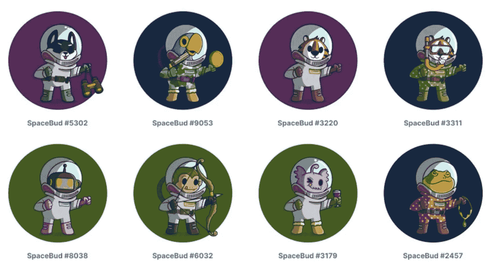
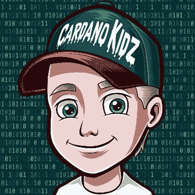

# 2022 年卡尔达诺 NFT 项目前五名

> 原文：<https://medium.com/geekculture/top-cardano-nft-projects-list-in-2022-f0a641ec7555?source=collection_archive---------10----------------------->

## 即将到来的市场瞄准最好的卡尔达诺 NFT 项目上市。大多数人都在寻找最大的腰果。这里我们有一些顶级的卡尔达诺 NFT 项目。

**Top Cardano NFT Projects**

卡尔达诺 NFT 市场发展是商业平台的完美合作伙伴，这些平台正试图在数字空间为自己命名。在加密领域，区块链技术的范围很广。其中，卡尔达诺区块链网络是最好的一个。这非常适合那些想要探索 NFTs 世界并获得巨大回报和利润的商业平台。[卡尔达诺区块链](https://cardano.org/)是一个第三代平台，基于利益证明的共识机制运行。卡尔达诺区块链与其他区块链网络非常相似，但唯一的区别是，这个区块链可以执行点对点的分析研究，作为区块链更新的主要基础。

卡尔达诺·区块链在大毒蛇网络上发挥作用。因此，Cardano 具有很高的可伸缩性，并且速度相对较快。卡尔达诺 NFT 市场的发展是企业带着特别的东西进入 NFT 市场的最佳途径。凭借最新的技术和技术参数，卡达诺 [**NFT 市场开发**](https://bit.ly/3x54MDE) 据说将彻底改变 NFT 的空间。因此，为了帮助商业平台了解卡尔达诺 NFT 的顶级项目，我们在这个博客中披露了一切。

# 以下是卡尔达诺 NFT 的五大项目

**1。**

****

****Clay Mates****

**Clay mates 是一个 NFT 平台，是在卡尔达诺区块链网络上开发的。这个卡尔达诺 NFT 项目是数字空间的新来者。这两个项目在数字世界分别以 20，000 和 15，000 ADAs 的价格出售。购买 Claymate NFTs 允许用户访问项目区域的成员。除此之外，粘土伴侣 NFT 项目允许持有人获得额外的利润。**

****2。** [**Yummi 宇宙**](https://bit.ly/3jflZSI)**

****

****Yummi Universe****

**Yummi Universe 也是 NFT 空间的新成员。这是一个由卡尔达诺·区块链开发的 NFT 项目。这个 NFT 项目致力于开发类似于流行电视节目《数码宝贝和口袋妖怪》的数字角色。这些 NFT 人物以 2D 和 3D 设计和动画的形式呈现。这个项目的核心是开放一个卡达诺木桩池，NFT 人物可以在池中放电，以木桩委托人更频繁。**

****3。** [**Spacebudz**](https://spacebudz.io/)**

****

****Spacebudz****

**Spacebudz 是在卡尔达诺区块链上创建的一个高级 NFT 平台。这个平台创造了在 Cardano 网络上以 510000 ADA 的价格出售第一个价值 100 万美元的 NFT 的记录。这个 NFT 平台是在这个网络上开发的许多平台之一。在开始的时候，Spacebudz NFTs 的交易量相当高，目前，交易量有所下降，但仍保持在目前市场上最好的卡尔达诺 NFT 项目的前 5 名。**

****4。** [**帕维亚**](https://www.pavia.io/)**

****

****Pavia****

**帕维亚是一个独特类型的元宇宙 NFT 平台，是在卡尔达诺区块链创建的。这是一款 NFT 游戏，基于网格元宇宙的概念。在这个游戏中，地块被用作 NFT。**

****5。** [**卡尔达诺·基德兹**](https://www.cardanocube.io/projects/cardanokidz)**

****

****Cardano Kidz****

**卡尔达诺 Kidz 是建立在卡尔达诺区块链上的首要 NFT 平台。在这个 NFT 项目中提供的 NFTs 的灵感来自于现实世界的艺术品。这些数字收藏品完全受 80 年代儿童电视节目的影响。**

# ****使用卡尔达诺 NFT 市场开发为企业带来的好处****

*   **NFT 市场上网络流量的最小化。项目中流量的指数级增长降低了市场的整体效率。有了卡达诺区块链技术，这些挑战在很大程度上得到了缓解，因为区块链的可扩展性最大限度地减少了带宽和数据存储方面的问题。**
*   **卡达诺区块链上的 NFT 项目消耗非常少的能量，因为使用了利益证明机制。这种节能的过程导致闪电般的交易速度。**
*   **带宽需求水平在所有市场中都是一个重要的问题。这就是在交易和使用 NFT 市场时效率低下的原因。卡达诺区块链降低了区块链中每个可用节点的带宽要求。此外，这是通过将主网络划分成多个子网来实现的。**
*   **与所有区块链网络类似，Cardano 网络以一丝不苟的方式保护以不可替代的令牌形式显示的数字资产的所有权。该区块链还包括数字资产的来源和历史。**
*   **安全是任何 NFT 项目中最重要的因素。在卡尔达诺区块链为基础的 NFT 平台，安全是根据利润和奖励发放给用户的赌注较低的饱和度池。通过执行这一点，防止了大多数黑客攻击和网络攻击，并且向投资者和购买者提供了平台的平稳运行。从而使他们能够有效地参与 NFT 项目。**

## ****总结，****

**不可替代的令牌被认为是未来许多特殊平台的核心。这项技术在商业实体领域也同样成功，从艺术领域到房地产领域。它为市场上现有和未来的企业带来巨大的投资机会和回报铺平了道路。通过投资和创建 NFT 商业实体，如卡尔达诺 NFT 市场发展展示了多种类型的货币化机会有效。这包括通过收取交易费和上市费来产生利润和收入的模式。因此，通过考虑这些因素，NFT 技术是一种完美的商业模式，有望提升数字空间中商业平台的标准，并立即获得广泛的利润和成功！因此，在不可替代的代币领域开展业务是在短期内提高利润的最佳方式。**