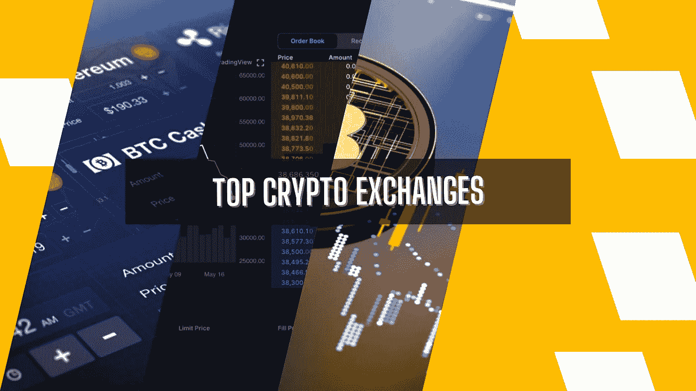
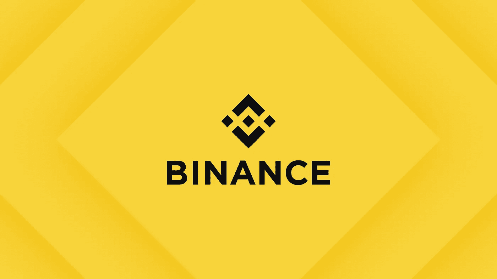
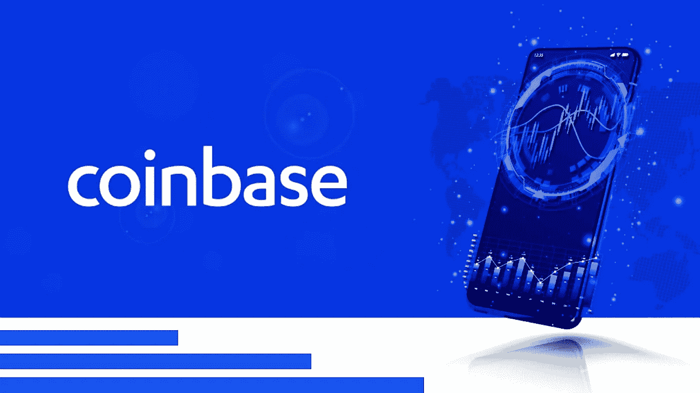
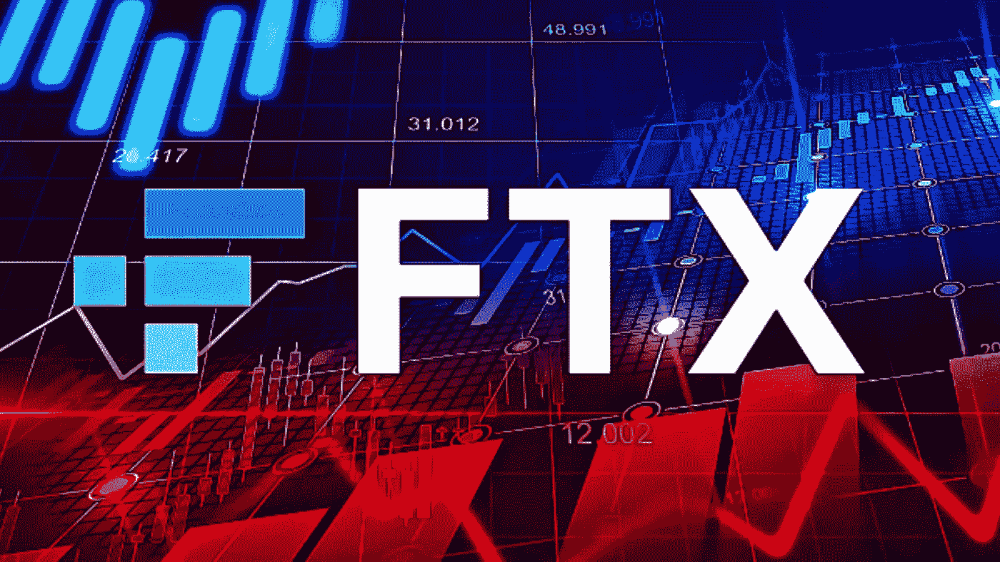
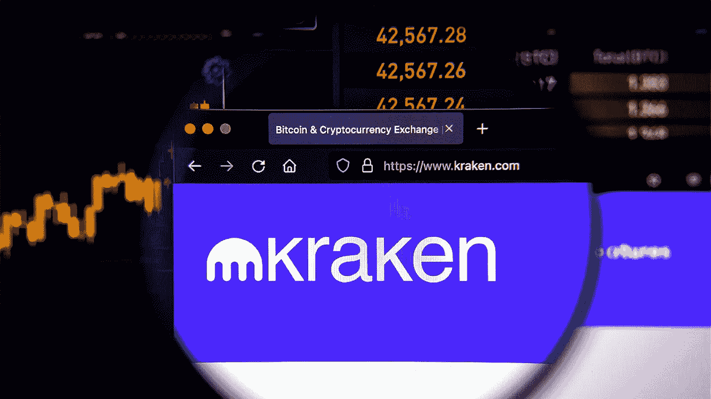
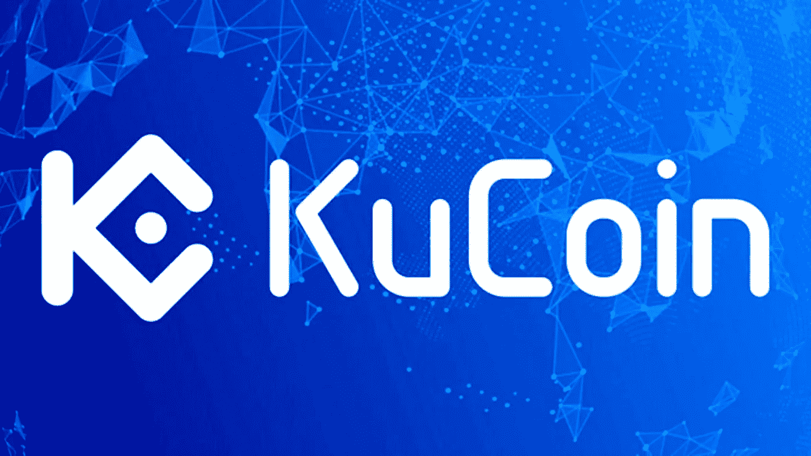

# 顶级加密交易所-2022 年 6 月

> 原文：<https://medium.com/geekculture/top-crypto-exchanges-june-2022-63ddff6f5892?source=collection_archive---------14----------------------->

## 在这里，我们解释了截至 2022 年 6 月按交易量排名的顶级加密交易所，这份交易所名单是基于美国、英国和印度等顶级国家。这些加密交易所位于十大加密交易所排名列表中。最佳加密交易平台筛选，并给你的看法。

**Top Crypto Exchanges**

自从它们出现以来，加密货币一直被吹捧为 Web3 生态系统的 kickstarter。几年前，这些另类金融硬币的市值就已经突破了万亿美元大关。虽然加密货币已经成为 Web3 世界的支柱，但加密交易所已经成为大多数 Web3 新手爱好者的切入点。加密交易所是人们可以交易加密货币以换取法定货币的平台。这些平台自比特币时代就已经存在，比特币市场是世界上第一个加密交易所。在这个博客中，我们将看到最佳加密交换的更新列表。

# 顶级密码交易所

**1。** [**币安**](https://bit.ly/3azyZBi)

**Binance is the Top crypto exchange**

币安是近代世界上最大的密码交易所之一。自 2017 年以来，币安在高效的币安区块链上运行，已成为全球日交易量最大的交易所。该交易所为用户提供了许多好处，包括低交易费用、大量加密资产、加密钱包和多因素认证。币安交易所还为其用户提供安全存储、增强的用户控制、高级风险控制和专用支持系统。尽管 Web3 世界因去中心化而繁荣，但币安作为一个集中的加密交换中心，为用户从 Web2 到 Web3 的过渡提供了便利。

**2。** [**比特币基地交易所**](https://bit.ly/3NueFjq)

**Coinbase crypto exchange**

作为 Web3 世界中的另一个顶级加密交易所，比特币基地交易所(或简称比特币基地)是一个远程工作的集中式加密交易所。它成立于 2012 年，是成功运营的最古老的加密交易所之一。就交易量而言，比特币基地交易所是美国最大的加密交易所，因为美国的法规使大多数加密交易所难以运作。比特币基地交易所允许用户交易 10，000 多种加密资产，使其成为可用加密资产种类最多的交易所之一。它在用户中也被认为是一种易于使用的加密交换。

**3。** [**FTX**](https://ftx.us/)

**FTX crypto exchange**

FTX 成立于 2019 年，是一个易于使用的加密交易所，拥有各种加密和交易资产。FTX 为 100 多种加密货币提供现货市场，并出售衍生品、杠杆代币、期货和期权。它的多功能性进一步扩展到法定货币、预测市场(MOVE)和赌注期权，使 FTX 成为投资者依赖的最佳加密交易所。FTX 的交易所和赌注服务被视为加密世界中最好的，因为投资者可以很容易地了解加密赌注和交易的细微差别，以赚取利润。所有这些特质使 FTX 成为顶级密码交易所之一。

**4。** [**北海巨妖**](https://www.kraken.com/en-us/)

**Kraken crypto exchange**

北海巨妖是另一家成立于 2011 年的顶级加密交易所。北海巨妖也是一个易于使用的加密交易所，它列出了 165 种加密资产，包括所有顶级的加密货币和本地令牌。该交易所位于美国，向几乎所有国家提供功能。就容易程度而言，密码交易所是最好的密码交易所之一。北海巨妖还拥有活跃的 NFT 市场和期货交易平台，这使其成为 Web3 用户的多面门户。北海巨妖的一个显著特点是，它为一个 Web3 新手用户提供了很多可以学习的东西，这样他们就可以在行动之前做出明智的决定。

**5。**

****

****KuCoin crypto exchange****

**KuCoin 是最好的加密交易所之一，它具有额外的分散金融(DeFi)功能，如贷款和投资者池。该交易所还提供期货和现货交易选项，这使其成为其他顶级加密交易所的一个重要竞争对手。KuCoin 于 2017 年推出，也是少数几家为用户提供点对点(P2P)交易选项的国际加密交易所之一。该加密交易所还支持通过其 Windvane 门户和 IGO NFT launchpad 平台交易不可替代令牌(NFT ),该平台有助于推出新的 NFT 游戏。**

## **一些结束语**

**因此，2022 年 6 月期间的统计数据显示，就交易量而言，上述 5 个平台是顶级加密交易所。这些密码交易所保持领先地位的原因非常清楚——从长远来看，它们强调的是最终用户。如果你也想建立这样一个以用户为中心的加密交换平台，那就直接找一家专门从事加密交换开发的公司吧。这些公司通常会根据您的要求创建您的加密交换。从长远来看，这种方法可以帮助您的加密交换取得成功。**