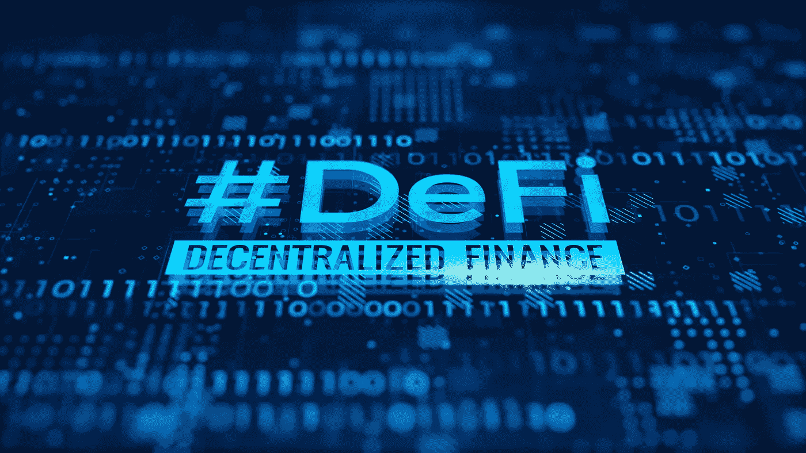
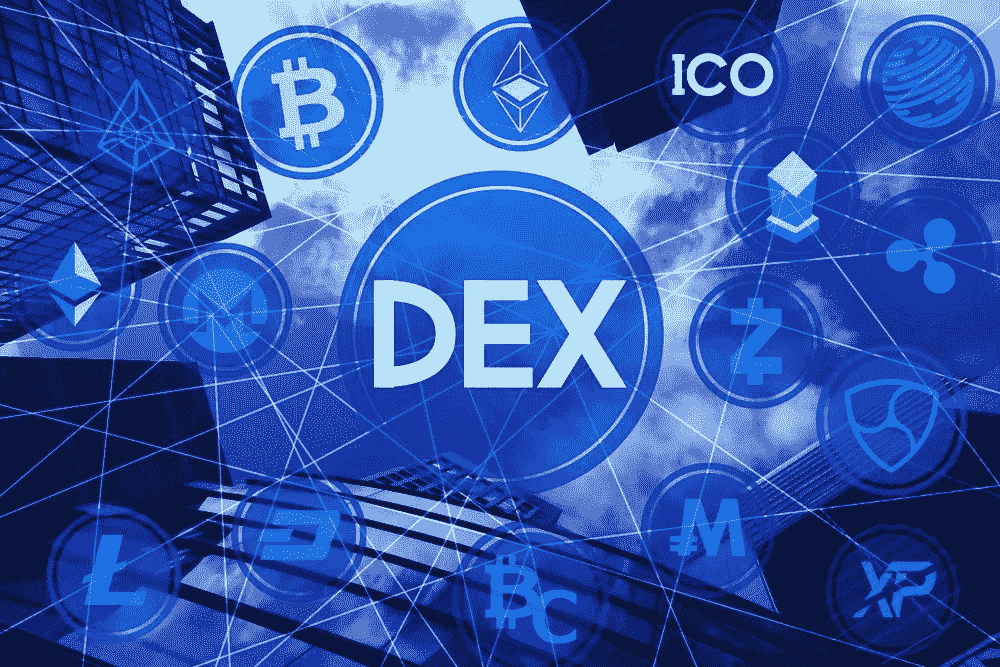
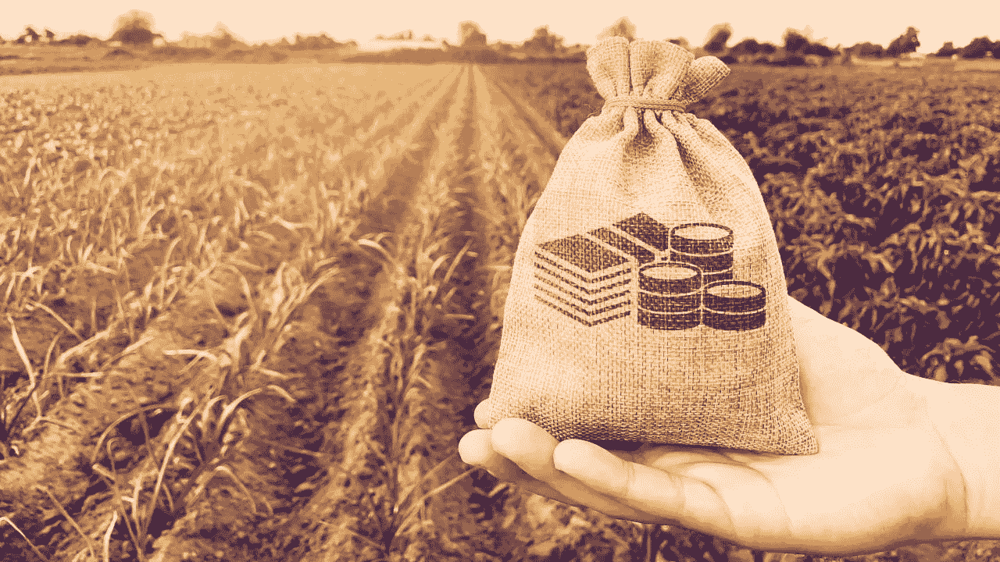

# Defi 领域的顶级 DeFi 趋势

> 原文：<https://medium.com/geekculture/top-defi-trends-in-defi-space-2783287614b7?source=collection_archive---------15----------------------->

随着 Defi 应用程序的推出，传统的金融系统(如加密交易所和银行)已经被改造和重新创建。许多人认为，Defi 是金融业的未来，Defi 完全有可能证明这一说法是正确的。Defi 正在打开更多的金融市场机会，许多人正在投资这项颠覆性技术。

随着越来越多的人开始习惯于 Defi 应用，许多 Defi 产品正在推出。Defi 为企业家和投资者增加收入铺平了道路。如果你想通过启动一个 Defi 应用程序进入 Defi 领域，那么这里有一些最受欢迎的 Defi 应用程序。

## 分散交易所

加密交易所帮助用户买卖他们的加密货币，以换取其他加密货币或法定货币。集中式加密交易所由中介控制平台内部的所有交易，而在分散式交易所中，用户可以在没有中介参与的情况下直接相互交易加密货币。

这使得 DEX 更加强大，用户群庞大。投资去中心化的加密货币交易所开发，可以在 2022 年给你带来更多的 ROI。

Defi Exchange

## Defi 借贷平台

在传统借贷平台中，贷方和买方的资金由中介系统控制。平台上发生的每一个过程仅基于中介的条款和条件而发生。

而在 Defi 借贷平台中，智能合约取代了银行等中介机构。在这里，用户不需要像在传统银行那样披露他们的身份或信用评分来获得贷款，相反，Defi 贷款平台是基于密码的抵押品。

Defi Lending and Borrowing

## 定义打桩平台

Defi Staking 平台允许用户在平台内的密码钱包中保存密码的数量。作为回报，他们会根据持有的密码数量获得奖励。最纯粹的加密赌注包括持有一组基于赌注算法证明的加密资产。人们大量使用 Defi 平台中的赌注来获得奖励和最大化他们的收入。

Defi staking 对企业家来说有一个很大的特点，因为它吸引了许多加密货币用户。 [**Defi Staking 平台开发**](https://maticz.com/crypto-ethereum-staking-development) 或将 Defi Staking 整合到现有的区块链平台中，可以成为 Defi 领域的一个良好开端。

Defi Staking

## Defi 产量养殖平台

Defi Yiled Farming

尽管借贷平台似乎是 Defi 的强大用例，但 yield farming concepts 的推出表明，Defi 的潜力不仅仅在于借贷。用户在借贷协议或流动性池中持有他们的加密资产，以增加平台中的流动性。随着用户通过高产农业平台获得更多回报，这些平台有一个庞大的用户群，因此 [**DeFi 高产农业发展**](https://maticz.com/defi-yield-farming-development) 可以成为一个很好的投资选择。

## 最后的想法

Defi 发展如此之快，高收益的机会也是如此。展望未来，Defi Technology 将继续通过新的分散式金融应用和服务来重塑传统金融产品。