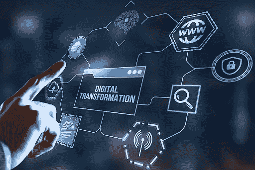
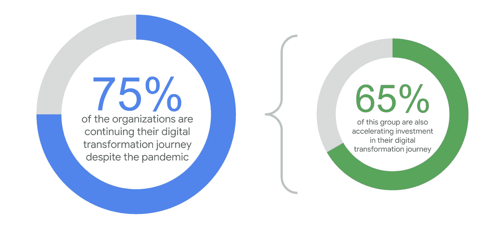
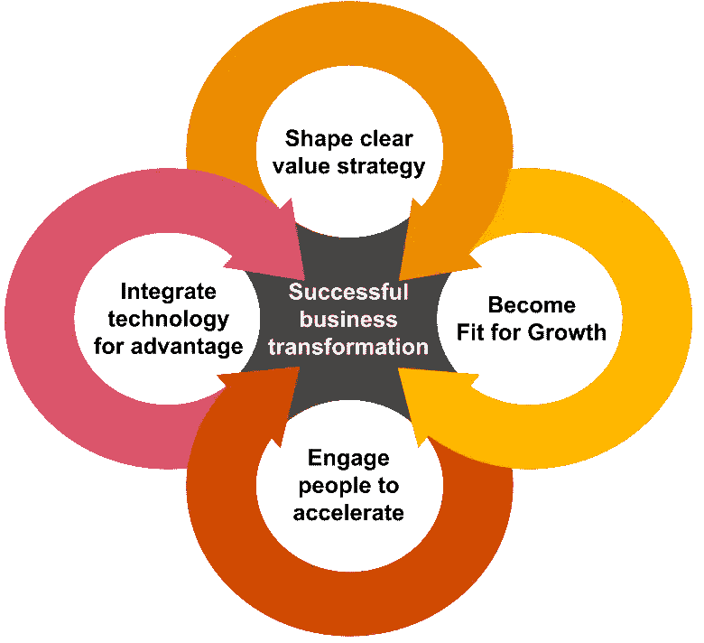

# 业务发展的顶级数字化转型战略

> 原文：<https://medium.com/geekculture/top-digital-transformation-strategies-for-business-development-24b4ffc884dc?source=collection_archive---------15----------------------->

[source](https://innovationatwork.ieee.org/five-ways-to-measure-the-success-of-your-digital-transformation/)

数字时代开启了业务增长的新时代。为了在数字时代竞争，企业需要接受数字化转型。这意味着您的企业需要有一个强有力的数字化转型战略。

数字化转型涉及利用技术来提高绩效和创造新的机会。

根据最近的[报告](https://www.globenewswire.com/news-release/2020/08/14/2078517/0/en/The-World-s-Digital-Transformation-Industry-2020-2025-Trends-Opportunities-and-Competitive-Landscape.html)，预计到 2025 年，世界数字化转型市场将从 2020 年的 4698 亿美元增长到 10098 亿美元，在预测期间的 CAGR 为 16.5%。

数字化转型有不同的方式，最适合您企业的策略将因您的行业和规模而异。

但是这些策略是什么呢？更重要的是，他们如何帮助您的业务？

在这篇博文中，我们将讨论数字时代商业发展的顶级[数字转型战略](https://www.valuecoders.com/blog/technology-and-apps/how-artificial-intelligence-is-redefining-success-of-digital-transformation-strategies/?utm_source=faunpop_digitaltransformation&utm_medium=S05)。我们还将提供成功实施每个策略的技巧。

所以，不管你是刚刚起步，还是想让你的事业更上一层楼，请继续读下去！

但在我们进入细节之前，让我们先了解一下数字化转型。

***亦读*** [***人工智能如何重新定义数字化转型战略的成功？***](https://www.valuecoders.com/blog/technology-and-apps/how-artificial-intelligence-is-redefining-success-of-digital-transformation-strategies/)

# 什么是数字化转型？

数字化转型是将数字技术全面整合到所有业务领域，从而导致企业运营方式和向客户提供价值的方式发生根本性变化。

数字化转型还可能涉及数据和分析，以推动业务决策。通过收集和分析消费者行为的数据，企业可以深入了解如何更好地为客户服务。

归根结底，数字化转型是利用技术实现更好的业务成果。通过简化流程和改善沟通，企业可以提高效率和增强客户体验。

在数字时代，商业发展有几个重要的数字化转型战略。以下是几个最重要的例子:

# 数字时代商业发展的关键策略

Source: PTC

*   **建立在线形象**

在数字时代，拥有一个在线形象对任何企业都是至关重要的。如果你想接触新的消费者并发展你的业务，你需要在网上可见。

建立网上形象的方法有很多，但最有效的几种方法包括:

*   **创建网站**

你的网站是你的数字家庭基地。在这里，观众可以更多地了解你的业务，查看你的产品和服务，并与你联系。

*   **优化搜索**

搜索引擎优化(SEO)帮助您的网站在搜索引擎结果中排名更高。这很重要，因为潜在客户更有可能点击出现在顶部的结果。

*   **使用社交媒体**

Twitter、脸书和 Instagram 等一些流行的社交媒体平台是强大的营销工具。它们为您提供了一种联系潜在和现有客户、分享您的品牌故事以及推广您的产品和服务的方式。

*   **生成销售线索**

一旦你建立了网上形象，你就需要创造商机。有很多方法可以做到这一点，但一些有效的方法包括内容营销，搜索引擎营销和社交媒体广告。

*   **转换导联**

一旦你产生了潜在客户，你需要将他们转化为客户。做到这一点的最佳方式是创建一个销售漏斗，并使用销售线索培育技术。

*   **制定移动战略**

在数字时代，移动就是一切，因为越来越多的人使用智能手机和平板电脑来访问互联网、在线购物以及与朋友和家人保持联系。

为了接触到这些消费者，你需要一个手机友好的网站和应用程序。此外，您需要确保您的移动战略符合您的总体业务目标。

想想你想让你的手机实现什么，然后制定一个计划来实现它。也可以联系任何一家顶级的 app 开发公司，获得高效的 app 开发。

*   **战略和领导力**

Source: Google Cloud

数字化转型不仅仅是技术的整合；这也是战略和领导力的问题。为了取得成功，企业需要有一个与其总体业务目标相一致的清晰的数字转换战略。

他们还需要强有力的领导来指导他们完成整个过程，并确保每个人都参与进来。您还可以联系印度的数字化转型公司，利用世界一流的数字化转型服务。

*   **组织结构**

企业着手数字化转型的另一个重要考虑因素是组织结构。在许多情况下，传统的层级结构会成为创新和敏捷性的障碍。

因此，为了取得成功，企业需要扁平化组织，并创建跨职能团队，这些团队有权做出决策并快速行动。

*   **要实施的技术**

许多技术可以作为业务发展数字化转型战略的一部分来实施。其中最重要的一些包括大数据分析、云计算、物联网、人工智能和区块链。

*   **云计算**

云计算使组织能够在远程服务器而不是本地服务器上存储和处理数据。这使得企业能够节省基础架构成本，并减少部署新应用程序和服务的时间。

基于云的服务通常比传统的内部解决方案更具可扩展性和灵活性。它可以帮助企业降低成本、提高效率和灵活性。

此外，云计算允许企业随时随地访问信息和应用程序。您还可以联系一流的应用程序开发公司，利用[应用程序开发服务](https://www.valuecoders.com/application-development?utm_source=faunpop_digitaltransformation&utm_medium=S05)。

*   **大数据分析**

如今，企业从各种来源生成大量数据，包括社交媒体、网站交互和交易数据。

可以对这些大量的数据进行分析，以提取有价值的见解，帮助组织做出更好的决策并改善他们的运营。

您还可以使用大数据分析工具来识别模式、趋势和相关性，否则很难发现。

*   **人工智能**

人工智能，也称为 AI，是计算机科学的一个分支，涉及创造智能机器。你可以使用人工智能技术来自动化任务，例如客户服务、营销和销售。

此外，你可以使用人工智能来分析数据和预测未来趋势。

随着企业越来越依赖数据，人工智能将成为数字化转型中越来越重要的一部分。也可以联系 app 开发公司，整合 AI 技术，打造高效 app。

*   **物联网**

物联网(IoT)是指连接到互联网的物理设备的不断增长的网络。这些设备可以收集和共享数据，使组织能够实时了解其运营情况。

尽管物联网还处于早期阶段，但它有可能彻底改变企业运营和与客户互动的方式。

*   **区块链**

区块链是一个分布式数据库，允许安全、透明和防篡改的交易。你可以使用区块链来跟踪资产的移动，并验证交易中参与者的身份。

可以使用区块链技术安全存储数据。由于其安全性和透明性，区块链有可能彻底改变企业的运营方式。

此外，这使得它非常适合供应链管理、身份管理和资产跟踪应用。

***也可阅读***[***2022 年 7 大数字化变革趋势***](https://amyrasheldon.medium.com/top-7-digital-transformation-trends-in-2022-that-revolutionize-industries-94c82aac3173?source=your_stories_page-------------------------------------)

# 数字化转型过程

**1。定义数字化转型的目标**

任何数字化转型过程的第一步都是定义计划的目标和目的。该组织希望实现什么目标？有哪些需要解决的痛点？

一旦定义了目标，选择正确的技术和策略来实现它们就变得更容易了。

**2。评估组织的当前状态**

目标确定后，是时候看看组织的现状了。此评估将有助于确定哪些领域需要改进，哪些领域有增长机会。

此外，这是建立基线度量的好时机，基线度量可用于测量转换过程的成功。

**3。制定路线图**

一旦评估了目标和当前状态，就该为数字化转型制定路线图了。该路线图应详细说明实现预期结果所需采取的步骤。

Source: Pwc

此外，路线图应该包括时间表、预算和其他重要细节。

**4。实施技术和策略**

路线图制定完成后，就该开始实施已经选定的技术和策略了。这通常是该过程中最具挑战性的部分，因为让每个人都参与到变化中来是一件具有挑战性的事情。

除此之外，随着新系统的实施，可能会遇到一些困难。

**5。测量结果**

数字化转型过程完成后，衡量结果非常重要。这将有助于确定目标是否实现，并确定需要改进的领域。

因此，这些数据可用于微调未来计划的转换流程。

***也读*** [***如何数字化转型是企业扭亏为盈的决定性因素|知道要领***](https://www.valuecoders.com/blog/technology-and-apps/all-about-digital-transformation/)

# 总结想法

为了确保成功的数字化转型战略，企业必须专注于利用人工智能(AI)、物联网(IoT)和区块链技术等新兴技术。

这些技术具有巨大的潜力来彻底改变企业的运营方式以及与客户的互动方式。通过利用新兴技术，企业可以变得更加高效、安全和以客户为导向。

为了取得成功，定义数字化转型过程的目标、评估组织的当前状态、制定路线图和衡量结果是相对重要的。

通过适当的规划和执行，企业可以成功实现数字化转型，并从这些尖端技术中获益。