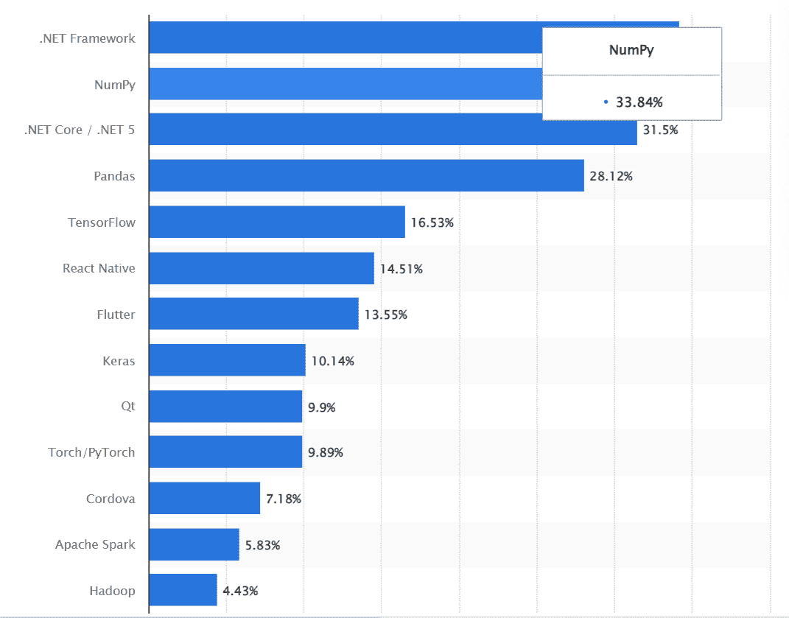

# 提高生产力的顶级点网开发工具

> 原文：<https://medium.com/geekculture/top-dot-net-development-tools-that-increase-productivity-d106a8f70742?source=collection_archive---------14----------------------->

软件开发是一项非常累人的动态活动。每年都会出现新的发展趋势和需求。这就要求 ASP.NET 发展公司不断努力跟上时代的步伐，提高生产力。

效率对于软件开发过程的重要生产力水平是必不可少的。虽然雇佣高技能的. net 开发人员可以完成这项工作，但是生产力工具可以帮助开发人员使这个过程更加有效。

今天让我们讨论一些最好的。net 开发者工具，可以帮助提高[的生产力。net 应用开发](https://www.botreetechnologies.com/blog/pros-and-cons-of-net-application-development/)流程。

**2021 年最常用的库和框架(来源:**[**Statista**](https://www.statista.com/statistics/793840/worldwide-developer-survey-most-used-frameworks/)**)**

# 的好处。Net 开发工具

*   减少部署时间
*   它使跟踪进展或问题变得容易
*   支持远程工作
*   改善沟通
*   提高团队合作和工作质量

> **阅读更多:** [**置顶。NET 开发技能公司在开发人员中寻找**](https://www.botreetechnologies.com/blog/top-dotnet-development-skills-companies-look-for-in-developers/)

# 顶端。Net 开发人员工具列表:

1.  **Visual Studio:**

*   这是一个轻量级但功能强大的源代码编辑器。它有一个非常全面的集成开发环境，每个使用它进行 web 开发活动的软件开发公司都推荐它。
*   这个由微软构建的全功能平台可以从头开始支持开发、编辑和产品部署活动。此外，该工具拥有一个庞大的活跃的开发人员社区。
*   多亏了 Visual Studio Gallery，它包含了代码建议、访问对象定义、代码完成和调试等功能， [net development services](https://www.botreetechnologies.com/blog/net-app-development-services-how-it-evolved/) 发现它非常高效。

**2。NuGET** :

*   它是一个. NET 包管理工具，被软件开发服务用来在[中创建、共享和提取包。NET 框架](https://www.botreetechnologies.com/blog/top-things-know-about-net-6/)。
*   使用 NuGet，您可以创建自己的库，并与社区的其他成员共享。此外，它还允许您在组织内部或跨平台公开共享您的工具。
*   NuGet 提供了许多可能适用于不同项目的包、库和模块选项。在 NuGet 的帮助下，你可以为你的项目探索相关的包。

**3。NCrunch 测试工具:**

*   NCrunch 已经成为 Visual Studio 集成开发环境(IDE)中使用最广泛的单元测试工具。它被[企业软件开发公司](https://www.botreetechnologies.com/software-development-company)用于应用和程序测试。它的优势是在代码开发的同时同时运行几个测试。
*   Net 开发人员可以使用 NCrunch 在编写代码的同时运行自动化测试。这一特性有助于开发人员获得对他们代码的实时反馈，并允许他们同时进行修正。
*   所以很明显，这是最重要的。net 开发人员工具，帮助开发人员实时发现故障。因此，它使代码更加稳定，开发过程更加高效。

**4。努尼特:**

*   它已经成为网络开发人员广泛使用的最好的. net 开发工具之一。该工具的开源框架已经构建好，可以在。NET 编程语言。
*   该工具使开发人员能够同时与其他测试脚本并行运行测试。一个[点网络开发公司](https://www.botreetechnologies.com/dot-net-development-company)可能更喜欢将该工具用于不在微软平台上的应用程序。

**5。实体开发者:**

*   Devart 的这个工具是一个强大的建模和代码生成工具。它是一个对象关系映射(ORM)工具，用于在不兼容的数据存储之间映射数据。它使您能够直观、轻松地设计数据访问层。Devart ORM 的自动生成的代码减少了出错的机会。
*   它提供了许多可视化设计工具和代码开发特性，可以帮助快速设计 ORM 模型，并为它们生成专业的、可扩展的代码。

**6。重剑:**

*   它由 JetBrains 创建，是 Visual Basic 的扩展，帮助开发人员。网络编码。它是最好的工具之一。net 开发者，因为它提供了评估的能力。NET 代码质量，并迅速发现和修正问题。
*   它为所有技术语言提供了足够的支持，比如 C#、JavaScript、XAML、HTML、CSS 等等。
*   ReSharper 是许多 asp net 开发公司的首选，因为它是一个生产力工具，通过性能提供代码的性能优化。它帮助开发人员消除内存泄漏，也可以作为一个单元运行器，一个自行释放的反编译器。

7 .**。LINQPad:**

*   。网络企业爱招[。精通不同点网络开发工具的网络开发人员](https://www.botreetechnologies.com/hire-full-stack-developers)。LINQPad 就是这样一个工具。这是一个支持数据库连接的多功能应用程序。。Net 开发人员在执行 C#编码时使用它。
*   它为每个查询创建新的服务器，这有助于避免单个服务器上的问题之间的冲突，从而避免对其他现有服务或正在运行的应用程序的破坏。

**8。巧克力地:**

*   它是 Windows 的一个软件包管理器，可以免费使用。它是 ASP.NET 快速开发工具之一，能够使用您可能已经在使用的软件开发工具来创建和部署软件包。
*   它兼容所有当前的语言和其他技术，是支持各种 Windows 系统以及云系统(如 Azure 和 Amazon AWS)的 ASP.NET 开发工具之一。

> **阅读更多:** [**公司为什么要用。Net 进行企业 App 开发？**](https://www.botreetechnologies.com/blog/why-companies-use-net-for-enterprise-development/)

# 结论

没有最好的工具，只有最相关的。正确的 ASP.NET 开发工具的选择取决于项目需求和您想要改进开发的哪个方面。不同的工具涵盖了该过程的多个方面，从编码、测试到部署。

开发人员在为[选择合适的构建工具之前需要考虑的重要因素。中的. net 应用程序。NET 或者。NET 核心包括应用程序性能、可伸缩性、代码质量、代码度量等等。此外，开发人员工具必须帮助团队提高开发人员的生产力，或者帮助测试 web 应用程序。](https://www.trickyenough.com/net-for-enterprise-application-development-top/)

根据[报告](https://www.statista.com/statistics/793840/worldwide-developer-survey-most-used-frameworks/)。NET 是 2021 年全球使用最多的库和框架之一，超过 34.2%的开发人员使用它。与此同时，对。NET 开发正在兴起，做出关于。要使用的净生产力工具。

在 BoTree technologies，我们提供全面的。面向全球所有企业的. NET 开发服务。所以如果你看完博客后决定了最好的。NET 开发公司。

[**联系**](https://www.botreetechnologies.com/contact) **我们今天免费咨询。**

*原载于 2022 年 6 月 15 日 https://www.botreetechnologies.com**[*。*](https://www.botreetechnologies.com/blog/top-dot-net-development-tools/)*