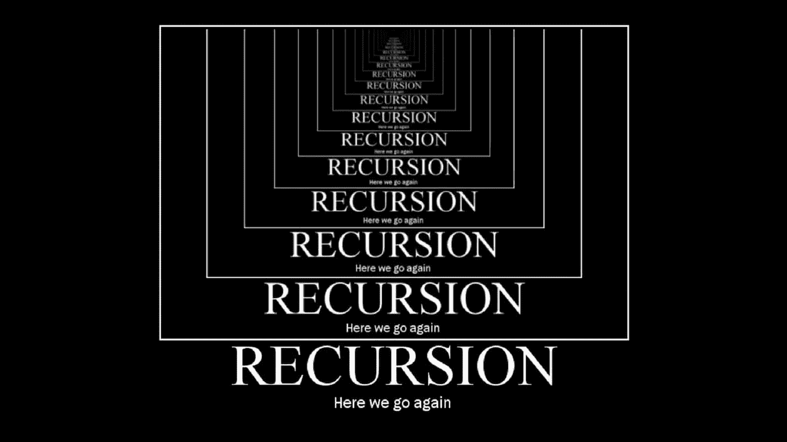

# 自顶向下的动态编程和记忆

> 原文：<https://medium.com/geekculture/top-down-dynamic-programming-memoization-50657f06815a?source=collection_archive---------46----------------------->

picture [source](https://dev.to/agrem28/recursion-in-javascript-goe)

在我的[上一篇文章](/geekculture/overlapping-sub-problems-tabulation-3facae1bc68b)中，我们看到了自下而上的方法或制表来解决问题。在本文中，我们将使用另一种称为自顶向下方法的技术来选择计算斐波那契数列的第 n 个斐波那契数的相同问题。

就像在自下而上的方法中，我们到达问题的底部并解决子问题，然后到达…