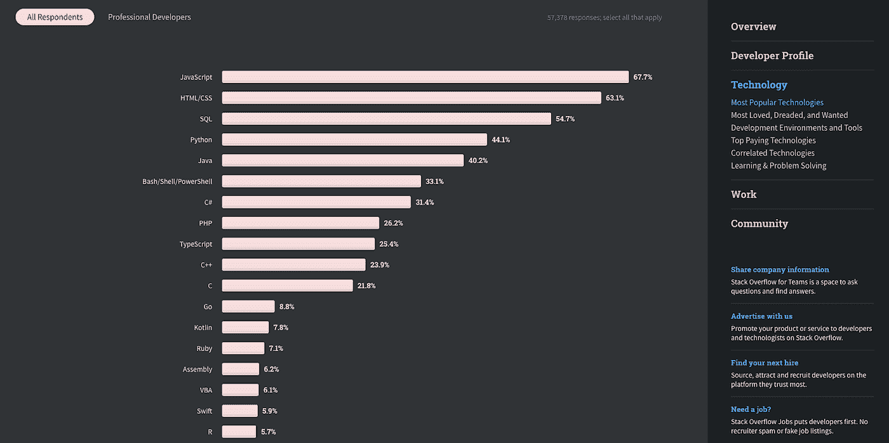
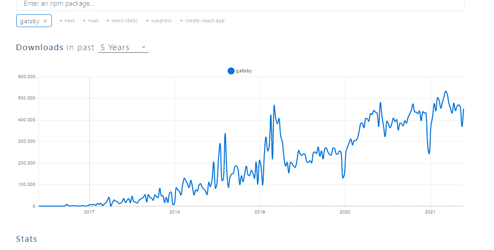
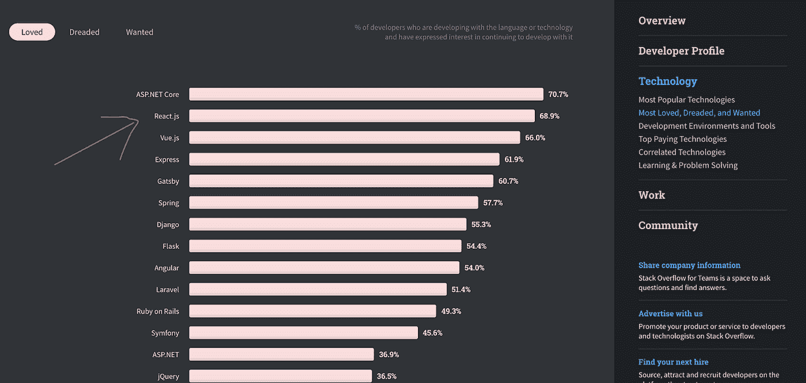
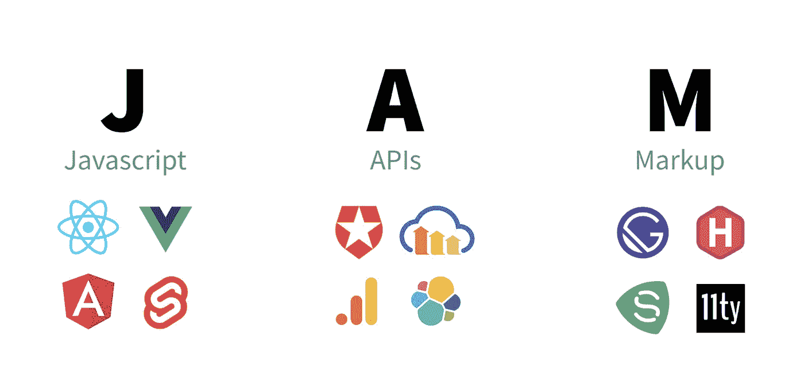

# 2021 年您应该关注的前端发展趋势

> 原文：<https://medium.com/geekculture/top-front-end-development-trends-you-should-follow-in-2021-64d7129fc066?source=collection_archive---------0----------------------->

前端 web 开发标准和趋势的变化速度超过了它们的实现速度。这使得开发者很难将小麦从谷壳中分离出来；时尚中改变游戏规则的趋势。

在这篇博文中，我们分享了我们对 2021 年前端发展趋势的思考和预测。阅读此博客以了解更多关于前端领域的最新信息。您还可以了解这些趋势将如何影响前端格局，以及您的前端开发之旅。

**1。JavaScript 将继续其统治地位**

Credit: 2020 Stack Overflow Developer Survey

JavaScript 每年都在变得更强大。根据 2020 年栈溢出开发者调查，它已经连续八年成为世界上最受欢迎的编程语言。

每天需要 JavaScript 技能的开发服务越来越多。在商业方面，这意味着越来越多的发展伙伴将提供 JS 服务。这种语言是通用的，可以用来实现各种需求。

虽然 JavaScript 仍然处于软件开发的前沿，但新技术正作为 JavaScript 的可能替代品出现。其中一个竞争对手是 Blazor——它是一个框架，允许我们使用 C#创建基于浏览器的应用程序，它已经被称为 JavaScript 杀手。

**2。强大的盖茨比**

Gatsby stats from npmtrends.com

单页应用程序(SPAs)让网络变得更加活跃和强大。然而，spa 的广泛采用有一个严重的障碍。它们对搜索引擎优化不友好，而这对于发展你的在线业务是至关重要的。

为了克服这一障碍，有创造力的头脑集中精力开发独特的解决方案，这就是为什么我们今天讨论盖茨比。Next.js 和 Gatsby 等解决方案的创造者认识到了这一问题，并采取措施加以解决。这就是静态站点渲染(Gatsby)的用武之地。

这主要是因为它提供了出色的开发人员体验。根据[盖茨比市场报告(2021 年 5 月)](https://w3techs.com/technologies/report/cm-gatsby)，盖茨比是增长最快的单一框架。

**3。最受欢迎的框架 ReactJS**

Credit: Stack Overflow survey

毫无疑问，React 将在 2021 年保持其在 JavaScript 框架和库领域的领先地位。

毫无疑问，React 的使用正在显著增加。根据最新的堆栈溢出调查，React 是最受欢迎的 web 框架，68.9%的受访者正在使用它或计划不久使用它。

React 的简单性、速度和最少的代码让我们着迷，这不会限制我们创建具有高用户参与率的 web 应用程序的能力。在处理与界面相关的问题时，像 Airbnb 和脸书这样的大公司依赖 ReactJS。

**4。Jamstack 正在运行**

Credit: freeCodeCamp

Jamstack 是代表 JavaScript、API 和标记的首字母缩写。

它是一种软件架构，使用上述元素来创建安全、可扩展、经济高效且高性能的网站和应用程序。

它是 web 开发世界中的新成员。每天，越来越多的开发者和企业使用这种现代高效的方法来创建网站和应用程序。根据 Frontend 2020 的状态调查，三分之一的受访者已经构建了基于 Jamstack 的解决方案。因此，它在 2021 年被广泛采用是不可避免的。

**5。微前端的啮合功率**

将一个网站或 web 应用程序看作是独立团队拥有的功能的集合，这些团队可以彼此独立工作。

令人惊讶的是，近年来有许多组织采用了这种架构风格。举几个例子，美国运通、宜家、Spotify 和星巴克都是如此。

当我们使用微前端方法时，我们得到了紧凑和内聚的代码库、可扩展的项目和独立的部署。我们不是与大而难的事情作斗争，而是将它们分成小块，并将这些小块的责任分配给特定的人。

**最后的想法**

因此，您已经了解了最有前途的前端框架、语言、架构和概念。在软件技术活跃的世界里，跟上最新的趋势是很重要的。

为了跟上前端开发框架的最新趋势，您是否被众多的选项所淹没？联系我们进行专业咨询，了解如何使用与您的想法相关的前端发展趋势 2021，以及如何将它们付诸行动以创建趋势产品。

**关于银河网络链接**

我们专注于交付端到端的软件设计和开发服务，并拥有流行的前端和后端框架的实践经验。我们的后端和前端工程师还帮助提高安全性、可靠性和功能，以确保您的业务应用程序能够扩展并保持安全。