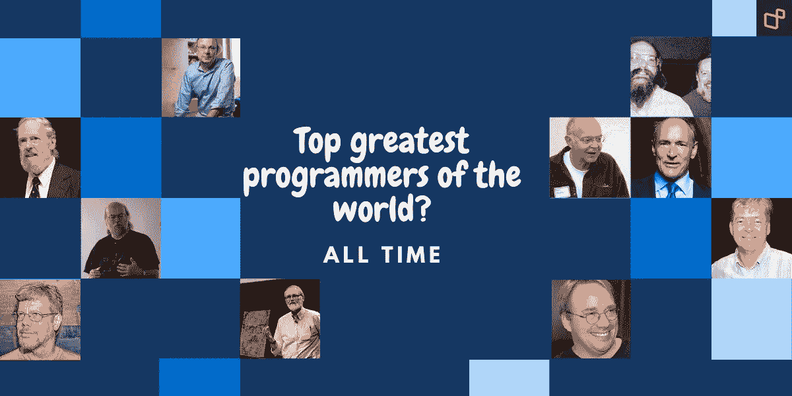

# 史上最伟大的程序员？

> 原文：<https://medium.com/geekculture/top-greatest-programmers-of-the-world-all-time-a662c9da4968?source=collection_archive---------8----------------------->

# **1。丹尼斯·里奇**

丹尼斯·麦卡利斯泰尔·里奇是美国计算机科学家，他“帮助塑造了数字时代”。他和他的长期同事肯·汤普森一起创造了 T2 C 编程语言和 Unix 操作系统。里奇和汤普森于 1983 年获得了美国计算机学会颁发的图灵奖，1990 年获得了 IEEE 颁发的汉明奖章和美国国家技术奖章…