# 印度顶级应用程序开发公司雇佣移动应用程序开发人员

> 原文：<https://medium.com/geekculture/top-indian-app-development-companies-to-hire-mobile-app-developers-33baa27b33bd?source=collection_archive---------16----------------------->

不可否认的是，移动应用市场正在逐步增长，预计将在 2022 年达到 10 亿美元的规模。随着对未来每一件事情都将使用移动应用程序的预测，科技初创公司甚至商业巨头已经得出结论，如果他们真的想在这个激烈的竞争市场中生存，他们需要投资移动应用程序开发解决方案。

当你决定开发一个移动应用的时候，你需要寻找有经验的移动应用开发者来推销你的应用理念。

由于每一个推出应用程序的计划，初创公司都有许多与营销、收入回报等相关的期望，因此，选择正确的应用程序开发团队来证明你的期望是至关重要的。但当你进入市场时，全球有超过 100 万的移动应用开发者，为你的项目选择最好的一个是非常困难的。

好像你站在海洋中，脑子里有一个想法，并且已经想象出它将如何在现实中实现。但是在某个地方，你陷入了一个两难的境地，不知道去哪里雇佣一个移动应用开发者，也不知道你实际上需要在一个移动应用中寻找什么。

作为一家领先 IT 公司的顾问，并拥有 12 年以上的行业经验，我们在这里分享一个专业提示，以找到美国、印度和迪拜最好的应用程序开发公司。

**以下是帮助你找到顶级印度移动应用开发者或程序员的关键参数:**

*   公司简介及其多元化
*   员工实力及其处理不同复杂项目的知识
*   最新技术和方法的经验
*   工作组合和客户满意度与保留率
*   对以前项目的评级和评审
*   质量工作的平衡，开发时间表和每小时的价格
*   严格的 NDA 协议和其他 app 安全措施
*   项目透明，按时报告项目进度
*   可靠的跟踪记录和准时的项目交付

考虑到这些关键参数和市场趋势，我们在印度、美国和迪拜列出了一些领先的移动应用程序开发公司，在这些地方，您可以雇佣到最好的印度移动应用程序程序员。

> 顶级公司在印度、美国和迪拜雇佣印度程序员和开发人员

## 1.[**Xicom Technologies**](https://www.xicom.biz/)**(获得认证的移动应用程序开发公司聘请最好的印度程序员)**

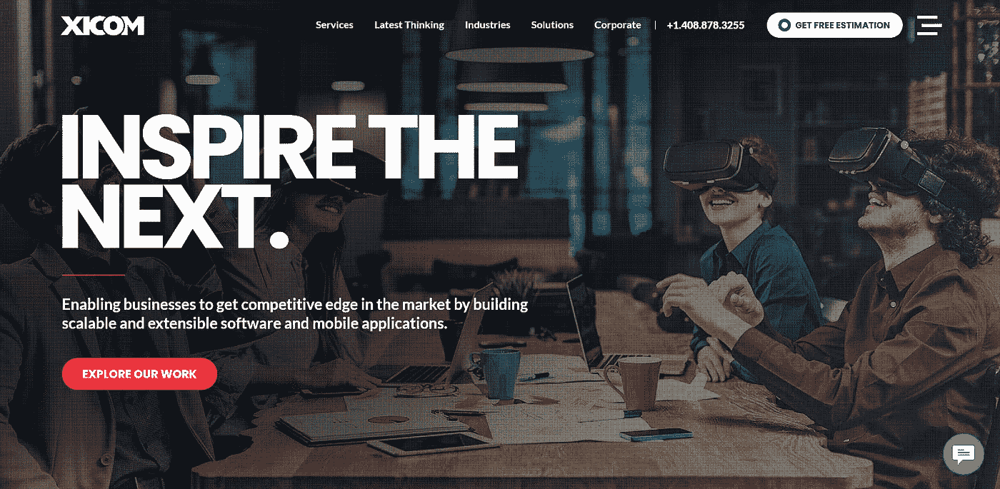

**地点**:印度、美国、迪拜

**员工:** 350 以上

**价格:**20 美元/小时

***服务:*** *手机 App 开发，跨平台 App 开发，PHP 开发，Java 开发解决方案，Web 应用开发，定制软件开发解决方案，实时 App 开发解决方案，。NET 开发解决方案、React 原生应用程序开发、云开发和维护、质量保证和应用程序测试等等。*

凭借在制作高级移动应用程序方面 15 年以上的领域经验，Xicom Technologies 已成为印度领先的移动应用程序开发公司。无论您是需要雇佣最好的印度程序员，还是想要定制移动应用程序，Xicom Technologies 都可以成为您满足所有开发需求的一站式平台。在 350 多名技术高超、经验丰富的应用程序开发人员的支持下，他们允许您构建快速、现代和可靠的应用程序，给用户留下持久的印象。

> **仍然想知道为什么 Xicom Technologies 是一个完美的选择？以下是 Xicom 的主要亮点:**

*   确保退款保证和项目满意度
*   遵循标准沟通流程，在整个项目过程中保持项目透明度
*   遵循敏捷开发方法，确保实时应用开发更新
*   按时交付项目，不影响质量
*   通过采用新兴技术的优点，提供卓越的质量保证

## 2.[**【Agloworks**](https://www.algoworks.com/)**(印度顶级移动应用开发公司之一)**

**地点:**印度

**员工:** 250 以上

**价格:**99 美元/小时

***服务:*** *移动和 web app 咨询服务，移动 app 开发，咨询和评估服务，UI/UX 设计，定制 app 开发服务，区块链 App 开发等等。*

Agloworks 植根于移动应用程序开发解决方案超过 13 年，已经在 IT 行业树立了标杆。他们以印度为基地，在加拿大、多伦多、加利福尼亚等地设有分支机构。他们花了十年的时间为创业公司、中小企业或领先企业开发应用程序，获得了 99%的客户保留率。如果您正在考虑雇佣最好的印度移动应用程序开发人员，那么 Algoworks 将是一个值得考虑的终极平台，因为他们提供从企业移动应用程序开发到软件产品工程的完整服务，旨在实现 100%的客户满意度和产品的高质量。

3.[**nine hertz**](https://theninehertz.com/)**(印度最好的手机 App 开发公司之一)**

**地点:**美国印度

**员工:** 200+人

**价格:**70 到 99 美元/小时

***服务:*** *iOS 移动应用开发服务、可穿戴应用开发解决方案、PHP 开发、MEAN Stack 开发解决方案、游戏应用开发、低代码开发解决方案、大数据、基于 VR 的应用开发等等。*

自 2008 年成立以来，NineHertz 通过开发最新的技术、成熟的策略和敏捷开发方法，不断提升自己的进度。在 200 多名高技能开发人员的支持下，他们可以很容易地理解组织的议程，并与客户建立长期健康的关系。

然而，由于他们致力于提供高质量的解决方案，来自世界各地的组织更喜欢雇佣始终相信为客户需求提供价值的印度应用程序开发人员。此外，为了让客户在竞争中保持领先，他们更喜欢采用 AR/VR、分析、物联网等现代技术。

## 4. [**Techugo**](https://www.techugo.com/) **(值得信赖且最优秀的印度移动应用开发公司之一)**

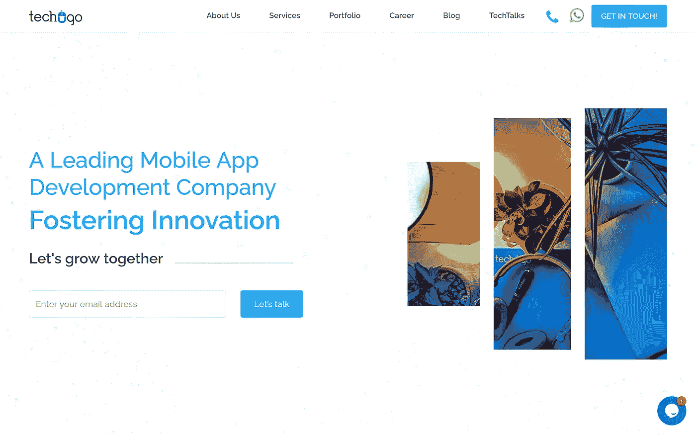

**地点:**美国印度

员工: 250 以上

**价格:**$ 99/小时

***服务:*** *Android app 开发解决方案，PHP/Node JS 开发，app 测试，可穿戴 app 开发解决方案，区块链 App 开发，Ionic App 开发等等。*

Techugo 是印度领先的移动应用程序开发公司，在美国设有运营办公室，致力于促进应用程序开发解决方案的创新，并致力于满足客户不断增长的需求。通过优先考虑质量和客户需求，他们精心设计了 475 个以上的解决方案，在六年内为 150 多个客户赢得了 2200 多万用户。在短暂的工作旅程中，他们被公认为印度最好的移动应用程序开发公司，并在每日明星英国和海湾新闻中亮相，在发布的第二天就获得了 5000 次下载。

## 5.[**【Openxcell】**](https://www.openxcell.com/)**(首创移动 App 开发解决方案)**

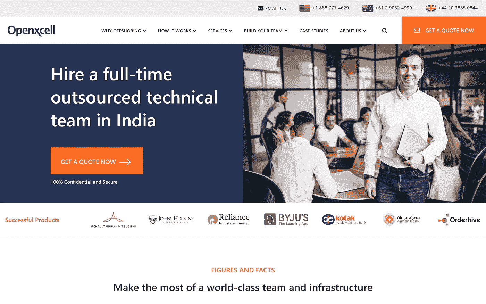

**地点:**美国印度

员工: 250 以上

**定价:**$ 75–99/小时

***服务:*** *定制应用开发解决方案、移动应用开发服务、UI/UX 设计、web 开发服务、AI 和 ML 开发解决方案、区块链和物联网应用开发服务、电子商务应用开发解决方案等等。*

Openxcell 是印度招聘最优秀移动应用程序开发人员的领先资源，因为他们提供 IT 行业的顶级人才。他们有一群技术高超的移动应用程序开发人员，通过遵守严格的时间表和高质量的交付成果，努力创造优质的品牌形象。他们以客户为导向的工作模式和灵活的支付模块使他们变得可靠和容易接近。

此外，他们在美国和印度的全球存在，使组织更容易雇用最好的应用程序开发人员，他们可以将您的应用程序想法转化为解决方案，就像您想象的那样推向市场。您可以在 OPenxcell 雇佣最优秀的印度应用程序开发人员，因为他们利用最新的工具、技术、方法和策略来构建移动应用程序解决方案。

## 6.****(全球公认的印度领先移动应用开发公司)****

**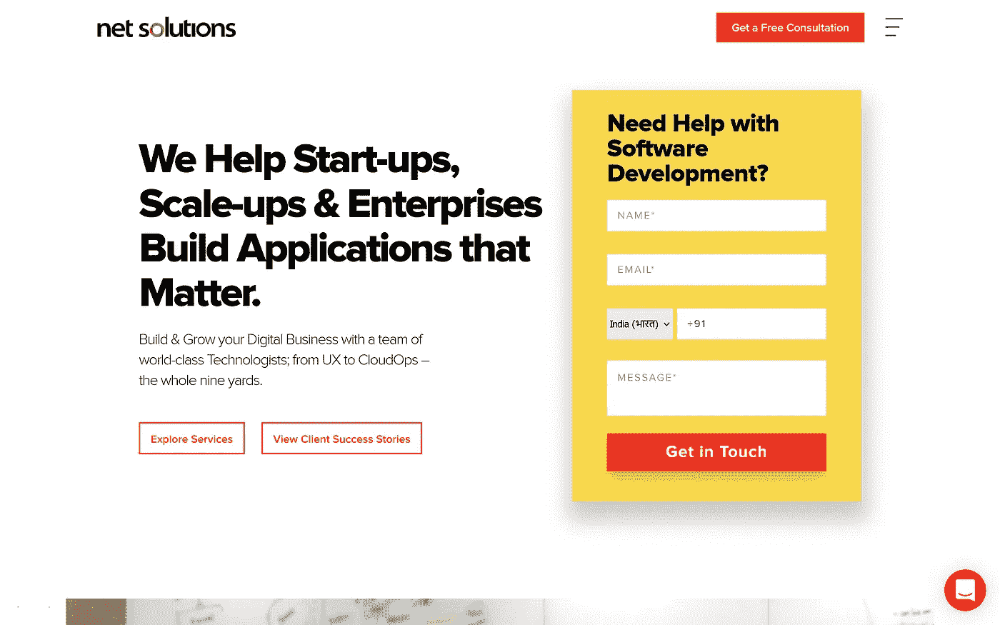**

****地点:**印度、美国、加拿大、英国**

****员工:** 450 以上**

****定价:**$ 99/小时**

*****服务:*** *移动应用开发解决方案、质量保证和测试解决方案、定制应用开发服务、视频流应用开发、SaaS 开发、PHP 开发、Python 应用开发、Magento 应用开发等等。***

**凭借二十年的移动应用开发经验，Net Solutions 已经在行业中建立了坚实的基础。无论你是一个成长中的初创企业还是一个有着复杂开发需求的企业，Net Solutions 都有一群工程师和程序员来推动你的成功。**

**成为印度最受好评的全球知名移动应用开发公司之一，为您提供市场领先的解决方案。此外，为了与客户建立持久的关系，他们在整个开发阶段保持遵循标准沟通流程的一致性。**

## **7.[**Radiansys Inc .**](https://www.radiansys.com/)**(顶级全栈开发公司)****

**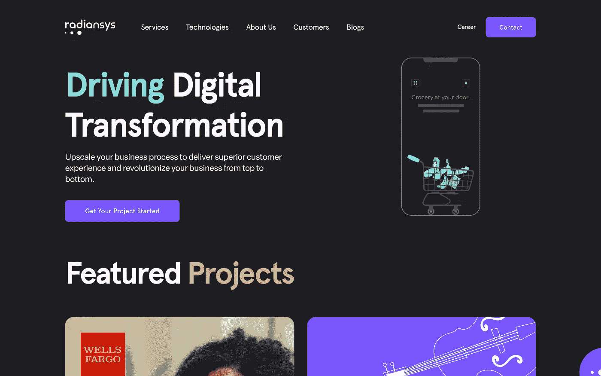**

****地点:**印度，美国**

**员工人数: 250 人以上**

****价格:**$ 25–49/小时**

*****服务:*** *移动应用开发，全栈开发服务，UI/UX 设计，线框，Python 开发解决方案，Laravel 应用开发解决方案，线框开发等等。***

**Radiansys Inc .是美国领先的银行、保险和零售公司的主要软件实施合作伙伴。他们遵循敏捷开发，并有一个定义良好的过程，以便他们能够快速满足行业标准，并确保以可承受的外包价格提供高质量的解决方案。**

**他们的主要目标是提升您的业务流程，提供卓越的客户体验，彻底改变您的业务。你可以在 Radiansys 雇佣一名移动应用程序开发人员，因为他们通过一个卓越的战略团队，从构思、创造到优化，一直遵循确定的业务流程。**

## **8. [**Spec 印度**](https://www.spec-india.com/) **(世界知名软件开发服务公司)****

**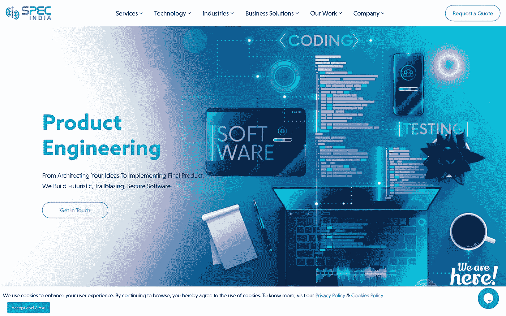**

****地点:**美国印度**

****员工:** 250 以上**

****定价:**$ 65–99/小时**

*****服务:*** *商业智能和分析、企业移动性、按需移动应用开发解决方案、软件测试和分析、定制软件开发、产品工程、技术顾问等。***

**Spec India 在应用程序开发解决方案领域拥有超过 30 年的从业经验，是印度领先的移动应用程序开发公司之一。凭借高技能的移动应用程序开发人员，他们拥有帮助企业通过高度安全和量身定制的以业务为中心的创新解决方案实现从物理到数字转变的专业知识。在他们 30 多年的旅程中，他们组建了一支由 300 多名工程师组成的团队，专门研究最新技术，因此聘请最好的印度应用程序开发人员将是一个完美的选择，因为他们可以融合多年的经验和协作能力来克服业务挑战。**

## **9.[**ARKA software**](https://www.arkasoftwares.com/)**(印度最好的移动应用开发公司)****

**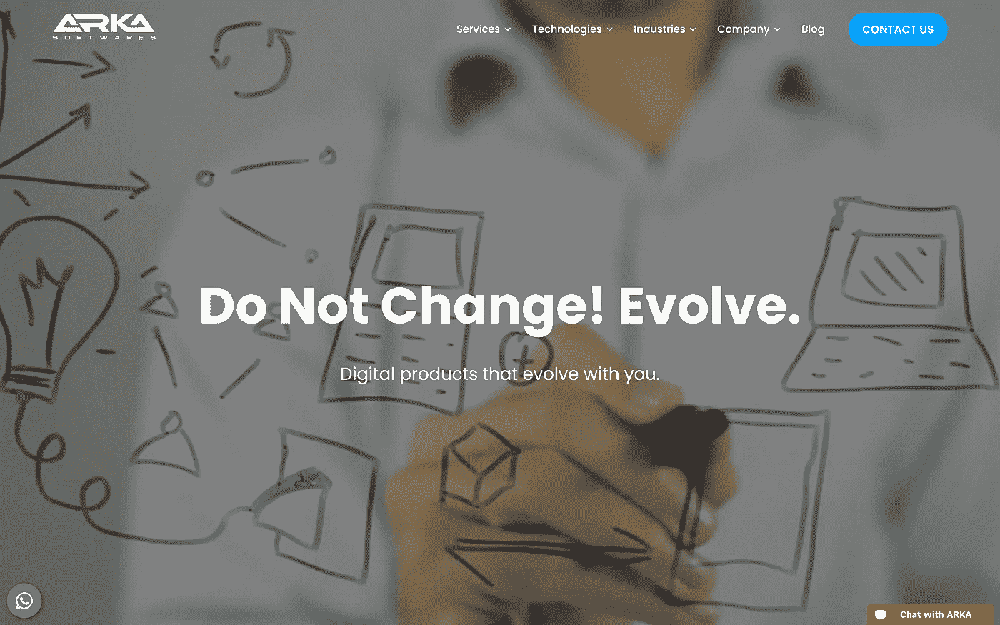**

****地点:**印度、英国、澳大利亚、美国**

**员工人数: 250 人以上**

****定价:**$ 75–99/小时**

*****服务:*** *Android 应用开发、iOS 应用开发、混合应用开发、AI 应用开发、物联网接口开发、软件顾问、原型和概念开发、基于 AR 和 VR 的应用开发等等。***

**ARKA Software 是 ISO 9001:2015 认证的领先移动应用开发公司，通过实施成熟的技术和最新的技术，为企业量身定制解决方案。拥有 100 多名充满激情的开发人员和设计师，他们可以轻松应对项目的复杂性，并通过创新驱动的解决方案为企业提供支持。**

**自 2010 年成立以来，他们一直致力于超越传统方法，将现代业务挑战降至最低。因此，如果你选择 ARKA 聘请最好的移动应用程序开发人员，那么这对你的组织来说将是一个富有成效的决定，因为他们支持超出你预期的服务。**

## **10. [**Sparx IT 解决方案**](https://www.sparxitsolutions.com/) **(印度领先的移动应用开发公司)****

**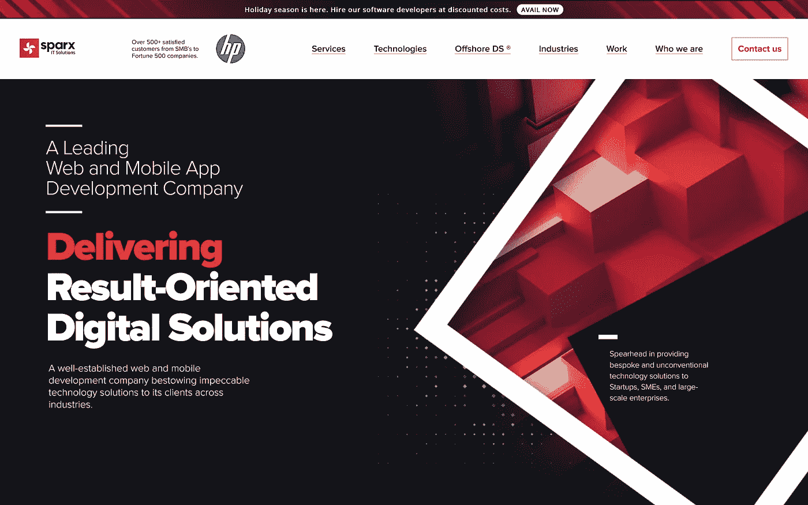**

****地点:**印度，美国**

****员工:** 250+人**

****定价:**$ 25–49/小时**

*****服务:*** *电子商务 app 开发、Magento 开发解决方案、Web 开发服务、区块链开发服务、app 开发解决方案中的数据智能、Flutter app 开发、React Native app 开发服务、渐进式 Web App 开发服务、人工智能和 ML 解决方案等等。***

**Sparx IT Solution 是一家久负盛名的 web 和移动应用程序开发公司，提供无可挑剔的技术驱动型解决方案，助您快速取得业务成功。由 250 多名热情的开发人员支持，他们可以确保为各种业务提供以结果为导向的解决方案。他们简单的座右铭是提供端到端的开发服务，提供动态的当代技术，如区块链，物联网，AR，VR，人工智能，大数据和机器学习，以促进企业的在线成功，尽管从 Sparx It Solutions 聘请印度的移动应用程序开发人员是有意义的。**

## ****11。**[**【AppIt Venture】**](https://appitventures.com/)**(印度一家领先的移动应用程序开发公司招聘程序员)****

**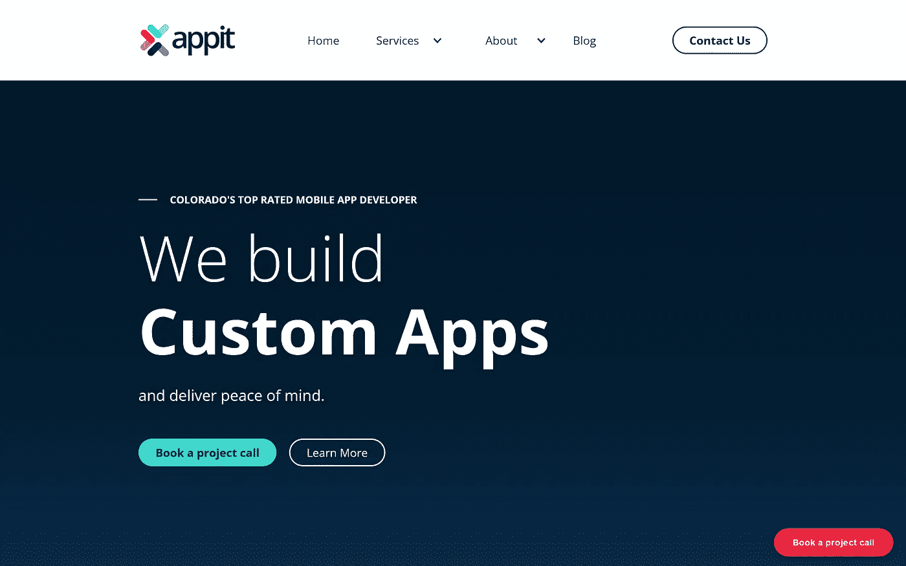**

**地点:美国印度**

**员工:50 岁以上**

****定价:**$ 100–125/小时**

*****服务:*** *定制软件开发、移动 app 开发、web app 开发、数据库、服务器和 API 开发、商业智能和人工智能在 app 开发、UI/UX 设计开发等等。***

**AppIt Venture 是全球公认的印度领先的移动应用程序开发公司之一，致力于提供数百种卓越品质的应用程序和定制软件解决方案，满足从本地初创公司到企业级公司的客户需求。他们的开发团队在整个开发过程中遵循正确的策略和方法。**

**为了在整个开发过程中与客户保持透明，他们遵循标准的沟通模式。你可以在印度从 AppIt Ventures 雇佣一名移动应用程序开发人员，因为他们掌握着国际技术趋势的脉搏，并允许他们的团队昼夜不停地工作，始终将客户放在竞争的第一位。**

## ****12。**[**9 series Inc**](https://www.9series.com/)**(全球值得信赖和更新的移动应用开发公司)****

**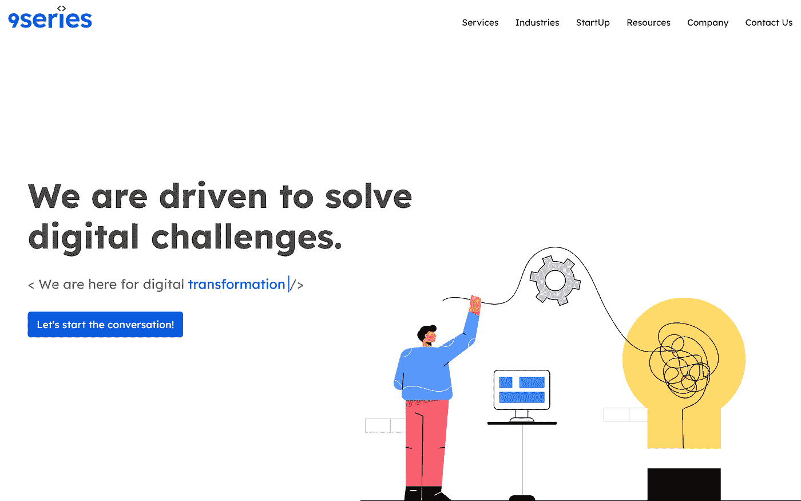**

****地点:**印度、美国、加拿大**

****员工:** 250 以上**

****定价:**$ 99/小时**

*****服务:*** *区块链 app 开发、AR、VR 开发、物联网解决方案及服务、SWIFT app 开发解决方案、React-Native app 开发、Flutter app 开发、Python app 开发服务、全栈 app 开发等等。***

**9series Inc 是一家卓越的移动应用程序开发服务公司，成立的目的很简单，就是为全球客户提供高端优质的解决方案和服务。自 2007 年成立以来，他们采用了创新的解决方案，并通过获取最新技术来构建无与伦比的高质量解决方案。**

**无论您的业务需求有多复杂，它们都能将您的业务转变为数字化解决方案。由于受到世界领先品牌的信任，各种组织都更喜欢从 9series Inc .雇佣印度移动应用程序开发人员，因为他们了解现代市场不断变化的需求，尽管他们在不牺牲质量的情况下快速开发解决方案，并确保业务成功。**

## **13。 [**认知云**](https://www.cognitiveclouds.com/) **(印度一款更新的移动应用开发)****

**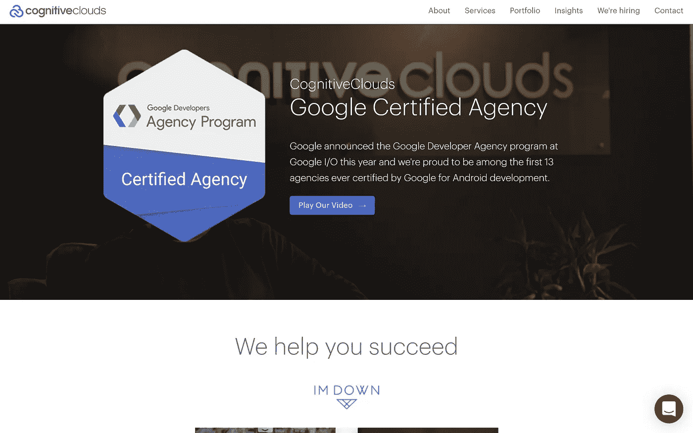**

**地点:印度、美国、加拿大**

****员工:** 250 以上**

****价格:**$ 75/小时**

*****服务:*** *定制 app 开发解决方案、React Native app 开发、Web app 开发、电商移动 app 开发解决方案、聊天机器人 app 开发、Python app 开发、Laravel app 开发等等。***

**认知云成立于 2012 年，其简单目标是通过连接新兴技术和客户需求之间的点来提供卓越的应用程序开发解决方案，从而提供令人愉快的互联体验。无论他们开发了多么出色的应用程序，他们都以客户的成功来衡量他们的成功。**

**从帮助初创企业到扶持领先企业，他们已经建立了卓越的解决方案，帮助企业以最快的方式取得进展。为了提供以结果为导向的解决方案，他们利用成熟的流程将您的第一个产品版本带到终点，并让您见证成功。**

## ****14。**[**code wave Technologies**](https://codewave.com/)**(印度领先的移动应用开发公司)****

**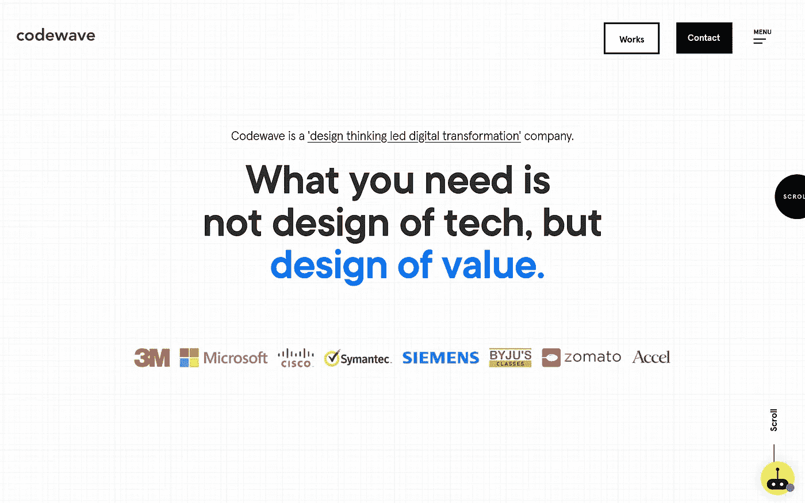**

****地点:**印度、美国、加拿大**

****员工:** 250 以上**

****定价:**$ 25–49/小时**

*****服务:*** *Web app 开发服务、移动应用开发服务、云开发、企业人工智能和机器学习、机器人流程自动化服务、区块链开发服务等等。***

**Codewave 是一家新成立的移动应用程序开发公司，专注于数字化转变业务设置，并帮助企业在不同的商业垂直领域开发可扩展的 web 和移动应用程序。Codewave 成立于 2013 年，目标是将设计思维带到印度，让每场演出都成为 UX 主导的演出。Codewave Technologies 可以帮助你雇佣印度最好的移动应用开发者。他们通过真诚地评估应用程序开发需求，在您的应用程序开发需求和成功之间架起一座桥梁。**

## **15。 [**灰链**](https://greychaindesign.com/) **(印度顶级手机 App 开发公司之一)****

**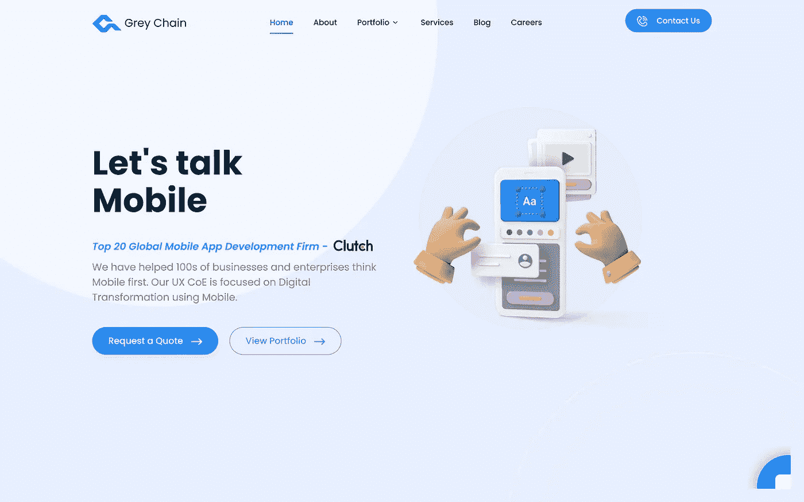**

****地点:**印度、美国、迪拜**

****员工:** 50 岁以上**

****价格:**$ 25–49/小时**

****服务:** iPhone 应用程序开发、Flutter 应用程序开发、混合应用程序开发、DevOps 实施、云迁移、用户体验研究等。**

**Grey Chain 是一家值得信赖的移动应用程序开发公司，在美国、德国、比利时、英国、菲律宾、迪拜等地都有业务。他们的全球存在使得组织更容易为他们的项目雇佣最好的移动应用开发者。**

**他们的总部设在美国，在印度有一个世界一流的交付中心，拥有 50 多名技术工程师，因此您可以雇佣最优秀的印度开发人员来获得世界一流的解决方案。他们相信提供符合您的要求、预算和时间表的服务。在三大、四大和全球银行专家的支持下，他们的团队拥有经验丰富的主题专家。**

# ****结论****

**如果你最终决定建立一个移动应用程序，以保持你在未来几十年的市场地位，那么这是与印度最好的移动应用程序开发公司合作的正确时机。虽然有数千家移动应用程序开发公司提供应用程序开发服务，但在最佳选项之间进行选择始终是一项具有挑战性的任务，尽管我们已经创建了一个最佳应用程序开发公司列表，使您能够以可承受的成本雇佣最好的印度应用程序开发人员。应用程序开发人员的每小时成本可能会因应用程序类型的复杂性而异，因此值得向专家预约咨询时间。**

**此外，如果你觉得我们没有添加任何值得在本博客中列出的移动应用程序开发公司，那么你可以在下面发表评论。我们的专家团队将在列出配置文件之前使用列出的参数对其进行评估。**