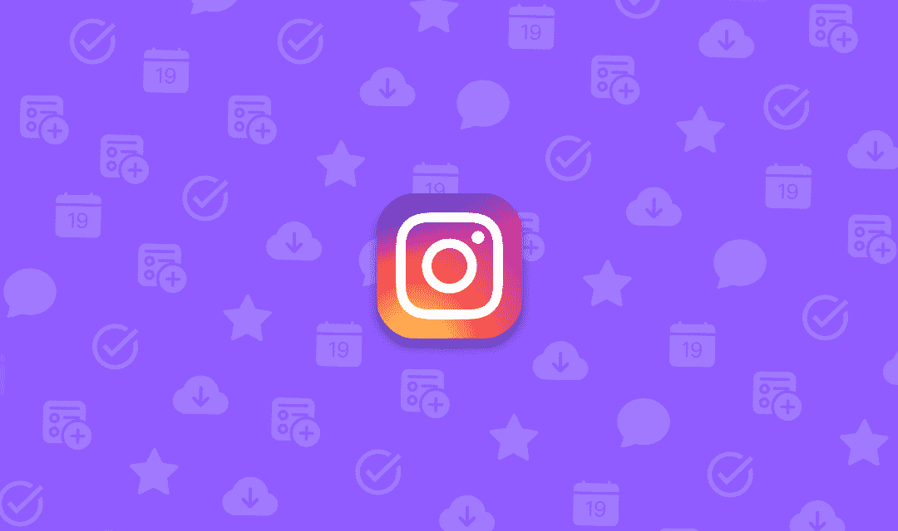
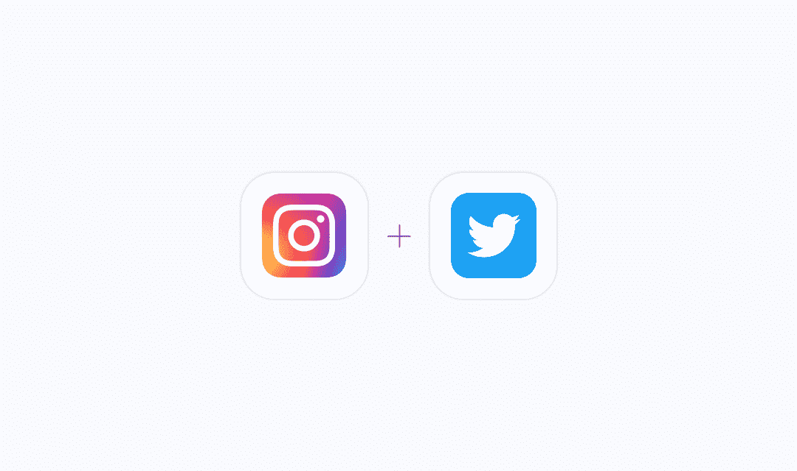
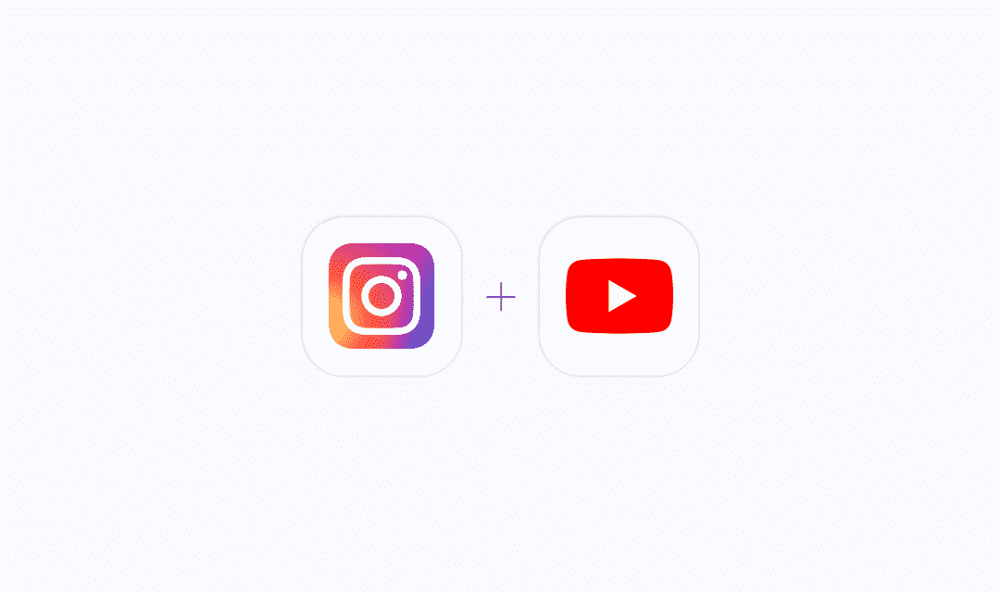

# 2022 年热门 Instagram 工作流

> 原文：<https://medium.com/geekculture/top-instagram-workflows-of-2022-a5ee603fc0fb?source=collection_archive---------22----------------------->

Instagram 是一个流行的社交媒体应用程序，通过消息传递、音频通话、视频聊天、每日故事、IGTV、卷轴等将世界各地的人们联系在一起。它有助于建立以生活方式和趋势为特色的艺术作品集，并允许个人追随个人兴趣、魅力、商业偶像、政治领袖、运动员等。

Instagram 的视觉方面使其区别于其他社交网络。如果你的企业从你的产品设计中受益，或者你提供的服务有明显的效果，那么 Instagram 是推广内容的理想媒介。

以下是使用 [Quickwork](https://bit.ly/3469Bk3) 的最好的 [Instagram](https://quickwork.co/apps/instagram/integrations) 工作流程，可以增加你的收入。

1.  **Instagram +脸书整合**

**在你的脸书个人资料上分享最新的 Instagram 帖子。**

将照片从 Instagram 分享到脸书页面非常简单。这种连接会自动将最新的 Instagram 照片上传到脸书页面。

**在您的脸书页面上分享您的 Instagram 帖子。**

这种集成会自动将 Instagram 照片以文本发布的形式上传到你的脸书页面。你不用再把你的 Instagram 照片信息复制粘贴到脸书了。

**在你的 Instagram 账户上制作新媒体的脸书页面视频。**

当你在社交媒体上发布视频材料时，你很可能希望它在另一个社交网站上被分享。当新媒体添加到你的 Instagram 账户时，这种整合会立即创建一个脸书页面视频。在所有社交渠道中分享从未如此简单。

**2。Instagram + Twitter 整合**

**自动将 Instagram 照片分享到 Twitter**

那么这个 Instagram 到 Twitter 的组合就是为你准备的。经过一次性配置后，所有新的 Instagram 帖子将自动上传到您的 Twitter 帐户。

**用 Instagram 上的新帖子发推文。**

利用这种整合，你可以让世界其他地方知道你在做什么。它从你的 Twitter 账户发布推文，并复制你的 Instagram 媒体更新。你的 Twitter 粉丝将会像你的 Instagram 粉丝一样保持更新。

**3。Instagram + YouTube 整合**

用 Instagram 上的新帖子发推文。

利用这种整合，你可以让世界其他地方知道你在做什么。它从你的 Twitter 账户发布推文，并复制你的 Instagram 媒体更新。你的 Twitter 关注者将会像你的 Instagram 关注者一样保持更新。

**上传 YouTube 视频到我的 Instagram 账号，进行新媒体更新。**

当您向社交媒体帐户发布新媒体时，您可能想要与您的视频订阅者共享它。当新媒体发布在特定的 Instagram 帐户上时，这种集成会将视频上传到 YouTube。你将不再需要手动上传视频。

既然你知道 Twitter 营销值得进一步探索，为什么不花几分钟时间使用 [Quickwork](https://bit.ly/3469Bk3) 创建你最喜欢的 Instagram 工作流程，帮助你更好地了解你的营销工作呢？