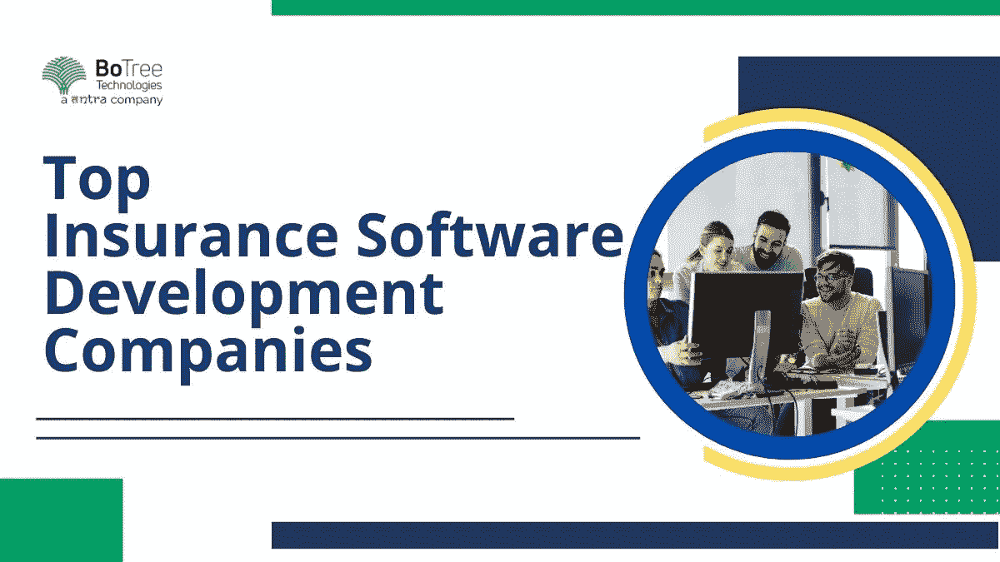

# 全球十大保险软件开发公司

> 原文：<https://medium.com/geekculture/top-insurance-software-development-companies-20e2b8f5bdd8?source=collection_archive---------12----------------------->

保险业正在经历一场大规模的数字化转型。如今，消费者可以在家中使用智能手机和笔记本电脑方便地使用所有类型的保险服务。这之所以成为可能，是因为创新的保险应用。

这种可能性的结果是保险软件开发市场的增长。今天，保险软件开发公司可以构建、再造或修改保险解决方案来满足消费者的需求。

然而，保险软件开发服务并不容易处理。有数百家软件合作伙伴提供类似的保险 app 开发服务。企业如何找到哪一个最适合自己的需求？

# 十大保险软件开发公司

通过考虑公司的经验、投资组合和反馈，任何企业都可以做出明智的决定，决定雇佣哪家 [**保险应用开发公司**](https://www.botreetechnologies.com/insurance-app-development) 。雇佣一家专业的保险应用程序开发公司是很重要的，这家公司应该脱颖而出，提供一些独特的东西来满足客户的需求。

下面是 10 家保险软件开发公司，企业在做最后决定前可以考虑一下——

1.  **博特里科技:**

*   作为领先的 [**企业软件开发公司**](https://www.botreetechnologies.com/enterprise-software-development-company) ，BoTree Technologies 为 B2B 和 B2C 公司开发保险应用程序。该公司提供关键服务，如定制保险软件解决方案、客户管理系统、业务管理解决方案以及支持和集成服务。
*   BoTree 拥有一个由 130 多名团队成员组成的团队，他们通力合作，提供无缝的 web 和保险移动应用。BoTree 是一家 [**高级软件开发公司**](https://www.botreetechnologies.com/) ，在软件行业拥有 10 年的经验。在此期间，它成功交付了 80 多个项目。联系他们的专家，免费咨询保险应用开发。

**2。Ascendix:**

*   Ascendix 是保险软件开发人员中历史最悠久的团队之一，他们将保险领域的创新带到了前沿。该公司通过创建互联保险解决方案来满足保险初创公司、经纪人和供应商的需求。
*   它提供智能的基于云的跨平台保险解决方案来为客户服务。Ascendix 创建现代保险 CRM 系统、索赔处理和管理解决方案，以及卓越的支持和维护服务。它拥有 25 年以上的经验，并拥有一个 150 多名成员的团队。

**3。ELEKS:**

*   作为顶级领先的保险软件开发公司，ELEKS 提供全周期定制保险软件开发服务。它提供定制软件开发、产品设计、数据科学、质量保证、R&D、智能团队以及支持和维护服务。
*   该公司拥有 25 年以上的经验，拥有 1000 多名团队成员。他们主要服务于美国、英国和欧洲的客户。它提供灵活的参与计划，使初创公司和小企业能够以可承受的价格获得高质量的保险应用。

**4。Tntra:**

*   作为 BoTree Technologies 的母公司，领先的 [**软件产品工程公司**](https://www.tntra.io/) ，以及美国、印度和新加坡最好的保险应用程序开发公司，Tntra 提供广泛的保险解决方案。该公司提供比其他保险开发公司更广泛的服务。
*   提供保险 app 咨询、风险分析、流程再造、app 开发、MVP 开发、 [**产品工程**](https://www.tntra.io/engineering) 。Tntra 为创建高质量的保险应用程序提供了一个创新的生态系统。为保险行业的创业公司 和企业提供 [**风险投资**](https://www.tntra.io/blog/new-age-of-venture-funding/) 和 [**孵化。**](https://www.tntra.io/incubation)

**5。切图:**

*   Chetu 是一家专业的保险应用开发公司，拥有拥有多年行业经验的顶尖软件开发人员。该公司为保险提供商、经纪人和客户提供开箱即用的软件解决方案。从拥有功能丰富的应用程序到决定如何进行软件开发过程，Chetu 在所有软件方面都有经验。它已经为 10 多个国家的客户提供服务。
*   该公司提供定制保险软件开发，并为保险行业的现有应用程序提供支持和维护。

6。下一个大技术:

*   Next Big Technology 是一家知名的保险 app 开发机构，拥有一支优秀的内部保险软件开发团队。它为创业公司和企业提供高端的 [**保险网络和移动解决方案**](https://www.botreetechnologies.com/blog/web-app-for-your-insurance-company/) 。该公司采用最新的工具和技术来创建高质量的保险解决方案。
*   该公司在该行业拥有 16 年以上的经验，并拥有一个 100 多名开发人员的团队。Next Big Technology 还为全球客户提供保险软件再造和升级服务。

**7。热心系统:**

*   作为 [**保险移动应用开发服务**](https://www.botreetechnologies.com/blog/5-ways-how-mobile-apps-are-transforming-insurance-industries/) 的值得信赖的合作伙伴，热心系统公司在该行业拥有超过 12 年的经验。该公司拥有一支由 150 多名成员组成的团队，他们拥有创建高质量保险应用程序的技能和技术专长。
*   它与最新的认知技术(如区块链、物联网和人工智能)合作，并提供标准的 It 产品，如应用程序开发、Web 开发、定制软件开发和移动开发。热心系统为创业公司、小企业和企业提供保险应用程序开发解决方案。

**8。Intellias:**

*   作为全球领先公司的热门选择，Intellias 是新时代创业公司的最佳 [**保险应用开发**](https://www.botreetechnologies.com/blog/insurance-app-development-costs-tips/) 公司。该公司为 P2P 门户、客户服务门户、索赔管理系统、文档管理系统、承保软件等提供保险开发。
*   Intellias 帮助公司个性化他们的销售过程，并向客户提供定制的解决方案。从汽车保险到人寿保险，Intellias 为保险行业的所有类别提供软件开发。

**9。CodeBright:**

*   寻找一家领先的保险软件开发公司，可以快速创建 MVP，并将创业公司和小企业的想法付诸实践？CodeBright 就是答案。该公司改进/简化/自动化了业务流程，提高了效率和生产率，降低了成本，解决了业务挑战，等等。
*   它在为保险行业创建动态软件解决方案方面拥有 8 年的经验。该公司与企业、初创公司、小企业和非营利组织合作。其 80%的业务来自对公司服务满意的现有客户。

10。BairesDev:

*   作为专业的保险 app 开发公司，BairesDev 深知 [**数字化转型**](https://www.botreetechnologies.com/blog/tech-capabilities-needed-for-digital-transformation/) 在保险行业的重要性。BairesDev 的保险应用程序开发人员提供一系列软件开发服务。它们推动利润，降低运营成本，并有助于改善客户关系。
*   该公司提供定制应用程序开发、CRM/ERP 平台、自适应报价算法、索赔管理系统、政策合规性软件、风险分析系统和数据分析解决方案。BairesDev 提供了一个专门的软件开发团队，他们是保险公司或企业的内部员工。

## 结论

一个 [**保险软件解决方案**](https://topdigital.agency/how-cloud-based-insurance-solutions-benefit-insurance-administrators/) 可以转变任何保险公司、经纪人或代理人的运营，并为客户简化流程。今天，世界上有数百家保险应用程序开发公司，选择正确的公司可能是一个挑战。上面列出的十大保险应用程序开发公司将帮助企业确定哪一个最符合他们的要求。

[**联系我们**](https://www.botreetechnologies.com/contact) **今天免费咨询。**