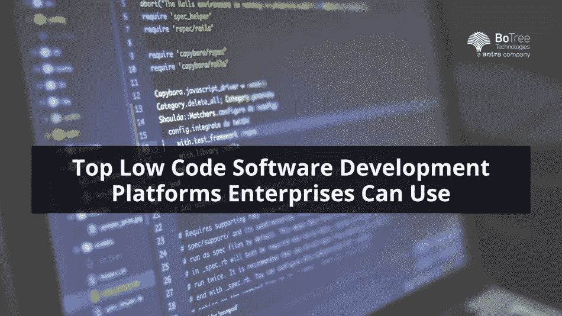

# 企业可以使用的顶级低代码软件开发平台

> 原文：<https://medium.com/geekculture/top-low-code-software-development-platforms-enterprises-can-use-1858de583561?source=collection_archive---------22----------------------->

低代码开发平台正在获得动力。今天，公司正在用创新的技术来构建软件产品。低代码软件开发是创建独特解决方案的新兴方式之一。

低代码软件开发平台最大的好处就是开发速度。企业可以比其他企业更快地发布应用程序，从而快速构建应用程序并获得竞争优势。

让我们看看低代码平台的更多优势。

# 低代码软件开发的好处

不可否认的事实是，公司需要不断创新以保持在市场中的相关性。从头开始构建应用程序可能会花费更多的时间、金钱和精力。这可能会导致该公司的市场份额下降。

> **阅读更多:** [**低代码开发如何解决软件危机**](https://www.botreetechnologies.com/blog/how-low-code-development-can-solve-the-software-crisis/)

低代码软件开发平台的一些好处包括

*   负担得起的应用程序开发，因为没有必要雇用一个专家团队，他们将根据开发应用程序所需的时间收费。(低代码快得多)
*   低代码平台非常容易使用。他们不需要学习复杂的编程语言来构建软件。
*   低代码平台的误差更小，调试更容易。它们不容易出现人为的编码错误。
*   由于低代码导致更快的开发，它将应用程序的产量提高了两倍。公司可以迅速推出新版本的应用程序。
*   低代码软件开发平台提供了应用程序的简单维护。有一些内置的特性可以轻松地维护和修改应用程序。

现在，让我们看看企业可以用于应用程序开发的一些顶级低代码平台。

# 企业可以使用的顶级低代码软件开发平台

如今，有数百种低代码开发平台可供企业使用。这些平台为创建软件解决方案提供了更快、更容易、更无缝的方式。

以下是一些用于创建[定制软件](https://www.botreetechnologies.com/blog/customized-software-what-is-it-types-and-examples/)的顶级低代码平台:

1.  **视觉兰萨:**

*   作为创建企业应用程序最有效的平台之一，Visual LANSA 在创建应用程序的同时提高了工作效率。它提供了广泛的测试和部署控制。开发人员可以在 ide 中编写代码，这使他们能够在编码时轻松地进行更改。
*   Visual LANSA 使开发人员能够比传统的编码方法更快地创建应用程序。这是唯一一个运行 IBMi、Windows 和 web 的平台。

**2。阿皮安:**

*   Appian 包含本地部署工具和集成选项，是一个用于[软件开发过程](https://www.botreetechnologies.com/blog/steps-to-define-software-development-process/)的令人惊叹的无代码开发工具。
*   该解决方案允许与 Jenkins 等 DevOps 工具集成。Appian 是一个创建业务流程管理应用程序的优秀平台。
*   此类应用程序帮助企业优化其流程并实现最大效率。Appian 还有一组内置特性，为 web 应用程序提供安全性和可伸缩性。

**3。微软 PowerApps:**

*   微软 PowerApps 可能是最好的低代码软件开发工具，它提供了企业创建高质量软件所需的一切。它有一个拖放界面，使开发人员能够使用预先构建的组件添加功能。
*   PowerApps 可以无缝处理来自各种来源的数据，包括 Microsoft Excel、SharePoint、OneDrive 和 Azure SQL。
*   PowerApps 在每台设备上提供一致的外观和感觉，使所有用户更容易在所有设备上无缝导航应用程序。

**4。奎西:**

*   一个低代码的软件开发平台，Quixy 是一个基于云的无代码开发平台。创建企业级 web 应用程序来自动化工作流和简化操作非常有用。
*   Quixy 有一个丰富的用户界面，带有一个用于创建应用程序的拖放工具。现成的连接器、Webhooks 和 API 集成允许开发人员将第三方应用程序与平台无缝集成。Quixy 还提供了以各种格式导出数据的选项，并提供了可操作的实时仪表板和报告。

**5。Zoho 创建者:**

*   Zoho 是业界的一个响当当的名字，它有一个令人惊叹的低代码软件开发工具[被称为 Zoho Creator。它是一个基于拖放界面的工具，用于企业在没有全面编码知识的情况下快速开发应用程序。](https://www.botreetechnologies.com/blog/top-software-development-tools/)
*   该平台具有内置的特性和功能，这本质上使它成为一个创建应用程序的无代码平台。最好的事情之一是它提供了与其他 Zoho 产品的无缝集成。

**6。快速基础:**

*   最好的低代码软件开发工具之一是 Quick Base。该平台支持基于云的应用程序开发。它是最广为人知的[低代码开发](https://www.botreetechnologies.com/blog/how-low-code-development-can-solve-the-software-crisis/)平台之一。
*   其自动化流程有助于实现最高效率并减少工作量，以便团队成员专注于实现重要的业务目标。Quick Base 是 CRM 解决方案的绝佳选择。它在过程中和过程后为开发者提供了很好的支持。

**7。门迪克斯:**

*   Mendix 是很多[公司](https://www.botreetechnologies.com/blog/top-skills-software-development-companies-looking-for/)选择的低代码平台。对于任何提供低代码应用程序开发的[可信软件开发公司](https://www.botreetechnologies.com/)来说，它都是一个有用的工具。使用 Mendix，开发人员可以在浏览器中创建应用程序，并且只在需要时才进行编码。
*   它遵循移动驱动的方法，使应用程序无缝和用户友好。使用 Mendix，可以在内部或云上开发应用程序。

**8。Salesforce 平台:**

*   Salesforce Platform 是一个独特的低代码平台，可提供企业级应用程序的可扩展性和适应性，以及 [SaaS 解决方案](https://www.botreetechnologies.com/blog/saas-solutions-built-with-ruby-on-rails/)的速度、灵活性和简单性。它有一个智能桌面和移动应用程序生成器。开发人员可以创建向用户提供个性化价值和体验的应用程序。
*   Salesforce 平台允许开发人员快速开发和部署应用程序。除了拖放界面，该平台还附带了用于集成的预构建组件。

**9。气泡:**

*   作为一个无缝的低代码软件开发工具，Bubble 提供了创建功能丰富的企业和 web 应用程序的惊人能力。此外，开发人员可以直观地设置应用程序逻辑，以正确识别用户导航应用程序时每个屏幕上发生的事情。
*   该平台拥有丰富的视觉元素库来设计 web 应用程序。此外，您可以完全灵活地使用 javascript 插件和 API 集成来扩展功能。Bubble 允许开发人员将应用程序翻译成 80 多种语言。

> **阅读更多:** [**软件开发对业务增长的重要性**](https://www.botreetechnologies.com/blog/importance-of-software-development-for-business-growth/)

## 结论

今天，低代码/无代码软件开发平台是提高开发过程速度的关键。需要快速 web 应用和原型的企业绝对应该选择由[可信企业软件开发公司](https://www.botreetechnologies.com/enterprise-software-development-company)提供的低代码平台服务。根据需求，公司可以浏览上面的低代码软件开发工具列表，并为他们的应用选择最好的一个。

[**联系我们**](https://www.botreetechnologies.com/contact) **今天免费咨询。**

*原载于 2022 年 11 月 10 日 https://www.wholepost.com***。**