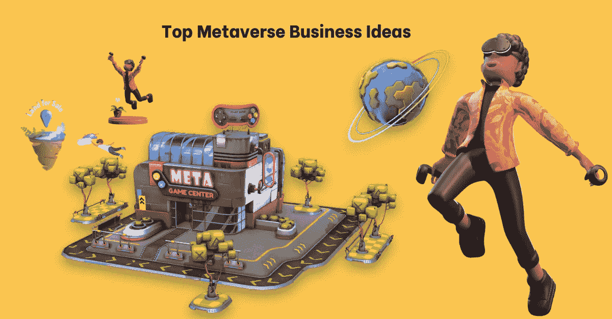
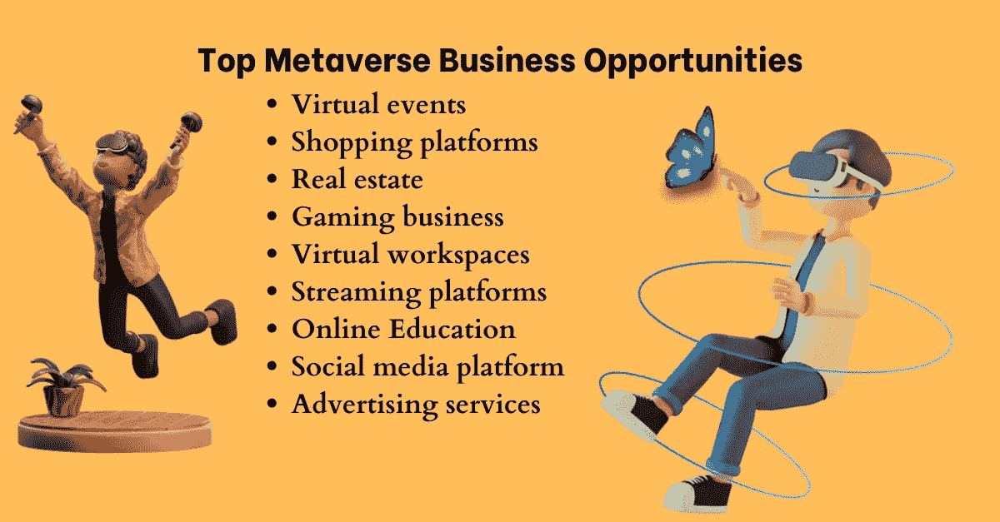
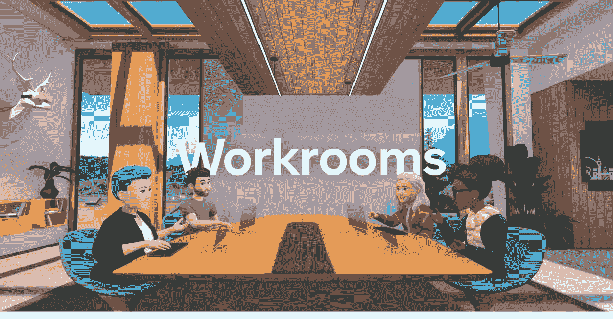

# 元宇宙顶级商业理念——在虚拟领域拓展您的业务

> 原文：<https://medium.com/geekculture/top-metaverse-business-ideas-expand-your-business-in-the-virtual-realm-fa2dd8db0aa6?source=collection_archive---------15----------------------->

Top Metaverse Business Ideas

> 元宇宙正在发展成为数字领域的下一个大事件。想象一个世界，在这个世界中，人们可以作为虚拟角色相互交流、游戏、生活和工作。全球最大的公司之一 Meta (前身为**脸书**)宣布在未来几年向元宇宙科技投资近 100 亿美元。许多创业公司也开始投资这一前景广阔的未来 Metaverses，并开始收获收益。从商业角度来看，让我们来讨论一些最佳的商业模式和[元宇宙解决方案](https://bit.ly/3T7KqRM)，它们可能对在元宇宙领域寻找机会的企业家有所帮助。

# **元宇宙**

元宇宙是一个虚拟的数字空间，可以通过虚拟现实耳机访问。它是在区块链开发的，用户可以使用数字货币购买资产。用户甚至可以漫无目的地在虚拟空间中穿行。

# **元宇宙顶级商机**

**Top Metaverse Business Opportunities**

一些高利润的元宇宙商业机会

## [**虚拟事件**](https://bit.ly/3T7KqRM)

近年来，在 Metaverses 上举办虚拟活动的概念越来越流行。通过元宇宙上的虚拟活动，参与者可以获得身临其境的体验，就好像他们身临其境一样。

堡垒之夜是最受欢迎的元宇宙虚拟活动平台之一。你可以开发自己的元宇宙虚拟活动平台，企业可以在那里举办活动。

## **购物平台**

零售业是从元宇宙技术中获益最多的主要行业之一。通过 Metaverses，用户可以获得身临其境的实时购物体验。你可以用你的数码头像购物，用你的头像试穿商品。这种有趣的购物模式肯定会在未来带来许多新的商机。

你可以在元宇宙开发你的虚拟购物平台，享受有利可图的生意。

## **房地产**

在元宇宙拥有虚拟土地是一个吸引人的想法，已经引起了商业团体的注意。用户可以在元宇宙上购买并拥有独一无二的虚拟空间，每个地块都作为 NFT 安全地归用户所有。

沙盒、Cryptovoxels 和 Somnium 等热门元宇宙平台上的房地产销售额在去年达到了近 500 美元，预计在未来几年将呈指数级增长。聘请元宇宙房地产开发服务公司在元宇宙成功的业务。

## **博彩业务**

Gaming business

游戏是元宇宙最具创新性和最有利可图的商业机会之一。博彩业已经是一个数十亿美元的市场，预计到 2025 年将达到 2670 亿美元。元宇宙科技凭借其身临其境的游戏模式将游戏行业提升到了新的高度。

你可以成为虚拟世界的一部分，进行互动，制定战略，并以 NFTs 和加密令牌的形式赢得奖励。使用元宇宙开发您自己的元宇宙游戏平台，实现高回报的业务。

## **虚拟工作区**

Virtual work spaces

虚拟工作空间已经成为元宇宙领域最重要的商业机会之一。元宇宙使公司能够创建增强的沉浸式工作空间，在那里他们可以与员工联系。这些虚拟工作场所可以提高员工和雇主之间的参与度、关系和生产率。

许多领先的公司，如微软，已经开始在元宇宙工作场所进行实验，以提高员工的参与度。在元宇宙，创建自己的虚拟工作场所是一个有利可图的商机。

## **流媒体平台**

像网飞、Prime 和 Hulu 这样的数字流媒体平台在过去几年里一直处于上升趋势。同样，市场上也有类似谷歌 Stadia 和 Xbox 的游戏订阅。随着元宇宙技术的发展，这些游戏和流媒体服务将在元宇宙上提供。

您可以开发增强空间，用户可以在虚拟环境中玩游戏和观看内容。元宇宙流媒体平台开发可以是一个有利可图的商机，你可以考虑。

## **在线教育**

基于虚拟现实的教育可以改善学生的整体学习体验。他们可以理解概念，因为元宇宙提供了身临其境的学习体验。来自世界各地的任何人都可以没有语言障碍地学习新概念。

用于教育目的的元宇宙对军事应用、医学学生和各种其他研究领域都非常有益。

元宇宙教育平台开发是另一个你可以考虑的元宇宙商机。

## **社交媒体平台**

元宇宙社交媒体平台是一个分散的沉浸式社交媒体平台，用户可以与他们的头像互动并执行各种其他活动。元宇宙社交媒体平台为其用户提供了开放和公平的空间。当前社交媒体平台的一个主要问题是他们对用户数据的控制。

凭借其独特的功能，元宇宙肯定会在未来占领社交媒体领域。脸书最近也将其母公司更名为“Meta”，并宣布了其元宇宙服务。因此，元宇宙社交媒体平台也是未来值得期待的重大商机。

## **广告服务**

您可以在元宇宙上推广和宣传您客户的产品和服务。由于元宇宙提供了身临其境的体验，广告可以对观众产生更深刻的影响。你可以在元宇宙开发广告空间，尝试广告套餐。

## **总结一下**

元宇宙在未来几年肯定会产生深远的社会影响。从投资的角度来看，它已经为企业开辟了许多新的机会。企业家有责任利用元宇宙为他们提供的独特机会。如果您正在元宇宙寻找商机，这是一个绝佳的时机。现在就雇佣一家专业的[元宇宙发展公司](https://bit.ly/3T7KqRM)来拓展你在元宇宙领域的业务。