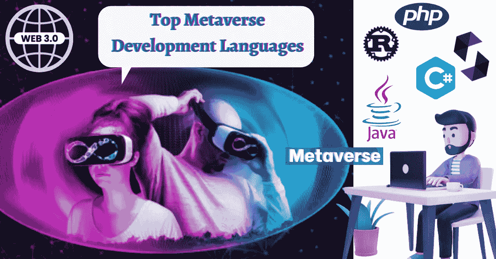

# 2022 年 Web3 开发者中的顶级元宇宙开发语言趋势！

> 原文：<https://medium.com/geekculture/top-metaverse-development-languages-trending-among-web3-developers-in-2022-8f25372fbec?source=collection_archive---------2----------------------->

Top Metaverse Development Languages

元宇宙对世界来说是一个革命性的发现，尽管到目前为止它的潜力只被开发了一小部分。在谈论元宇宙改变互联网的潜力之前，让我们先简单定义一下。

> 目前，元宇宙是一个虚拟世界，人们可以作为数字化身进行社交。即使这个概念看起来很基础，但扩大它的视野只会让人敬畏。未来十年预计将是元宇宙应用开发的金矿，因为数十亿美元的资金将投入到这项技术的研究和开发中。在这里，我们将看看 2022 年占据元宇宙开发专业人员简历的顶级元宇宙开发语言。

# 固态

以太坊网络独有的区块链编程语言，Solidity 是现存最流行的元宇宙开发语言之一。该语言允许开发者在以太坊和其他 EVM 兼容(以太坊虚拟机)网络中构建应用程序。元宇宙开发者可以在任何 EVM 兼容的链上使用这种语言构建他们虚拟应用的后端，这使得风险企业能够进入更广泛的 Web3 社区。

# 锈

元宇宙软件开发的另一个著名语言是 Rust。Rust 最初是一种像 C++一样的通用编程语言，当以太坊的主要竞争对手 Solana 和 Polkadot 使用它从头开始开发他们的网络时，它引起了 Web3 的注意。该语言与内存安全和管理相关的特性允许开发者为 metaverses 编写完美的程序。Rust 还确保为应用程序提供高端安全性，这使其成为元宇宙应用程序开发专业人士的首选。

# Java Script 语言

也许是 Web3 世界中最重要的编程语言，诸如 node.js 和 react.js 之类的 JavaScript 程序普遍用于元宇宙软件开发，以开发能够跨设备(PC/移动设备/浏览器)运行的应用程序。在区块链使用其他语言时，从零开始构建遇到了很多困难。但是 JavaScript 的本质允许开发者编写程序的每一行。使用该语言，集成 VR 和 AR 等其他 Web3 元素变得更加容易。

# C#

微软的 C#作为一种元宇宙开发语言已经变得很流行，这可以从它被各种游戏引擎采用上看出来。就元宇宙开发而言，C#提供的可伸缩性和互操作性是无与伦比的，随着多链应用程序开发趋势的发展，这种语言在未来几年肯定会大有裨益。人们也可以使用 C#语言创建基于虚拟现实的元宇宙应用程序。Unity Game Engine 使用 C#，其广泛的游戏开发者社区可以随时派上用场。

# 计算机编程语言

Python 是一种面向编程初学者的流行语言，由于各种原因，包括其开源支持，Python 已经进入了元宇宙应用程序开发。Python 易于理解的语法和图形用户界面应用程序帮助开发人员快速构建元宇宙平台。基于增强现实的应用是使用 Python 制作的常见 Web3 平台。它与其他编程语言(如 C 和 C++)的互操作性也为开发人员提供了创建元宇宙软件平台的多功能性。Python 中不断增长的 Web3 社区通过提供开发支持库提供了帮助。

# 总结想法

在这个博客中，我们看到了 Web3 开发者社区中需求最大的[元宇宙开发](https://bit.ly/3cuRrg0)语言。他们中的每一个都有自己的优点和缺点，这些优点和缺点因每个人的需求而异。众所周知，元宇宙发展仍然是一个不断发展的领域，具有巨大的未开发潜力。除此之外，还有其他语言可以用于构建虚拟世界，但它们的使用目前还很有限。如果您的元宇宙开发项目需要开发专家，请考虑与拥有上述语言专家的专业公司合作，以获得最佳效果。