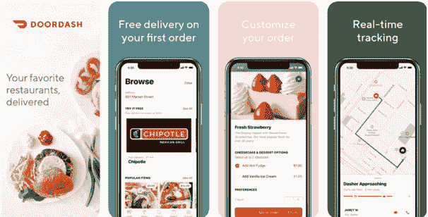
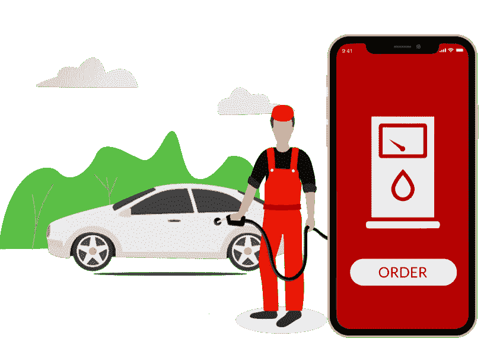
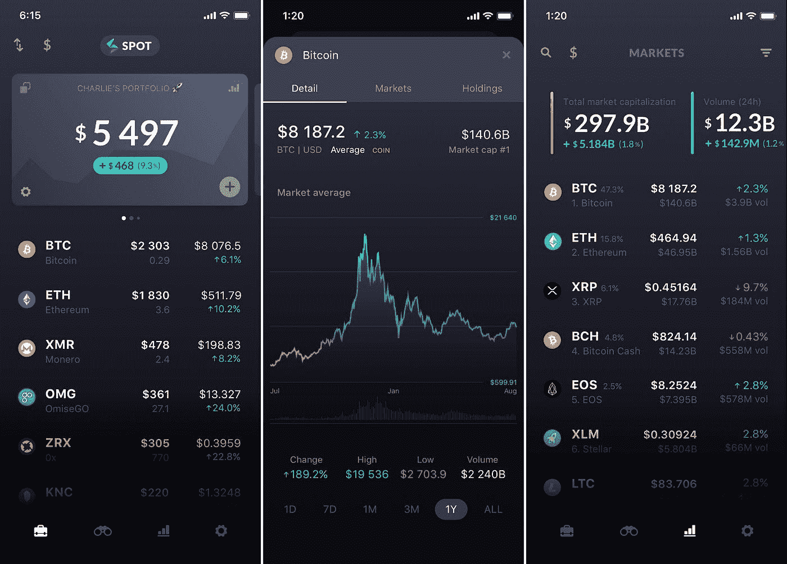

# 2021 年最赚钱的移动应用:iOS 和 Android

> 原文：<https://medium.com/geekculture/top-mobile-app-ideas-for-making-massive-money-in-2021-ios-and-android-f1603eee4ce3?source=collection_archive---------22----------------------->

移动应用行业每年都在不断变化。竞争非常激烈，对我们来说，跟上应用程序开发领域的最新趋势更加复杂。目前(2021 年)苹果商店上有大约 196 万个应用程序，谷歌 Play 商店上有 287 万个移动应用程序。这些数字预计到 2022 年将会翻倍。

如果你正在考虑为你的企业开发一个应用程序，你应该知道有两种主要类型的应用程序——iOS 和 Android，所以你应该专注于开发在市场上处于领先地位的创造性和创新性的应用程序。

为了帮助你思考优秀的移动应用程序创意，我提到了几个商业驱动的应用程序创意，它们将帮助你赚钱！

1.  **包装工&搬运工 App**

**图片来源:** Emizentech

这个应用程序可以用于那些希望移动办公室或家的人。人们可以用它来寻找信誉良好的搬家公司，提供合理的价格和优质的客户服务。这个应用程序的想法可以帮助你接触到大量的受众，如果你添加额外的功能，如评估计算器，它会变得非常有利可图。此外，在开发这样的应用程序时，您可能会面临一些问题；那样的话，你可以**雇佣 iOS 应用开发者印度**。

**2。美食&饮品 App**

这种类型的移动应用对任何餐馆老板来说都是无可挑剔的！它可以帮助他们记录手头有什么食材，他们已经做了多少顿饭，厨房里还有多少存货。该应用程序还可以让顾客预订餐桌、购买礼品卡和查看菜单。

**3。建筑 App**

需要帮助跟踪项目和安排会议的建筑公司可以使用这种类型的移动应用程序。这将使他们能够合理地管理自己的时间，并跟上最新的建筑趋势。寻找 Android 应用程序开发人员和 iOS 应用程序开发人员将是构建这样一个移动应用程序的最佳选择。

**4。害虫控制应用程序**

这个应用程序对任何做害虫控制的公司来说都是完美的，比如 Terminix 或 Orkin。这个手机应用的目的就是除害虫！如果你有一个应用程序，让客户识别他们有什么类型的错误，然后用他们的手机安排服务预约，这可以节省他们很多麻烦。

**5。餐厅外卖 App**

**图片来源:**都市味蕾

如果你从事食品配送业务，这是一个几乎必不可少的应用程序！由于像 Seamless 和 GrubHub 这样的应用程序，餐饮业已经取得了巨大的增长。你可以通过主动提供送餐上门来获得你的一份。

**6。美容院 App**

美容院应用程序对于美发、化妆或护肤行业的任何企业来说都是非常棒的。目前，人们不得不在去沙龙和在线订购产品之间做出选择——但是如果他们可以同时做两件事呢？一个能让顾客预约和购买你最受欢迎的产品的应用将会是一个成功。

**7。电力&电力 App**

这是一个独特的利基，但仍然是一个应用程序，可以带来一些严重的业务！想想有多少人总是在寻找最便宜的方式为他们的家庭或公司供电？像这样的应用程序可以让他们比较发电厂的价格和位置。客户将从一开始就知道他们得到了最好的交易。

**8。燃料&气体输送 App**

**图片来源:** Goteso

现在什么都有应用程序，而且不会很快停止！如果你拥有一个加油站，或者如果你向需要燃料的人提供燃料(比如丙烷)，那么这是一个可以帮助你提高底线的想法。如今，每个人都把手机放在身边——为什么他们不能给自己的汽车或卡车加油呢？

有物理位置的企业有机会创建一个应用程序，让客户找到他们并获得方向。应用程序也可以通过发送关于销售或独家优惠的推送通知来用作营销工具。这种类型的移动应用程序适合任何需要帮助吸引新业务的公司！

**9。汽车维修 App**

这款应用非常适合希望帮助客户充分利用汽车的汽车服务中心。用户可以使用它来查找附近的经销商，安排与技术人员的约会，预订试驾，并联系客户支持代表！

**10。DevOps 工具应用**

如果你正在运营一家软件公司或任何类型的企业，需要后端帮助，你应该创建一个应用程序，让你的客户在旅途中获得快速可靠的服务！这种类型的程序还允许他们跟踪每项任务的状态，以便让每个参与的人都了解最新情况。此外，为了开发此类应用，您可能需要 [**雇佣专门的 iOS 应用开发人员**](https://www.valuecoders.com/hire-developers/hire-ios-developers?utm_source=geekculture-topmobileappideas&utm_medium=S05)；这样做，你将能够形成一个出色的应用程序，没有任何错误。

**11。视频直播教程 App**

这个应用程序将用于录制和发布各种主题的现场教程。它可以包括烹饪技巧，家庭装修项目，修理电子产品，甚至导盲犬！任何正在努力完成这些任务的人都会发现这个程序非常有助于节省时间和金钱。此外，这种应用程序的想法可以帮助你接触到更多的受众。

**12。金融科技应用**

这种类型的应用程序将由寻求投资或存钱的个人使用。它可以让人们进行不同的交易，如转移资金，支付账单，检查他们的账户余额。

此外，对于那些希望以不同方式与潜在客户建立联系的公司来说，这也是一个很好的应用程序想法。金融科技应用旨在帮助人们开始更有效地储蓄和管理他们的钱，这可以帮助他们在未来做出更好的财务决策。

**13。加密货币 App**

**图片来源:** TechCrunch

对于任何想要投资加密货币的人来说，这是一个出色的应用思路。该应用程序将允许人们跟踪他们当前的持有量，并与市场趋势保持同步。如果你需要同样的帮助，你可以[在印度](https://www.codersdaddy.com/hire-developer-engineer-programmer/python)雇佣 Python 开发者。

交易者也可以用它来关注实时利率、新闻更新和价格波动。这种类型的移动应用程序可能是帮助您扩大客户群和扩大品牌认知度的好方法。

**14。基于人工智能的食品新鲜度检查器应用**

如果你想做一些可以让很多人受益的东西，这是另一个伟大的应用程序想法！任何购买杂货并希望确保食品安全的人都可以使用基于人工智能的食品新鲜度检查应用程序。该应用程序将使用机器学习算法，根据收获时间来估计您生产的产品的历史。

**15。约会&聊天 App**

这种类型的应用程序非常适合任何希望结识新客户和建立品牌知名度的企业。该应用程序将类似于 Tinder 或 Bumble，但它也可以包括一个选项，人们可以在其他社交媒体平台上公开个人资料并与朋友分享内容！

**16。音乐流媒体应用**

这是另一个伟大的应用程序的想法，任何人都想通过接触大量的观众来赚钱。音乐流媒体应用程序旨在帮助听众找到新的歌曲，与他们最喜爱的艺术家保持同步，并发现他们以前可能没有听过的新歌！

# 包扎

2022 年赚钱的顶级移动应用创意列表是一个很好的指南，可以指导未来可能会发生什么。然而，重要的是，你不要陷入思考你的竞争对手在做什么，或者他们是如何成功实施营销策略的。

相反，你应该专注于开发一个令人敬畏的产品，并提供服务体验，这将在客户中创造忠诚度，他们知道当他们需要什么时，他们可以依赖你的业务。通过减少与其他企业竞争的时间，将更多的时间用于为你周围的人创造价值，你会赚很多钱！

此外，如果你想构建一个同时支持 Android 和 iOS 的优秀应用，**寻找 Android 应用开发者**和**雇佣专门的 iOS 应用开发者**将是最佳选择。通过这样做，你将能够在现实生活中毫无争议地展示你的应用想法。