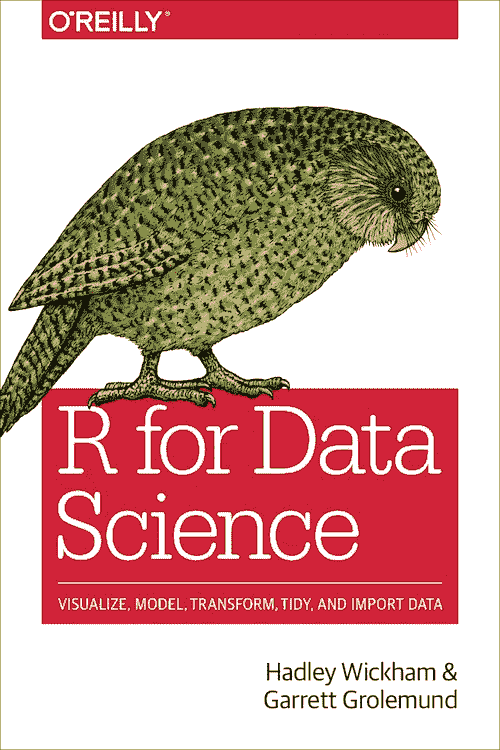
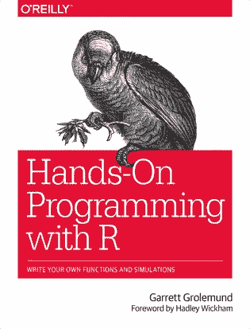
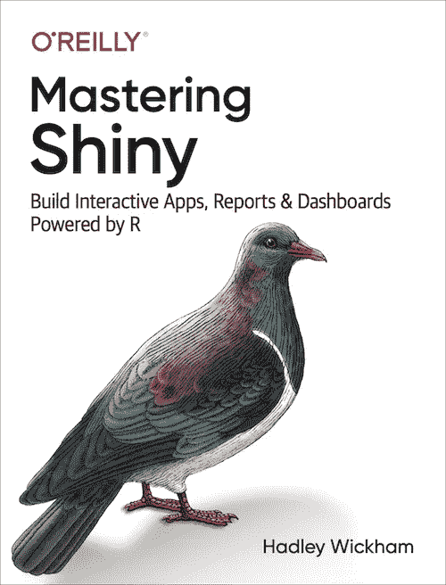
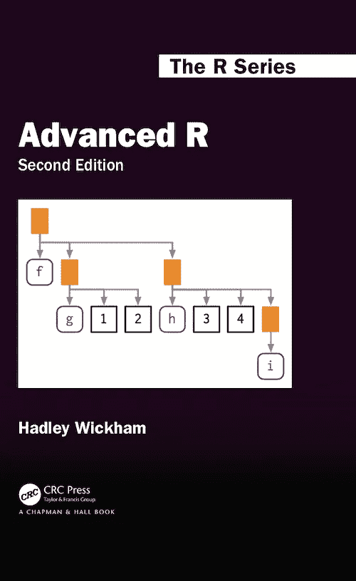
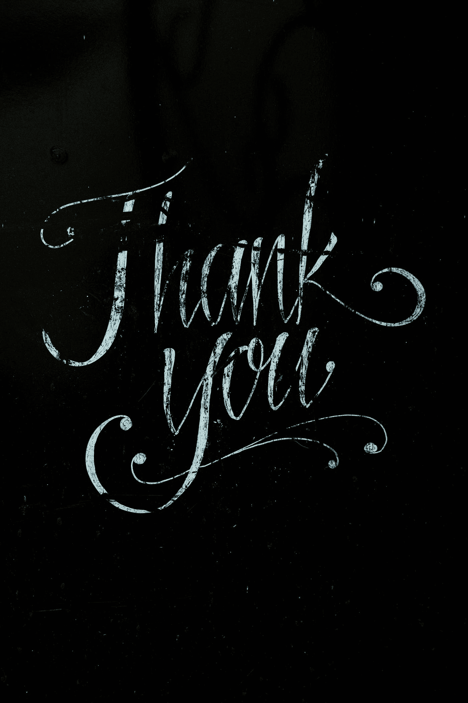

# 必读的 6 本 R 编程书籍

> 原文：<https://medium.com/geekculture/top-must-read-r-programming-books-fa4fc820b413?source=collection_archive---------2----------------------->

L egend 说，世界的秘密和宝藏都藏在书中，但人类懒得去寻找它们，这要感谢 Google。

如果你喜欢读书，更重要的是喜欢使用 R 编程语言，那么这篇文章就是为你准备的。

根据我的看法，这些是 R 编程书籍，你会发现足智多谋。

## [R 为数据科学](https://r4ds.had.co.nz/)

Image by Author

这是我写的最好的一本书，作者是超级明星哈德利·威克姆，这也是为什么它会排在榜首。

这本书将教你如何成为一个更好的数据科学家。

从`ggplot2`、`dplyr`和其他开始，你将在`tidyverse` 下学习所有你需要知道的关于软件包的知识，它还包含练习练习来测试你在每个章节中学到的知识。

## [R 食谱](https://rc2e.com/)

Image by Author

如果你曾经解决了一个问题，却忘记了是怎么做的，这本书是给你的。

把这本书作为你在编程或统计中使用 R 及其解决方案时可能遇到的常见问题的列表。

这与其说是一本需要从头到尾阅读的书，不如说是一份参考资料。

## [与 R 一起动手编程](https://rstudio-education.github.io/hopr/project-2-playing-cards.html)

Image by Author

这本书重点是教你如何使用 R 进行编程，而不是分析数据。

您将了解 R 数据对象和环境，以及如何通过构建 3 个有趣的项目来创建自己的函数。

## [掌握闪亮](https://mastering-shiny.org/)

Image by Author

想要构建 web 应用程序，但不了解 HTML/CSS，Shiny 就是为你准备的。

这本书是关于如何使用 R Shiny 框架的指南，带你从初级到高级。

读完这本书，你应该能够构建类似于 [this](https://ridwan-adejumo-suleiman.shinyapps.io/WAFEDA/?_ga=2.58495277.663747270.1646329263-556426440.1629003048) 的东西，并使你的数据分析和结果，与用户互动。

## [高级 R](https://adv-r.hadley.nz/)

Image by Author

就像名字一样，这本书教你如何成为一个高级 R 用户。

你将在 R 中学习所有关于面向对象编程的知识。

这本书会教你如何更高效，写出干净的 R 代码。

## [R 大书](https://www.bigbookofr.com/index.html#your-last-ever-bookmark)

Photo by [Luke Tanis](https://unsplash.com/@saluken?utm_source=medium&utm_medium=referral) on [Unsplash](https://unsplash.com?utm_source=medium&utm_medium=referral)

最后但不是列表，是超过 300 本 R 编程书籍的集合，这本书是每一个 R 用户的祝福，感谢[Oscar barufa](https://twitter.com/OscarBaruffa)使这成为可能。

在这本书里，你可以看到与各种领域相关的书籍，包括统计学、生命科学、心理学、编程、金融等等。

这是一个你不会后悔保存的书签！

感谢阅读，我希望你发现这篇文章足智多谋。

Photo by [Donald Giannatti](https://unsplash.com/@wizwow?utm_source=medium&utm_medium=referral) on [Unsplash](https://unsplash.com?utm_source=medium&utm_medium=referral)