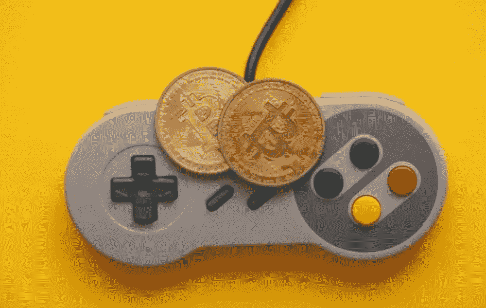
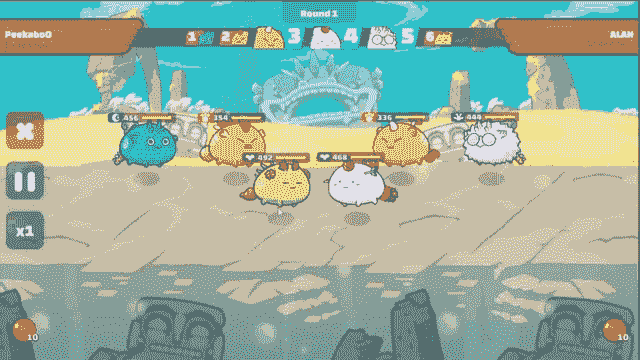
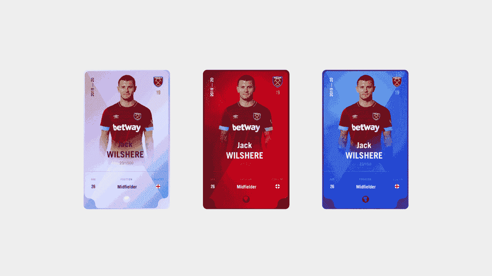
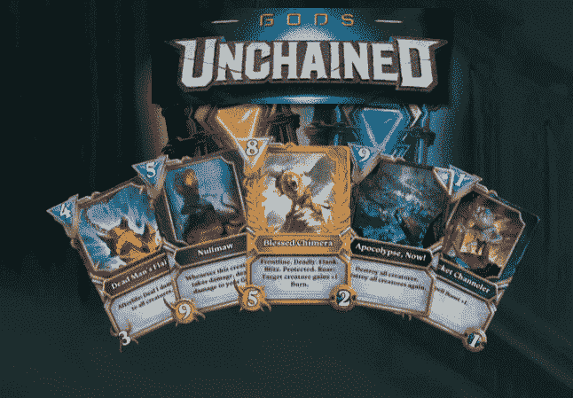
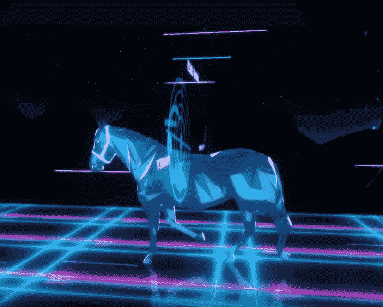
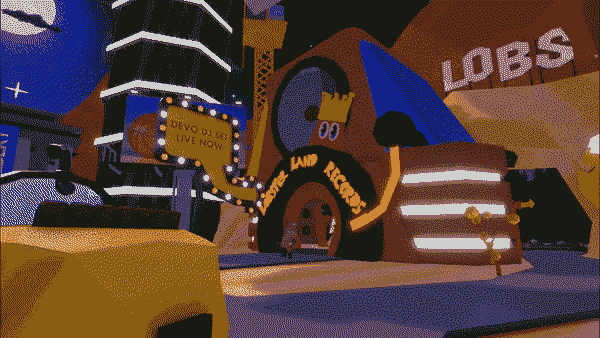

# 顶级 NFT 运动会和运动会的确定性

> 原文：<https://medium.com/geekculture/top-nft-games-and-the-certainty-of-the-games-8459788ed1c9?source=collection_archive---------14----------------------->

自从智能手机进化以来，网络游戏已经取代了早期的所有游戏。加上 NFT 游戏已经发布，并在游戏爱好者中获得了人气。NFTs 的概念已经被引入到游戏中，玩家可以在游戏中购买角色、服装、数字土地和更多组件。

**让我们了解一下 NFT 奥运会**

与其他在线游戏不同，NFT 游戏允许玩家在玩游戏时通过加密货币来赚钱。游戏中出现的角色可以作为 NFT 购买，并可以在游戏平台上出售给出价购买角色的人。正如我们已经看到的，不仅仅是角色可以被出售，角色穿的衣服、部件或装置、枪等等都可以被出售。从游戏中购买一个组件并据此进行交易，完全是玩家的选择。有几个 NFT 游戏盛行，所以我们可以看看一些顶级的 NFT 游戏。

**轴协无穷大**

Axie Infinity 是近期最著名的 NFT 游戏之一。它的灵感来自区块链以太坊创造的口袋妖怪词源。游戏中的怪物可以在 NFT 买到，玩家可以通过游戏的进程把怪物卖给其他想买的玩家。人物可以被收集，提升，可以用于战斗。这个游戏中的玩家在玩游戏时会得到 SLP 作为奖励。这证明了玩游戏要赚钱，玩这些游戏会给玩家 SLP 代币，这些代币可以与币安或 Uniswap 交换。

人们当他们提出创建一个像另一个游戏的请求时，可以通过某个网站来完成。同样的 [Axie Infinity 克隆](https://www.inoru.com/axie-infinity-clone)也可以被创造出来，通过同样的 NFT 进程，它可以被发布给玩家使用。

**Sorare**

另一个著名的 NFT 游戏是 Sorare，这是一个幻想足球游戏，其中最受欢迎的球员被选为一个团队，用户将根据球员在现实生活中的表现获得奖励。不同之处在于玩家被表示为 NFT。

足球 NFT 收藏品可以在市场和视频中分组和交易，游戏的数字资产可以买卖。

**上帝的解放**

《上帝的解放》是一款类似于卡牌游戏《魔法:聚会或炉石》的卡牌游戏。游戏的要点是交易的牌的性质不能改变，价值和力量保持不变。

这款游戏可以归类为电子竞技，有其独特的功能。上帝的被解放的克隆体可以被创造出来，在那里 NFT 可以被交换，以此来建立游戏赚钱的概念。

**Zed 运行**

Zed run clone 是另一个著名的游戏，其中马被定义为 NFT，并在游戏平台之间进行交易。这些马将根据从 1 到 5 的值进行分类。感兴趣的投资者可以研究一下，可以根据利率来购买。在这个游戏中，马匹被虚拟饲养和比赛，投资者可以通过交易马匹的成功赚取一定的金额。

用 Zed Run 克隆脚本开发一个像 Zed Run 这样的[游戏是可能的。它有无错误的代码，通过它可以建立一个基于区块链的 NFT 游戏。](https://www.inoru.com/zed-run-clone)

**分权**

分散的土地是另一个在互联网上引起轰动的新项目，这是元宇宙的一个完美例子。自 2020 年 2 月推出以来，分散土地的受欢迎程度大幅上升。

游戏中的组件，如虚拟土地，服装和其他组件被创建为 NFT，并出租给玩家进行交易。与其他游戏不同，它为玩家在社交媒体平台上相互联系和互动铺平了道路。

总之，这些 NFT 奥运会很受欢迎，得到了全世界人民的关注。