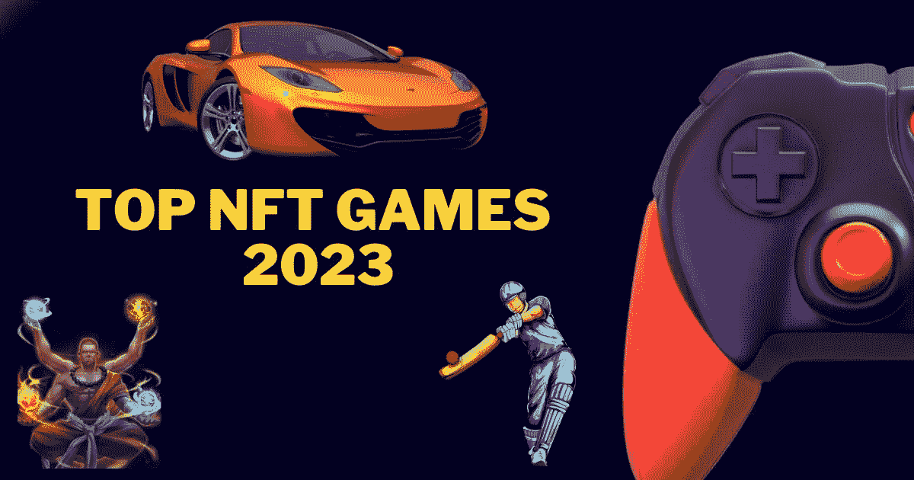
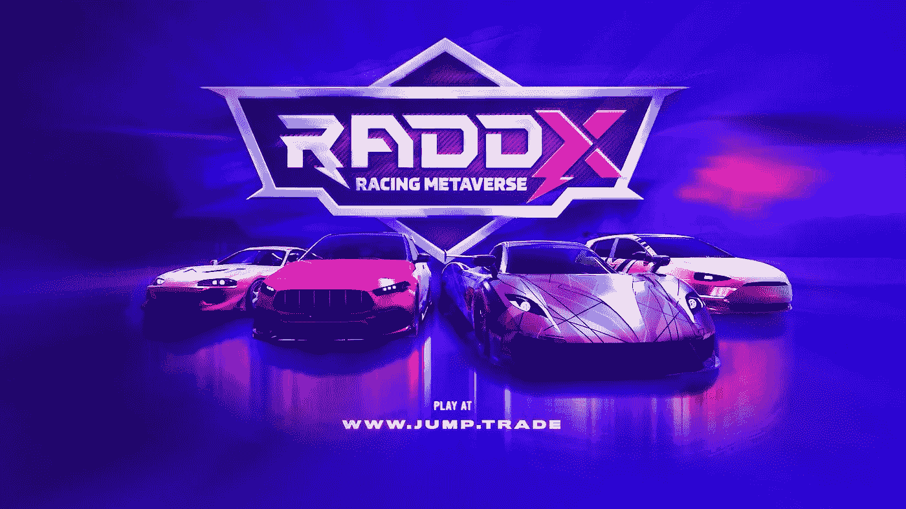
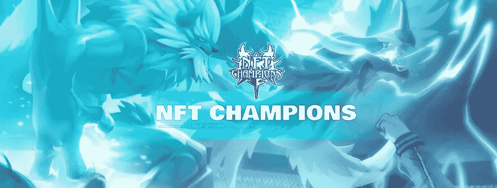
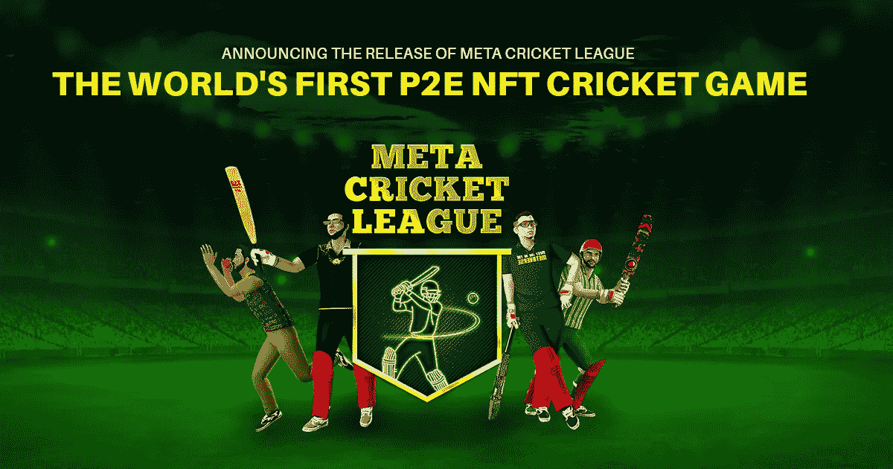
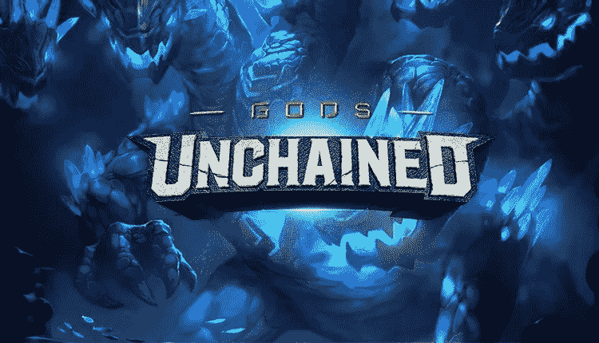

# 2023 年 NFT 顶级运动会

> 原文：<https://medium.com/geekculture/top-nft-games-in-2023-3eb3df164836?source=collection_archive---------10----------------------->

## 最佳 NFT 游戏将于 2023 年诞生

**Top NFT Games In 2023**

游戏已经完全改变了。这不是开玩笑，因为那时玩的游戏都很基本，图形也很简单。要说我们在游戏方面已经取得了多大的进步，说游戏技术已经发生了变化是一种保守的说法。游戏已经以几种不同的方式一次又一次地被重新定义。当第一款游戏机问世时，它是一个巨大的失败，随后第二款游戏机设法打破了市场，然后出现了各种其他游戏机，如 Wii、Playstation、XBOX 等。正是在这段时间，游戏成指数增长，并设法完全接管了世界。如果我们回到雅达利时代，想象一下年轻一代会有多困惑。这还不是全部，因为现在我们正在经历另一个变化，这实际上可能是完全改变了很多的事情。

这些年来，我们看到很多 NFT 游戏变得非常受欢迎，也有很多新的竞争者进入这个领域。从所有这些来看，虽然可能很难将一些游戏从其他游戏中挑选出来或区分开来，但事实并非如此。下面是 2023 年 NFT 最受欢迎的 5 场比赛，或者至少是那些有望上演的比赛。

1.  **元宇宙 RADDX 赛车**

这是一款由 Jump.trade 开发的游戏，它是亚洲发展中的体育和游戏 NFT 市场之一。 [**RADDX 元宇宙赛车游戏**](https://www.jump.trade/drop/raddx-car-nfts?fsz=KARTHIK) 允许用户驾驶他们的 NFT 赛车，在挑战中竞争，边玩边赚。然而，这并不是唯一令人震惊的事情。NFT 的售价是 1 美元！。这可能听起来像是一个非常糟糕的恶作剧或者有某种隐藏成本的事情，但是没有什么比这更好的了。因此，简单地说，你只需要 1 美元，你甚至可以通过简单地玩游戏并尽可能多地赢 10 次？谁能拒绝这样的提议呢？

**2。NFT 冠军**

一场本身就令人难以置信的 MMORPG 比赛。首先，这个游戏是一个 MMORPG，这已经使它成为一个广泛流行的游戏类型。游戏的工作方式基本上是通过使用怪物 NFT 来与其他怪物战斗。允许用户升级他们的角色并输入字段。这还不是全部，NFT 或角色通常有他们自己的隐藏技能，这给了他们自己可能获胜的机会。这也可以被认为是一张王牌，所以是的，它应该排在前 5 名。

**3。MCL(元板球联赛)**

这是 Jump.trade 的又一款游戏，它是亚洲发展最快的运动之一，也是 NFT 游戏市场 的 [**。这个游戏基本上是一个基于板球的游戏，用户可以购买任意数量的角色和球棒，最少需要 1 个投球手和 1 个击球手。原因是他们至少需要这么多钱来玩这个游戏。角色被分为不同的类别，蝙蝠也是如此，随着等级的增加，价值也会增加。玩家也可以通过玩游戏和获得 Jt 点数来赚钱，他们也可以使用 Jt 点数来提升他们的角色。**](https://www.jump.trade/)

**4。神仙**

《被解放的神》也是一个非常有趣的游戏。这个游戏基本上是免费的，它强调技巧和策略。简而言之，这是一种任何人都可以玩的纸牌游戏。用户可以赚到钱，这些钱以后可以作为现实世界的钱提取。至于卡片，正如你们大多数人已经猜到的，它们确实是 NFT，否则为什么这个游戏会出现在列表中？除此之外，《诸神之战》确实是一款值得关注的游戏，凭借其身临其境的游戏性和看起来非常酷的卡牌，它一定会让一些人着迷。

**结论**

尽管如此，这些只是第一批被广泛谈论的，所以今年晚些时候很有可能会有一匹黑马藏在某个地方。游戏的问题是它们随着时间的推移会变得更好，这也意味着新游戏比旧游戏有优势。这可能是一个很常见的东西，但是对于 NFT 游戏来说，更重要的是实用性。这是因为与其他游戏不同的是，NFT 游戏让你在享受乐趣的同时获得合理的收入。虽然可能不多，但至少可以让你得到一些零花钱。