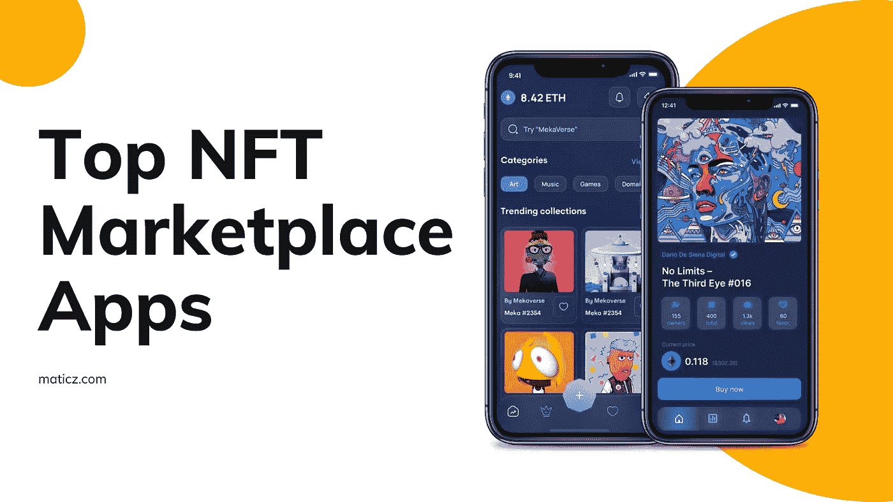
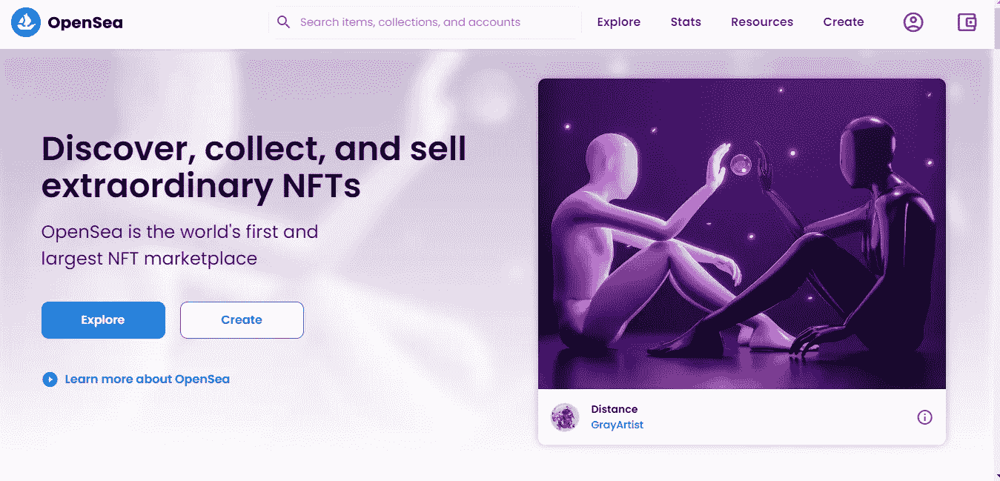
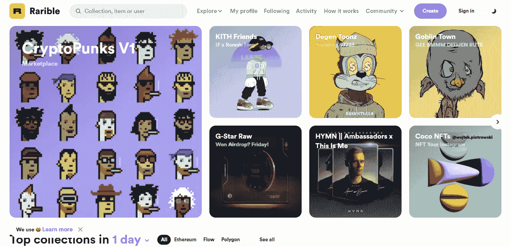
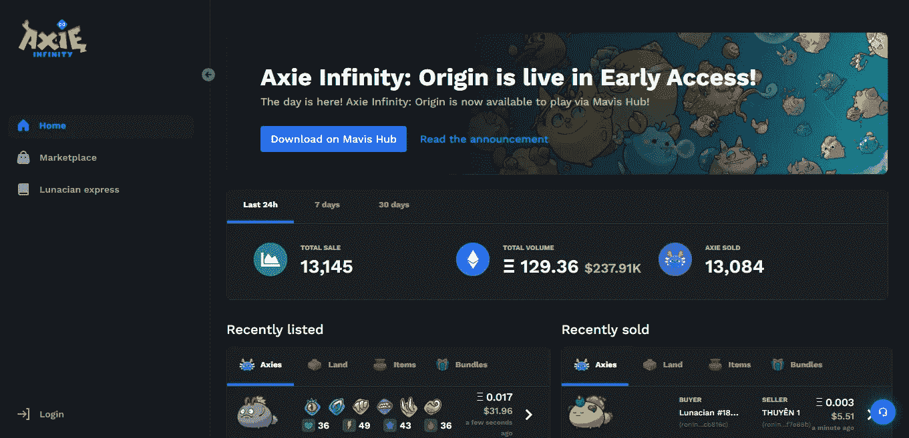
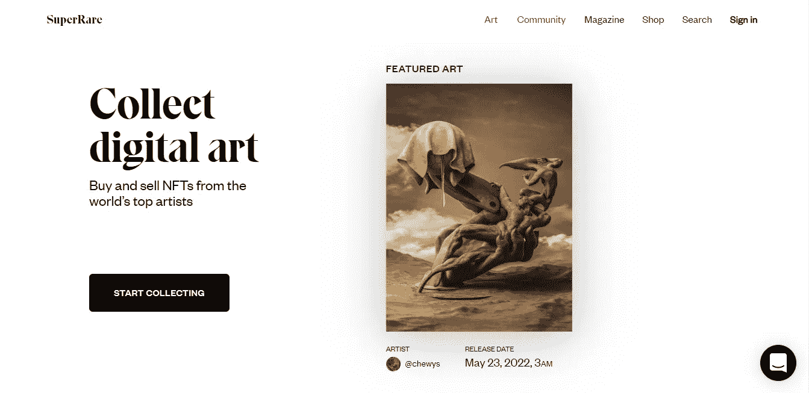
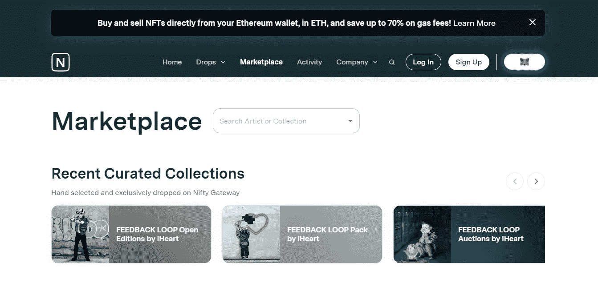
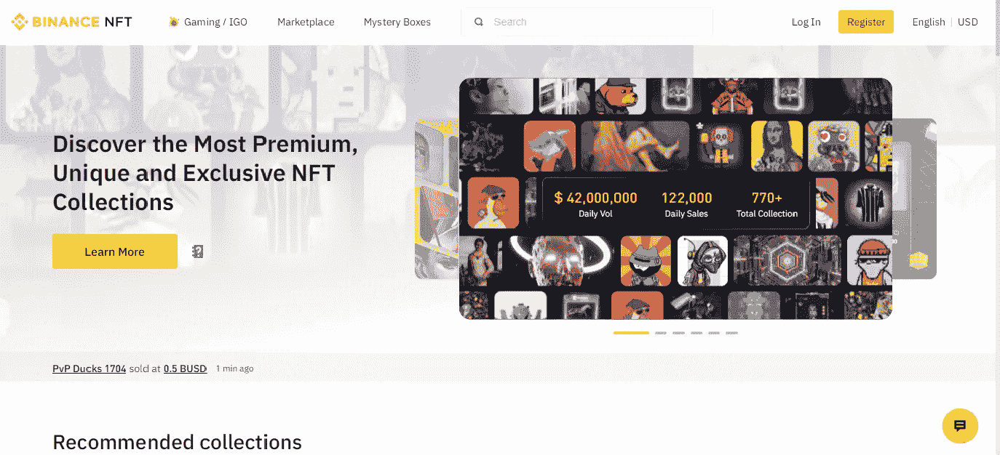
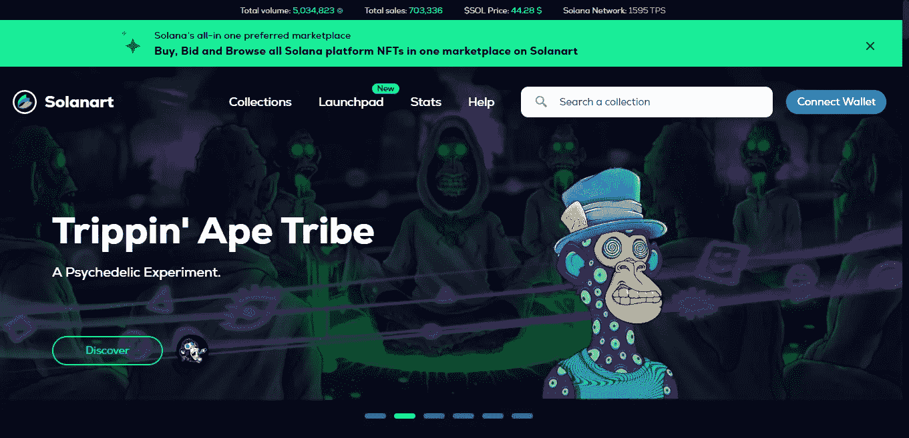
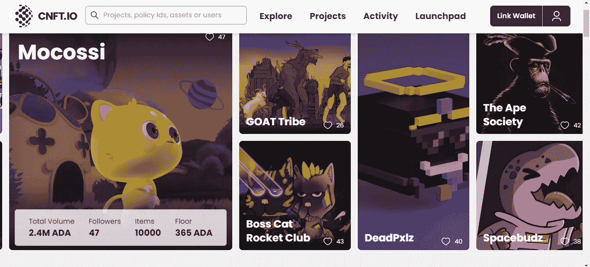

# 顶级 NFT 市场应用程序开发——确实吸引了整个 NFT 市场

> 原文：<https://medium.com/geekculture/top-nft-marketplace-app-development-does-attract-over-whole-nft-market-1bba6c7255f0?source=collection_archive---------17----------------------->

不可替代的代币有突出的角色扮演，以展示他们在世界各地的现实中的创造力。就 NFT 而言，数字数据以分布式账本的形式存储在区块链网络中。通常，每个 NFT 都有一个独特的智能合同，该合同基于与图像、视频和音频等数字文件相关联的用户。这些 NFT 给了用户真正潜在的所有权，所以你不能做任何侵犯版权的事情，因为它存储的是公开可见的哈希值。

# 引起 NFT 的

至于加密行业，NFT 在金融领域以及创作者和交易者方面有着巨大的增长。从 2021 年初到 2021 年年中，NFT 在购买、销售、竞标和铸造方面创造了更多吸引年轻人的热潮。当时越来越多的数字收藏品正在迅速崛起。

# 顶级 NFT 市场正在排除市场

NFT 市场是一个让创意者展示自己赚钱技能的平台。根据用户的不同，它可以在不同的链和平台上使用。包括一些汽油费，视市场情况而定，可能会因市场表现而异。

## Opensea

OpenSea

Opensea 是 NFT 市场的市场领导者。这个平台上有各种各样的数字资产。易于注册，整洁干净的用户界面和 UX，以支持您最喜爱的创作者。如果你想在这个平台上创建自己的 NFT，铸造功能是可用的。这是一万多的 NFT 的顶级收藏。从用户的角度来看，它具有强大的功能，如超过 24 小时的顶级收藏，轻松获取所有类别的非功能性交易，多种钱包支持，以及超过 150+支付令牌已被支持。它可以保护您的时间和金钱。对于初学者来说，第一次购买 NFT 是最好的地方，无论是在其他平台。这个平台完全由以太坊区块链网络组成，后来它采用了 Klatyn、Polygon 和 Solana 等区块链。从初学者到专家 [Opensea 克隆](https://maticz.com/opensea-clone-script) NFT 市场通过安卓和 ios 版本的特定应用程序全面支持投资者

## 稀有的

Rarible

Rarible 是 NFT 第二大密码市场。Rarible 类似于 Opensea，所有特性和功能都适用于这个平台。各种各样的艺术、视频、音乐、收藏品和数字土地都可以在上面买卖、竞标和创作。稀有的 NFT 市场也被以太坊区块链所主宰。这个平台看起来像一个更加丰富多彩的用户界面，很容易吸引 NFT 收藏在类别中，如从一天到一周的热门收藏，最高出价，现场拍卖，所有类别都有特定的过滤器选项可用。NFT 在这个平台上的价格由以太坊决定，尽管你可以使用 Rarible 自己的 Rarible 令牌来购买 NFT。它从买家和卖家那里收取 2.5%的交易费，然后交给这个平台。Rarible 支持不同的 NFT 链，如以太坊、流、Tezos 和多边形。这个市场为 Android 和 IOS 版本都提供了专门的应用支持。

## Axie Infinity 市场

Axie Infinity Marketplace

这个平台是专门为电子游戏玩家的网上商店。这是有史以来最著名的 NFT 游戏。用户可以购买游戏中的收藏品和虚拟土地。它允许 Axie 玩家铸造，出售，购买 Axie 和其他各种 Axie 相关的东西都在这里。大多数交易都在快速进行。在这个市场上，Ronin 是一个熟悉的标志，它提供的汽油费比以太坊网络低。

## 超级罕见

SuperRare

SuperRare 是一个以太坊区块链供电的 NFT 市场。这是完全策划和最好的数字艺术市场平台，是独特的艺术收藏文化的先驱。它允许从主要销售中获得 15%的佣金，从次要销售中获得 10%的佣金，并从所有买家那里获得 3%的交易费，从而主要激励他们的创造者。如果你是最优秀的艺术品艺术家，这是展示你的技能和赚取报酬的最佳市场

## 漂亮的网关

Nifty Gateway

另一个可以考虑的顶级 NFT 市场是 Nifty Gateway。这个市场专注于优质 NFT 空投和有限的数字资产集合。它与 Gemini 加密交换公司有合作关系。与以太坊供电的市场完美运行，大多数名人通过这个市场控制了他们的 NFT。如果你是美国人，你可以用借记卡和信用卡购买 NFT。相反，您可以在美国境外使用储存在您的 Gemini 帐户上的密码。它向每笔 NFT 的卖家收取 5%的费用，还有 0.3%的交易费。Nifty Gateway 总共收购了 6，000 多个 NFT 的优质收藏。

## 币安 NFT 市场

Binance NFT Marketplace

币安是最大的密码交易平台之一，它正在成为全球最大的 NFT 市场之一。这个市场提供 1%的较低水平的气费结构。此外，它为用户提供币安智能链和以太坊区块链上的 NFT，以访问这个市场上的各种 NFT。易于导航的用户界面和 UX。包装良好的 NFT 收藏包括所有类别，如艺术、体育、娱乐、游戏收藏等。一个额外的功能，你已经有一个币安帐户使用币安 NFT 相同的凭证。横向上，它可以为 NFT 提供铸造功能，而在 BNB 支付的费用较低。

## 索拉纳特

Solanart

Solanart 是 Solana 区块链驱动的 NFT 市场，具有购买、出售、出价和造币等内在功能。现在，在这个市场上新推出了 Launchpad 选项，以更罕见的 NFT 系列在用户界面和用户体验功能上吸引更多用户。它收取每笔交易售价的 3%。目前该市场的总交易量为 5，034，815 笔，每秒可处理 65，000 笔交易。

# 卡尔达诺 NFT 市场

Cardano NFT Marketplace

大多数发展中的分散式区块链具有更高的吞吐率，这意味着与前几代区块链网络相比，它们的工作更加完美。Akain Cardano 区块链是第三代公共区块链网络。它促进了更丰富的功能，如这个市场背后的共识机制。在 proof-of-stage(POS)中，店面是一个基本的东西，如出价、历史记录、所有者信息和预览，与多钱包支持兼容。如果您有关于[卡尔达诺 NFT 市场开发的想法](https://maticz.com/cardano-nft-marketplace-development)，我们有市场领先的开发商在短时间内实现您的 NFT 市场。Ṁ

# 最后的想法

每个 NFT 市场都有独特的特点和功能，但它是基于用户想要选择正确的平台来与上述市场进行交易。NFT 市值也日益增长，许多投资者被吸引到这个平台，通过这个平台来获得他们的需求。许多企业家希望以网页形式或应用程序形式启动他们自己的 NFT 市场平台。他们中的大多数都有自己的 NFT 市场网站，但在 NFT 市场应用程序中的市场参与者更少。所以我认为在未来 [NFT 市场的应用程序开发](https://maticz.com/nft-marketplace-app-development)将会是密码行业蓬勃发展的下一个阶段。