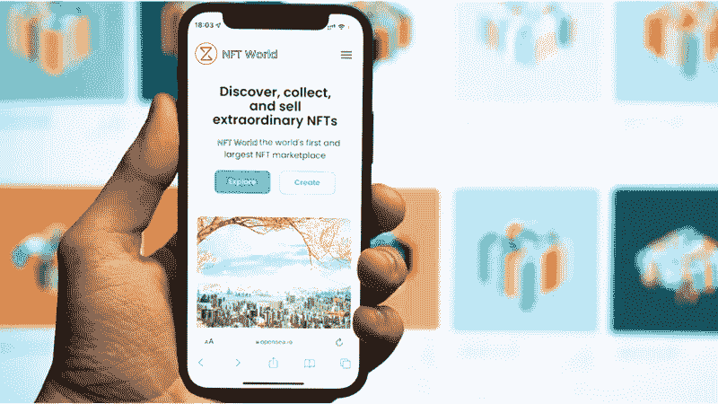

# 2022 年 NFT 市场发展公司排行榜

> 原文：<https://medium.com/geekculture/top-nft-marketplace-development-companies-20537aaeaeb5?source=collection_archive---------17----------------------->

nft marketplace

NFT 在各种数字内容创作者(如艺术家、音乐家、视频和迷因创作者等)中的受欢迎程度有了新的上升，因为它们以数字方式表明了他们作品的所有权，并使他们获得了更大的收入。他们有能力赋予从音乐到艺术，甚至手机拍摄的照片以独特的价值。预计到 2023 年，NFT 市场将增长 800 亿美元。NFTs 的使用案例是无止境的，它提供了一个创造终生收入流的机会。在 NFT 如此受欢迎的情况下，建立一个 NFT 市场是在当今时代开展一项经得起未来考验的业务的关键。

计划建立一个 NFT 市场？有一些 NFT 市场开发公司已经在区块链行业留下了印记，要开发 NFT 市场，你可能需要选择最好的。困惑于选择哪家公司？这篇文章将为你提供选择最适合你需求的 NFT 市场发展公司的详细见解。为了让你的工作更容易，我们列出了 2022 年前 10 大 NFT 市场发展公司。

# 最佳 NFT 市场发展公司

**Maticz**

Maticz 是印度顶级的 [**NFT 市场开发公司**](https://maticz.com/nft-marketplace-development) ，专门在艺术、音乐、视频、体育、游戏、房地产、元宇宙等领域提供最佳的 NFT 市场开发服务。到目前为止，Maticz 已经在区块链成功开展了 150 多个项目，致力于使用尖端技术为初创企业和大型企业打造成功且可扩展的 [**白色标签 NFT 市场**](https://maticz.com/whitelabel-nft-marketplace) 产品，并提供一流的服务。他们的核心竞争力在于为从金融科技、教育到零售等所有垂直行业提供面向市场的端到端区块链解决方案，以应对您的业务挑战。

**阿尔温**技术**技术**

Alwin Technologies 是一家全球性的区块链解决方案提供商，致力于通过一系列服务推动其客户的成功，如 NFT、加密交换、Defi、各种规模企业的软件开发。他们拥有业内最优秀的区块链开发人员，专注于构建总是超出预期的功能包 NFT 平台。无论你的需求有多复杂，他们的团队都能帮你实现。

**李维赫兹**

Leewayhertz 是另一家为创业公司和企业提供最佳软件开发的公司，它可以帮助你和经验丰富的开发人员一起构建创新的解决方案。凭借 10 多年的经验，Leewayhertz 已经开发了几个项目，目前已被全球数百万用户使用。他们提供一系列 NFT 市场开发服务。

**印孚瑟斯**

印孚瑟斯是印度顶级 IT 巨头之一，为全球客户提供 IT 支持的业务解决方案和端到端区块链服务。Infosys 在 46 个国家的 220 多个地方开展业务，是仅次于 TCS 的第二大信息技术解决方案提供商。随着进入元宇宙和 NFT 服务，Infosys 帮助客户利用下一代技术释放 NFTs 的真正商业价值。

**区块链 App 工厂**

区块链应用工厂是顶级区块链开发公司竞赛中的顶级竞争者之一，这些公司为全球所有商业垂直领域的客户提供各种服务，如区块链、NFTs、DApps、Defi 解决方案。他们已经提供了很长一段时间，并在各种行业服务。

**Appdupe**

Appdupe 是著名的移动应用开发公司之一，成立于 2007 年。随着 Appdupe 进入区块链，在很短的时间内，它凭借其创新的解决方案在市场上赢得了很高的声誉。几年来，该公司服务于不同的垂直行业，如银行、金融、医疗保健、电子商务、教育等。

**头脑盘点**

MindInventory 是最受欢迎的移动应用程序开发公司之一，拥有出色的业绩记录。它向客户提供大量软件开发服务。该公司成立于 2011 年，在为全国各地的企业提供高质量的创新解决方案方面拥有超过 10 年的经验。他们有一个专家团队，在人工智能、虚拟现实、区块链等各种趋势技术方面拥有丰富的经验。

**安铁**溶液

Antier Solutions 是一家出色的区块链开发公司，为全球客户提供端到端的区块链解决方案。凭借 10 多年的行业经验，他们提供专为用户和企业主设计的前卫 NFT 解决方案。他们的专家团队精通尖端技术，能够根据客户的要求提供准确的解决方案。

**车图**

Chetu 位于美国，是一家世界级的软件开发公司，拥有 20 多年的经验，通过世界级的软件解决方案和应用程序帮助全球企业。Chetu 拥有 2500 多名技术熟练的行业专家，为初创企业、中型企业、财富 5000 强企业和顶级品牌提供定制软件解决方案，以加速他们的业务增长。

**塔塔咨询服务公司**

TCS 成立于 1968 年，是为全球客户提供服务的最大、最有价值的信息技术公司之一。作为全球 IT 服务的领导者，TCS 提供一系列服务，如企业应用程序、移动应用程序、物联网、人工智能、区块链、云解决方案等。他们为利用尖端技术的全球公司提供转型和外包服务。

**最后的想法**

希望我们已经涵盖了这个列表，现在你已经知道 NFT 市场开发公司的排名了。这些公司在提供 [**NFT 开发服务**](https://maticz.com/nft-development-company) 方面拥有丰富的经验，可以成为启动您项目的最佳选择。由于加密爱好者、技术传播者和名人的兴趣日益增加，NFT 越来越受欢迎，并且每天都在变得流行。随着对 NFTs 兴趣的增加，它同时增加了 NFT 市场的用户基础，这反过来又为 NFT 企业创造了数百万的收入。