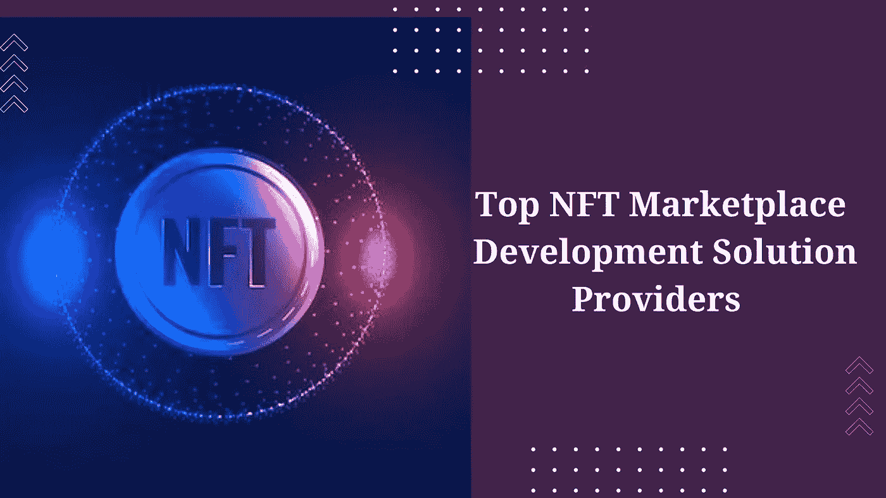

# 顶级 NFT 市场开发解决方案提供商

> 原文：<https://medium.com/geekculture/top-nft-marketplace-development-solution-providers-c625993bd8aa?source=collection_archive---------19----------------------->

## 您想与顶级解决方案提供商一起创建您的 NFT 市场吗？这是你最期待的清单！

这些不可替代的代币是在市场上出售的支持资产，这是 2022 年 NFT 繁荣的推动力。他们在它的繁荣中获得了巨大的利润，这在它推出之前是不可想象的。许多现有的市场已经存在多年，是的，2-3 年在密码世界里是很长的时间。由于他们的成功，大多数跨国公司已经开始为 NFT 市场提供可快速部署的平台，这些平台只需要稍加定制，就可以供初露头角的加密领域企业家使用。让我们看看提供令人难以置信的 NFT 市场克隆脚本的顶级公司。

**选择克隆脚本方法的额外好处**

使用 NFT 市场克隆脚本是一个有利可图的方式来启动你自己的 NFT 市场在一瞬间和小本经营的预算。这些 NFT 市场克隆脚本是可定制的，添加一些独特的功能将吸引更多的用户。用你想要的区块链创建你自己的 NFT 市场也是可能的，在那里你可以建立你自己的独立社区。NFT 市场克隆脚本已经过预先测试，没有错误，可以随时推出，所有设施都非常安全。最重要的是，选择一个合适的 NFT 市场克隆脚本提供商是一个令人困惑的部分，每个企业家在推出他们的 NFT 市场。在这里，我想出了一个解决方案，让你选择合适的 NFT 市场克隆脚本提供商。

# **顶级 NFT 市场开发解决方案提供商**

1.  **火蜂科技服务**

最值得信赖、最成功的公司，他们始终将客户放在第一位。擅长提供最佳现成的 [**NFT 市场克隆脚本**](https://www.firebeetechnoservices.com/nft-marketplace-clone-script?utm_source=NFTMaPlcCS&utm_medium=medium&utm_campaign=joy) 和 [**白色标签 NFT 市场解决方案**](https://www.firebeetechnoservices.com/white-label-nft-marketplace-development?utm_source=WLNFTMaPlc&utm_medium=medium&utm_campaign=joy) 的克隆脚本提供商。他们已经帮助许多初露头角的企业家迅速成功地步入了 crypto 平台。他们提供高度可定制的功能脚本，您可以根据您的业务需求修改和设计您的 NFT 市场平台。他们用顶尖的技术工具和最先进的技术工具制作他们的 NFT 市场克隆脚本，使您的脚本在与全球竞争对手的竞争中更具优势。他们甚至在你要求的区块链建立你的 NFT 平台，像以太坊、索拉纳和币安智能链 BSC。他们是 NFT 市场克隆脚本、白标 NFT 市场解决方案、加密交换克隆脚本、Gamefi 克隆脚本、Defi-分散金融开发和元宇宙开发的大规模克隆脚本提供商。

**2。Scala 区块链**

当你想到 NFT 市场克隆和软件服务时，它是一个领先的服务提供商。如果你对用白标解决方案或 NFT 市场的克隆脚本来创业感到困惑，那么你可以选择他们，他们有一个团队根据你的投资来帮助你选择合适的方案。他们有一个很好的团队来制作 NFT 市场脚本，你可以得到可以立即部署的克隆脚本。如果你有大量投资的心态，你可以选择它们。

**3。Appkodes**

他们可以开发你所有的数字创意，并在这个蓬勃发展的加密时代为你呈现最佳表现。他们有一个工作流程，推动提前学习，并将其转化为高效和有效的产品。他们确保他们的顾客的流行和以最小的花费生产。他们提供的一些服务包括 NFT 市场、硬币创造、DeFi 交换等等。预期的发布时间比其他提供商稍长。

**4。伦蒂斯托**

提供克隆脚本的顶级解决方案。Rentisto 可能是 NFT 市场发展的新手，但他们在 Airbnb 等在线租房应用方面经验丰富。他们的 NFT 市场开发有助于启动企业家自己的 NFT 市场，这将吸引更多的 NFT 用户。他们甚至建立了一个强大的 NFT 市场，整合了独特的功能和多层安全功能系统，以增强用户的交易，但他们仍处于初级阶段。他们提供了一个成熟的 NFT 市场开发前端到后端的所有服务的智能合同。

**5。Addus 科技公司**

一家顶级的区块链解决方案提供公司，正在催生所有的初创公司和企业家，并将他们的业务转化为盈利的解决方案。他们有一组区块链开发人员，他们提供所需的可以立即部署的区块链解决方案。他们提供区块链解决方案，如加密交易所、NFT 市场、令牌开发、元宇宙等。

## **结论**

大多数公司已经与几个区块链技术服务每天上升，这是非常重要的，找到一个合适的有经验的公司，可以使你的工作更容易，并有助于发展自己的 NFT 市场。正如我已经解释了最突出的克隆脚本提供商，我建议选择列表中的第一个顶级提供商，他们是这个加密领域的专家，以及处理海外客户的克隆脚本提供商。

在任何情况下，他们都将客户放在第一位。有了他们的克隆脚本，你不需要任何技术知识和支持来运行你的 NFT 市场。他们提供了 NFT 市场克隆脚本和 NFT 市场解决方案。Fire Bee Techno Services 甚至在 NFT 市场、Crypto exchange、DeFi development、GameFi 和元宇宙上提供克隆脚本的免费演示。随时联系和咨询他们，他们有 24/7 的客户咨询服务。